# Thiết kế hệ thống Bảng tin (News Feed System)

## ⚡ Tóm tắt ngắn (30s)
* **Mục tiêu**: Thiết kế hệ thống News Feed (như Facebook, Twitter, Instagram) cho phép người dùng đăng bài viết và xem dòng tin tức tổng hợp từ những người họ theo dõi, đảm bảo thời gian tải bảng tin cực nhanh (< 100ms) ngay cả khi có hàng triệu người dùng hoạt động cùng lúc.
* **Core Logic**:
  * **Mô hình Hybrid Fan-out (Đẩy & Kéo kết hợp)**: Áp dụng cơ chế **Push (Fan-out-on-write)** cho người dùng bình thường để bảng tin của người theo dõi luôn sẵn sàng trong Cache. Đối với người nổi tiếng (Celebrities) có hàng triệu followers, ta áp dụng cơ chế **Pull (Fan-out-on-read)** để tránh nghẽn luồng ghi, sau đó trộn dữ liệu (Merge) động trên bộ nhớ RAM khi người dùng tải trang.
  * **Dòng thời gian lưu trữ bằng Redis Sorted Set**: Sử dụng kiểu dữ liệu `ZSET` trên Redis để lưu danh sách ID bài viết của từng người dùng, sắp xếp theo điểm số (Score) chính là Timestamp của bài viết.
  * **Phân trang dạng Cursor (Cursor-based Pagination)**: Ngăn chặn triệt để tình trạng bỏ sót bài viết hoặc hiển thị lặp lại bài viết khi người dùng cuộn vô hạn dưới tải cao.

---

## 🔍 Yêu cầu hệ thống (Requirements)

### 1. Functional Requirements
* **Đăng bài viết (Publish Post)**: Người dùng có thể đăng bài viết mới chứa văn bản và hình ảnh/video.
* **Xem Bảng tin (Retrieve News Feed)**: Hiển thị danh sách các bài viết mới nhất từ những người mà người dùng đang theo dõi, sắp xếp theo thời gian giảm dần (Timeline).
* **Theo dõi (Follow/Unfollow)**: Người dùng có thể bấm theo dõi hoặc bỏ theo dõi người dùng khác.
* **Phân trang cuộn vô hạn (Infinite Scroll)**: Hỗ trợ cuộn xuống để tải thêm các bài viết cũ hơn.

### 2. Non-Functional Requirements
* **Độ trễ đọc cực thấp (Ultra-low Read Latency)**: Tải trang News Feed phải hoàn thành trong < 100ms.
* **Khả năng ghi chịu tải lớn**: Xử lý mượt mà lượng bài viết khổng lồ được đăng lên mỗi giây.
* **Tính nhất quán yếu (Eventual Consistency)**: Chấp nhận việc một người dùng đăng bài viết và bạn bè của họ nhìn thấy bài viết đó chậm hơn một vài giây.
* **Độ sẵn sàng cao (High Availability)**: Hệ thống đọc News Feed không được phép bị sập ngay cả khi có lượng truy cập đột biến.

---

## 🎨 Sơ đồ kiến trúc (News Feed Architecture)

Hệ thống tách biệt rõ ràng làm hai luồng chính: **Luồng Đăng bài (Publishing Pipeline)** và **Luồng Đọc bảng tin (Feed Generation Pipeline)**.

```mermaid
flowchart TD
    UserA([Người dùng thường A]) -->|1. Đăng bài| PostService[Post Service]
    Celebrity([Người nổi tiếng C]) -->|1. Đăng bài| PostService
    
    PostService -->|2. Write Post| DB_Post[(Post DB - Cassandra/Postgres)]
    
    subgraph "Luồng Đẩy - Push Pipeline (Standard User)"
        PostService -->|3a. Publish Event| Kafka[Kafka Message Broker]
        Kafka -->|4. Consume| FanoutWorker[Fan-out Worker Pool]
        FanoutWorker -->|5. Push Post ID to followers| RedisCache[(Redis Cluster - User Feed Cache)]
    end

    subgraph "Luồng Kéo - Pull Pipeline (Celebrity User)"
        PostService -->|3b. Skip push| DB_Post
    end

    subgraph "Luồng Đọc - Feed Generation Pipeline"
        UserB([Người dùng B]) -->|6. Tải News Feed| FeedService[Feed Service]
        FeedService -->|7a. Get Push Feed| RedisCache
        FeedService -->|7b. Query Celebrities Followed| FollowService[Follow Service]
        FollowService -->|7c. Pull Latest Posts| DB_Post
        FeedService -->|8. Merge & Sort on RAM| MemoryMerge[Memory Merge & Filter]
        MemoryMerge -->|9. Return Timeline| UserB
    end

    style RedisCache fill:#1a365d,stroke:#3182ce,stroke-width:2px
    style DB_Post fill:#1a365d,stroke:#3182ce,stroke-width:2px
    style Kafka fill:#2c1a3f,stroke:#7b2cbf,stroke-width:2px
```



---

## 💾 Thiết kế Database & Lưu trữ Bảng tin

### 1. Schema Database (PostgreSQL - Lưu trữ Quan hệ & Bài viết)
Bảng quan hệ giúp dễ dàng quản lý luồng Follower/Followee và thông tin bài viết gốc.

```sql
CREATE TABLE users (
    id BIGINT PRIMARY KEY,
    name VARCHAR(100) NOT NULL,
    is_celebrity BOOLEAN DEFAULT FALSE, -- Cờ phân loại người nổi tiếng
    created_at TIMESTAMP WITH TIME ZONE DEFAULT CURRENT_TIMESTAMP
);

CREATE TABLE follows (
    follower_id BIGINT REFERENCES users(id),
    followee_id BIGINT REFERENCES users(id),
    created_at TIMESTAMP WITH TIME ZONE DEFAULT CURRENT_TIMESTAMP,
    PRIMARY KEY (follower_id, followee_id)
);

-- Index phục vụ luồng tìm nhanh xem người dùng đang follow những ai
CREATE INDEX idx_follows_follower ON follows(follower_id);
-- Index phục vụ luồng tìm nhanh xem ai đang follow người nổi tiếng
CREATE INDEX idx_follows_followee ON follows(followee_id);

CREATE TABLE posts (
    id BIGINT PRIMARY KEY,
    user_id BIGINT REFERENCES users(id),
    content TEXT,
    created_at TIMESTAMP WITH TIME ZONE DEFAULT CURRENT_TIMESTAMP
);

CREATE INDEX idx_posts_user_time ON posts(user_id, created_at DESC);
```

### 2. Cấu trúc Cache dòng thời gian trên Redis (Sorted Set)
Đối với mỗi người dùng tích cực (Active User), ta duy trì một dòng thời gian bảng tin trong bộ đệm Redis để tối ưu hóa truy vấn đọc.
* **Redis Key**: `user:feed:<user_id>`
* **Data Structure**: `Sorted Set (ZSET)`
  * **Score**: Timestamp của bài viết (e.g. `1716480000`)
  * **Member**: Post ID (e.g. `"post_99304"`)
* **Giới hạn số lượng**: Để tránh tràn RAM, ta chỉ lưu trữ tối đa **500 bài viết mới nhất** cho mỗi người dùng trong cache. Khi thêm bài mới, ta tự động loại bỏ các bài viết cũ hơn bằng lệnh `ZREMRANGEBYRANK`.

---

## 💻 Code Example: Spring Boot triển khai luồng Hybrid Fan-out

Dưới đây là mã nguồn Spring Boot minh họa luồng đọc News Feed trộn lẫn dữ liệu theo cơ chế Hybrid.

### 1. Model dữ liệu bài viết
```java
public class PostDto {
    private Long postId;
    private Long userId;
    private String content;
    private Long createdAtEpoch;
    // Getters, Setters, Constructors
}
```

### 2. Service xử lý tạo và đọc bảng tin Hybrid
```java
@Service
public class NewsFeedService {

    @Autowired
    private RedisTemplate<String, String> redisTemplate;

    @Autowired
    private FollowRepository followRepository;

    @Autowired
    private PostRepository postRepository;

    private static final String FEED_CACHE_PREFIX = "user:feed:";

    /**
     * Tải News Feed của người dùng bằng cơ chế trộn Hybrid
     */
    public List<PostDto> getNewsFeed(Long userId, Long maxTimestampCursor, int limit) {
        String feedKey = FEED_CACHE_PREFIX + userId;

        // 1. Lấy danh sách Post ID đã được PUSH từ Redis Sorted Set (Người dùng bình thường)
        // Lấy các bài viết có score < maxTimestampCursor (phục vụ phân trang Cursor)
        Set<ZSetOperations.TypedTuple<String>> cachedFeedTuples = redisTemplate.opsForZSet()
                .reverseRangeByScoreWithScores(feedKey, 0, maxTimestampCursor, 0, limit);

        List<PostDto> feedList = new ArrayList<>();
        if (cachedFeedTuples != null) {
            for (ZSetOperations.TypedTuple<String> tuple : cachedFeedTuples) {
                Long postId = Long.parseLong(Objects.requireNonNull(tuple.getValue()));
                Long timestamp = Objects.requireNonNull(tuple.getScore()).longValue();
                
                // Fetch nội dung chi tiết bài viết từ Post Cache/DB
                PostDto post = postRepository.getPostDetails(postId); 
                if (post != null) feedList.add(post);
            }
        }

        // 2. Tìm danh sách những NGƯỜI NỔI TIẾNG mà user này đang follow
        List<Long> followedCelebrityIds = followRepository.findFollowedCelebrities(userId);

        if (!followedCelebrityIds.isEmpty()) {
            // 3. PULL: Truy vấn trực tiếp các bài viết mới của người nổi tiếng từ DB/PostCache
            List<PostDto> celebrityPosts = postRepository.getLatestPostsFromUsers(
                    followedCelebrityIds, maxTimestampCursor, limit);

            // 4. MERGE: Trộn lẫn 2 dòng tin tức và sắp xếp lại trên RAM
            feedList.addAll(celebrityPosts);
            feedList.sort((p1, p2) -> p2.getCreatedAtEpoch().compareTo(p1.getCreatedAtEpoch()));
        }

        // Cắt bớt danh sách theo đúng limit yêu cầu của trang hiện tại
        if (feedList.size() > limit) {
            feedList = feedList.subList(0, limit);
        }

        return feedList;
    }
}
```

---

## 📊 Trade-off Analysis: So sánh các mô hình thiết kế dòng thời gian

| Tiêu chí | Mô hình Kéo (Pull Model / Fan-out-on-read) | Mô hình Đẩy (Push Model / Fan-out-on-write) | Mô hình Lai (Hybrid Model) |
| :--- | :--- | :--- | :--- |
| **Cách hoạt động** | Khi user load feed, hệ thống chạy câu lệnh `SELECT` để gom bài viết của bạn bè và sắp xếp. | Khi user đăng bài, hệ thống đẩy ngay bài viết đó vào Feed Cache của toàn bộ followers. | Kết hợp Push cho người dùng thường và Pull cho người nổi tiếng. Trộn trên bộ nhớ. |
| **Độ trễ luồng Đọc** | Chậm. Phải query DB lớn và merge động mỗi lần tải trang. | **Cực nhanh**. Chỉ cần đọc trực tiếp 1 key Redis Sorted Set. | **Nhanh**. Đọc 1 key Redis và trộn thêm một lượng nhỏ bài viết người nổi tiếng trên RAM. |
| **Tốc độ luồng Ghi** | **Cực nhanh**. Chỉ cần ghi duy nhất 1 bản ghi bài viết mới vào Database. | Chậm khi gặp người nổi tiếng. Gây nghẽn hệ thống (Celebrity Write Spike). | **Tối ưu nhất**. Cân bằng tuyệt vời tải ghi và đọc của toàn hệ thống. |
| **Chi phí bộ nhớ RAM** | Rất thấp. Không cần duy trì feed cache cho mọi người dùng. | Cực cao. Phải lưu trữ Sorted Set cho hàng triệu người dùng tích cực. | Trung bình-Cao. Chỉ cần cache feed cho người dùng tích cực (Active Users). |
| **Khuyên dùng** | Hệ thống nhỏ, ít người dùng, quan hệ bạn bè thưa thớt. | Hệ thống khép kín, giới hạn số lượng bạn bè tối đa (như Path). | **(Khuyên dùng)** Cho MXH lớn (Facebook, Twitter, Instagram). |

---

## ⚠️ Common Gotchas (Câu hỏi đào sâu từ interviewer)

1. **Phân trang cho News Feed nên dùng Offset hay Cursor? Tại sao?**
   * *Trả lời*: Bắt buộc phải sử dụng **Phân trang dựa trên Cursor (Cursor-based Pagination)**.
   * *Lý do*: News Feed là dòng dữ liệu động cực kỳ nhạy cảm với thời gian. 
     * Nếu dùng **Offset** (`LIMIT 10 OFFSET 10`): Trong lúc người dùng đang đọc trang 1 (10 bài đầu), có 5 bài viết mới được đăng lên. Khi người dùng cuộn xuống để gọi trang 2 (`OFFSET 10`), database sẽ dịch chuyển vị trí bắt đầu đi 10 dòng, dẫn đến 5 bài viết cuối của trang 1 sẽ bị đẩy xuống trang 2. Người dùng sẽ bị nhìn thấy **trùng lặp** dữ liệu.
     * Nếu dùng **Cursor** (sử dụng Timestamp của bài viết cuối cùng ở trang trước làm Cursor): API trang tiếp theo sẽ gọi `WHERE created_at < cursor_timestamp LIMIT 10`. Dù có bao nhiêu bài viết mới được đăng đi chăng nữa, dòng dữ liệu cũ vẫn luôn đứng yên phía sau mốc con trỏ đó. Không bao giờ xảy ra trùng lặp hay bỏ sót bài viết.

2. **Làm thế nào để tối ưu hóa bộ nhớ RAM và tiết kiệm chi phí cho bộ đệm Redis khổng lồ?**
   * *Trả lời*: Ta áp dụng chiến lược **Chỉ cache cho Người dùng Tích cực (Active User Caching)**:
     * Ta định nghĩa người dùng tích cực là những người đăng nhập hoặc tương tác với app ít nhất 1 lần trong 3 ngày qua.
     * Chỉ những người này mới có key `user:feed:<id>` tồn tại trên Redis. 
     * Đặt thời gian hết hạn (TTL) cho key này là 3 ngày. Nếu người dùng không mở app quá 3 ngày, key tự hết hạn giải phóng RAM.
     * Khi người dùng không tích cực (Inactive User) đột ngột mở lại ứng dụng, hệ thống sẽ phát hiện cache miss. Lúc này, Backend sẽ kéo dữ liệu từ Database, dựng lại bảng tin (Rebuild Feed) và ghi lại vào Redis để phục vụ các lần tải trang tiếp theo của họ.

3. **Làm sao xử lý vấn đề Hot Spot khi một người nổi tiếng có buổi Livestream đột biến thu hút hàng triệu lượt xem cùng lúc?**
   * *Trả lời*: Đây là hiện tượng thắt cổ chai về mặt Đọc (Read Bottleneck).
     * Để giảm tải cho Database chính, thông tin trạng thái bài viết/livestream của người nổi tiếng phải được lưu trữ trong **Redis Replica Cluster** chuyên biệt dành riêng cho luồng đọc, tránh chung đụng RAM với các nghiệp vụ khác.
     * Áp dụng cơ chế **Local Caching** (như Caffeine Cache trong JVM) ngay trên từng Node Backend để lưu thông tin bài viết của người nổi tiếng trong vòng 2-5 giây. Điều này giúp chặn đứng 95% lượng request đọc giống hệt nhau đổ vào Redis trong cùng một thời điểm cực ngắn.
