# Cài đặt bộ nhớ đệm LRU Cache (Least Recently Used)

## ⚡ Tóm tắt ngắn (30s)
* **Khái niệm**: LRU Cache là một cấu trúc lưu trữ dữ liệu có kích thước giới hạn. Khi bộ nhớ đệm đầy, phần tử **ít được truy cập nhất trong thời gian gần đây** sẽ bị loại bỏ để nhường chỗ cho phần tử mới.
* **Core Logic**:
  * **Độ phức tạp $O(1)$**: Cần thực hiện cả thao tác đọc (`get`) và ghi (`put`) trong thời gian hằng số $O(1)$.
  * **Cấu trúc dữ liệu kết hợp**: 
    * **HashMap**: Dùng để tìm kiếm nhanh Node trong bộ nhớ đệm bằng Key ($O(1)$).
    * **Doubly Linked List (Danh sách liên kết đôi)**: Dùng để duy trì thứ tự sử dụng của các phần tử. Phần tử mới nhất/vừa được truy cập được đưa lên đầu danh sách (`head`), phần tử cũ nhất nằm ở cuối danh sách (`tail`) và sẽ bị loại bỏ khi đầy bộ nhớ đệm.
* **Quy tắc di chuyển**:
  * Mỗi khi một key được truy cập (`get` hoặc cập nhật `put`), Node tương ứng sẽ được ngắt kết nối khỏi vị trí hiện tại và đưa lên đầu danh sách (ngay sau `head` giả).
  * Khi chèn phần tử mới vào lúc cache đã đầy: Xóa Node ở cuối danh sách (ngay trước `tail` giả), xóa key tương ứng khỏi HashMap, sau đó chèn Node mới vào đầu danh sách.

---

## 🔍 Phân tích yêu cầu (Requirements)

### 1. Functional Requirements (Yêu cầu chức năng)
* **`LRUCache(int capacity)`**: Khởi tạo cache với dung lượng tối đa cố định `capacity` (phải lớn hơn 0).
* **`int get(int key)`**: Trả về giá trị `value` của `key` nếu key tồn tại trong cache, ngược lại trả về `-1`.
* **`void put(int key, int value)`**:
  * Cập nhật giá trị của `key` nếu key đã tồn tại (và đưa nó lên vị trí mới nhất).
  * Nếu key chưa tồn tại, thêm cặp `key-value` vào cache. Nếu số lượng phần tử vượt quá `capacity`, loại bỏ phần tử cũ nhất trước khi thêm.

### 2. Non-Functional Requirements (Yêu cầu phi chức năng)
* **Thời gian đáp ứng**: Luôn là $O(1)$ cho cả hai thao tác.
* **Bộ nhớ**: Tối ưu dung lượng bộ nhớ, tránh tình trạng rò rỉ bộ nhớ (memory leak) do không hủy liên kết các Node đã bị xóa.
* **Luồng chạy**: Thảo luận về khả năng hỗ trợ đa luồng (thread-safety) trong môi trường phân tán hoặc đa tiến trình thực tế.

---

## 🎨 Sơ đồ trực quan (Visual Representation)

Sơ đồ dưới đây mô tả cách HashMap ánh xạ trực tiếp tới các Node trong Danh sách liên kết đôi (Doubly Linked List), giúp truy xuất nhanh và dịch chuyển thứ tự mà không cần duyệt tuyến tính.

```mermaid
graph TD
    subgraph "HashMap (Key -> Node Reference)"
        Map["Key: 1 --> Node (1)<br>Key: 2 --> Node (2)<br>Key: 3 --> Node (3)"]
    end

    subgraph "Doubly Linked List (Thứ tự sử dụng)"
        Head[("Head (Dummy)")] <--> N3["Node (3)<br>Key: 3, Val: C"]
        N3 <--> N1["Node (1)<br>Key: 1, Val: A"]
        N1 <--> N2["Node (2)<br>Key: 2, Val: B"]
        N2 <--> Tail[("Tail (Dummy)")]
    end

    Map -.-> N1
    Map -.-> N2
    Map -.-> N3

    style Head fill:#2c1a3f,stroke:#7b2cbf,stroke-width:2px
    style Tail fill:#2c1a3f,stroke:#7b2cbf,stroke-width:2px
    style N3 fill:#1a365d,stroke:#3182ce,stroke-width:2px
    style N1 fill:#1a365d,stroke:#3182ce,stroke-width:2px
    style N2 fill:#1a365d,stroke:#3182ce,stroke-width:2px
```



* **Mới nhất (Most Recently Used)**: Nằm ngay sau `Head` (trong hình là `Node (3)`).
* **Cũ nhất (Least Recently Used)**: Nằm ngay trước `Tail` (trong hình là `Node (2)`). Nếu chèn thêm phần tử mới, `Node (2)` sẽ bị trục xuất khỏi cache.

---

## 💡 Lựa chọn cấu trúc dữ liệu & Thuật toán

### Vì sao phải dùng kết hợp HashMap + Doubly Linked List?

1. **Nếu chỉ dùng HashMap**:
   * Tìm kiếm cực nhanh: $O(1)$.
   * Tuy nhiên, không có cách nào duy trì thứ tự sử dụng của phần tử một cách hiệu quả. Nếu dùng Array/ArrayList để lưu thứ tự, việc dịch chuyển một phần tử lên đầu hoặc xóa phần tử ở cuối sẽ tốn $O(N)$ độ phức tạp thời gian.
2. **Nếu chỉ dùng Linked List**:
   * Việc dịch chuyển phần tử, thêm vào đầu hay xóa ở cuối rất nhanh: $O(1)$ một khi đã xác định được Node cần thao tác.
   * Tuy nhiên, việc tìm kiếm một Node theo Key lại tốn $O(N)$ vì phải duyệt tuần tính từ đầu đến cuối danh sách.
3. **Giải pháp kết hợp**:
   * HashMap lưu ánh xạ từ `Key` sang con trỏ trỏ trực tiếp đến `Node` tương ứng trong Linked List.
   * Khi cần `get(key)`, ta lấy được Node từ HashMap trong $O(1)$, ngắt kết nối Node đó khỏi Linked List và nối lại vào đầu danh sách trong $O(1)$.
   * *Lưu ý quan trọng*: Phải dùng **Doubly Linked List** (danh sách liên kết đôi - có cả con trỏ `prev` và `next`) thay vì Single Linked List. Bởi vì khi muốn ngắt một Node ở giữa danh sách, ta cần biết Node liền trước (`prev`) của nó để nối sang Node liền sau (`next`). Với danh sách liên kết đơn, ta sẽ phải duyệt từ đầu để tìm Node liền trước, làm mất đi tính chất $O(1)$.

---

## 💻 Code Example: Custom LRU Cache từ đầu trong Java

Dưới đây là phiên bản tự viết cấu trúc dữ liệu từ đầu. Đây là cách tiếp cận ghi điểm tuyệt đối trong các buổi phỏng vấn vì nó chứng minh ứng viên hiểu rõ cách quản lý con trỏ và cấu trúc dữ liệu cơ bản.

```java
import java.util.HashMap;
import java.util.Map;

public class LRUCache {

    // Định nghĩa cấu trúc Node của Doubly Linked List
    private static class Node {
        int key;
        int value;
        Node prev;
        Node next;

        Node(int key, int value) {
            this.key = key;
            this.value = value;
        }
    }

    private final int capacity;
    private final Map<Integer, Node> map;
    
    // Sử dụng hai Node giả (Dummy Head & Tail) để tránh việc check null phức tạp
    private final Node head;
    private final Node tail;

    public LRUCache(int capacity) {
        if (capacity <= 0) {
            throw new IllegalArgumentException("Capacity must be greater than zero");
        }
        this.capacity = capacity;
        this.map = new HashMap<>();
        
        // Khởi tạo dummy head & tail và liên kết chúng lại
        this.head = new Node(-1, -1);
        this.tail = new Node(-1, -1);
        this.head.next = this.tail;
        this.tail.prev = this.head;
    }

    public int get(int key) {
        Node node = map.get(key);
        if (node == null) {
            return -1;
        }
        // Mỗi lần đọc thành công, đưa Node này lên đầu danh sách (MRU)
        moveToHead(node);
        return node.value;
    }

    public void put(int key, int value) {
        Node node = map.get(key);
        
        if (node != null) {
            // Trường hợp key đã tồn tại: Cập nhật value và đưa lên đầu
            node.value = value;
            moveToHead(node);
        } else {
            // Trường hợp key mới: Tạo node mới
            Node newNode = new Node(key, value);
            
            // Kiểm tra xem cache đã đầy chưa
            if (map.size() >= capacity) {
                // Xóa phần tử cũ nhất ở cuối danh sách (LRU)
                Node lruNode = removeTail();
                map.remove(lruNode.key);
            }
            
            // Thêm node mới vào HashMap và chèn vào đầu danh sách
            map.put(key, newNode);
            addToHead(newNode);
        }
    }

    // ==========================================
    // CÁC PHƯƠNG THỨC TRỢ GIÚP DANH SÁCH LIÊN KẾT
    // ==========================================

    /**
     * Thêm một Node mới vào ngay sau Dummy Head.
     */
    private void addToHead(Node node) {
        node.prev = head;
        node.next = head.next;
        
        head.next.prev = node;
        head.next = node;
    }

    /**
     * Xóa một Node hiện tại khỏi danh sách liên kết.
     */
    private void removeNode(Node node) {
        Node prevNode = node.prev;
        Node nextNode = node.next;
        
        prevNode.next = nextNode;
        nextNode.prev = prevNode;
    }

    /**
     * Đưa một Node hiện tại lên vị trí đầu danh sách (vừa được sử dụng).
     */
    private void moveToHead(Node node) {
        removeNode(node);
        addToHead(node);
    }

    /**
     * Xóa Node cuối cùng trong danh sách (ngay trước Dummy Tail) và trả về Node đó.
     */
    private Node removeTail() {
        Node lruNode = tail.prev;
        removeNode(lruNode);
        return lruNode;
    }
}
```

---

## 📊 Phân tích độ phức tạp & Trade-offs

### 1. Phân tích độ phức tạp
* **Độ phức tạp thời gian (Time Complexity)**:
  * `get(key)`: $O(1)$ - Việc lookup trên HashMap tốn $O(1)$, việc ngắt và chèn Node vào đầu DLL chỉ tốn thay đổi vài con trỏ liên kết nên cũng là $O(1)$.
  * `put(key, value)`: $O(1)$ - Việc kiểm tra key tốn $O(1)$. Việc chèn node mới hoặc cập nhật node cũ và đưa lên đầu/loại bỏ node cuối đều là các thao tác thay đổi liên kết trực tiếp trong $O(1)$.
* **Độ phức tạp không gian (Space Complexity)**:
  * $O(C)$ với $C$ là kích thước dung lượng (capacity). Ta lưu tối đa $C + 2$ Node trong danh sách liên kết đôi (bao gồm 2 Node dummy) và tối đa $C$ phần tử trong HashMap.

### 2. So sánh các cách triển khai (Trade-off Analysis)

| Tiêu chí | Cài đặt Custom (HashMap + DLL) | Sử dụng Java `LinkedHashMap` |
| :--- | :--- | :--- |
| **Tính đơn giản** | Khá phức tạp, cần quản lý con trỏ cẩn thận để tránh lỗi NullPointer hoặc rò rỉ liên kết. | Cực kỳ đơn giản, chỉ cần kế thừa `LinkedHashMap` và override phương thức `removeEldestEntry`. |
| **Tốc độ thực thi**| Nhanh nhất có thể vì được tối ưu hóa riêng cho các kiểu dữ liệu nguyên thủy (primitive) hoặc cấu trúc siêu nhẹ. | Rất nhanh, tuy nhiên có một chút overhead do cơ chế generic của Java và cấu trúc nội bộ phức tạp hơn của `LinkedHashMap`. |
| **Tính linh hoạt** | Có thể tùy biến cấu trúc Node để lưu thêm TTL, thống kê số lần truy cập (LFU), hoặc tùy biến thuật toán trục xuất. | Bị giới hạn trong các phương thức kế thừa của Java Collection API. |
| **Phù hợp khi phỏng vấn**| **Khuyên dùng 100%**. Chứng minh tư duy thuật toán sâu sắc của ứng viên. | Thường chỉ dùng làm giải pháp tham chiếu hoặc viết nhanh nếu thời gian phỏng vấn quá ngắn. |

---

## ⚠️ Common Gotchas (Câu hỏi đào sâu từ interviewer)

### 1. Làm thế nào để biến LRU Cache này thành Thread-Safe trong môi trường đa luồng?
* **Giải pháp đơn giản**: Đồng bộ hóa toàn bộ các phương thức `get` và `put` bằng từ khóa `synchronized`. Tuy nhiên, cách này làm giảm mạnh throughput hệ thống vì luồng đọc và luồng ghi đều block lẫn nhau.
* **Giải pháp tối ưu hơn**: Sử dụng **`ReentrantReadWriteLock`**.
  * Cho phép nhiều luồng cùng đọc dữ liệu (`Read Lock`) đồng thời nếu không có thao tác ghi.
  * Chỉ block khi có luồng thực hiện ghi (`Write Lock`).
  * *Lưu ý*: Ngay cả luồng đọc `get` trong LRU cũng có hành động thay đổi cấu trúc dữ liệu (đưa Node lên đầu). Do đó, thao tác `moveToHead` vẫn phải được bảo vệ bởi `Write Lock`, làm giảm đi phần nào hiệu năng của ReadWriteLock.
* **Giải pháp cao cấp (Production-grade)**: Sử dụng cấu trúc ConcurrentHashMap kết hợp phân đoạn (segmentation) hoặc các thư viện chuyên dụng như **Caffeine** (sử dụng Window TinyLFU) để tối ưu việc xếp hàng xử lý bất đồng bộ các sự kiện đọc/ghi bằng RingBuffer.

### 2. Thiết kế LRU Cache có hỗ trợ thời gian sống (TTL - Time To Live)?
* Để hỗ trợ xóa các phần tử hết hạn một cách chủ động:
  * Thêm thuộc tính `expireTime` (timestamp) vào mỗi `Node`.
  * Khi gọi `get(key)`, kiểm tra nếu `currentTime > expireTime` thì tiến hành xóa Node đó khỏi cache và trả về `-1`.
  * Có thể kết hợp một background thread chạy định kỳ để dọn dẹp các key đã hết hạn (Lazy + Active clean up).

### 3. Tại sao cần sử dụng hai Node giả `head` và `tail`?
* Nếu không sử dụng dummy head/tail, code xử lý danh sách liên kết sẽ bị phình to do phải liên tục kiểm tra các điều kiện biên: list có rỗng không, Node cần xóa có phải là head không, có phải là tail không.
* Dummy Node đóng vai trò là lính canh (sentinel nodes), đảm bảo danh sách luôn có ít nhất hai phần tử, giúp loại bỏ hoàn toàn các câu lệnh kiểm tra `if (head == null)` hay `if (node.next == null)`. Code sạch hơn, ít bug hơn và chạy nhanh hơn.
