# Cài đặt bộ lọc giới hạn tần suất (Rate Limiter)

## ⚡ Tóm tắt ngắn (30s)
* **Khái niệm**: Rate Limiter là hệ thống kiểm soát lưu lượng request được gửi tới server từ một client/IP trong một đơn vị thời gian. Nếu vượt quá giới hạn (e.g. 100 request/phút), các request thừa sẽ bị từ chối (trả về HTTP Status `429 Too Many Requests`).
* **3 Thuật toán phổ biến**:
  1. **Token Bucket (Khuyên dùng)**: Cho phép một lượng lưu lượng request bùng nổ (burst traffic) đột xuất nhờ lượng token tích lũy sẵn trong xô.
  2. **Fixed Window**: Chia thời gian thành các cửa sổ cố định (e.g. từ phút 1:00 đến 2:00). Dễ cài đặt nhưng bị lỗi "nút thắt cổ chai ở biên" (double traffic ở ranh giới giữa hai cửa sổ).
  3. **Sliding Window Log**: Lưu lại timestamp của mọi request của client. Độ chính xác tuyệt đối nhưng tốn rất nhiều bộ nhớ.
* **Cải tiến tối ưu (Lazy Refill)**: Thay vì chạy background thread định kỳ sinh token (gây lãng phí CPU), ta tính toán lượng token sinh thêm một cách động (lazy) dựa trên thời gian trôi qua giữa hai request kế tiếp.

---

## 🔍 Phân tích yêu cầu (Requirements)

### 1. Functional Requirements (Yêu cầu chức năng)
* **`allowRequest()`**: Trả về `true` nếu request hợp lệ (chưa vượt hạn mức), ngược lại trả về `false`.
* **Cấu hình tùy biến**: 
  * `maxBucketSize` (hoặc `capacity`): Số lượng token tối đa có thể tích trữ trong xô.
  * `refillRate`: Số lượng token được hồi lại trong 1 giây (hoặc 1 giây sinh thêm bao nhiêu token).

### 2. Non-Functional Requirements (Yêu cầu phi chức năng)
* **Độ trễ cực thấp (Low Latency)**: Việc kiểm tra giới hạn tần suất nằm ở đầu luồng xử lý API, do đó thời gian chạy của Rate Limiter phải cực kỳ nhỏ ($< 1\text{ms}$).
* **Tiết kiệm tài nguyên**: Tránh tối đa luồng chạy ngầm (background thread) định kỳ để tiết kiệm CPU và bộ nhớ ở scale hàng triệu user.
* **An toàn đa luồng (Thread-safety)**: Nhiều request đồng thời từ cùng một client phải được xử lý chính xác tuyệt đối mà không gây ra race condition.

---

## 🎨 Sơ đồ trực quan (Request Flowchart)

Sơ đồ dưới đây mô tả luồng kiểm tra request dựa trên thuật toán Token Bucket sử dụng kỹ thuật Lazy Refill.

```mermaid
flowchart TD
    Start([Nhận Request của Client]) --> CalcTokens[Tính số token được hồi thêm: <br> elapsedSeconds * refillRate]
    CalcTokens --> UpdateBucket[Cập nhật số token trong xô: <br> min capacity, current + refilled]
    UpdateBucket --> CheckToken{Số token trong xô >= 1?}
    
    CheckToken -- Yes --> Allow[Trừ đi 1 Token <br> Trả về true: Cho phép đi qua]
    CheckToken -- No --> Deny[Không trừ Token <br> Trả về false: Từ chối 429]

    style Allow fill:#1a365d,stroke:#3182ce,stroke-width:2px
    style Deny fill:#2c1a3f,stroke:#7b2cbf,stroke-width:2px
```



---

## 💡 Thiết kế thuật toán: Token Bucket (Lazy Refill)

### Kỹ thuật Lazy Refill hoạt động như thế nào?

Thông thường, cách thô sơ để triển khai Token Bucket là tạo một `ScheduledExecutorService` chạy ngầm mỗi giây để cộng thêm token vào xô. Cách này gặp 2 vấn đề lớn:
1. **Lãng phí CPU**: Nếu hệ thống có 10,000 client, ta phải chạy 10,000 task ngầm cập nhật liên tục ngay cả khi client đó không gửi bất kỳ request nào.
2. **Khó scale**: Rất khó quản lý hàng triệu timer/thread chạy ngầm trong ứng dụng lớn.

**Lazy Refill** giải quyết triệt để điều này bằng cách thay đổi tư duy: **Chỉ tính toán số token khi có request thực tế gửi đến**.
* Ta lưu lại biến `lastRefillTimestamp` đại diện cho lần cuối cùng có request gửi đến.
* Khi có request mới tại thời điểm `now`:
  $$\text{Tokens Hồi Thêm} = (\text{now} - \text{lastRefillTimestamp}) \times \text{Tỷ lệ hồi token mỗi mili-giây}$$
  $$\text{Tokens Hiện Tại} = \min(\text{capacity}, \text{Tokens Hiện Tại} + \text{Tokens Hồi Thêm})$$
* Sau đó kiểm tra nếu `Tokens Hiện Tại >= 1` thì trừ đi 1 token, cập nhật `lastRefillTimestamp = now` và cho phép request đi qua.

---

## 💻 Code Example: Token Bucket Rate Limiter in Java

Dưới đây là cài đặt thread-safe của thuật toán **Token Bucket** sử dụng kỹ thuật **Lazy Refill**. Hai thuật toán còn lại được minh họa ở phần tiếp theo để đúng với yêu cầu implement cả ba loại rate limiter.

```java
public class TokenBucketRateLimiter {
    
    private final long capacity;      // Sức chứa tối đa của xô (e.g. 100 token)
    private final double refillRate;  // Số token được hồi lại mỗi giây (e.g. 10 token/s)
    
    private double currentTokens;     // Lượng token hiện tại trong xô
    private long lastRefillTime;      // Thời điểm monotonic (nanoTime) của lần refill gần nhất

    public TokenBucketRateLimiter(long capacity, double refillRate) {
        if (capacity <= 0 || refillRate <= 0) {
            throw new IllegalArgumentException("Capacity and refill rate must be greater than zero");
        }
        this.capacity = capacity;
        this.refillRate = refillRate;
        this.currentTokens = capacity; // Ban đầu xô đầy token
        this.lastRefillTime = System.nanoTime();
    }

    /**
     * Kiểm tra xem request có được phép đi qua hay không.
     * Phương thức được đồng bộ hóa (synchronized) để đảm bảo thread-safe trong môi trường đa luồng.
     */
    public synchronized boolean allowRequest() {
        long now = System.nanoTime();
        
        // Bước 1: Tính toán số lượng token được hồi thêm bằng đồng hồ monotonic
        long elapsedNanos = Math.max(0L, now - lastRefillTime);
        double tokensToAdd = (elapsedNanos / 1_000_000_000.0) * refillRate;
        
        // Bước 2: Cập nhật số token trong xô (không vượt quá sức chứa tối đa)
        currentTokens = Math.min(capacity, currentTokens + tokensToAdd);
        lastRefillTime = now; // Cập nhật thời điểm refill gần nhất
        
        // Bước 3: Kiểm tra hạn mức và trừ token
        if (currentTokens >= 1.0) {
            currentTokens -= 1.0;
            return true; // Cho phép request
        }
        
        return false; // Quá hạn mức, từ chối request
    }
}
```


---

## Code bổ sung: Fixed Window và Sliding Window Log

Hai cài đặt dưới đây dùng `System.nanoTime()` cho thời gian trôi qua. Trong production phân tán, trạng thái cần được chuyển sang store dùng chung như Redis và thao tác kiểm tra/cập nhật phải nguyên tử.

```java
import java.util.ArrayDeque;
import java.util.Deque;
import java.util.concurrent.TimeUnit;

final class FixedWindowRateLimiter {
    private final int limit;
    private final long windowNanos;
    private long windowStart = System.nanoTime();
    private int count;

    FixedWindowRateLimiter(int limit, long window, TimeUnit unit) {
        if (limit <= 0 || window <= 0) throw new IllegalArgumentException();
        this.limit = limit;
        this.windowNanos = unit.toNanos(window);
    }

    synchronized boolean allowRequest() {
        long now = System.nanoTime();
        if (now - windowStart >= windowNanos) {
            windowStart = now;
            count = 0;
        }
        if (count >= limit) return false;
        count++;
        return true;
    }
}

final class SlidingWindowLogRateLimiter {
    private final int limit;
    private final long windowNanos;
    private final Deque<Long> acceptedAt = new ArrayDeque<>();

    SlidingWindowLogRateLimiter(int limit, long window, TimeUnit unit) {
        if (limit <= 0 || window <= 0) throw new IllegalArgumentException();
        this.limit = limit;
        this.windowNanos = unit.toNanos(window);
    }

    synchronized boolean allowRequest() {
        long now = System.nanoTime();
        while (!acceptedAt.isEmpty() && now - acceptedAt.peekFirst() >= windowNanos) {
            acceptedAt.removeFirst();
        }
        if (acceptedAt.size() >= limit) return false;
        acceptedAt.addLast(now);
        return true;
    }
}
```

---

## 📊 So sánh các thuật toán (Trade-off Analysis)

| Thuật toán | Cách hoạt động | Ưu điểm | Nhược điểm | Phù hợp với |
| :--- | :--- | :--- | :--- | :--- |
| **Token Bucket** | Hồi token dần dần theo thời gian trong một xô có dung lượng giới hạn. | Hỗ trợ tốt burst traffic (lượng request tăng vọt tức thời). Cực kỳ tiết kiệm bộ nhớ ($O(1)$) và CPU nhờ cơ chế Lazy Refill. | Khó tối ưu hóa khóa lock trong môi trường có mức độ tranh chấp đa luồng cực cao. | API Gateway, Rate Limiting tổng thể cho toàn bộ dịch vụ. |
| **Fixed Window** | Chia thời gian thành các cửa sổ cố định. Reset bộ đếm request khi bắt đầu cửa sổ mới. | Rất dễ triển khai và hiểu. Bộ nhớ tiêu tốn hằng số $O(1)$. | Bị lỗi double traffic ở biên (ví dụ: limit 10 req/phút, nhưng khách hàng có thể gửi 10 req ở 0:59 và 10 req ở 1:01, tổng 20 req trong 2 giây). | Các hệ thống hạn mức đơn giản, không yêu cầu độ chính xác tuyệt đối. |
| **Sliding Window Log** | Lưu timestamp của tất cả request. Khi có request mới, xóa các log quá hạn và đếm số log còn lại. | Độ chính xác tuyệt đối 100%, không bị hiện tượng đột biến ở biên. | Tiêu tốn lượng bộ nhớ cực lớn vì phải lưu trữ timestamp của tất cả các request thành công trong cửa sổ. Độ phức tạp thời gian tăng dần khi lượng request lớn. | Các API quan trọng, nhạy cảm cần độ chính xác cao và lượng request thấp (e.g. API đăng nhập, cổng thanh toán). |

---

## ⚠️ Common Gotchas (Câu hỏi đào sâu từ interviewer)

### 1. Làm thế nào để mở rộng Rate Limiter này lên quy mô hệ thống phân tán (Distributed Rate Limiter)?
* **Vấn đề**: Phiên bản Java trên chỉ chạy trong bộ nhớ của một instance duy nhất (In-memory). Khi dịch vụ được scale ra nhiều server nằm sau Load Balancer, các instance sẽ không biết trạng thái bộ đếm của nhau, dẫn đến việc client có thể bypass rate limit bằng cách gửi request xoay vòng tới các instance khác nhau.
* **Giải pháp**: Sử dụng một Data Store tập trung tốc độ cao như **Redis**.
  * **Redis INCR / EXPIRE**: Thích hợp cho thuật toán Fixed Window.
  * **Redis Lua Script**: Với Token Bucket, ta có thể lưu 2 key trong Redis đại diện cho `current_tokens` và `last_refill_time`. Viết một đoạn mã Lua script chạy trực tiếp trên Redis để thực hiện logic Lazy Refill. Việc sử dụng Lua script đảm bảo tính nguyên tử (Atomicity), giúp tránh hoàn toàn các lỗi tranh chấp dữ liệu (Race Condition) mà không cần dùng khóa khóa lock phân tán (Distributed Lock) đắt đỏ.

### 2. Sự khác biệt giữa Rate Limiter và Circuit Breaker?
* **Rate Limiter**: Bảo vệ hệ thống khỏi các tác nhân bên ngoài (Client gửi quá nhiều request làm sập server).
* **Circuit Breaker**: Bảo vệ hệ thống khỏi các lỗi nội bộ hoặc từ phía downstream services (Ví dụ: Downstream service bị sập hoặc phản hồi quá chậm, Circuit Breaker sẽ tự động ngắt kết nối tạm thời để tránh làm tràn nghẽn luồng xử lý của hệ thống hiện tại).

### 3. Làm thế nào để xử lý các Client bị từ chối truy cập (Rate Limited)?
* Khi từ chối request, chuẩn REST API khuyến nghị:
  * Trả về HTTP Status Code `429 Too Many Requests`.
  * Gửi kèm Header `Retry-After: <seconds>` để thông báo cho Client biết chính xác sau bao lâu nữa họ có thể gửi request tiếp theo.
  * Trong ứng dụng Client, cần cấu hình cơ chế Client-side Rate Limiting hoặc Retry với thuật toán **Exponential Backoff** kết hợp **Jitter** để tránh việc tất cả Client cùng retry đồng loạt gây quá tải hệ thống một lần nữa (Thundering Herd Problem).
