# Hợp nhất các khoảng khoảng cách (Merge Intervals)

## ⚡ Tóm tắt ngắn (30s)
* **Bài toán**: Cho một danh sách các khoảng thời gian/khoảng cách (intervals) `[start, end]`, hãy hợp nhất tất cả các khoảng chồng lấn (overlapping intervals) và trả về danh sách các khoảng không chồng lấn.
* **Core Logic**:
  1. **Sắp xếp (Sorting)**: Sắp xếp các khoảng theo chiều tăng dần của điểm bắt đầu (`start`). Đây là bước quan trọng nhất vì khi các khoảng đã được xếp thứ tự, các khoảng chồng lấn chắc chắn sẽ nằm cạnh nhau.
  2. **Duyệt tuyến tính (Linear Scan)**: Duyệt qua danh sách đã sắp xếp:
     * Nếu khoảng hiện tại **không chồng lấn** với khoảng cuối cùng trong danh sách kết quả (tức là `current.start > lastMerged.end`), thêm thẳng khoảng hiện tại vào kết quả.
     * Nếu khoảng hiện tại **chồng lấn** với khoảng cuối cùng (tức là `current.start <= lastMerged.end`), ta gộp chúng lại bằng cách cập nhật `lastMerged.end = max(lastMerged.end, current.end)`.
* **Độ phức tạp**: Thời gian $O(N \log N)$ (bị chi phối bởi bước sắp xếp) và Không gian $O(N)$ hoặc $O(\log N)$ để lưu trữ dữ liệu sắp xếp.

---

## 🔍 Phân tích yêu cầu (Requirements)

### 1. Functional Requirements (Yêu cầu chức năng)
* **Đầu vào**: Mảng hai chiều các số nguyên `intervals` kích thước $N \times 2$, ví dụ: `[[1,3],[2,6],[8,10],[15,18]]`.
* **Đầu ra**: Mảng hai chiều đã gộp các khoảng chồng lấn, ví dụ: `[[1,6],[8,10],[15,18]]`.
* **Điều kiện biên (Edge cases)**:
  * Mảng đầu vào rỗng hoặc chỉ có 1 khoảng: Trả về chính nó.
  * Các khoảng trùng nhau hoàn toàn: `[[1,4],[1,4]]` $\r\rightarrow$ `[[1,4]]`.
  * Một khoảng bao trọn khoảng khác: `[[1,4],[2,3]]` $\r\rightarrow$ `[[1,4]]`.
  * Các khoảng tiếp giáp nhau: `[[1,2],[2,3]]` $\r\rightarrow$ `[[1,3]]`.

### 2. Non-Functional Requirements (Yêu cầu phi chức năng)
* **Tối ưu không gian**: Tránh tạo quá nhiều đối tượng tạm nếu không cần thiết.
* **Tính bất biến (Immutability)**: Tùy thuộc vào yêu cầu của người phỏng vấn, có cho phép chỉnh sửa mảng đầu vào trực tiếp (in-place) hay tạo mảng mới để đảm bảo tính an toàn dữ liệu.

---

## 🎨 Sơ đồ trực quan (Interval Merging Process)

Dưới đây là sơ đồ Mermaid mô tả trực quan các khoảng thời gian trước và sau khi được hợp nhất.

```mermaid
gantt
    title Quá trình Hợp nhất các Khoảng (Merge Intervals)
    dateFormat  X
    axisFormat %s

    section Trước khi gộp
    Khoảng A [1, 3] :active, a1, 1, 3
    Khoảng B [2, 6] :active, a2, 2, 6
    Khoảng C [8, 10] :active, a3, 8, 10
    Khoảng D [15, 18] :active, a4, 15, 18

    section Sau khi gộp
    Gộp A & B [1, 6] :done, m1, 1, 6
    Khoảng C [8, 10] :done, m2, 8, 10
    Khoảng D [15, 18] :done, m3, 15, 18
```



### Phân tích sự chồng lấn:
* **Khoảng A [1, 3] và Khoảng B [2, 6]**: Do điểm bắt đầu của B (`2`) nhỏ hơn hoặc bằng điểm kết thúc của A (`3`), chúng chồng lấn nhau. Kết quả gộp là khoảng mới bắt đầu từ `min(1, 2) = 1` và kết thúc ở `max(3, 6) = 6`.
* **Khoảng C [8, 10]**: Điểm bắt đầu `8` lớn hơn điểm kết thúc của khoảng gộp trước đó là `6`, nên không chồng lấn. C được giữ nguyên như một khoảng độc lập mới.

---

## 💡 Thiết kế thuật toán

### Tại sao bắt buộc phải sắp xếp (Sorting)?

Nếu không sắp xếp, ta sẽ gặp khó khăn cực lớn vì các khoảng chồng lấn có thể nằm rải rác ở bất kỳ vị trí nào trong mảng.
* Ví dụ với mảng chưa sắp xếp: `[[8,10], [1,3], [15,18], [2,6]]`.
* Để gộp được `[1,3]` và `[2,6]`, ta phải so sánh từng cặp phần tử với nhau, dẫn đến thuật toán duyệt trâu (Brute Force) có độ phức tạp thời gian lên tới $O(N^2)$.
* **Khi sắp xếp theo `start`**: Ta có `[[1,3], [2,6], [8,10], [15,18]]`.
  * Lúc này, chỉ cần so sánh khoảng hiện tại với khoảng ngay trước nó. Nếu chúng không chồng lấn, thì khoảng hiện tại chắc chắn cũng sẽ không chồng lấn với bất kỳ khoảng nào đứng trước đó nữa.
  * Nhờ vậy, ta đưa bài toán từ kiểm tra cặp $O(N^2)$ về duyệt tuyến tính duy nhất 1 lần $O(N)$ sau khi sort.

---

## 💻 Code Example: Merge Intervals in Java

Dưới đây là mã nguồn cài đặt tối ưu bằng Java, sử dụng kiểu dữ liệu nguyên thủy `int[][]` để tiết kiệm bộ nhớ tối đa, tránh overhead của việc đóng gói đối tượng (Object overhead).

```java
import java.util.Arrays;
import java.util.ArrayList;
import java.util.List;

public class MergeIntervals {

    public int[][] merge(int[][] intervals) {
        // Kiểm tra điều kiện biên
        if (intervals == null || intervals.length <= 1) {
            return intervals;
        }

        // Bước 1: Sắp xếp các khoảng theo điểm bắt đầu (start time) tăng dần
        // Độ phức tạp thời gian: O(N log N)
        Arrays.sort(intervals, (a, b) -> Integer.compare(a[0], b[0]));

        List<int[]> merged = new ArrayList<>();
        
        // Bắt đầu với khoảng đầu sig
        int[] currentInterval = intervals[0];
        merged.add(currentInterval);

        // Bước 2: Duyệt tuyến tính qua các khoảng còn lại
        // Độ phức tạp thời gian: O(N)
        for (int i = 1; i < intervals.length; i++) {
            int[] nextInterval = intervals[i];
            
            int currentEnd = currentInterval[1];
            int nextStart = nextInterval[0];
            int nextEnd = nextInterval[1];

            if (nextStart <= currentEnd) {
                // Có chồng lấn: Cập nhật điểm kết thúc của khoảng hiện tại
                currentInterval[1] = Math.max(currentEnd, nextEnd);
            } else {
                // Không chồng lấn: Thêm khoảng tiếp theo vào danh sách kết quả
                currentInterval = nextInterval;
                merged.add(currentInterval);
            }
        }

        // Chuyển đổi List<int[]> về lại int[][]
        return merged.toArray(new int[merged.size()][]);
    }

    public static void main(String[] args) {
        MergeIntervals solution = new MergeIntervals();
        int[][] input = {{1, 3}, {2, 6}, {8, 10}, {15, 18}};
        int[][] result = solution.merge(input);
        
        System.out.println("Result: " + Arrays.deepToString(result));
        // Output mong đợi: [[1, 6], [8, 10], [15, 18]]
    }
}
```

---

## 📊 Phân tích độ phức tạp & Trade-offs

### 1. Phân tích độ phức tạp
* **Độ phức tạp thời gian (Time Complexity)**:
  * **Sắp xếp**: $O(N \log N)$ với $N$ là số lượng khoảng.
  * **Duyệt và gộp**: $O(N)$ vì ta chỉ đi qua mảng đã sắp xếp đúng một lần.
  * **Tổng cộng**: $O(N \log N)$. Đây là mức tối ưu nhất cho bài toán này nếu dữ liệu đầu vào chưa được sắp xếp.
* **Độ phức tạp không gian (Space Complexity)**:
  * **Trong Java**: `Arrays.sort()` cho mảng đối tượng hoặc kiểu nguyên thủy sử dụng thuật toán **Dual-Pivot Quicksort** hoặc **Timsort** có độ phức tạp bộ nhớ phụ trợ là $O(\log N)$ hoặc $O(N)$.
  * Nếu không tính bộ nhớ lưu trữ kết quả trả về, độ phức tạp không gian phụ trợ là $O(\log N)$ (cho call stack của quicksort).

### 2. Trade-off Analysis: Sorting vs Dynamic Interval Tree

| Tiêu chí | Giải pháp Sắp xếp (Sorting) | Sử dụng Interval Tree (Cây khoảng cách) |
| :--- | :--- | :--- |
| **Bản chất** | Tĩnh (Static) - Thích hợp khi nhận toàn bộ dữ liệu một lần rồi xử lý (Batch processing). | Động (Dynamic) - Phù hợp khi các khoảng liên tục được thêm vào theo thời gian thực (Streaming data). |
| **Độ phức tạp** | Rất dễ implement, code ngắn gọn, tận dụng được hàm sort tối ưu sẵn của ngôn ngữ. | Cực kỳ phức tạp để cài đặt cấu trúc cây tự cân bằng (như Red-Black Tree mở rộng). |
| **Hiệu năng thêm mới**| Mỗi lần thêm một khoảng mới, ta phải sắp xếp lại từ đầu $\r\rightarrow$ tốn $O(N \log N)$. | Thêm mới và gộp trực tiếp trên cây trong thời gian $O(\log N + K)$ với $K$ là số khoảng bị chồng lấn. |

---

## ⚠️ Common Gotchas (Câu hỏi đào sâu từ interviewer)

### 1. Nếu dữ liệu đầu vào đã được sắp xếp sẵn theo điểm bắt đầu (`start`) thì có thể tối ưu hơn không?
* **Trả lời**: Hoàn toàn có thể! Nếu mảng đầu vào đã được sắp xếp sẵn, ta có thể bỏ qua bước `Arrays.sort()`. Lúc này, ta chỉ cần thực hiện bước duyệt tuyến tính (Linear Scan) duy nhất 1 lần. Độ phức tạp thời gian sẽ được tối ưu tuyệt đối về **$O(N)$** và độ phức tạp không gian là **$O(1)$** (nếu ghi đè in-place).

### 2. Làm thế nào để thực hiện gộp trực tiếp trên mảng đầu vào (In-place) để đạt độ phức tạp không gian phụ trợ $O(1)$?
* **Trả lời**: Thay vì dùng một `List<int[]>` trung gian, ta có thể duy trì một con trỏ `insertIndex` trỏ tới vị trí ghi kết quả trên chính mảng `intervals` đầu vào:
  * Sau khi sort, ta duyệt qua mảng. Nếu khoảng tiếp theo chồng lấn, ta gộp thẳng vào `intervals[insertIndex]`.
  * Nếu không chồng lấn, ta tăng `insertIndex` và sao chép khoảng hiện tại vào vị trí `intervals[insertIndex]`.
  * Cuối cùng, ta chỉ cần cắt mảng đầu vào từ chỉ số `0` đến `insertIndex`. Cách này giúp tiết kiệm bộ nhớ tuyệt đối nhưng sẽ làm thay đổi dữ liệu gốc của client.

### 3. Bài toán Insert Interval (LeetCode 57) - Thêm một khoảng mới vào danh sách đã gộp sẵn và giữ nguyên tính chất không chồng lấn.
* **Trả lời**: Đây là câu hỏi follow-up cực kỳ phổ biến.
  * Vì danh sách cũ đã được sắp xếp và không chồng lấn, ta **không cần sắp xếp lại toàn bộ**.
  * Quy trình xử lý trong $O(N)$ thời gian:
    1. Thêm tất cả các khoảng kết thúc trước khi khoảng mới bắt đầu (`intervals[i].end < newInterval.start`) vào kết quả.
    2. Gộp tất cả các khoảng chồng lấn với khoảng mới bằng cách liên tục cập nhật:
       * `newInterval.start = min(newInterval.start, intervals[i].start)`
       * `newInterval.end = max(newInterval.end, intervals[i].end)`
       * Duyệt cho đến khi không còn chồng lấn (`intervals[i].start > newInterval.end`).
    3. Thêm khoảng `newInterval` đã gộp vào kết quả.
    4. Thêm toàn bộ các khoảng còn lại vào kết quả.
