# Phát hiện chu trình trong danh sách liên kết (Detect Cycle in Linked List)

## ⚡ Tóm tắt ngắn (30s)
* **Bài toán**: Kiểm tra xem một danh sách liên kết đơn (Singly Linked List) có chứa chu trình (cycle - vòng lặp vô hạn) hay không. Nếu có, tìm node bắt đầu của chu trình đó.
* **Thuật toán Floyd's Tortoise and Hare (Rùa và Thỏ - Khuyên dùng)**:
  * Sử dụng hai con trỏ xuất phát từ `head`: con trỏ chậm `slow` (Rùa - đi 1 bước/lần) và con trỏ nhanh `fast` (Thỏ - đi 2 bước/lần).
  * **Phát hiện chu trình**: Nếu không có chu trình, `fast` sẽ đi đến cuối danh sách (`null`). Nếu có chu trình, `fast` chắc chắn sẽ đuổi kịp và gặp `slow` ở bên trong vòng lặp ($O(1)$ Space).
  * **Tìm điểm bắt đầu**: Khi `slow` và `fast` gặp nhau tại điểm $M$, đặt lại một con trỏ về `head`. Di chuyển cả hai con trỏ với cùng tốc độ (1 bước/lần). Vị trí chúng gặp nhau lần hai chính là **node bắt đầu chu trình**.
* **Độ phức tạp**: Thời gian $O(N)$, Không gian $O(1)$ tuyệt đối.

---

## 🔍 Phân tích yêu cầu (Requirements)

### 1. Functional Requirements (Yêu cầu chức năng)
* **Đầu vào**: Node đầu tiên của danh sách liên kết (`head`).
* **Đầu ra**: 
  * Bài toán 1: Trả về `true` nếu có chu trình, `false` nếu không.
  * Bài toán 2 (LeetCode 142): Trả về tham chiếu của `Node` bắt đầu chu trình, hoặc `null` nếu không có chu trình.
* **Điều kiện biên (Edge cases)**:
  * Danh sách rỗng (`head == null`) hoặc chỉ có 1 node không nối với chính nó: Không có chu trình.
  * Chu trình bắt đầu ngay tại `head` (danh sách là một vòng tròn khép kín).

### 2. Non-Functional Requirements (Yêu cầu phi chức năng)
* **Không gian tối ưu**: Bắt buộc đạt độ phức tạp không gian **$O(1)$**. Không được phép nhân bản danh sách hoặc sử dụng các cấu trúc dữ liệu lưu trữ phụ trợ lớn như Set/Map.
* **Không làm biến đổi cấu trúc gốc**: Không được sửa đổi con trỏ `next` của các Node trong quá trình tìm kiếm (trừ khi được yêu cầu rõ ràng).

---

## 🎨 Sơ đồ trực quan & Chứng minh toán học

### 1. Sơ đồ mô tả cấu trúc chu trình

```mermaid
graph LR
    Head((Head)) --> A[Node]
    A --> Entry{{"Entry (Bắt đầu chu trình)"}}
    
    subgraph "Vòng lặp (Cycle)"
        Entry --> C1[Node]
        C1 --> Meeting(("M (Điểm gặp nhau)"))
        Meeting --> C2[Node]
        C2 --> Entry
    end

    style Entry fill:#1a365d,stroke:#3182ce,stroke-width:2px
    style Meeting fill:#2c1a3f,stroke:#7b2cbf,stroke-width:2px
```



* Gọi $a$ là khoảng cách từ `Head` đến `Entry`.
* Gọi $b$ là khoảng cách từ `Entry` đến điểm gặp nhau `M`.
* Gọi $c$ là khoảng cách từ điểm `M` đi tiếp đến `Entry`.
* Chiều dài chu trình $L = b + c$.

### 2. Chứng minh toán học thuật toán tìm điểm bắt đầu

Khi hai con trỏ `slow` và `fast` gặp nhau lần đầu tại $M$:
* Quãng đường `slow` đã đi: $s = a + b$
* Quãng đường `fast` đã đi: $f = a + b + kL$ (với $k$ là số vòng lặp `fast` đã chạy quanh chu trình).
* Vì `fast` chạy nhanh gấp 2 lần `slow`:
  $$f = 2s$$
  $$\R\rightarrow a + b + kL = 2(a + b)$$
  $$\R\rightarrow kL = a + b$$
  $$\R\rightarrow a = kL - b$$
  $$\R\rightarrow a = (k - 1)L + (L - b)$$
* Vì $L = b + c \R\rightarrow L - b = c$. Do đó:
  $$a = (k - 1)L + c$$

**Ý nghĩa của công thức**: Khoảng cách từ `Head` đến điểm bắt đầu chu trình ($a$) đúng bằng khoảng cách từ điểm gặp nhau $M$ đến điểm bắt đầu chu trình ($c$), cộng thêm một số nguyên lần chu vi vòng lặp $(k-1)L$.

Vì vậy, nếu ta đặt một con trỏ ở `Head`, con trỏ kia giữ ở điểm gặp nhau $M$, và cho cả hai cùng di chuyển từng bước một, chúng **chắc chắn sẽ gặp nhau lần đầu tiên tại chính điểm `Entry`**!

---

## 💻 Code Example: Detect Cycle & Find Entry Node in Java

Dưới đây là mã nguồn Java hoàn chỉnh để giải quyết trọn vẹn cả hai bài toán: kiểm tra chu trình và tìm điểm bắt đầu chu trình.

```java
public class LinkedListCycle {

    // Định nghĩa lớp ListNode cơ bản
    public static class ListNode {
        int val;
        ListNode next;
        ListNode(int x) {
            val = x;
            next = null;
        }
    }

    /**
     * Bài toán 1: Kiểm tra xem Linked List có chu trình hay không.
     */
    public boolean hasCycle(ListNode head) {
        if (head == null || head.next == null) {
            return false;
        }

        ListNode slow = head;
        ListNode fast = head;

        while (fast != null && fast.next != null) {
            slow = slow.next;          // Rùa đi 1 bước
            fast = fast.next.next;     // Thỏ đi 2 bước

            if (slow == fast) {
                return true; // Hai con trỏ gặp nhau -> có chu trình
            }
        }

        return false; // Thỏ đi tới cuối danh sách -> không có chu trình
    }

    /**
     * Bài toán 2: Tìm và trả về Node bắt đầu chu trình.
     * Nếu không có chu trình, trả về null.
     */
    public ListNode detectCycle(ListNode head) {
        if (head == null || head.next == null) {
            return null;
        }

        ListNode slow = head;
        ListNode fast = head;
        boolean hasCycle = false;

        // Bước 1: Phát hiện chu trình bằng thuật toán Rùa và Thỏ
        while (fast != null && fast.next != null) {
            slow = slow.next;
            fast = fast.next.next;

            if (slow == fast) {
                hasCycle = true;
                break; // Gặp nhau tại điểm M
            }
        }

        // Nếu không có chu trình, trả về null ngay lập tức
        if (!hasCycle) {
            return null;
        }

        // Bước 2: Tìm Node bắt đầu chu trình (Entry Node)
        // Reset một con trỏ về head, giữ con trỏ kia ở điểm gặp nhau M (slow)
        ListNode p1 = head;
        ListNode p2 = slow;

        // Di chuyển cả hai con trỏ với tốc độ 1 bước/lần
        while (p1 != p2) {
            p1 = p1.next;
            p2 = p2.next;
        }

        return p1; // Trả về node bắt đầu chu trình khi chúng gặp nhau
    }
}
```

---

## 📊 Phân tích độ phức tạp & Trade-offs

### So sánh các hướng tiếp cận

| Tiêu chí | Sử dụng HashSet (Lưu tham chiếu) | Sử dụng thuật toán Floyd (Rùa & Thỏ) |
| :--- | :--- | :--- |
| **Độ phức tạp thời gian** | $O(N)$ - Duyệt danh sách một lần. | $O(N)$ - Rùa chạy tối đa $N$ bước trước khi gặp Thỏ. |
| **Độ phức tạp không gian**| $O(N)$ - Tốn bộ nhớ để lưu địa chỉ các Node đã đi qua vào Set. | **$O(1)$** - Bộ nhớ hằng số tối ưu, không tốn thêm RAM phụ trợ. |
| **Sự phá hủy dữ liệu** | Không làm ảnh hưởng cấu trúc danh sách. | Không làm ảnh hưởng cấu trúc danh sách. |
| **Tính đơn giản** | Rất trực quan, cực kỳ dễ cài đặt. | Phức tạp hơn về mặt logic toán học, nhưng code thực tế rất ngắn gọn. |

---

## ⚠️ Common Gotchas (Câu hỏi đào sâu từ interviewer)

### 1. Tại sao con trỏ nhanh (`fast`) phải nhảy đúng 2 bước mà không phải là 3 bước hay 4 bước?
* **Trả lời**: Đây là một câu hỏi tư duy logic cực kỳ hay.
  * Nếu `fast` nhảy 2 bước và `slow` nhảy 1 bước: Khoảng cách giữa `fast` và `slow` ở mỗi lượt lặp sẽ **giảm đi đúng 1 đơn vị** (tốc độ tương đối là $2 - 1 = 1$). Vì khoảng cách giảm dần tuyến tính từng đơn vị một ($..., 3, 2, 1, 0$), chúng **chắc chắn 100% sẽ gặp nhau** (khoảng cách bằng 0) mà không bao giờ bị nhảy vượt qua nhau.
  * Nếu `fast` nhảy 3 bước: Tốc độ tương đối là $3 - 1 = 2$. Khoảng cách giảm đi 2 đơn vị sau mỗi lượt. Nếu khoảng cách ban đầu là số lẻ (ví dụ 3), lượt sau khoảng cách sẽ là 1, lượt kế tiếp khoảng cách sẽ nhảy qua số 0 để thành -1 (tức là Thỏ nhảy vượt qua Rùa mà không gặp nhau). Lúc này, chúng sẽ tiếp tục chạy vòng quanh chu trình và chỉ gặp nhau ở vòng sau nếu điều kiện khoảng cách chia hết cho 2 được thỏa mãn. Việc này làm thuật toán chạy chậm hơn và phức tạp hơn để chứng minh sự hội tụ.

### 2. Làm thế nào để tính toán độ dài (số lượng Node) của chu trình?
* **Trả lời**: Sau khi `slow` và `fast` gặp nhau lần đầu tại điểm $M$, ta có thể giữ nguyên một con trỏ (ví dụ `slow`) tại điểm đó. Cho con trỏ kia (`fast`) di chuyển tiếp từng bước một và đếm số bước đi. Khi `fast` quay lại gặp đúng vị trí của `slow`, số bước đếm được chính là độ dài chu kỳ $L$ của vòng lặp.

### 3. Có giải pháp nào khác ngoài hai phương pháp trên không?
* **Cách tiếp cận Đánh dấu giá trị (Value Marking)**: Nếu cấu trúc dữ liệu `ListNode` cho phép sửa đổi hoặc có trường `visited` (boolean), ta có thể đánh dấu Node đã đi qua. Tuy nhiên, cách này thường bị cấm vì làm thay đổi dữ liệu gốc, hoặc không hoạt động nếu Node ở dạng read-only.
* **Cách tiếp cận Đảo ngược danh sách (List Reversal)**: Đảo ngược danh sách khi duyệt qua. Nếu có chu trình, ta sẽ quay lại đầu danh sách ban đầu. Cách này cực kỳ nguy hiểm vì nếu code bị crash giữa chừng, cấu trúc Linked List của khách hàng sẽ bị phá hủy hoàn toàn.
