# Tuần tự hóa và giải tuần tự hóa cây nhị phân (Serialize and Deserialize Binary Tree)

## ⚡ Tóm tắt ngắn (30s)
* **Bài toán**: Chuyển đổi một cây nhị phân (Binary Tree) thành một chuỗi (String) - gọi là **Serialization** (Tuần tự hóa), và khôi phục lại cấu trúc cây nhị phân gốc từ chuỗi đó - gọi là **Deserialization** (Giải tuần tự hóa).
* **Giải pháp tối ưu (DFS Preorder - Khuyên dùng)**:
  * **Serialize**: Duyệt cây theo thứ tự trước (Preorder: Root -> Left -> Right). Gặp node rỗng (`null`) ta tuần tự hóa thành ký tự đặc biệt (ví dụ: `#` hoặc `null`). Phân tách các giá trị bằng dấu phẩy `,`.
  * **Deserialize**: Tách chuỗi đã tuần tự hóa thành một hàng đợi (`Queue`) các token. Đọc từng phần tử từ hàng đợi để tái dựng cây một cách đệ quy. Nếu gặp `#`, trả về `null`. Ngược lại, tạo một node mới và tiếp tục gọi đệ quy cho nhánh bên trái rồi nhánh bên phải.
* **Độ phức tạp**: Thời gian $O(N)$, Không gian $O(N)$ cho cả hai thao tác (với $N$ là số lượng node của cây).

---

## 🔍 Phân tích yêu cầu (Requirements)

### 1. Functional Requirements (Yêu cầu chức năng)
* **API thiết kế**:
  * `public String serialize(TreeNode root)`: Nhận vào gốc cây nhị phân, trả về chuỗi đại diện.
  * `public TreeNode deserialize(String data)`: Nhận vào chuỗi đại diện, xây dựng lại cấu trúc cây gốc và trả về root.
* **Điều kiện biên (Edge cases)**:
  * Cây rỗng (`root == null`): Chuỗi tuần tự hóa phải xử lý gọn gàng (ví dụ trả về `#` hoặc rỗng).
  * Cây lệch hoàn toàn (Skewed tree) giống như Linked List: Thuật toán không được gây tràn bộ nhớ stack (`StackOverflowError`).
  * Giá trị của các node có thể âm, dương hoặc trùng nhau.

### 2. Non-Functional Requirements (Yêu cầu phi chức năng)
* **Hiệu suất về kích thước (Size Efficiency)**: Chuỗi kết quả tuần tự hóa phải càng nhỏ gọn càng tốt để tiết kiệm băng thông truyền tải mạng hoặc dung lượng lưu trữ.
* **Độ phức tạp thời gian cực hạn**: Cả hai thao tác phải chạy trong thời gian tuyến tính **$O(N)$**.
* **Tính toàn vẹn**: Phép khôi phục phải chính xác tuyệt đối cấu trúc gốc, không làm mất mát hoặc thay đổi liên kết của bất kỳ node nào.

---

## 🎨 Sơ đồ trực quan & Ý tưởng thiết kế

### 1. Luồng tuần tự hóa (Serialization) bằng DFS Preorder

Giả sử ta có cây nhị phân sau:

```mermaid
graph TD
    A((1)) --> B((2))
    A --> C((3))
    C --> D((4))
    C --> E((5))

    style A fill:#1a365d,stroke:#3182ce,stroke-width:2px
```



Khi duyệt cây theo thứ tự **Preorder (Root -> Left -> Right)** và biểu diễn các node trống bằng `#`, tiến trình sẽ là:
1. Gốc là `1` -> Ghi `1`
2. Nhánh trái của `1` là `2` -> Ghi `2`
3. Nhánh trái của `2` là `null` -> Ghi `#`
4. Nhánh phải của `2` là `null` -> Ghi `#`
5. Quay lại, nhánh phải của `1` là `3` -> Ghi `3`
6. Nhánh trái của `3` là `4` -> Ghi `4`
7. Nhánh trái của `4` là `null` -> Ghi `#`
8. Nhánh phải của `4` là `null` -> Ghi `#`
9. Nhánh phải của `3` là `5` -> Ghi `5`
10. Nhánh trái của `5` là `null` -> Ghi `#`
11. Nhánh phải của `5` là `null` -> Ghi `#`

Kết quả chuỗi thu được: **`"1,2,#,#,3,4,#,#,5,#,#"`**

### 2. Luồng giải tuần tự hóa (Deserialization)

Ta chuyển chuỗi trên thành một Hàng đợi (`Queue`):
```
Queue = [ "1", "2", "#", "#", "3", "4", "#", "#", "5", "#", "#" ]
```
Thuật toán đệ quy lấy từng token ra để dựng cây:
* Lấy `"1"`: Tạo `Node(1)`. Gọi đệ quy cho nhánh trái và nhánh phải của `1`.
  * Nhánh trái của `1`: Lấy tiếp `"2"`. Tạo `Node(2)`. Gọi đệ quy cho trái/phải của `2`.
    * Trái của `2`: Lấy tiếp `"#"` -> Trả về `null`.
    * Phải của `2`: Lấy tiếp `"#"` -> Trả về `null`.
    * Kết nối `2.left = null`, `2.right = null`. Trả về `Node(2)`.
  * Nhánh phải của `1`: Lấy tiếp `"3"`. Tạo `Node(3)`. Gọi đệ quy cho trái/phải của `3`.
    * Trái của `3`: Lấy tiếp `"4"`. Tạo `Node(4)`. Trái/phải của `4` đều lấy tiếp `"#"` -> Trả về `null`. Trả về `Node(4)`.
    * Phải của `3`: Lấy tiếp `"5"`. Tạo `Node(5)`. Trái/phải của `5` đều lấy tiếp `"#"` -> Trả về `null`. Trả về `Node(5)`.
    * Kết nối `3.left = Node(4)`, `3.right = Node(5)`. Trả về `Node(3)`.
* Kết nối `1.left = Node(2)`, `1.right = Node(3)`. Hoàn thành khôi phục cây!

---

## 💻 Code Example: Code mẫu chuẩn hóa Java (DFS Preorder)

Dưới đây là mã nguồn tối ưu sử dụng `StringBuilder` để tránh lãng phí bộ nhớ khi tạo chuỗi liên tục, kết hợp với cấu trúc `LinkedList` đóng vai trò là `Queue` trong quá trình khôi phục:

```java
import java.util.Arrays;
import java.util.LinkedList;
import java.util.Queue;

public class Codec {

    // Định nghĩa cấu trúc Node của cây nhị phân
    public static class TreeNode {
        int val;
        TreeNode left;
        TreeNode right;
        TreeNode(int x) { val = x; }
    }

    private static final String delimiter = ",";
    private static final String nullMarker = "#";

    /**
     * 1. Tuần tự hóa cây thành chuỗi (Serialize)
     * Sử dụng đệ quy DFS Preorder
     */
    public String serialize(TreeNode root) {
        StringBuilder sb = new StringBuilder();
        buildString(root, sb);
        return sb.toString();
    }

    private void buildString(TreeNode node, StringBuilder sb) {
        if (node == null) {
            sb.append(nullMarker).append(delimiter);
            return;
        }
        
        // Ghi giá trị của node hiện tại (Root)
        sb.append(node.val).append(delimiter);
        
        // Duyệt tiếp nhánh trái (Left) rồi nhánh phải (Right)
        buildString(node.left, sb);
        buildString(node.right, sb);
    }

    /**
     * 2. Giải tuần tự hóa chuỗi thành cây (Deserialize)
     * Sử dụng Queue để quản lý và đệ quy khôi phục cấu trúc
     */
    public TreeNode deserialize(String data) {
        if (data == null || data.isEmpty()) {
            return null;
        }
        // Tách chuỗi theo dấu phẩy và đưa vào Queue
        Queue<String> nodes = new LinkedList<>(Arrays.asList(data.split(delimiter)));
        return buildTree(nodes);
    }

    private TreeNode buildTree(Queue<String> nodes) {
        // Lấy token đầu tiên ra khỏi hàng đợi
        String val = nodes.poll();
        
        // Nếu gặp ký hiệu null, trả về null cho nhánh này
        if (val.equals(nullMarker)) {
            return null;
        }

        // Tạo Node mới từ giá trị số
        TreeNode node = new TreeNode(Integer.parseInt(val));
        
        // Đệ quy thiết lập nhánh trái trước, rồi đến nhánh phải
        node.left = buildTree(nodes);
        node.right = buildTree(nodes);
        
        return node;
    }
}
```

---

## 📊 Phân tích độ phức tạp & Trade-offs

### So sánh các hướng tiếp cận thiết kế

| Tiêu chí | DFS (Preorder/Postorder) | BFS (Level-order giống LeetCode mặc định) |
| :--- | :--- | :--- |
| **Cách thức hoạt động** | Duyệt theo chiều sâu một cách đệ quy. | Sử dụng hàng đợi duyệt từng hàng (level). |
| **Độ phức tạp thời gian** | $O(N)$ cho cả hai thao tác. | $O(N)$ cho cả hai thao tác. |
| **Độ phức tạp không gian** | $O(N)$ (ở trường hợp xấu nhất cây lệch, stack đệ quy sâu $N$; cây cân bằng là $O(\log N)$). | $O(W)$ với $W$ là chiều rộng lớn nhất của cây (ở tầng đáy có thể lên tới $N/2$ nodes). |
| **Kích thước chuỗi đầu ra**| Nhỏ gọn hơn do không phải chứa các giá trị `null` dư thừa ở cuối hàng của tầng sâu nhất. | Lớn hơn vì phải chứa rất nhiều giá trị `null` đệm ở tầng cuối cùng khi dùng BFS chuẩn. |
| **Độ phức tạp mã nguồn** | **Cực kỳ ngắn gọn, thanh lịch**, dễ đọc và cài đặt đúng trong buổi phỏng vấn. | Dài và phức tạp hơn vì phải quản lý trạng thái Queue ở cả 2 đầu thủ công. |

---

## ⚠️ Common Gotchas (Câu hỏi đào sâu từ interviewer)

### 1. Tại sao DFS Inorder lại KHÔNG THỂ dùng độc lập để serialize/deserialize cây nhị phân?
* **Trả lời**: Duyệt Inorder (Left -> Root -> Right) không xác định được vị trí chính xác của Root để tái dựng cây một cách duy nhất, ngay cả khi ta đã lưu các giá trị `null`.
* Ví dụ: Hai cây nhị phân khác nhau: Cây A chỉ có gốc là `1` và node con trái `2` (`2 <- 1`), và Cây B chỉ có gốc là `2` và node con phải `1` (`2 -> 1`).
  * Inorder của cây A (có null): `# , 2 , # , 1 , #`
  * Inorder của cây B (có null): `# , 2 , # , 1 , #`
  * Cả hai cây cho ra cùng một chuỗi Inorder, khiến cho quá trình Deserialize bị mơ hồ và không thể khôi phục chính xác cấu trúc ban đầu.

### 2. Thuật toán này có an toàn với dữ liệu cực lớn không? Làm thế nào để tối ưu bộ nhớ hơn nữa?
* **Rủi ro đệ quy**: Nếu cây quá sâu (lên đến hàng vạn node lệch hẳn một bên), đệ quy DFS có thể gây lỗi `StackOverflowError`. Để khắc phục triệt để trong môi trường Productive, ta có thể chuyển đổi thuật toán DFS sang dạng **Không đệ quy** (sử dụng một `Stack` tường minh lưu trữ trong bộ nhớ Heap) hoặc chuyển hẳn sang dùng **BFS Level-order**.
* **Tối ưu hóa chuỗi (Format Compression)**:
  * Thay vì phân tách bằng dấu phẩy `,` tốn nhiều byte, ta có thể nén dữ liệu dưới dạng nhị phân (**Binary Format**) thay vì chuỗi Text.
  * Mỗi node số nguyên `int` chiếm 4 bytes, còn ký tự đặc biệt biểu diễn `null` có thể dùng chỉ 1 bit đặc quyền trong định dạng byte tùy biến (ví dụ: dùng định dạng protocol như Protocol Buffers hoặc FlatBuffers).

### 3. Làm thế nào để xử lý nếu giá trị Node chứa các ký tự đặc biệt của dấu phân tách (như dấu `,` hay `#`)?
* **Trả lời**: Trong trường hợp cây nhị phân lưu trữ chuỗi văn bản thay vì số nguyên (ví dụ cây biểu thức chứa các chuỗi như `","` hoặc `"#"`):
  * **Giải pháp 1**: Áp dụng kỹ thuật **Escaping** (như dùng ký tự `\` để thoát ký tự đặc biệt, biến dấu phẩy giá trị thành `\,`).
  * **Giải pháp 2**: Sử dụng dấu phân tách dài hơn hoặc không thể trùng (như ký tự điều khiển ASCII phi in ấn `\u0001`).
  * **Giải pháp 3**: Lưu độ dài của chuỗi trước mỗi giá trị, ví dụ: `5:apple,5:peach,4:null` (kỹ thuật **Length-prefix**).
