# Thiết kế hàng đợi nghẽn an toàn đa luồng (Design Thread-Safe Blocking Queue)

## ⚡ Tóm tắt ngắn (30s)
* **Bài toán**: Thiết kế một hàng đợi có giới hạn kích thước (Bounded Queue) hỗ trợ truy cập đồng thời từ nhiều luồng (Thread-safe).
  * **Hành vi nghẽn (Blocking)**:
    * Nếu hàng đợi **đầy**, thao tác thêm phần tử (`put`) phải nghẽn (chờ) cho đến khi có luồng khác lấy phần tử ra làm trống chỗ.
    * Nếu hàng đợi **rỗng**, thao tác lấy phần tử (`take`) phải nghẽn (chờ) cho đến khi có luồng khác thêm phần tử vào.
* **Giải pháp tối ưu (ReentrantLock + 2 Conditions)**:
  * Sử dụng khóa tường minh `ReentrantLock` đảm bảo tính loại trừ tương hỗ (Mutual Exclusion).
  * Sử dụng 2 biến điều kiện (`Condition`): `notEmpty` (chờ khi rỗng) và `notFull` (chờ khi đầy).
  * Chia tách kênh thông báo giúp tối ưu hiệu năng vượt trội so với cơ chế `synchronized` + `wait/notifyAll` mặc định nhờ tránh được hiện tượng "bão thức dậy" (Wake-up storm) của các luồng không liên quan.
* **Độ phức tạp**: Thêm/Lấy phần tử mất $O(1)$ thời gian, bộ nhớ phụ trợ $O(N)$ lưu trữ phần tử.

---

## 🔍 Phân tích yêu cầu (Requirements)

### 1. Functional Requirements (Yêu cầu chức năng)
* **Các phương thức cần thiết**:
  * `public void put(T item)`: Thêm một phần tử vào cuối hàng đợi. Nghẽn nếu hàng đợi đầy.
  * `public T take()`: Lấy và loại bỏ phần tử đầu hàng đợi. Nghẽn nếu hàng đợi rỗng.
  * `public int size()`: Trả về số lượng phần tử hiện tại một cách an toàn luồng.
* **Cơ chế hoạt động**: Tuân thủ nguyên tắc **FIFO** (First-In, First-Out - Vào trước, Ra trước).

### 2. Non-Functional Requirements (Yêu cầu phi chức năng)
* **An toàn đa luồng tuyệt đối (Thread-safety)**: Không xảy ra hiện tượng Race Condition, Corrupted State ngay cả khi hàng trăm luồng Producer và Consumer cùng gọi đồng thời.
* **Hiệu năng cao & Liveness**: Tránh lỗi nghẽn chết chóc (**Deadlock**), đói tài nguyên (**Starvation**), và giảm thiểu tối đa việc tiêu hao CPU vô ích do các luồng chờ đợi (Busy Waiting là bị cấm).
* **Xử lý ngắt (Interruption Handling)**: Phải hỗ trợ cơ chế ngắt luồng chuẩn của Java thông qua `InterruptedException`.

---

## 🎨 Sơ đồ trực quan & Ý tưởng thiết kế

Sử dụng cấu trúc mảng vòng tròn (**Circular Array**) để triển khai hàng đợi với bộ đệm giới hạn giúp tránh lãng phí bộ nhớ và chi phí cấp phát lại.

```mermaid
sequenceDiagram
    autonumber
    actor P as Producer Thread
    participant Q as Circular Queue (Buffer)
    actor C as Consumer Thread

    rect rgb(20, 30, 50)
        Note over P, Q: Trường hợp Hàng đợi ĐẦY (Queue Full)
        P->>Q: put(item)
        Q-->>P: Buffer full! Đưa luồng vào hàng chờ 'notFull' (Nghẽn)
    end

    rect rgb(20, 50, 30)
        Note over C, Q: Giải phóng nghẽn
        C->>Q: take() -> Trả về phần tử đầu
        Q-->>P: Gửi tín hiệu 'notFull.signal()' đánh thức Producer
        P->>Q: Thức dậy, chèn phần tử vào ô trống
    end
```



### Quản lý khóa và điều kiện (Condition Queues)
* **`ReentrantLock lock`**: Cánh cửa duy nhất bảo vệ toàn bộ cấu trúc dữ liệu bên trong mảng.
* **`Condition notEmpty`**: Hàng chờ chứa các luồng **Consumer** đang đợi để được đọc dữ liệu khi hàng đợi rỗng. Được đánh thức bởi Producer khi có `put()`.
* **`Condition notFull`**: Hàng chờ chứa các luồng **Producer** đang đợi để được ghi dữ liệu khi hàng đợi đầy. Được đánh thức bởi Consumer khi có `take()`.

---

## 💻 Code Example: Triển khai Bounded Blocking Queue bằng Java

Dưới đây là mã nguồn chuẩn hóa sản phẩm (Production-ready) sử dụng mảng vòng tròn kết hợp `ReentrantLock` và hai `Condition`:

```java
import java.util.concurrent.locks.Condition;
import java.util.concurrent.locks.ReentrantLock;

public class BoundedBlockingQueue<T> {

    // Mảng vòng tròn lưu trữ phần tử
    private final T[] buffer;
    
    // Dung lượng tối đa của hàng đợi
    private final int capacity;
    
    // Con trỏ vị trí ghi (put index), vị trí đọc (take index) và biến đếm số lượng phần tử
    private int putPtr = 0;
    private int takePtr = 0;
    private int size = 0;

    // Khóa Lock bảo vệ trạng thái của hàng đợi
    private final ReentrantLock lock = new ReentrantLock();

    // Biến điều kiện quản lý luồng chờ khi hàng đợi đầy (Producers wait here)
    private final Condition notFull = lock.newCondition();

    // Biến điều kiện quản lý luồng chờ khi hàng đợi rỗng (Consumers wait here)
    private final Condition notEmpty = lock.newCondition();

    @SuppressWarnings("unchecked")
    public BoundedBlockingQueue(int capacity) {
        if (capacity <= 0) {
            throw new IllegalArgumentException("Dung lượng hàng đợi phải lớn hơn 0!");
        }
        this.capacity = capacity;
        // Khởi tạo mảng kiểu Generic trong Java bằng ép kiểu Object
        this.buffer = (T[]) new Object[capacity];
    }

    /**
     * Ghi phần tử vào hàng đợi. Nghẽn nếu hàng đợi đầy.
     */
    public void put(T item) throws InterruptedException {
        if (item == null) {
            throw new NullPointerException("Không được chèn phần tử null vào hàng đợi!");
        }
        
        lock.lockInterruptibly(); // Cho phép ngắt luồng đang chờ khóa
        try {
            // Dùng vòng lặp while để chống hiện tượng Spurious Wakeup (Thức tỉnh giả)
            while (size == capacity) {
                notFull.await(); // Nhả khóa lock và đưa luồng Producer hiện tại vào trạng thái nghẽn
            }

            // Ghi phần tử vào mảng vòng tròn
            buffer[putPtr] = item;
            
            // Dịch con trỏ ghi lên 1 đơn vị, xoay vòng về 0 nếu chạm cuối mảng
            putPtr = (putPtr + 1) % capacity;
            size++;

            // Đánh thức duy nhất một luồng Consumer đang nằm chờ trong hàng đợi notEmpty
            notEmpty.signal();
        } finally {
            lock.unlock(); // Đảm bảo luôn mở khóa trong khối finally
        }
    }

    /**
     * Lấy phần tử khỏi hàng đợi. Nghẽn nếu hàng đợi rỗng.
     */
    public T take() throws InterruptedException {
        lock.lockInterruptibly();
        try {
            // Chờ cho đến khi hàng đợi có ít nhất 1 phần tử
            while (size == 0) {
                notEmpty.await(); // Nhả khóa lock và nghẽn luồng Consumer
            }

            // Lấy phần tử ra khỏi mảng
            T item = buffer[takePtr];
            buffer[takePtr] = null; // Hỗ trợ Garbage Collector giải phóng bộ nhớ sớm

            // Dịch con trỏ đọc lên 1 đơn vị, xoay vòng về 0 nếu chạm cuối mảng
            takePtr = (takePtr + 1) % capacity;
            size--;

            // Đánh thức duy nhất một luồng Producer đang nằm chờ trong hàng đợi notFull
            notFull.signal();
            
            return item;
        } finally {
            lock.unlock();
        }
    }

    /**
     * Lấy số lượng phần tử hiện tại an toàn luồng
     */
    public int size() {
        lock.lock();
        try {
            return this.size;
        } finally {
            lock.unlock();
        }
    }
}
```

---

## 📊 Phân tích độ phức tạp & Trade-offs

### So sánh các kỹ thuật Đồng bộ hóa (Synchronization)

| Tiêu chí | Kỹ thuật `synchronized` + `wait/notifyAll` | Kỹ thuật `ReentrantLock` + 2 `Conditions` | Kỹ thuật Lock-Free (ví dụ `Disruptor RingBuffer`) |
| :--- | :--- | :--- | :--- |
| **Độ phức tạp mã nguồn** | Rất đơn giản, ngắn gọn. | Vừa phải, cần tự quản lý đóng mở khóa tường minh. | Cực kỳ phức tạp, đòi hỏi kiến thức chuyên sâu về CAS và Memory Barriers. |
| **Chi phí đánh thức luồng**| **Cao**: Phải dùng `notifyAll()` để tránh deadlock, dẫn đến việc thức tỉnh toàn bộ các luồng (cả Producer và Consumer) mặc dù chỉ có 1 vị trí trống. | **Thấp (Tối ưu)**: Dùng `signal()` để đánh thức đúng 1 luồng cần thiết (chỉ đánh thức Producer khi có chỗ trống, Consumer khi có dữ liệu). | **Gần như bằng 0**: Luồng không bị đưa vào trạng thái ngủ của hệ điều hành mà dùng vòng lặp Spin-wait cực nhanh. |
| **Khả năng bị gián đoạn** | Không thể ngắt luồng đang chờ khóa `synchronized` (không hỗ trợ Interruption). | **Tốt**: Hỗ trợ ngắt thông qua phương thức `lockInterruptibly()`. | Tùy thuộc vào chiến lược triển khai vòng chờ (Wait Strategy). |
| **Công bằng (Fairness)** | Không hỗ trợ (luồng nào giành được CPU trước sẽ chiếm khóa). | Hỗ trợ cấu hình **Fair Lock** (Luồng nào đợi lâu nhất sẽ được cấp khóa trước). | Thường chạy theo cơ chế tranh chấp tự nhiên cực nhanh. |

---

## ⚠️ Common Gotchas (Câu hỏi đào sâu từ interviewer)

### 1. Tại sao bắt buộc phải sử dụng vòng lặp `while` thay vì câu lệnh `if` khi kiểm tra điều kiện `size == capacity` hay `size == 0`?
* **Trả lời**: Đây là một lỗi chí tử của lập trình viên mới bắt đầu đa luồng. Có hai lý do bắt buộc dùng `while`:
  1. **Hiện tượng Spurious Wakeup (Thức tỉnh giả lập)**: Trong hệ điều hành thực tế, một luồng đang ngủ đôi khi có thể bị đánh thức một cách ngẫu nhiên bởi OS mà không hề có bất kỳ tín hiệu `signal()` nào từ luồng khác phát ra.
  2. **Tranh chấp đa luồng (Multi-consumer race)**: Giả sử luồng Consumer A đang ngủ do hàng đợi rỗng. Producer chèn 1 phần tử vào và gọi `signal()`. Consumer A thức dậy và chuẩn bị lấy dữ liệu. Tuy nhiên, cùng lúc đó một Consumer B khác vừa bay vào hệ thống và cướp mất phần tử đó ngay trước khi Consumer A kịp giành lấy khóa để chạy tiếp. Nếu A chỉ dùng câu lệnh `if`, nó sẽ tự tin chạy tiếp để đọc ô trống và gây lỗi logic nghiêm trọng. Việc dùng `while` bắt luồng A sau khi thức dậy phải kiểm tra lại điều kiện, nếu vẫn rỗng thì tiếp tục đi ngủ.

### 2. Sự khác biệt giữa `signal()` và `signalAll()` (hoặc `notify()` và `notifyAll()`) là gì? Khi nào ta được phép dùng `signal()`?
* **Trả lời**:
  * `signal()`/`notify()` chỉ đánh thức duy nhất **một** luồng đang xếp hàng chờ.
  * `signalAll()`/`notifyAll()` đánh thức **toàn bộ** các luồng đang xếp hàng chờ.
  * **Quy tắc an toàn để dùng `signal()` (đơn lẻ)**: Chỉ được phép dùng khi ta đảm bảo 2 điều kiện:
    1. **Tất cả các luồng trong hàng chờ đợi cùng một điều kiện giống nhau**. Trong đoạn code trên, hàng chờ `notFull` chỉ chứa toàn bộ các Producers và tất cả đều đợi một điều kiện duy nhất: "có ít nhất một ô trống". Hàng chờ `notEmpty` chỉ chứa Consumers và đều đợi: "có ít nhất một phần tử".
    2. **Mỗi phần tử thêm vào hoặc lấy ra chỉ có thể kích hoạt đúng một luồng tiếp theo**. Một phần tử chèn vào chỉ có thể cho phép tối đa một Consumer đọc nó. Do đó, việc gọi `signal()` đánh thức duy nhất 1 luồng là vừa đủ và tối ưu hiệu năng tối đa.
  * Nếu ta dùng chung một hàng chờ cho cả Producer và Consumer (như khi dùng `synchronized` mặc định), ta **bắt buộc** phải dùng `notifyAll()` vì nếu gọi `notify()` ta có thể đánh thức nhầm một Producer khác trong khi ta cần đánh thức Consumer, dẫn đến tình trạng tất cả các luồng cùng ngủ đông (Deadlock).

### 3. Làm thế nào để implement một Thread-Safe Queue không dùng Lock (Lock-Free)?
* **Trả lời**: Kỹ thuật Lock-free Queue sử dụng cấu trúc dữ liệu không khóa và cơ chế nguyên tử phần cứng **CAS (Compare-And-Swap)** thông qua lớp `AtomicReference` trong Java.
* Ý tưởng phổ biến nhất là thuật toán **Michael-Scott Queue**:
  * Sử dụng một danh sách liên kết với hai biến nguyên tử `AtomicReference<Node>` đại diện cho con trỏ `head` và `tail`.
  * Khi thêm phần tử, thay vì giữ khóa toàn cục, luồng sẽ liên tục thử liên kết node mới vào `tail.next` bằng CAS. Nếu thất bại (do có luồng khác vừa chèn thành công), luồng hiện tại sẽ tự động cập nhật lại con trỏ `tail` mới nhất và thực hiện thử lại (Retry Loop) cho đến khi thành công mà không bao giờ bị khóa hay ngủ đông.
