# Triển khai mô hình Nhà sản xuất - Người tiêu dùng (Implement Producer - Consumer)

## ⚡ Tóm tắt ngắn (30s)
* **Bài toán**: Hiện thực hóa mô hình phối hợp hoạt động đồng thời giữa một hoặc nhiều luồng tạo ra dữ liệu (**Producers - Nhà sản xuất**) và một hoặc nhiều luồng tiêu thụ dữ liệu đó (**Consumers - Người tiêu dùng**) thông qua một bộ đệm dùng chung có giới hạn dung lượng (**Bounded Buffer**).
* **Giải pháp tối ưu (Sử dụng BlockingQueue)**:
  * Tránh tự viết lại các cơ chế đồng bộ luồng thủ công phức tạp. Sử dụng cấu trúc `BlockingQueue` tiêu chuẩn của Java (như `ArrayBlockingQueue` hoặc `LinkedBlockingQueue`).
  * `BlockingQueue` tự động giải quyết bài toán nghẽn luồng và điều phối tín hiệu đánh thức (Signaling) một cách an toàn và hiệu quả tối đa.
  * **Tắt hệ thống mượt mà (Graceful Shutdown)**: Sử dụng cơ chế ngắt luồng chuẩn (`Thread.interrupt()`) hoặc gửi một tin nhắn báo hiệu dừng đặc biệt gọi là **Poison Pill** (Viên thuốc độc) vào hàng đợi để báo cho Consumers biết khi nào dòng dữ liệu kết thúc và tự động thoát luồng an toàn.
* **Độ phức tạp**: Điều phối giữa các luồng tốn chi phí đồng bộ $O(1)$, không gian đệm $O(K)$ với $K$ là dung lượng hàng đợi tối đa.

---

## 🔍 Phân tích yêu cầu (Requirements)

### 1. Functional Requirements (Yêu cầu chức năng)
* **Vai trò các thành phần**:
  * **Producer**: Tạo ra các nhiệm vụ công việc (Tasks/Jobs) liên tục và đẩy vào hàng đợi chung. Nếu hàng đợi đầy, Producer phải đợi để tránh tràn bộ nhớ.
  * **Consumer**: Liên tục lấy các nhiệm vụ từ hàng đợi ra để xử lý độc lập. Nếu hàng đợi trống, Consumer phải dừng lại chờ.
  * **Graceful Shutdown**: Hệ thống phải có khả năng dừng lại một cách có kiểm soát. Khi tắt, Consumers phải xử lý hết các nhiệm vụ còn tồn đọng trong hàng đợi trước khi hoàn toàn dừng lại.

### 2. Non-Functional Requirements (Yêu cầu phi chức năng)
* **Khả năng tự điều tiết (Backpressure)**: Đảm bảo Producers không sản xuất quá nhanh so với tốc độ tiêu thụ của Consumers, gây quá tải bộ nhớ RAM (lỗi `OutOfMemoryError`).
* **Không bận chờ (No Busy Waiting)**: Các luồng đang trong trạng thái chờ không được phép tiêu tốn tài nguyên chu kỳ CPU.
* **Độ co giãn luồng (Scalability)**: Thiết kế linh hoạt, dễ dàng tăng giảm số lượng Producer và Consumer tùy thuộc vào cấu hình phần cứng CPU cores của máy chủ.

---

## 🎨 Sơ đồ trực quan & Ý tưởng thiết kế

Mô hình hoạt động phối hợp thông qua cấu trúc hàng đợi nghẽn trung gian:

```mermaid
graph LR
    subgraph Producers ["Nhà sản xuất (Producers)"]
        P1[Producer Thread 1]
        P2[Producer Thread 2]
    end

    subgraph Buffer ["Bộ đệm giới hạn (Bounded Blocking Queue)"]
        direction TB
        Q1[Task 1]
        Q2[Task 2]
        Q3[Task 3]
        Q4[Empty Slot]
    end

    subgraph Consumers ["Người tiêu dùng (Consumers)"]
        C1[Consumer Thread 1]
        C2[Consumer Thread 2]
    end

    P1 -->|put| Q4
    P2 -->|put| Q4
    Q1 -->|take| C1
    Q1 -->|take| C2

    style Buffer fill:#1a365d,stroke:#3182ce,stroke-width:2px
```



### Chiến lược Graceful Shutdown bằng cơ chế Interruption
Khi hệ thống cần dừng hoạt động:
1. Ta dừng tất cả luồng Producers trước (không cho tạo thêm Task mới).
2. Chờ cho đến khi hàng đợi được Consumers giải phóng hết về rỗng.
3. Gửi tín hiệu ngắt (`interrupt()`) tới các Consumers đang ngủ chờ trên hàng đợi trống để đánh thức chúng dậy, nhận biết trạng thái dừng và kết thúc luồng sạch sẽ.

---

## 💻 Code Example: Triển khai mô hình hoàn chỉnh bằng Java

Dưới đây là mã nguồn Java hoàn chỉnh, sử dụng `ExecutorService` để quản lý vòng đời luồng, phối hợp qua `ArrayBlockingQueue`, và triển khai quy trình tắt hệ thống chuẩn doanh nghiệp:

```java
import java.util.concurrent.ArrayBlockingQueue;
import java.util.concurrent.BlockingQueue;
import java.util.concurrent.ExecutorService;
import java.util.concurrent.Executors;
import java.util.concurrent.TimeUnit;
import java.util.concurrent.atomic.AtomicInteger;

public class ProducerConsumerSystem {

    // Định nghĩa Task công việc mà hệ thống cần xử lý
    public static class Task {
        private final int id;

        public Task(int id) {
            this.id = id;
        }

        @Override
        public String toString() {
            return "Task[ID=" + id + "]";
        }
    }

    // Lớp thực thi công việc của Nhà sản xuất
    public static class Producer implements Runnable {
        private final BlockingQueue<Task> queue;
        private final AtomicInteger taskCounter;
        private volatile boolean running = true;

        public Producer(BlockingQueue<Task> queue, AtomicInteger taskCounter) {
            this.queue = queue;
            this.taskCounter = taskCounter;
        }

        @Override
        public void run() {
            try {
                while (running) {
                    // Tạo một Task mới với ID tăng dần an toàn luồng
                    Task task = new Task(taskCounter.incrementAndGet());
                    
                    System.out.println("[Producer-" + Thread.currentThread().getId() + "] Đang sản xuất: " + task);
                    // Đẩy vào queue (nghẽn nếu queue đầy)
                    queue.put(task);

                    // Giả lập thời gian sản xuất ngẫu nhiên
                    Thread.sleep((long) (Math.random() * 200));
                }
            } catch (InterruptedException e) {
                Thread.currentThread().interrupt();
                System.out.println("[Producer-" + Thread.currentThread().getId() + "] Bị ngắt trong lúc chờ đẩy Task.");
            } finally {
                System.out.println("[Producer-" + Thread.currentThread().getId() + "] Đã dừng hẳn.");
            }
        }

        public void stop() {
            this.running = false;
        }
    }

    // Lớp thực thi công việc của Người tiêu dùng
    public static class Consumer implements Runnable {
        private final BlockingQueue<Task> queue;

        public Consumer(BlockingQueue<Task> queue) {
            this.queue = queue;
        }

        @Override
        public void run() {
            try {
                // Tiếp tục lấy task cho đến khi bị ngắt hoặc queue rỗng khi hệ thống chuẩn bị tắt
                while (!Thread.currentThread().isInterrupted()) {
                    // Lấy task từ queue (nghẽn nếu queue rỗng)
                    Task task = queue.take();

                    System.out.println("[Consumer-" + Thread.currentThread().getId() + "] Đang tiêu thụ: " + task);
                    
                    // Giả lập xử lý nghiệp vụ thực tế
                    Thread.sleep((long) (Math.random() * 400));
                }
            } catch (InterruptedException e) {
                // Luồng bị ngắt trong lúc ngủ chờ ở queue.take() hoặc Thread.sleep()
                System.out.println("[Consumer-" + Thread.currentThread().getId() + "] Bị ngắt khi đang chờ lấy Task.");
            } finally {
                // Xử lý nốt tất cả các task còn lại trong queue trước khi dừng hoàn toàn (Graceful Drain)
                drainRemainingTasks();
                System.out.println("[Consumer-" + Thread.currentThread().getId() + "] Đã dừng hẳn.");
            }
        }

        private void drainRemainingTasks() {
            Task task;
            // Dùng poll để lấy ra ngay lập tức mà không bị nghẽn nếu queue rỗng
            while ((task = queue.poll()) != null) {
                System.out.println("[Consumer-Drain-" + Thread.currentThread().getId() + "] Tiêu thụ nốt: " + task);
            }
        }
    }

    public static void main(String[] args) throws InterruptedException {
        // Hàng đợi dùng chung giới hạn tối đa chứa 5 phần tử cùng lúc (Backpressure)
        BlockingQueue<Task> sharedQueue = new ArrayBlockingQueue<>(5);
        AtomicInteger taskCounter = new AtomicInteger(0);

        int numProducers = 2;
        int numConsumers = 3;

        // Khởi tạo các Executors để quản lý nhóm luồng
        ExecutorService producerExecutor = Executors.newFixedThreadPool(numProducers);
        ExecutorService consumerExecutor = Executors.newFixedThreadPool(numConsumers);

        // Tạo danh sách các Producers để có thể chủ động stop()
        Producer[] producers = new Producer[numProducers];
        for (int i = 0; i < numProducers; i++) {
            producers[i] = new Producer(sharedQueue, taskCounter);
            producerExecutor.submit(producers[i]);
        }

        // Tạo và chạy các Consumers
        for (int i = 0; i < numConsumers; i++) {
            consumerExecutor.submit(new Consumer(sharedQueue));
        }

        // Cho hệ thống chạy thử nghiệm trong 3 giây
        Thread.sleep(3000);

        System.out.println("\n--- BẮT ĐẦU QUY TRÌNH TẮT HỆ THỐNG GRACEFUL SHUTDOWN ---\n");

        // Bước 1: Yêu cầu tất cả Producers ngừng tạo task mới
        for (Producer producer : producers) {
            producer.stop();
        }
        // shutdownNow() đánh thức Producer đang block ở queue.put() hoặc sleep().
        producerExecutor.shutdownNow();
        // Chờ tối đa 5 giây cho Producers dừng hẳn; không để Consumer bị dừng trước Producer.
        if (!producerExecutor.awaitTermination(5, TimeUnit.SECONDS)) {
            System.err.println("Producer chưa dừng sau 5 giây; cần kiểm tra task không phản hồi interrupt.");
        }
        System.out.println("Tất cả Producers đã dừng. Chờ Consumers dọn dẹp hàng đợi...");

        // Bước 2: Yêu cầu Consumers dừng lại bằng cách ngắt luồng (Interrupt)
        consumerExecutor.shutdownNow(); // Phát tín hiệu ngắt (interrupt) tới toàn bộ Consumers đang block ở take()
        
        // Chờ Consumers dọn sạch các task còn tồn đọng trong hàng đợi
        consumerExecutor.awaitTermination(5, TimeUnit.SECONDS);
        System.out.println("Hệ thống đã dừng hoàn toàn an toàn và trọn vẹn!");
    }
}
```

---

## 📊 Phân tích độ phức tạp & Trade-offs

### Các chiến lược điều phối dừng luồng (Shutdown Strategies)

| Tiêu chí | Sử dụng Tín hiệu Ngắt (Thread Interruption) | Sử dụng Viên thuốc độc (Poison Pill) |
| :--- | :--- | :--- |
| **Cách thức hoạt động** | Gọi phương thức `Thread.interrupt()` để đánh thức trực tiếp luồng đang bị block ở các IO/Wait queues của hệ điều hành. | Đẩy một phần tử đặc biệt (ví dụ `new Task(-1)`) vào hàng đợi. Khi Consumer lấy ra đúng phần tử này, nó tự hiểu là tín hiệu dừng. |
| **Độ phức tạp cài đặt** | **Khá đơn giản**, tận dụng cơ chế ngắt tích hợp sẵn rất mạnh mẽ của JVM. | Phức tạp hơn do phải thiết kế phần tử đặc biệt phù hợp, và số lượng Poison Pills đưa vào phải bằng đúng số lượng Consumers đang chạy. |
| **Bảo toàn dữ liệu** | Đòi hỏi lập trình viên phải tự viết mã dọn dẹp hàng đợi trong khối `finally` (như hàm `drainRemainingTasks` ở trên). | **Tự động tuyệt đối**: Vì Poison Pill xếp hàng sau cùng, nên tất cả các nhiệm vụ thật xếp trước đó chắc chắn được giải quyết trọn vẹn. |
| **Độ tin cậy** | Rất cao, hoạt động tốt trên mọi môi trường chạy đa luồng. | Dễ lỗi nếu hàng đợi bị đầy vĩnh viễn do lỗi ở luồng tiêu thụ, khiến cho việc chèn "viên thuốc độc" bị nghẽn vĩnh viễn. |

---

## ⚠️ Common Gotchas (Câu hỏi đào sâu từ interviewer)

### 1. Sự khác biệt giữa các cấu trúc `ArrayBlockingQueue` và `LinkedBlockingQueue` là gì? Khi nào nên chọn loại nào?
* **Trả lời**: Đây là câu hỏi kinh điển về mặt tối ưu hóa cấu trúc dữ liệu trong Java:
  * **`ArrayBlockingQueue`**:
    * Sử dụng mảng cố định kích thước, cấp phát bộ nhớ một lần duy nhất ngay từ đầu.
    * Sử dụng **duy nhất một khóa lock chung** cho cả thao tác chèn (`put`) và lấy (`take`). Do đó, thao tác ghi và đọc có thể gây tranh chấp khóa trực tiếp lẫn nhau.
    * Thích hợp khi dung lượng đệm cố định và cần hạn chế tối đa việc tạo rác đối tượng (Garbage Collection overhead).
  * **`LinkedBlockingQueue`**:
    * Sử dụng cấu trúc danh sách liên kết, các node được cấp phát bộ nhớ động khi chèn vào.
    * Sử dụng **hai khóa lock độc lập**: một khóa ghi (`putLock`) và một khóa đọc (`takeLock`). Nhờ đó, luồng Producer và Consumer có thể ghi và đọc đồng thời ở hai đầu danh sách mà hoàn toàn không cản trở nhau.
    * Thích hợp cho các hệ thống yêu cầu thông lượng (Throughput) cực cao. Tuy nhiên, cần đặt giới hạn kích thước khi khởi tạo (`new LinkedBlockingQueue<>(capacity)`) để tránh hàng đợi phình to vô hạn gây tràn bộ nhớ.

### 2. Làm thế nào để xử lý bài toán nếu tốc độ của Producers gấp 10 lần Consumers và hệ thống bị quá tải hàng đợi?
* **Trả lời**: Đây là bài toán thiết kế hệ thống phân tán thực tế. Có 3 giải pháp chính:
  1. **Áp dụng cơ chế Backpressure tự nhiên**: Đặt kích thước hàng đợi nhỏ (như ví dụ trên). Khi hàng đợi đầy, các Producers tự động bị nghẽn và giảm tốc độ lại theo đúng năng lực xử lý của hệ thống.
  2. **Mở rộng chiều ngang (Horizontal Scaling)**: Tăng số lượng luồng Consumers lên để tận dụng tối đa số lượng CPU Cores trống, hoặc phân tán công việc ra nhiều máy chủ thông qua Message Brokers như Kafka.
  3. **Chiến lược loại bỏ (Drop Policy)**: Nếu dữ liệu là log hoặc metrics không quá quan trọng, ta có thể dùng hàng đợi có cơ chế từ chối khi đầy (ví dụ dùng `DiscardOldestPolicy` trong ThreadPoolExecutor để ghi đè dữ liệu cũ nhất).
