# Mẫu thiết kế Phương thức Bản mẫu (Template Method Design Pattern)

## ⚡ Tóm tắt ngắn (30s)
* **Khái niệm**: **Template Method Pattern** là một mẫu thiết kế thuộc nhóm **Hành vi (Behavioral)**. Nó định nghĩa bộ khung (xương sườn) của một thuật toán trong một phương thức của lớp cha, nhưng trì hoãn việc triển khai một số bước cụ thể cho các lớp con mà không làm thay đổi cấu trúc tổng thể của thuật toán.
* **Giá trị cốt lõi**:
  * **Tối ưu hóa DRY (Don't Repeat Yourself)**: Trích xuất phần code chung của nhiều lớp có luồng chạy giống nhau lên lớp cha, loại bỏ hoàn toàn sự trùng lặp mã nguồn.
  * **Kiểm soát chặt chẽ luồng thực thi**: Đảm bảo các lớp con bắt buộc phải chạy theo đúng trình tự các bước định sẵn, không thể tự ý thay đổi trật tự logic.
  * **Cung cấp các điểm móc (Hooks)**: Cho phép lớp con chèn thêm các tính năng tùy chọn vào giữa thuật toán tại các thời điểm định sẵn.

---

## 🔍 Khi nào nên áp dụng Template Method Pattern?

Hãy cân nhắc áp dụng Template Method khi gặp các kịch bản thực tế sau:

1. **Khi có nhiều lớp thực hiện một luồng công việc gần như giống hệt nhau, chỉ khác biệt ở một vài chi tiết nhỏ**:
   * *Ví dụ*: Quy trình phân tích dữ liệu (1. Đọc file -> 2. Parse dữ liệu -> 3. Lưu vào Database). Bước 1 và 3 hoàn toàn giống nhau cho mọi định dạng, chỉ có Bước 2 là khác biệt giữa CSV, JSON và XML.
   * *Ví dụ*: Luồng xây dựng nhà (1. Đặt nền móng -> 2. Xây tường -> 3. Lợp mái). Quy trình luôn cố định, lớp con chỉ thay đổi chất liệu xây dựng (Nhà gỗ vs Nhà gạch).
2. **Khi bạn muốn kiểm soát chặt chẽ ranh giới mở rộng của các lớp con**:
   * Lớp con chỉ được phép ghi đè (override) một số bước cụ thể được chỉ định sẵn (abstract methods hoặc hooks), chứ không được phép can thiệp hay sửa đổi cấu trúc lớn của thuật toán chính.

---

## 💻 Code Example: Thiết kế hệ thống Đọc và Phân tích Dữ liệu

### ❌ Vi phạm thiết kế (Trùng lặp code nghiệp vụ lớn)

```java
// Lớp xử lý file CSV
public class CsvDataParser {
    public void parse() {
        System.out.println("1. Mở kết nối file.");
        System.out.println("2. Đọc luồng byte thô.");
        System.out.println("3. Parse dữ liệu theo cấu trúc CSV phân tách dấu phẩy."); // Khác biệt
        System.out.println("4. Lưu thông tin vào Database.");
        System.out.println("5. Đóng kết nối file.");
    }
}

// Lớp xử lý file JSON
public class JsonDataParser {
    public void parse() {
        System.out.println("1. Mở kết nối file.");
        System.out.println("2. Đọc luồng byte thô.");
        System.out.println("3. Parse dữ liệu JSON thành Object bằng Jackson."); // Khác biệt
        System.out.println("4. Lưu thông tin vào Database.");
        System.out.println("5. Đóng kết nối file.");
    }
}
```
* **Vấn đề**: Các bước 1, 2, 4, 5 bị lặp lại hoàn toàn (Duplicate Code). Nếu nghiệp vụ lưu Database thay đổi, ta phải vào sửa đổi ở tất cả các lớp parser con.

### ✔️ Áp dụng Template Method Pattern (Elegant Refactoring)

1. **Tạo Lớp Cha Trừu Tượng Định Nghĩa Bộ Khung**:
```java
public abstract class DataParser {

    // 1. Template Method: Bắt buộc khai báo 'final' để lớp con không thể sửa cấu trúc luồng!
    public final void parseData() {
        openFile();
        readRawBytes();
        
        // Bước trừu tượng bắt buộc lớp con hiện thực
        processData(); 
        
        saveToDatabase();
        closeFile();
        
        // Hook (Móc nối): Tính năng tùy chọn
        if (shouldSendAlert()) {
            sendNotification();
        }
    }

    // Các phương thức chung viết sẵn cho mọi lớp con dùng chung
    private void openFile() { System.out.println("1. Mở kết nối file."); }
    private void readRawBytes() { System.out.println("2. Đọc luồng byte thô."); }
    private void saveToDatabase() { System.out.println("4. Lưu thông tin vào Database."); }
    private void closeFile() { System.out.println("5. Đóng kết nối file."); }

    // 2. Phương thức trừu tượng để lớp con tự quyết định chi tiết
    protected abstract void processData();

    // 3. Hook Method: Mặc định trả về false, lớp con có thể ghi đè nếu muốn bật tính năng
    protected boolean shouldSendAlert() {
        return false; 
    }

    private void sendNotification() {
        System.out.println("-> [Alert] Gửi cảnh báo: Quá trình phân tích hoàn tất xuất sắc!");
    }
}
```

2. **Triển khai các Lớp Con cụ thể**:
```java
// Lớp con CSV
public class CsvDataParser extends DataParser {
    @Override
    protected void processData() {
        System.out.println("3. Parse dữ liệu theo cấu trúc CSV phân tách dấu phẩy.");
    }
}

// Lớp con JSON
public class JsonDataParser extends DataParser {
    @Override
    protected void processData() {
        System.out.println("3. Parse dữ liệu JSON thành Object bằng Jackson.");
    }

    // Ghi đè Hook để kích hoạt tính năng gửi thông báo tự động
    @Override
    protected boolean shouldSendAlert() {
        return true; 
    }
}
```

3. **Sử dụng ngoài Client**:
```java
public class Main {
    public static void main(String[] args) {
        DataParser csvParser = new CsvDataParser();
        csvParser.parseData(); // Chạy tuần tự 5 bước chuẩn chỉ

        System.out.println("-----------------------------------");

        DataParser jsonParser = new JsonDataParser();
        jsonParser.parseData(); // Chạy 5 bước + gửi thông báo (kích hoạt Hook)
    }
}
```

---

## 🎨 Sơ đồ kiến trúc lớp Template Method

```mermaid
classDiagram
    class DataParser {
        <<abstract>>
        +parseData() void [final]
        -openFile() void
        -readRawBytes() void
        -saveToDatabase() void
        -closeFile() void
        #processData()* void
        #shouldSendAlert() boolean [hook]
    }
    
    class CsvDataParser {
        #processData() void
    }
    
    class JsonDataParser {
        #processData() void
        #shouldSendAlert() boolean
    }

    CsvDataParser --|> DataParser : Inherits / Extends
    JsonDataParser --|> DataParser : Inherits / Extends

    style DataParser fill:#1a365d,stroke:#3182ce,stroke-width:2px
```



---

## 📊 Phân tích Trade-offs: So sánh chi tiết

| Tiêu chí | Template Method Pattern | Strategy Pattern |
| :--- | :--- | :--- |
| **Cơ chế cốt lõi** | Dựa trên **Kế thừa (Inheritance)**. | Dựa trên **Đóng gói/Ủy quyền (Composition)**. |
| **Thời điểm cấu hình** | **Tĩnh (Compile-time)**: Hành vi lớp con được quyết định cứng từ lúc viết code kế thừa. | **Động (Runtime)**: Có thể thay thế thuật toán dễ dàng lúc chạy bằng các Setter. |
| **Độ bao phủ thuật toán** | Lớp cha quản lý **toàn bộ bộ khung**, lớp con chỉ tùy biến một vài chi tiết nhỏ. | Lớp con tự kiểm soát **toàn bộ thuật toán từ đầu tới cuối**. |
| **Mức độ kết dính** | **Cao hơn**: Lớp con dính chặt vào cấu trúc lớp cha thông qua cây kế thừa. | **Rất thấp**: Giao tiếp lỏng lẻo hoàn toàn qua một Interface. |
| **Ví dụ thực tế** | Quy trình cấu hình vòng đời Servlet (`init`, `service`, `destroy`). | Cấu hình các cơ chế nén file (`Zip`, `Tar`) cho lớp nén đa năng. |

---

## ⚠️ Common Gotchas (Câu hỏi phỏng vấn đào sâu)

### 1. Sự khác biệt cốt lõi giữa "Hook Method" và "Abstract Method" trong Template Method là gì? Khi nào nên chọn loại nào?
* **Trả lời**: Đây là câu hỏi chi tiết về mặt cú pháp và tư duy thiết kế:
  * **Abstract Method (Phương thức trừu tượng)**: 
    * Lớp cha không khai báo phần thân `{}`.
    * **Bắt buộc**: Lớp con bắt buộc phải ghi đè (override), nếu không compiler sẽ báo lỗi.
    * *Khi nào chọn*: Khi bước đó là **xương sống bắt buộc** và lớp cha không thể tự đoán được logic hoạt động của lớp con (ví dụ: việc phân tích cú pháp dữ liệu).
  * **Hook Method (Phương thức móc nối)**:
    * Lớp cha cung cấp sẵn một phần thân mặc định (rỗng `{}` hoặc trả về một giá trị mặc định như `false` / `null`).
    * **Tùy chọn**: Lớp con hoàn toàn có thể chọn ghi đè hoặc không ghi đè. Nếu không ghi đè, hệ thống vẫn chạy ổn định với logic mặc định của cha.
    * *Khi nào chọn*: Khi bạn muốn mở rộng **tính năng tùy chọn (optional extension points)** cho các lớp con đặc biệt mà không muốn bắt mọi lớp con thông thường khác phải triển khai code thừa.

### 2. Làm thế nào để đảm bảo tuyệt đối rằng các nhà phát triển khác trong nhóm không thể ghi đè hoặc can thiệp vào thứ tự luồng chạy chính của thuật toán trong lớp cha?
* **Trả lời**:
  * Sử dụng từ khóa **`final`** trong Java cho phương thức Template chính (ví dụ: `public final void parseData()`). 
  * Từ khóa `final` ngăn chặn hoàn toàn việc các lớp con cố gắng `@Override` lại phương thức này. Lớp con chỉ có thể thay đổi các bước nhỏ được bảo vệ bằng phạm vi `protected abstract` hoặc `protected` ở các hàm con, giữ vững tính toàn vẹn của thuật toán xương sống.
