# Mẫu thiết kế Kho lưu trữ (Repository Design Pattern)

## ⚡ Tóm tắt ngắn (30s)
* **Khái niệm**: **Repository Pattern** là một mẫu thiết kế đóng vai trò làm **cầu nối trung gian** giữa tầng Nghiệp vụ nghiệp vụ (Domain/Service Layer) và tầng Truy cập dữ liệu (Data Access Layer). Nó mô phỏng một **bộ sưu tập đối tượng trong bộ nhớ** (in-memory collection of domain objects), giúp che giấu toàn bộ chi tiết kỹ thuật lưu trữ dữ liệu (SQL, ORM, API bên ngoài).
* **Giá trị cốt lõi**:
  * **Phân tách mối quan tâm (Decoupling)**: Tầng Service hoàn toàn sạch sẽ, chỉ tập trung vào nghiệp vụ, không cần biết dữ liệu được lưu trữ bằng JPA, raw JDBC, MongoDB hay gọi sang một API khác.
  * **Hỗ trợ tuyệt vời cho Unit Test**: Dễ dàng thay thế database thật bằng một Mock Repository hoặc In-Memory Repository để chạy test cô lập siêu nhanh.
  * **Tập trung hóa logic truy vấn**: Tránh việc viết các câu lệnh SQL rải rác khắp nơi trong dự án, giúp dễ bảo trì và tối ưu hóa hiệu năng truy vấn tại một nơi duy nhất.

---

## 🔍 Phân tích chi tiết: Vai trò của Repository trong Kiến trúc phần mềm

Trong các kiến trúc nhiều tầng (layered architecture) hoặc Clean Architecture, Repository đóng vai trò cực kỳ quan trọng làm ranh giới bảo vệ miền nghiệp vụ:

```
┌────────────────────────┐
│  Service Layer (Core)  │
└───────────┬────────────┘
            │  Gọi qua Interface trừu tượng (DIP)
            ▼
┌────────────────────────┐
│ <<Interface>>          │
│     UserRepository     │
└────────────────────────┘
            ▲
            │  Triển khai cụ thể (Data Access Layer)
 ┌──────────┴──────────┐
 ┌──────────┴──────────┐┌──────────┴──────────┐
 │  JpaUserRepository  ││ InMemoryUserRepo    │
 └─────────────────────┘└─────────────────────┘
```

### Tại sao không nên viết mã truy vấn dữ liệu trực tiếp trong Service?
* **Khó bảo trì**: Nếu bạn đổi tên một cột trong database hoặc đổi từ MySQL sang MongoDB, bạn sẽ phải lùng sục khắp các file Service để sửa các câu query SQL/HQL.
* **Không thể viết Unit Test thực thụ**: Khi Service trực tiếp gọi `EntityManager` hay `JdbcTemplate`, bạn bắt buộc phải dựng Database thật (Integration Test) mới chạy được test, làm tăng thời gian chạy build dự án lên hàng chục lần.

---

## 💻 Code Example: Thiết kế hệ thống quản lý Người dùng (User)

### ❌ Vi phạm thiết kế (Service bị vấy bẩn bởi mã SQL/DB)
```java
public class UserService {
    // VI PHẠM: Service trực tiếp thực thi SQL và quản lý kết nối DB
    public void registerUser(String username, String email) {
        String sql = "INSERT INTO users (username, email) VALUES (?, ?)";
        try (Connection conn = DatabaseConnection.getConnection();
             PreparedStatement stmt = conn.prepareStatement(sql)) {
            stmt.setString(1, username);
            stmt.setString(2, email);
            stmt.executeUpdate();
        } catch (SQLException e) {
            e.printStackTrace();
        }
    }
}
```

### ✔️ Áp dụng Repository Pattern (Mã nguồn cực sạch)

1. **Định nghĩa Domain Model (Không phụ thuộc DB)**:
```java
public class User {
    private Long id;
    private String username;
    private String email;
    // Constructors, Getters, Setters
}
```

2. **Định nghĩa Repository Interface (Thuộc tầng Nghiệp vụ/Core)**:
```java
public interface UserRepository {
    void save(User user);
    User findById(Long id);
    User findByEmail(String email);
}
```

3. **Hiện thực hóa Repository cụ thể bằng JPA/SQL (Tầng Infrastructure)**:
```java
public class SqlUserRepository implements UserRepository {
    private final EntityManager entityManager;

    public SqlUserRepository(EntityManager entityManager) {
        this.entityManager = entityManager;
    }

    @Override
    public void save(User user) {
        if (user.getId() == null) {
            entityManager.persist(user);
        } else {
            entityManager.merge(user);
        }
    }

    @Override
    public User findById(Long id) {
        return entityManager.find(User.class, id);
    }

    @Override
    public User findByEmail(String email) {
        return entityManager.createQuery("SELECT u FROM User u WHERE u.email = :email", User.class)
                .setParameter("email", email)
                .getSingleResult();
    }
}
```

4. **Lớp Service sử dụng Repository thông qua Interface (Dependency Injection)**:
```java
public class UserService {
    private final UserRepository userRepository; // Chỉ phụ thuộc vào Interface trừu tượng

    public UserService(UserRepository userRepository) {
        this.userRepository = userRepository;
    }

    public void registerUser(String username, String email) {
        if (userRepository.findByEmail(email) != null) {
            throw new IllegalArgumentException("Email đã tồn tại trên hệ thống!");
        }
        User user = new User(username, email);
        userRepository.save(user); // Trông đơn giản như thêm phần tử vào List!
    }
}
```

---

## 🎨 Sơ đồ kiến trúc Repository Pattern

```mermaid
classDiagram
    class UserService {
        -UserRepository userRepository
        +registerUser(username, email)
    }
    
    class UserRepository {
        <<interface>>
        +save(user)
        +findById(id) User
        +findByEmail(email) User
    }
    
    class SqlUserRepository {
        -EntityManager em
        +save(user)
        +findById(id) User
        +findByEmail(email) User
    }
    
    class InMemoryUserRepository {
        -Map dataStore
        +save(user)
        +findById(id) User
        +findByEmail(email) User
    }

    UserService --> UserRepository : Uses
    SqlUserRepository ..|> UserRepository : Implements
    InMemoryUserRepository ..|> UserRepository : Implements (For testing)

    style UserRepository fill:#1a365d,stroke:#3182ce,stroke-width:2px
```



---

## 📊 So sánh: Repository Pattern vs DAO (Data Access Object)
Hai mẫu này thường xuyên bị hiểu nhầm và dùng lẫn lộn vô tội vạ trong các dự án.

| Tiêu chí | Data Access Object (DAO) | Repository Pattern |
| :--- | :--- | :--- |
| **Góc nhìn tiếp cận** | **Theo hướng Dữ liệu (Database-centric)**: Mỗi bảng (table) trong database thường có 1 lớp DAO tương ứng (ví dụ: `UserDAO`, `RoleDAO`). | **Theo hướng Nghiệp vụ (Domain-centric)**: Tập trung vào đối tượng nghiệp vụ cốt lõi - Aggregate Root (ví dụ: `OrderRepository` quản lý cả Order, OrderItem, ShippingInfo). |
| **Cấp độ trừu tượng** | Thấp hơn. DAO cung cấp các API ánh xạ thô trực tiếp xuống bảng dữ liệu (insert, update, delete, select). | Cao hơn. Repository cung cấp giao diện hoạt động giống hệt một bộ sưu tập trong bộ nhớ (Collection). |
| **Quan hệ tầng lớp** | DAO thường đứng ở tầng Data Access thuần túy. | Repository đứng ở tầng Domain, che giấu cả DAO bên dưới. |
| **Ví dụ nghiệp vụ** | `userDao.insertUser()`, `roleDao.insertRole()`. | `orderRepository.save(order)` (Tự động lưu Order và các OrderItem liên quan xuống các bảng khác nhau). |

---

## ⚠️ Common Gotchas (Câu hỏi phỏng vấn đào sâu)

### 1. Spring Data JPA đã cung cấp sẵn interface `JpaRepository` cực kỳ mạnh mẽ, chỉ cần khai báo là có đủ các hàm CRUD mà không cần viết 1 dòng code triển khai. Vậy việc lập trình viên tự viết thêm một lớp Custom Repository thực tế có cần thiết nữa không? Khi nào cần?
* **Trả lời**: Rất cần thiết. Mặc dù `JpaRepository` của Spring Data đáp ứng 80% trường hợp cơ bản, ta vẫn bắt buộc phải viết Custom Repository trong 3 kịch bản lớn sau:
  1. **Thực thi các câu truy vấn phức tạp hoặc Dynamic SQL**: Khi cần ghép chuỗi SQL động dựa trên nhiều điều kiện lọc không cố định từ người dùng, việc dùng `@Query` hay Method Name của Spring Data là bất khả thi. Ta cần viết Custom Repository sử dụng `Criteria API`, `QueryDSL` hoặc `Native SQL` kết hợp `EntityManager`.
  2. **Tích hợp Stored Procedure hoặc JDBC Batch Update**: Khi cần tối ưu hóa hiệu năng chèn hàng loạt (Bulk Insert) bằng raw JDBC hoặc gọi các hàm Stored Procedure sâu trong database.
  3. **Áp dụng Domain-Driven Design (DDD) khắt khe**: Trong DDD, tầng Domain Core không được phép biết đến sự tồn tại của Spring Data JPA. Ta bắt buộc phải khai báo Interface UserRepository tại Domain, sau đó viết class `JpaUserRepositoryImpl` ở tầng Infrastructure để thực thi Spring Data JPA bên trong đó, bảo vệ lõi domain sạch sẽ.

### 2. Có nên đưa Transaction (`@Transactional`) vào tầng Repository không?
* **Trả lời**: **KHÔNG NÊN.** Đây là một lỗi thiết kế nghiêm trọng:
  * **Lý do**: Một giao dịch (Transaction) đại diện cho một **đơn vị công việc nghiệp vụ hoàn chỉnh (Unit of Work)**. Một nghiệp vụ lớn ở Service có thể cần gọi nhiều phương thức Repository khác nhau (ví dụ: rút tiền từ ví của User A rồi gửi tiền vào ví của User B).
  * Nếu đánh dấu `@Transactional` ở mức Repository, mỗi hàm gọi db sẽ chạy trên một Transaction độc lập riêng lẻ. Nếu bước thứ 2 lỗi, ta không thể rollback lại bước thứ nhất, dẫn đến mất an toàn dữ liệu.
  * *Quy tắc chuẩn*: `@Transactional` bắt buộc phải đặt ở **Service Layer** để đảm bảo tính ACID toàn vẹn cho toàn bộ luồng nghiệp vụ.
