# CQRS là gì? (Command Query Responsibility Segregation)

## ⚡ Tóm tắt ngắn (30s)
* **Khái niệm**: **CQRS** (Phân tách Trách nhiệm Lệnh và Truy vấn) là một mẫu kiến trúc phần mềm chỉ ra rằng: **Mô hình ghi dữ liệu (Command)** và **Mô hình đọc dữ liệu (Query)** của hệ thống nên được thiết kế, tối ưu hóa và thực thi hoàn toàn tách biệt nhau.
* **Quy tắc cốt lõi**:
  * **Command (Lệnh - Write)**: Thực hiện các hành động thay đổi trạng thái (Thêm, Sửa, Xóa). Trả về `void` (hoặc thông tin định danh như ID, mã lỗi), không trả dữ liệu hiển thị.
  * **Query (Truy vấn - Read)**: Thực hiện các hành động lấy dữ liệu. Chỉ trả về dữ liệu thuần túy (DTO/VO), tuyệt đối không gây ra bất kỳ tác dụng phụ (no side effects) làm thay đổi trạng thái hệ thống.
* **Giá trị cốt lõi**: Tối ưu hóa hiệu năng đọc/ghi độc lập, giảm tranh chấp tài nguyên (lock database), cải thiện bảo mật và cho phép mở rộng quy mô hệ thống cực tốt ở các ứng dụng có traffic lớn.

---

## 🔍 Phân tích chuyên sâu: Tại sao cần CQRS?

Trong các kiến trúc CRUD truyền thống, ta thường dùng chung một thực thể dữ liệu (Domain Model/JPA Entity) cho cả hai tác vụ Đọc và Ghi. Điều này dẫn đến các vấn đề nghiêm trọng khi hệ thống phình to:
1. **Bất tương thích về mặt dữ liệu**: 
   * **Khi Ghi**: Cần sự chặt chẽ, tối giản, chuẩn hóa dữ liệu cao độ (Normalization) để tránh trùng lặp và bảo vệ tính ACID của transaction nghiệp vụ.
   * **Khi Đọc**: Cần các phép nối phức tạp (Complex Joins), tổng hợp dữ liệu (Aggregations) và phi chuẩn hóa (Denormalization) để trả về giao diện người dùng (UI DTO) siêu nhanh.
2. **Sự mất cân bằng traffic**: Trong hầu hết hệ thống (như MXH, Thương mại điện tử), tỷ lệ đọc/ghi luôn lệch pha khủng khiếp (95% đọc - 5% ghi). Việc dùng chung mô hình và chung instance database khiến luồng Đọc cản trở luồng Ghi do cơ chế lock bảng.

### Các cấp độ triển khai CQRS:

```
[CẤP ĐỘ 1: CHUNG DATABASE - TÁCH BIỆT CODE]
  Client ──► [Command Controller] ──► Write Models ─┐
         ──► [Query Controller]   ──► Read Models  ─┼─► ┌─────────────┐
                                                    └─► │ Single DB   │
                                                        └─────────────┘

[CẤP ĐỘ 2: TÁCH BIỆT DATABASE & CODE (Mạnh nhất)]
  Client ──► [Command Service] ──► Write DB (Relational) 
                                        │
                                 Đồng bộ qua CDC / Event Bus (Bất đồng bộ)
                                        ▼
         ──► [Query Service]   ──► Read DB (NoSQL / ElasticSearch)
```

---

## 💻 Code Example: Mô phỏng phân tách Command và Query trong Java

Dưới đây là thiết kế một hệ thống quản lý tài khoản ngân hàng đơn giản tuân thủ nguyên tắc CQRS.

### 1. Phần COMMAND (Ghi dữ liệu - Thay đổi trạng thái)
```java
// Lớp Command chứa tham số thay đổi dữ liệu
public class DepositMoneyCommand {
    private final String accountId;
    private final double amount;

    public DepositMoneyCommand(String accountId, double amount) {
        this.accountId = accountId;
        this.amount = amount;
    }
    // Getters
}

// Service xử lý Lệnh - CHỈ TRẢ VỀ VOID
@Service
public class AccountCommandService {
    private final AccountRepository repository;

    public AccountCommandService(AccountRepository repository) {
        this.repository = repository;
    }

    @Transactional
    public void handle(DepositMoneyCommand command) {
        Account account = repository.findById(command.getAccountId())
                .orElseThrow(() -> new IllegalArgumentException("Không tìm thấy tài khoản!"));
        
        account.deposit(command.getAmount()); // Thực thi Business Logic
        repository.save(account);
        // Không trả về dữ liệu số dư mới!
    }
}
```

### 2. Phần QUERY (Đọc dữ liệu - Không gây side effect)
```java
// DTO tối giản cho tầng hiển thị
public class AccountSummaryDTO {
    private String accountId;
    private String ownerName;
    private double balance;
    // Constructor, Getters
}

// Service xử lý Truy vấn - CHỈ TRUY XUẤT VÀ TRẢ VỀ DTO
@Service
public class AccountQueryService {
    private final JdbcTemplate jdbcTemplate; // Sử dụng SQL thô siêu nhanh

    public AccountQueryService(JdbcTemplate jdbcTemplate) {
        this.jdbcTemplate = jdbcTemplate;
    }

    @Transactional(readOnly = true)
    public AccountSummaryDTO getAccountSummary(String accountId) {
        String sql = "SELECT id, owner, balance FROM accounts WHERE id = ?";
        return jdbcTemplate.queryForObject(sql, (rs, rowNum) -> new AccountSummaryDTO(
            rs.getString("id"),
            rs.getString("owner"),
            rs.getDouble("balance")
        ), accountId);
    }
}
```

---

## 🎨 Sơ đồ luồng hoạt động CQRS vĩ mô với 2 Database

```mermaid
graph LR
    Client -->|1. Send Command| CommandService
    CommandService -->|2. Write / Update| WriteDB[(Write DB<br>MySQL)]
    WriteDB -->|3. Publish Event| EventBroker{Kafka}
    EventBroker -->|4. Sync Event| SyncService
    SyncService -->|5. Update View| ReadDB[(Read DB<br>MongoDB)]
    Client -->|6. Search / Get Query| QueryService
    QueryService -->|7. Instant Read| ReadDB

    style WriteDB fill:#1a365d,stroke:#3182ce,stroke-width:2px
    style ReadDB fill:#1a365d,stroke:#3182ce,stroke-width:2px
    style EventBroker fill:#2c1a3f,stroke:#7b2cbf,stroke-width:2px
```



---

## 📊 Phân tích Trade-offs: CRUD truyền thống vs CQRS

| Tiêu chí | CRUD truyền thống (Shared Model) | CQRS chuyên sâu (Dual DB) |
| :--- | :--- | :--- |
| **Độ phức tạp ban đầu** | **Cực thấp**: Dễ code, phù hợp với hầu hết dự án vừa và nhỏ. | **Cực cao**: Phải thiết kế 2 Database, quản lý đồng bộ dữ liệu và event bus. |
| **Hiệu năng Đọc (Query)**| Bình thường. Có thể bị chậm khi dữ liệu lớn cần join nhiều bảng. | **Siêu tốc**: Database đọc được phi chuẩn hóa sẵn (ElasticSearch/Redis) để query 1 bước. |
| **Độ đồng nhất (Consistency)**| **Đồng nhất tức thời (Strong Consistency)**: Đọc ngay sau khi Ghi sẽ thấy dữ liệu mới luôn. | **Đồng nhất muộn (Eventual Consistency)**: Có độ trễ lag vài mili-giây đến vài giây để đồng bộ dữ liệu. |
| **Tranh chấp khóa luồng (Locking)**| Dễ bị lock table khi có hàng ngàn lượt đọc/ghi đồng thời xảy ra. | Hoàn toàn loại bỏ tranh chấp do tách biệt hẳn vùng vật lý đọc/ghi. |
| **Bảo trì và phát triển** | Dễ debug ban đầu nhưng code phình to rất khó refactor sau này. | Cần nhân lực trình độ cao, cấu trúc tách biệt giúp làm việc nhóm song song rất tốt. |

---

## ⚠️ Common Gotchas (Câu hỏi phỏng vấn đào sâu)

### 1. Khi tách biệt Database Đọc và Ghi, làm sao đồng bộ dữ liệu giữa hai bên? Vấn đề "Đồng nhất muộn" (Eventual Consistency) xử lý như thế nào ở phía Client để không gây trải nghiệm tệ cho người dùng (ví dụ: Vừa sửa tên xong, load lại trang vẫn thấy tên cũ)?
* **Trả lời**: Đây là câu hỏi thực chiến System Design cốt lõi nhất của CQRS:
  * **Cơ chế đồng bộ**:
    1. **Application-level**: Sau khi Command Service lưu dữ liệu thành công, nó gửi một Sự kiện (Event) lên Message Broker. Query Service lắng nghe sự kiện đó để cập nhật Database Đọc.
    2. **Database-level (CDC - Change Data Capture)**: Sử dụng các công cụ như **Debezium** lắng nghe trực tiếp Binlog của Write DB để tự động stream các cập nhật sang Read DB một cách bất đồng bộ.
  * **Xử lý trải nghiệm người dùng (UX) phía Client**:
    * **Optimistic UI (Cập nhật lạc quan)**: Phía Frontend (React/Vue) chủ động vẽ giao diện với trạng thái mới ngay khi bấm nút lưu, không đợi phản hồi thật từ database đọc.
    * **Redirect querying**: Trong trường hợp cực kỳ quan trọng (như trang thanh toán vừa mua hàng xong), hệ thống có thể cấu hình tạm thời định tuyến các câu query đọc của user đó trực tiếp vào **Write Database** trong vòng 2-3 giây đầu tiên để đảm bảo hiển thị đúng 100%.
    * **WebSockets / Server-Sent Events (SSE)**: Đẩy thông báo từ server xuống client ngay khi quá trình đồng bộ giữa 2 DB hoàn tất để kích hoạt client reload dữ liệu tự động.

### 2. CQRS có bắt buộc phải đi kèm với Event Sourcing không? Mối quan hệ giữa chúng là gì?
* **Trả lời**: **KHÔNG BẮT BUỘC.** Đây là hai mẫu thiết kế độc lập nhưng là cặp bài trùng bổ trợ cho nhau hoàn hảo:
  * **CQRS**: Chỉ giải quyết vấn đề **Phân tách mô hình Đọc và Ghi**. Bạn hoàn toàn có thể dùng CQRS với cách lưu database truyền thống (lưu trạng thái hiện tại).
  * **Event Sourcing**: Giải quyết vấn đề **Lưu trữ trạng thái dưới dạng một chuỗi các sự kiện lịch sử** thay vì đè lên trạng thái hiện tại (ví dụ: Tài khoản không lưu số dư `100$`, mà lưu các event `+50$`, `+100$`, `-50$`).
  * **Mối liên hệ**: Khi dùng Event Sourcing, việc tái cấu trúc (rebuild) lại toàn bộ lịch sử sự kiện để trả lời câu hỏi "Số dư hiện tại là bao nhiêu" là cực kỳ đắt đỏ. Vì vậy, người ta **bắt buộc dùng CQRS** để tạo ra một Database Đọc chuyên biệt chứa trạng thái hiện tại, giúp cho việc truy vấn dữ liệu trở nên nhanh chóng.
