# Thiết kế hướng Tên miền là gì? (Domain-Driven Design - DDD)

## ⚡ Tóm tắt ngắn (30s)
* **Khái niệm**: **Domain-Driven Design (DDD)** là một triết lý phát triển phần mềm được đề xuất bởi Eric Evans. Nó tập trung vào việc đặt **Domain Core (Nghiệp vụ cốt lõi)** ở vị trí trung tâm của dự án, định hình kiến trúc phần mềm ăn khớp hoàn chỉnh với mô hình hoạt động thực tế của doanh nghiệp.
* **Hai trụ cột cốt lõi**:
  * **Thiết kế Chiến lược (Strategic Design)**: Xác định ranh giới nghiệp vụ vĩ mô thông qua **Bounded Context**, tiếng nói chung **Ubiquitous Language**, và sơ đồ liên kết **Context Map**. (Dành cho việc chia tách kiến trúc Microservices).
  * **Thiết kế Chiến thuật (Tactical Design)**: Bộ công cụ lập trình chi tiết để hiện thực hóa nghiệp vụ bao gồm: **Entities**, **Value Objects**, **Aggregates**, **Domain Services**, và **Repositories**.
* **Giá trị cốt lõi**: Phá vỡ rào cản ngôn ngữ giữa lập trình viên (Developer) và chuyên gia nghiệp vụ (Domain Expert), giúp quản lý các hệ thống có độ phức tạp nghiệp vụ cực kỳ cao.

---

## 🔍 Phân tích chuyên sâu: Hai trụ cột của DDD

Để áp dụng thành công DDD, ta phải thực hiện cả hai giai đoạn: đi từ bức tranh vĩ mô (Chiến lược) xuống chi tiết mã nguồn (Chiến thuật).

### 1. Thiết kế Chiến lược (Strategic Design - Bức tranh vĩ mô)
* **Ubiquitous Language (Ngôn ngữ phổ quát)**: 
  * Đây là **linh hồn** của DDD. Lập trình viên và Chuyên gia nghiệp vụ (Product Owner, Business Analyst) phải thống nhất sử dụng chung **một bộ thuật ngữ duy nhất** từ tài liệu, giao tiếp hàng ngày cho đến tên Class, tên Biến trong code. 
  * Không dùng các từ dịch thuật kỹ thuật như `userData` nếu chuyên gia gọi là `Account`.
* **Bounded Context (Bối cảnh giới hạn)**:
  * Một từ có thể mang nghĩa khác nhau trong các phòng ban khác nhau. 
  * *Ví dụ*: Trong Context **Bán hàng (Sales)**, `Product` chứa giá cả, mô tả. Trong Context **Vận chuyển (Shipping)**, `Product` lại chứa cân nặng, kích thước. 
  * DDD chia nhỏ hệ thống thành các Bounded Context độc lập, mỗi nơi có một định nghĩa riêng, tránh việc tạo ra một class `Product` khổng lồ chứa hàng trăm thuộc tính hỗn độn.

### 2. Thiết kế Chiến thuật (Tactical Design - Chi tiết mã nguồn)
* **Entity**: Đối tượng có **Danh tính định danh độc nhất (Identity)** không thay đổi theo thời gian (ví dụ: `User` phân biệt bằng `Id`, dù đổi tên thì vẫn là User đó).
* **Value Object**: Đối tượng không có danh tính, chỉ đại diện cho một tập hợp giá trị thuộc tính. Hai Value Object có giá trị giống nhau thì coi là một (ví dụ: `Address`, `Money`). Lớp này bắt buộc phải **bất biến (Immutable)**.
* **Aggregate (Cụm đối tượng)**: Một cụm các Entity và Value Object đi liền với nhau thành một đơn vị giao dịch nhất quán dưới quyền điều phối của một **Aggregate Root** (Thực thể gốc).

---

## 💻 Code Example: Cấu trúc thư mục của một dự án DDD chuẩn

DDD thường được triển khai kết hợp với **Clean/Hexagonal Architecture** để bảo vệ lớp Domain:

```
com.company.project
├── sales_context (Mỗi Bounded Context nằm ở một phân vùng riêng biệt)
│   ├── domain (Tầng nghiệp vụ lõi)
│   │   ├── model
│   │   │   ├── Order.java (Aggregate Root / Entity)
│   │   │   ├── OrderItem.java (Entity phụ thuộc)
│   │   │   └── Money.java (Value Object)
│   │   ├── event
│   │   │   └── OrderPlacedEvent.java (Domain Event)
│   │   └── service
│   │       └── OrderDomainService.java (Domain Service)
│   └── infrastructure
│       └── JpaOrderRepository.java (Chi tiết kỹ thuật lưu trữ)
```

### Triển khai Java minh họa Tactical Design:
```java
// domain.model.Money.java (Value Object - Bất biến)
public final class Money {
    private final double amount;
    private final String currency;

    public Money(double amount, String currency) {
        this.amount = amount;
        this.currency = currency;
    }
    
    // Tạo đối tượng mới khi cộng tiền, không sửa trực tiếp (Immutability)
    public Money add(Money other) {
        if (!this.currency.equals(other.currency)) {
            throw new IllegalArgumentException("Không cùng đơn vị tiền tệ!");
        }
        return new Money(this.amount + other.amount, this.currency);
    }
}

// domain.model.Order.java (Aggregate Root - Quản lý toàn bộ vòng đời của cụm)
public class Order {
    private final String orderId; // Định danh duy nhất (Entity)
    private final List<OrderItem> items = new ArrayList<>(); // Các entity con
    private Money totalAmount;

    public Order(String orderId) {
        this.orderId = orderId;
        this.totalAmount = new Money(0.0, "VND");
    }

    // Client không được tự ý can thiệp items.add(). Mọi hành động phải thông qua Root!
    public void addProduct(Product product, int quantity) {
        if (quantity <= 0) {
            throw new IllegalArgumentException("Số lượng phải lớn hơn 0");
        }
        OrderItem item = new OrderItem(product.getId(), quantity, product.getPrice());
        this.items.add(item);
        
        // Cộng dồn tiền vào Aggregate Root
        this.totalAmount = this.totalAmount.add(product.getPrice().multiply(quantity));
    }
}
```

---

## 🎨 Sơ đồ trực quan: Mối quan hệ trong DDD

```mermaid
graph TD
    subgraph "Bounded Context (Ví dụ: Order Context)"
        subgraph "Aggregate Boundary"
            Root["Order (Aggregate Root / Entity)<br>ID: ORD-123"]
            Item["OrderItem (Entity)<br>ID: ITEM-999"]
            Cost["Money (Value Object)<br>150,000 VND"]
        end
        
        Repo["OrderRepository (Port/Interface)"]
        Service["OrderDomainService"]
    end

    Root --> Item
    Root --> Cost
    Service --> Root
    Repo --> Root

    style Root fill:#2c1a3f,stroke:#7b2cbf,stroke-width:2px
    style Cost fill:#1a365d,stroke:#3182ce,stroke-width:2px
```



---

## 📊 Phân tích Trade-offs: Data-Driven vs Domain-Driven

| Tiêu chí | Thiết kế hướng Dữ liệu (Data-Driven Design) | Thiết kế hướng Tên miền (Domain-Driven Design) |
| :--- | :--- | :--- |
| **Trọng tâm tư duy** | **Database-centric**: Nghĩ về cấu trúc các bảng (tables), khóa ngoại trước khi code. | **Behavior-centric**: Nghĩ về hành vi nghiệp vụ, các khế ước quy tắc nghiệp vụ trước. |
| **Cấu trúc Class** | **Anemic Domain Model**: Các class Entity chỉ chứa dữ liệu thô (getter/setter), logic nằm rải rác ở Service. | **Rich Domain Model**: Logic nghiệp vụ được đóng gói trực tiếp bên trong các Entities/Aggregates. |
| **Giao tiếp dự án** | Lập trình viên phải tự "dịch" thuật ngữ của BA sang thuật ngữ database (Dễ sai lệch). | Sử dụng **Ubiquitous Language** đồng bộ tuyệt đối từ lời nói đến code (Không sai lệch). |
| **Chi phí triển khai**| Rất rẻ và đi nhanh ở giai đoạn đầu của dự án. | Đắt đỏ, tốn thời gian trao đổi với chuyên gia nghiệp vụ để thống nhất mô hình. |
| **Phù hợp kịch bản** | Ứng dụng CRUD đơn giản, báo cáo dữ liệu. | Ứng dụng nghiệp vụ siêu phức tạp (Ngân hàng, Logistics, Thương mại điện tử lớn). |

---

## ⚠️ Common Gotchas (Câu hỏi phỏng vấn đào sâu)

### 1. Tại sao nói Ubiquitous Language mới là tinh hoa thực sự của DDD, chứ không phải các mẫu thiết kế chiến thuật (Tactical) như Entity, Value Object hay Aggregate?
* **Trả lời**: Đây là câu hỏi lọc ứng viên Senior thực thụ:
  * Nhiều nhà phát triển lầm tưởng rằng cứ tạo Value Object, viết Aggregate Root là đang làm DDD. Đây là tư duy sai lầm ("Tactical-first").
  * Mục tiêu tối cao của DDD không phải là tạo ra code đẹp, mà là **giải quyết bài toán bất đồng ngôn ngữ và sự hiểu sai lệch nghiệp vụ giữa bên kỹ thuật và bên kinh doanh**. 
  * Nếu bạn viết code rất sạch bằng Entity/Value Object nhưng mô hình class của bạn không phản ánh đúng tư duy thực tế của Chuyên gia nghiệp vụ, phần mềm của bạn vẫn thất bại vì nó giải quyết sai bài toán thực tế.
  * Việc thống nhất **Ubiquitous Language** giúp loại bỏ hoàn toàn chi phí "dịch thuật" sai lệch ở các khâu, đảm bảo code tự giải thích và phát triển bền vững cùng doanh nghiệp.

### 2. Mối quan hệ giữa Bounded Context trong DDD và kiến trúc Microservices là gì? Có phải mỗi Bounded Context bắt buộc phải là một Microservice độc lập?
* **Trả lời**: Mối quan hệ giữa chúng là **Logic Boundary** vs **Physical Boundary**:
  * **Bounded Context** là một ranh giới khái niệm về mặt logic (thuộc về thiết kế kiến trúc lý thuyết).
  * **Microservice** là một ranh giới vật lý về mặt triển khai và vận hành (deployable unit, process boundary).
  * **Quy tắc thiết kế**:
    * Trong thế giới lý tưởng, ta thường ánh xạ **1:1** (Mỗi Bounded Context được triển khai dưới dạng 1 Microservice độc lập). Điều này giúp phân tách nhóm phát triển và cơ sở dữ liệu hoàn hảo.
    * Tuy nhiên, thực tế có thể áp dụng tỷ lệ **1:N** (Một Bounded Context lớn có thể được chia nhỏ thành nhiều Microservices nhỏ hơn vì lý do tối ưu hóa tài nguyên phần cứng hoặc tải).
    * *Cấm kỵ*: Tuyệt đối tránh tỷ lệ **N:1** (Một Microservice chứa nhiều Bounded Context hỗn tạp, vì nó sẽ biến Microservice đó thành một Distributed Monolith rối rắm).
