# Khái niệm Bounded Context trong Domain-Driven Design (DDD)

## ⚡ Tóm tắt ngắn (30s)
* **Khái niệm**: **Bounded Context (Bối cảnh giới hạn)** là mẫu thiết kế mang tính chất **Chiến lược (Strategic Design)** tối quan trọng trong DDD. Nó vẽ ra một **ranh giới logic rõ ràng** mà trong phạm vi đó, mô hình miền nghiệp vụ (Domain Model) và mọi thuật ngữ trong **Ngôn ngữ phổ quát (Ubiquitous Language)** có một ý nghĩa duy nhất, nhất quán và không bao giờ gây nhập nhằng.
* **Tầm quan trọng**: Tránh việc xây dựng một mô hình dữ liệu dùng chung duy nhất cho cả doanh nghiệp (Enterprise-wide Shared Model) - thứ vốn là ảo tưởng kiến trúc dẫn đến đống hỗn độn "Big Ball of Mud" (Bóng bùn khổng lồ).
* **Mối quan hệ**: Bounded Context là nền tảng triết lý để phân chia ranh giới vật lý cho các **Microservices** độc lập sau này.

---

## 🔍 Phân tích chuyên sâu: Tại sao phải chia Bounded Context?

### 1. Vấn đề của mô hình dữ liệu dùng chung (Shared Monolithic Model)
Trong các hệ thống lớn, nếu ta cố gắng tạo ra một class `User` hay `Product` dùng chung cho toàn bộ hệ thống, class đó sẽ nhanh chóng biến thành một "Thần đối tượng" (God Object):
* Với phòng **Bán hàng (Sales)**: Khách hàng cần thông tin thẻ tín dụng, lịch sử mua hàng.
* Với phòng **Hỗ trợ (Support)**: Khách hàng cần lịch sử gửi ticket lỗi, thiết bị đang dùng.
* Với phòng **Vận chuyển (Shipping)**: Khách hàng cần địa chỉ nhận hàng, định vị GPS, ghi chú giao hàng.
* **Hậu quả**: Class `Customer` phình to hàng ngàn dòng code, chằng chịt Annotation, rất khó bảo trì và sửa đổi cho một phòng ban mà không làm sập phòng ban khác.

### 2. Giải pháp Bounded Context (Tách biệt ngữ nghĩa)
DDD chỉ ra rằng ta nên chia nhỏ hệ thống thành các Bounded Context riêng biệt tương ứng với từng phòng ban nghiệp vụ. Trong mỗi bối cảnh, ta định nghĩa một class riêng biệt phù hợp nhất với ngữ cảnh đó:

```
┌────────────────────────────────────────────────────────────────────────┐
│                        E-COMMERCE SYSTEM                               │
│                                                                        │
│  ┌─────────────────────────┐              ┌─────────────────────────┐  │
│  │   SALES CONTEXT         │              │   SHIPPING CONTEXT      │  │
│  │                         │              │                         │  │
│  │  Class Customer {       │              │  Class Customer {       │  │
│  │    id, creditCardInfo,  │              │    id, deliveryAddress, │  │
│  │    purchaseHistory      │              │    gpsCoordinates       │  │
│  │  }                      │              │  }                      │  │
│  └─────────────────────────┘              └─────────────────────────┘  │
│               │                                        ▲               │
│               └───────────── Giao tiếp qua ────────────┘               │
│                              Domain Events                             │
└────────────────────────────────────────────────────────────────────────┘
```
* **Kết quả**: Hai lớp `Customer` hoàn toàn độc lập, nằm ở hai database/package khác nhau, nghiệp vụ cực kỳ tập trung và rõ ràng.

---

## 💻 Code Example: Tổ chức mã nguồn phân tách Bounded Context

Trong môi trường Java, Bounded Context được thể hiện trực tiếp qua cấu trúc đóng gói package độc lập:

### 1. Phân vùng Bối cảnh Bán hàng (Sales Context)
```java
package com.company.ecommerce.sales;

// Lớp Customer chỉ phục vụ nghiệp vụ mua hàng và thanh toán
public class Customer {
    private String customerId;
    private String cardToken;
    private double balance;

    public void processPayment(double amount) {
        if (balance < amount) throw new IllegalStateException("Không đủ số dư!");
        this.balance -= amount;
    }
}
```

### 2. Phân vùng Bối cảnh Vận chuyển (Shipping Context)
```java
package com.company.ecommerce.shipping;

// Lớp Customer hoàn toàn độc lập, chỉ phục vụ vận chuyển hàng hóa
public class Customer {
    private String customerId;
    private String streetAddress;
    private String city;
    private String shippingNotes;

    public String getFullDeliveryAddress() {
        return streetAddress + ", " + city;
    }
}
```

---

## 🎨 Sơ đồ trực quan: Context Mapping (Cách các Bối cảnh giao tiếp)

Khi các Bounded Context bị chia tách, chúng vẫn cần trao đổi dữ liệu. DDD định nghĩa các mối quan hệ (Context Map) rõ ràng:

```mermaid
graph LR
    subgraph "Sales Bounded Context"
        Sales[Sales Domain]
    end

    subgraph "Shipping Bounded Context"
        ACL[Anti-Corruption Layer] --> Ship[Shipping Domain]
    end

    Sales -->|1. Publish Event 'OrderPaid'| EventBus{Kafka}
    EventBus -->|2. Consume Event| ACL

    style Sales fill:#2c1a3f,stroke:#7b2cbf,stroke-width:2px
    style Ship fill:#1a365d,stroke:#3182ce,stroke-width:2px
    style ACL fill:#d69e2e,stroke:#b7791f,stroke-width:2px
```



* **Anti-Corruption Layer (ACL - Lớp chống tham nhũng)**: Đóng vai trò là bộ dịch thuật ở biên của Shipping Context. Nó nhận Event từ Sales Context, dịch thuật dữ liệu sang mô hình nghiệp vụ sạch của Shipping trước khi nạp vào domain cốt lõi, tránh việc domain của Shipping bị vấy bẩn bởi cấu trúc dữ liệu của Sales.

---

## 📊 Phân tích Trade-offs: Chung Model vs Phân tách Bounded Context

| Tiêu chí | Sử dụng Chung Mô hình (Shared Monolith Model) | Chia tách Bounded Context |
| :--- | :--- | :--- |
| **Sự nhập nhằng từ ngữ** | **Rất cao**: Cực kỳ dễ hiểu sai ý nghĩa của thuộc tính khi làm việc nhóm. | **Bằng không**: Thuật ngữ rõ ràng 100% trong bối cảnh được áp dụng. |
| **Tính độc lập phát triển**| **Tồi tệ**: Đội Sales thay đổi code có thể làm sập tính năng của đội Shipping. | **Tuyệt vời**: Mỗi đội toàn quyền kiểm soát và phát triển code bối cảnh của mình. |
| **Khả năng chuyển lên Microservices**| Gần như bất khả thi nếu không đập đi viết lại toàn bộ cơ sở dữ liệu. | **Cực kỳ dễ dàng**: Chỉ cần biến mỗi Context thành một deployable unit độc lập. |
| **Dung lượng code Boilerplate**| Thấp, ít số lượng file class. | **Cao**: Đòi hỏi tạo nhiều class trùng tên ở các package khác nhau. |
| **Độ trễ đồng bộ dữ liệu**| Không có (Strong Consistency). | Có độ trễ nhất định do đồng bộ bất đồng bộ qua Event Bus (Eventual Consistency). |

---

## ⚠️ Common Gotchas (Câu hỏi phỏng vấn đào sâu)

### 1. Làm thế nào để xác định chính xác ranh giới của một Bounded Context trong thực tế? Có những chỉ số hoặc dấu hiệu nào?
* **Trả lời**: Đây là câu hỏi lọc ứng viên Senior giàu kinh nghiệm thực chiến. Ta xác định ranh giới dựa trên 3 dấu hiệu vàng sau:
  1. **Semantic Boundary (Ranh giới ngôn ngữ)**: Khi thảo luận với chuyên gia nghiệp vụ, nếu ta phát hiện thấy **cùng một thuật ngữ nhưng bắt đầu thay đổi ý nghĩa** hoặc có các quy tắc nghiệp vụ khác nhau ở các phòng ban, đó là ranh giới phân tách Bounded Context (ví dụ: từ `Order` trong bán hàng có nghĩa là giỏ hàng thanh toán, nhưng trong kho hàng lại có nghĩa là danh sách đóng gói cần xếp xe).
  2. **Organizational Structure (Cấu trúc tổ chức - Định luật Conway)**: Ranh giới của Bounded Context nên khớp với sơ đồ tổ chức của các phòng ban doanh nghiệp thực tế. Mỗi phòng ban (ví dụ: Kế toán, Chăm sóc khách hàng, Vận chuyển) là một ranh giới tự nhiên tuyệt vời.
  3. **Ranh giới công nghệ/bảo mật**: Khi một vùng nghiệp vụ đòi hỏi mức độ bảo mật thông tin cực cao (như thanh toán tiền tệ) so với phần còn lại, nó nên được bọc trong một Bounded Context riêng biệt để dễ kiểm soát truy cập.

### 2. Sự giao tiếp giữa hai Bounded Context nên diễn ra như thế nào? Có những mẫu quan hệ (Context Mapping Patterns) phổ biến nào?
* **Trả lời**: Có 3 mẫu quan hệ kinh điển nhất trong Context Map:
  * **Customer-Supplier (Upstream-Downstream)**: Context A (Supplier - Thượng nguồn) cung cấp dữ liệu cho Context B (Customer - Hạ nguồn). Sự thay đổi của A ảnh hưởng trực tiếp đến B, vì vậy hai đội phải làm việc chặt chẽ để thống nhất lịch trình release.
  * **Shared Kernel (Nhân chung)**: Hai Context cùng chia sẻ chung một phần mô hình miền nghiệp vụ hoặc database (ví dụ: thư viện `core-domain-lib`). Cách này khá nguy hiểm vì thay đổi thư viện chung sẽ làm ảnh hưởng cả hai bên.
  * **Anti-Corruption Layer (ACL - Lớp chống nhiễm độc)**: Context hạ nguồn tạo ra một lớp bảo vệ ở biên. Mọi giao tiếp gọi từ bên ngoài vào đều phải đi qua lớp dịch thuật này để chuyển đổi dữ liệu sang mô hình nội bộ sạch sẽ, ngăn chặn sự "nhiễm độc" cấu trúc dữ liệu từ bên ngoài.
