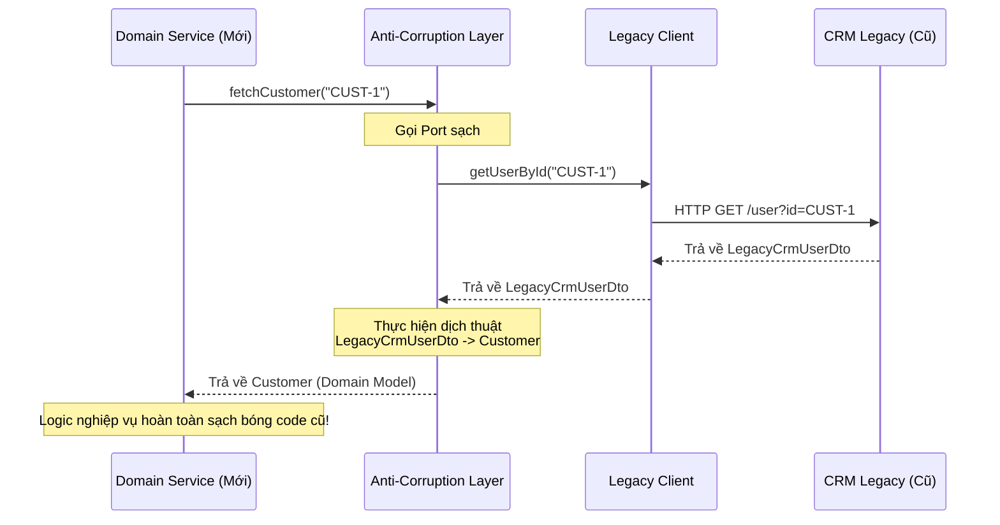

# Lớp chống Nhiễm độc là gì? (Anti-Corruption Layer - ACL)

## ⚡ Tóm tắt ngắn (30s)
* **Khái niệm**: **Anti-Corruption Layer (ACL - Lớp chống nhiễm độc/thối hóa)** là một mẫu thiết kế kiến trúc thuộc nhóm **Thiết kế Chiến lược (Strategic Design)** của DDD. Nó đóng vai trò là một **tầng trung gian dịch thuật (Translation Layer)** đứng chắn giữa hệ thống mới (Downstream) và hệ thống cũ/bên thứ ba (Upstream).
* **Mục tiêu**: Ngăn chặn tuyệt đối việc các mô hình dữ liệu xấu xí, lỗi thời hoặc thuật ngữ nhập nhằng của hệ thống cũ rò rỉ và "nhiễm độc" vào mô hình miền nghiệp vụ sạch sẽ, hiện đại của hệ thống mới.
* **Cơ chế**: ACL chuyển dịch toàn bộ các cuộc gọi API và định dạng dữ liệu ngoại lai thành các khái niệm nghiệp vụ và thực thể (Entities/Value Objects) sạch sẽ của hệ thống mới trước khi đưa vào Domain Core.

---

## 🔍 Phân tích chi tiết: Tại sao và Khi nào cần dùng ACL?

### 1. Vấn đề "Nhiễm độc Kiến trúc" (Architectural Corruption)
Khi tích hợp hệ thống mới viết bằng Clean Architecture với một hệ thống Legacy cũ kỹ (đã chạy 10 năm) hoặc API của đối tác bên ngoài:
* Hệ thống cũ có cấu trúc dữ liệu rất tệ, đặt tên cột tối nghĩa (ví dụ: `cust_sts_cd_01` thay vì `is_active`).
* Nếu bạn để tầng Service mới trực tiếp nhận và xử lý các DTO của hệ thống cũ, toàn bộ logic nghiệp vụ mới của bạn sẽ bị "vấy bẩn". Bạn phải viết code kiểm tra các điều kiện dị biệt của hệ thống cũ.
* **Hậu quả**: Khi hệ thống cũ thay đổi API, hệ thống mới của bạn cũng sập dây chuyền. Bạn đã đánh mất hoàn toàn tính "sạch" của Domain.

### 2. Giải pháp ACL (Bức tường lửa bảo vệ Domain)
ACL đóng vai trò như một thông dịch viên ở biên hệ thống, bao gồm hai thành phần chính:
* **Adapters / Facades**: Chịu trách nhiệm thực hiện các kết nối vật lý, gửi request HTTP/gọi gRPC/đọc DB thô sang hệ thống cũ.
* **Translators (Bộ dịch thuật)**: Chịu trách nhiệm chuyển đổi (mapping) hai chiều giữa DTO của hệ thống cũ và Domain Model sạch của hệ thống mới.

```
┌────────────────────────────────────────────────────────┐
│               HỆ THỐNG MỚI (DOWNSTREAM)                │
│                                                        │
│  ┌─────────────────┐        ┌───────────────────────┐  │
│  │   Domain Core   │ ◄────  │ Anti-Corruption Layer │  │
│  │  (Domain Model) │  Gọi   │ (Adapter + Translator)│  │
│  └─────────────────┘        └───────────┬───────────┘  │
└─────────────────────────────────────────│──────────────┘
                                          │  Gọi chuyển đổi
                                          ▼
                              ┌───────────────────────┐
                              │  HỆ THỐNG CŨ/BÊN THỨ 3│
                              │    (UPSTREAM)         │
                              └───────────────────────┘
```

---

## 💻 Code Example: Tích hợp Hệ thống CRM Legacy của bên thứ ba

Hệ thống mới của bạn quản lý Khách hàng qua thực thể `Customer` sạch sẽ. Tuy nhiên, bạn phải lấy thông tin từ một hệ thống CRM cổ đại trả về định dạng DTO cực kỳ hỗn loạn.

### 1. Thực thể sạch ở hệ thống mới (Domain Model)
```java
// domain.model.Customer.java
public class Customer {
    private final String id;
    private final String fullName;
    private final boolean isActive;

    public Customer(String id, String fullName, boolean isActive) {
        this.id = id;
        this.fullName = fullName;
        this.isActive = isActive;
    }
    // Getters, Business Logic...
}
```

### 2. DTO thô dị biệt trả về từ CRM cũ (Legacy DTO)
```java
// infrastructure.legacy.LegacyCrmUserDto.java
public class LegacyCrmUserDto {
    public String usr_id_key;      // ID đặt tên kỳ quái
    public String first_name_val;
    public String last_name_val;
    public int status_flag_01;     // 1 là hoạt động, 0 là khóa
}
```

### 3. Triển khai Anti-Corruption Layer (ACL)

Đầu tiên, định nghĩa Port trừu tượng ở Domain:
```java
// domain.port.outbound.CustomerExternalService.java
public interface CustomerExternalService {
    Customer fetchCustomer(String id);
}
```

Tiếp theo, viết lớp triển khai ACL ở tầng Infrastructure thực hiện dịch thuật:
```java
// infrastructure.acl.CustomerAclAdapter.java
@Component
public class CustomerAclAdapter implements CustomerExternalService {
    private final LegacyCrmClient crmClient; // Client kết nối vật lý với CRM cũ

    public CustomerAclAdapter(LegacyCrmClient crmClient) {
        this.crmClient = crmClient;
    }

    @Override
    public Customer fetchCustomer(String id) {
        // 1. Gọi hệ thống cũ lấy DTO thô
        LegacyCrmUserDto legacyDto = crmClient.getUserById(id);
        
        if (legacyDto == null) return null;

        // 2. Sử dụng Translator để dịch thuật dữ liệu sang Domain Model sạch
        return translateToDomain(legacyDto);
    }

    // TRANSLATOR: Trọng tâm của ACL là hàm chuyển đổi này!
    private Customer translateToDomain(LegacyCrmUserDto dto) {
        String cleanId = dto.usr_id_key;
        String cleanName = dto.first_name_val + " " + dto.last_name_val;
        boolean cleanStatus = (dto.status_flag_01 == 1); // Dịch logic dị biệt của hệ thống cũ

        // Trả về đối tượng Domain tinh khiết
        return new Customer(cleanId, cleanName, cleanStatus);
    }
}
```

---

## 🎨 Sơ đồ luồng dữ liệu đi qua ACL



---

## 📊 Phân tích Trade-offs: Tích hợp Trực tiếp vs Sử dụng ACL

| Tiêu chí | Tích hợp Trực tiếp (Direct Integration) | Sử dụng Lớp chống Nhiễm độc (ACL) |
| :--- | :--- | :--- |
| **Tính toàn vẹn của Domain**| **Rất thấp**: Domain core bị vấy bẩn bởi cấu trúc dữ liệu thô của bên ngoài. | **Tuyệt đối**: Bảo vệ lõi nghiệp vụ luôn tinh khiết, sạch sẽ. |
| **Thời gian triển khai ban đầu**| **Rất nhanh**: Chỉ cần gọi API, nhận DTO rồi dùng trực tiếp là xong. | **Chậm hơn**: Phải viết thêm interface Port, class Adapter và viết hàm dịch thuật (Translator). |
| **Chi phí bảo trì dài hạn**| **Cực cao**: Hệ thống cũ thay đổi API sẽ làm đổ vỡ dây chuyền toàn bộ code nghiệp vụ. | **Rất thấp**: Chỉ cần sửa đúng hàm dịch thuật trong file ACL, nghiệp vụ chính giữ nguyên. |
| **Tác động hiệu năng** | Không có độ trễ chuyển đổi bộ nhớ. | Có một chút overhead siêu nhỏ do chạy CPU để map dữ liệu (không đáng kể so với I/O mạng). |

---

## ⚠️ Common Gotchas (Câu hỏi phỏng vấn đào sâu)

### 1. Việc mapping dữ liệu qua nhiều tầng (từ Legacy DTO -> Domain Model -> UI DTO) trong ACL có thực sự gây suy giảm hiệu năng hệ thống (Performance Overhead) đáng lo ngại không? Xử lý thế nào?
* **Trả lời**: Đây là thắc mắc kinh điển của các lập trình viên thiên về tối ưu hiệu năng phần cứng:
  * **Thực tế**: Trong 99.9% các ứng dụng doanh nghiệp (Enterprise Apps), thắt nút cổ chai hiệu năng (Performance Bottleneck) luôn nằm ở **Network I/O** (gọi API qua HTTP mất 100-200ms) và **Database I/O** (mất 10-50ms).
  * Việc chạy CPU để ánh xạ một vài thuộc tính đối tượng trong bộ nhớ RAM chỉ tốn **dưới 1 micro-giây** (0.001ms), hoàn toàn có thể bỏ qua. Lợi ích khổng lồ về mặt kiến trúc dễ bảo trì, dễ viết test vượt trội gấp hàng ngàn lần so với tổn thất siêu nhỏ này.
  * **Cách tối ưu khi dữ liệu khổng lồ (Batch Processing)**:
    * Nếu cần xử lý hàng triệu bản ghi cùng lúc, ta có thể dùng các công cụ mapping hiệu năng cực cao tự động sinh bytecode lúc compile như **MapStruct**, tránh dùng cơ chế Reflection (như `BeanUtils.copyProperties` vốn rất chậm).

### 2. ACL nên được thiết kế và đặt ở đâu? Ở phía hệ thống Thượng nguồn (Upstream - hệ thống cũ) hay Hạ nguồn (Downstream - hệ thống mới)?
* **Trả lời**: 
  * ACL **luôn luôn phải được đặt ở phía Hạ nguồn (Downstream - hệ thống mới)**.
  * **Lý do**: Hệ thống hạ nguồn là bên đang có nhu cầu tự bảo vệ mình khỏi sự ảnh hưởng và nhiễm độc của hệ thống thượng nguồn. Hệ thống cũ (Upstream) thường là mã nguồn đóng, khó can thiệp hoặc không có nhiệm vụ phải phục vụ riêng cho thiết kế sạch của hệ thống mới của bạn. Do đó, đội phát triển hệ thống mới phải tự xây bức tường lửa ACL này ở biên ứng dụng của mình để làm chủ hoàn toàn kiến trúc.
