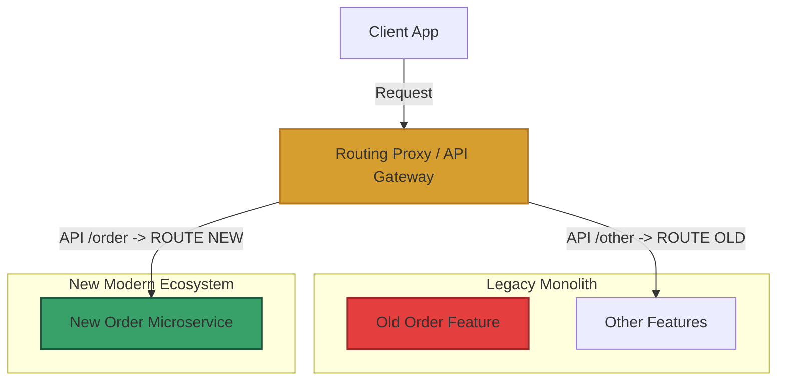

# Chiến lược Tái cấu trúc mã nguồn cũ an toàn (Safe Legacy Code Refactoring Strategies)

## ⚡ Tóm tắt ngắn (30s)
* **Khái niệm**: **Tái cấu trúc mã nguồn cũ (Legacy Code Refactoring)** là quá trình cải tiến cấu trúc thiết kế bên trong của mã nguồn hiện có mà không làm thay đổi hành vi hoạt động bên ngoài (External Behavior) của nó.
* **Nguyên tắc vàng của Michael Feathers**: **Tuyệt đối không được thay đổi code nếu chưa có Test bao phủ**. 
* **3 Chiến lược thực chiến đỉnh cao**:
  1. **Branch by Abstraction (Nhánh bằng Trừu tượng)**: Đặt lớp cũ sau một Interface, viết lớp mới hiện thực hóa Interface đó, rồi lắp ghép thay thế dần dần.
  2. **Sprout Method / Sprout Class (Đâm chồi)**: Viết tính năng mới hoàn toàn độc lập vào hàm/class mới và gọi nó từ hàm cũ, tránh chắp vá thêm code rối vào file cũ.
  3. **Strangler Fig Pattern (Mẫu cây bóp nghẹt)**: Dành cho mức vĩ mô (System-level). Thay thế dần từng phần của hệ thống cũ bằng dịch vụ mới thông qua một cổng định tuyến (Routing) cho đến khi hệ thống cũ bị thay thế hoàn toàn.

---

## 🔍 Phân tích các Chiến lược thực chiến cốt lõi

### 1. Phá vỡ vòng lặp luẩn quẩn bằng Characterization Tests
* **Thực tế**: Bạn muốn viết Unit Test cho code cũ -> Nhưng code cũ kết dính chặt chẽ (Tight Coupling) nên không thể Mock để viết Unit Test được -> Vì không có Test nên bạn không dám sửa để Decoupling -> Vòng lặp bế tắc.
* **Giải pháp**: Viết **Characterization Tests (Golden Master Test)**. 
  * Hãy viết các bài test tích hợp (Integration Test) ở mức cao (E2E hoặc API Test). Chạy hệ thống với 1000 bộ dữ liệu đầu vào khác nhau và ghi nhận lại chính xác kết quả đầu ra (Snapshot). 
  * Đây là khế ước hành vi. Khi refactor, chỉ cần chạy lại bộ test này, nếu kết quả đầu ra không đổi nghĩa là bạn đã refactor an toàn 100%.

### 2. Kỹ thuật Branch by Abstraction (Nhánh bằng Trừu tượng)
Kỹ thuật này cho phép ta thay thế một thành phần hệ thống cực lớn ngay trên nhánh chính (`main`) mà không cần tạo nhánh git dài hạn, tránh xung đột merge code (Merge Hell).

```
GIAI ĐOẠN 1: DỰNG RANH GIỚI
  Client ──► [ <<Interface>> OrderProcessor ]
                           ▲
                           │ Triển khai
                 ┌─────────┴─────────┐
                 │  LegacyProcessor  │ (Code cũ nát)
                 └───────────────────┘

GIAI ĐOẠN 2: THAY THẾ DẦN
  Client ──► [ <<Interface>> OrderProcessor ] 
                           ▲
                Chuyển qua │ Cấu hình Feature Flag
                 ┌─────────┼─────────┐
                 │         │         │
        ┌────────┴────────┐┌────────┴────────┐
        │ LegacyProcessor ││   NewProcessor  │ (Code mới tinh khiết)
        └─────────────────┘└─────────────────┘
```

---

## 💻 Code Example: Áp dụng Branch by Abstraction trong Java

Chúng ta cần tái cấu trúc thuật toán tính thuế cũ nát, rắc rối của lớp `LegacyTaxCalculator` sang thuật toán mới.

### Bước 1: Khai báo Interface trừu tượng bảo vệ Client
```java
public interface TaxCalculator {
    double calculateTax(double income);
}
```

### Bước 2: Ép lớp cũ kế thừa Interface này
```java
// Ép class cũ implements interface mới, giữ nguyên logic cũ
public class LegacyTaxCalculator implements TaxCalculator {
    @Override
    public double calculateTax(double income) {
        // ... 500 dòng code spaghetti cũ ...
        return income * 0.10; 
    }
}
```

### Bước 3: Viết lớp xử lý mới hoàn toàn tinh khiết
```java
public class ModernTaxCalculator implements TaxCalculator {
    @Override
    public double calculateTax(double income) {
        // Code mới sạch sẽ, dễ đọc, có Unit Test bao phủ 100%
        if (income < 0) throw new IllegalArgumentException("Thu nhập không được âm!");
        return income * 0.08; 
    }
}
```

### Bước 4: Điều phối chuyển giao an toàn bằng Feature Flag
Sử dụng mẫu **Shadow Execution** (Chạy song song) để kiểm thử thực tế trên Production mà không làm gián đoạn khách hàng:

```java
@Service
public class TaxService {
    private final TaxCalculator legacyCalculator;
    private final TaxCalculator modernCalculator;
    private final FeatureFlagClient featureFlag; // Cấu hình bật/tắt từ xa

    public TaxService(TaxCalculator legacy, TaxCalculator modern, FeatureFlagClient flag) {
        this.legacyCalculator = legacy;
        this.modernCalculator = modern;
        this.featureFlag = flag;
    }

    public double getTax(double income) {
        if (featureFlag.isEnabled("use-modern-tax-calculator")) {
            return modernCalculator.calculateTax(income); // Chạy code mới
        }
        
        // CHẠY SHADOW (Tùy chọn): Chạy cả hai để so sánh sai lệch trong log log
        double legacyResult = legacyCalculator.calculateTax(income);
        double modernResult = modernCalculator.calculateTax(income);
        if (legacyResult != modernResult) {
            log.warn("Sai lệch thuật toán! Cũ: {}, Mới: {}", legacyResult, modernResult);
        }

        return legacyResult; // Vẫn trả về kết quả cũ an toàn cho khách hàng
    }
}
```

---

## 🎨 Sơ đồ vĩ mô: Strangler Fig Pattern (Cây bóp nghẹt)

Dành cho việc tái cấu trúc các hệ thống Monolith cũ nát sang kiến trúc Microservices mới:



* **Cơ chế**: API Gateway sẽ chuyển dần lưu lượng truy cập (ví dụ: 10% request) của API `/order` sang Service mới. Khi Service mới chạy ổn định 100%, ta ngắt hoàn toàn route sang Monolith cũ đối với tính năng này. Dần dần, Monolith bị "bóp nghẹt" và khai tử hoàn toàn.

---

## 📊 Phân tích Trade-offs: Big Bang Rewrite vs Incremental Refactoring

| Tiêu chí | Viết lại từ đầu (Big Bang Rewrite) | Tái cấu trúc từng bước (Incremental) |
| :--- | :--- | :--- |
| **Mức độ rủi ro** | **Cực kỳ cao**: Rất dễ thiếu sót các logic ẩn (Edge Cases) của hệ thống cũ đã chạy nhiều năm. | **Rất thấp**: Mỗi bước thay đổi đều nhỏ, có test và Feature Flag bảo vệ. |
| **Time-to-market** | **Rất lâu**: Phải đợi viết xong toàn bộ hệ thống mới bàn giao được tính năng đầu tiên. | **Rất nhanh**: Khách hàng được thụ hưởng các cải tiến nhỏ liên tục. |
| **Kiểm soát ngân sách**| Khó kiểm soát. Dự án viết lại từ đầu thường bị trễ deadline từ vài tháng đến vài năm. | Dễ dàng quản lý dựa trên việc chia nhỏ task theo từng sprint. |
| **Độ ức chế của Dev** | Thấp ban đầu (thích viết mới), cực cao về sau khi phải đi dò tìm bug cũ. | Đòi hỏi tính kiên trì và kỷ luật kỹ thuật cao ngay từ đầu. |

---

## ⚠️ Common Gotchas (Câu hỏi phỏng vấn đào sâu)

### 1. Michael Feathers khuyên "Không có Test thì cấm sửa code". Nhưng code cũ kết dính quá chặt, không thể Mock hay tách Class để viết Unit Test được! Đây là cái bẫy luẩn quẩn kinh điển. Làm sao ta thoát ra để thực hiện bước đi đầu tiên?
* **Trả lời**: Đây là câu hỏi thực chiến đỉnh cao của các Senior:
  * Để thoát khỏi vòng lặp này, ta phải áp dụng các kỹ thuật **"Phẫu thuật bẻ khớp" (Breaking Dependencies / Seams)** của Feathers một cách cực kỳ cẩn thận:
    1. **Tận dụng các công cụ tự động của IDE**: Chỉ sử dụng tính năng refactoring tự động của các IDE xịn (như IntelliJ IDEA) để thực hiện các thao tác siêu an toàn như: *Extract Method*, *Extract Interface*. Tuyệt đối không tự tay gõ sửa code lúc này vì IDE tự động đảm bảo không sai cú pháp.
    2. **Subclass and Override Method**: Tạo một lớp con kế thừa lớp cũ khó test đó. Trong lớp con, ta ghi đè (override) các phương thức gây cản trở kiểm thử (như phương thức kết nối DB vật lý) để trả về dữ liệu giả lập. Sau đó ta có thể viết Unit Test cho lớp cha thông qua lớp con này.
    3. **Chấp nhận viết Integration Test trước**: Chấp nhận dựng DB ảo (như H2 hoặc Testcontainers) để viết bộ Integration Test bao phủ luồng đi chính trước, sau khi an tâm mới tiến hành đập nhỏ class để viết Unit Test.

### 2. Làm thế nào để chạy thử nghiệm và chuyển giao code mới thay thế hoàn toàn code cũ trên Production một cách an toàn tuyệt đối mà không sợ xảy ra thảm họa hệ thống?
* **Trả lời**:
  * Áp dụng kỹ thuật **Dark Launch / Shadow Execution (Chạy bóng đêm)**:
    * Khi một request gửi đến, ta **cho chạy cả 2 luồng xử lý**: code cũ và code mới.
    * Ta lấy kết quả của code cũ để trả về cho người dùng (đảm bảo người dùng không bị ảnh hưởng).
    * Đồng thời, ta so sánh kết quả của code mới với code cũ. Nếu phát hiện sự sai lệch (Mismatch), ta ghi nhận log chi tiết (Sentry/Kibana) để điều tra.
    * Khi tỷ lệ sai lệch trên Production về bằng **0%** liên tục trong vòng 1-2 tuần, ta tự tin gạt Feature Flag để chuyển hướng 100% người dùng sang dùng kết quả của code mới và tiến hành xóa bỏ hoàn toàn code cũ (Clean up).
