# Mẫu thiết kế Chiến lược (Strategy Design Pattern)

## ⚡ Tóm tắt ngắn (30s)
* **Khái niệm**: **Strategy Pattern** là một mẫu thiết kế thuộc nhóm **Hành vi (Behavioral Patterns)**. Nó cho phép định nghĩa một tập hợp các thuật toán hoặc hành vi có cùng một mục đích, đóng gói từng hành vi đó vào các lớp riêng biệt (Strategies), và giúp chúng có thể thay thế linh hoạt cho nhau khi chạy (Runtime).
* **Giá trị cốt lõi**:
  * **Giải phóng cấu trúc rẽ nhánh**: Loại bỏ các khối lệnh `if-else` hoặc `switch-case` cồng kềnh, phức tạp và dễ vỡ khi thêm hành vi mới.
  * **Tuân thủ OCP (Open/Closed Principle)**: Khi muốn thêm một thuật toán mới, ta chỉ cần viết thêm một class Strategy mới mà không cần sửa đổi bất kỳ dòng mã nguồn nào của lớp gọi (Context).
  * **Tách biệt mối quan tâm (Separation of Concerns)**: Tách logic của thuật toán ra khỏi logic xử lý nghiệp vụ chung của hệ thống.

---

## 🔍 Khi nào nên áp dụng Strategy Pattern?

Hãy cân nhắc áp dụng mẫu thiết kế Strategy trong 3 kịch bản thực tế sau:

1. **Khi hệ thống có nhiều biến thể của cùng một hành vi**:
   * *Ví dụ*: Các phương thức thanh toán khác nhau (CreditCard, Paypal, Momo, QR Code).
   * *Ví dụ*: Các thuật toán nén file khác nhau (Zip, Rar, 7z).
   * *Ví dụ*: Các chiến lược tính thuế hoặc chiết khấu khác nhau tùy theo quốc gia hoặc đối tượng khách hàng.
2. **Khi bạn muốn đóng gói và che giấu chi tiết thuật toán**:
   * Khách hàng sử dụng thuật toán không cần biết thuật toán đó hoạt động bên trong ra sao, tránh việc phơi bày các biến nội bộ hoặc cấu trúc dữ liệu nhạy cảm của thuật toán cho Client.
3. **Khi một lớp có quá nhiều hành vi khác nhau và chúng được điều khiển bởi các câu lệnh điều kiện phân loại**:
   * Nếu mã nguồn của bạn ngập tràn các đoạn lệnh `if (type == A) { doA(); } else if (type == B) { doB(); }`, đó là tín hiệu mạnh mẽ cần tái cấu trúc (refactoring) sang Strategy Pattern.

---

## 💻 Code Example: Thiết kế hệ thống tính chiết khấu đơn hàng

### ❌ Vi phạm thiết kế (Fragile Switch-case)
Lớp `OrderService` phải gánh vác toàn bộ logic tính chiết khấu cho mọi loại khách hàng. Mỗi khi có chính sách chiết khấu mới, ta phải nhảy vào sửa đổi phương thức cũ.

```java
public class OrderService {
    public double calculateDiscount(String customerType, double orderAmount) {
        // TỒN TẠI CODE MÙI (Code Smell): Switch-case phình to khi thêm chính sách mới
        switch (customerType) {
            case "NEW":
                return 0.0; // Khách hàng mới không giảm giá
            case "REGULAR":
                return orderAmount * 0.05; // Giảm 5%
            case "VIP":
                return orderAmount * 0.15; // Giảm 15%
            // Thêm đối tượng PARTNER, WHOLESALE => Sửa trực tiếp hàm này!
            default:
                throw new IllegalArgumentException("Loại khách hàng không hợp lệ");
        }
    }
}
```

### ✔️ Áp dụng Strategy Pattern (Elegant Design)
1. **Định nghĩa Strategy Interface**:
```java
public interface DiscountStrategy {
    double applyDiscount(double amount);
}
```

2. **Triển khai các chiến lược cụ thể (Concrete Strategies)**:
```java
public class NewCustomerDiscount implements DiscountStrategy {
    @Override
    public double applyDiscount(double amount) {
        return 0.0;
    }
}

public class RegularCustomerDiscount implements DiscountStrategy {
    @Override
    public double applyDiscount(double amount) {
        return amount * 0.05;
    }
}

public class VipCustomerDiscount implements DiscountStrategy {
    @Override
    public double applyDiscount(double amount) {
        return amount * 0.15;
    }
}
```

3. **Lớp ngữ cảnh điều phối (Context) tương tác qua Interface**:
```java
public class OrderContext {
    private DiscountStrategy discountStrategy;

    // Cho phép thay đổi chiến lược linh hoạt lúc Runtime (Setter)
    public void setDiscountStrategy(DiscountStrategy discountStrategy) {
        this.discountStrategy = discountStrategy;
    }

    public double executeDiscount(double amount) {
        if (discountStrategy == null) {
            throw new IllegalStateException("Chưa cấu hình chiến lược chiết khấu!");
        }
        return discountStrategy.applyDiscount(amount);
    }
}
```

4. **Sử dụng thực tế**:
```java
OrderContext context = new OrderContext();

// Khách hàng VIP
context.setDiscountStrategy(new VipCustomerDiscount());
double vipDiscount = context.executeDiscount(100.0); // 15.0

// Thay đổi sang khách hàng Regular lúc Runtime
context.setDiscountStrategy(new RegularCustomerDiscount());
double regularDiscount = context.executeDiscount(100.0); // 5.0
```

---

## 🎨 Sơ đồ kiến trúc mẫu Strategy

```mermaid
classDiagram
    class OrderContext {
        -DiscountStrategy discountStrategy
        +setDiscountStrategy(strategy)
        +executeDiscount(amount) double
    }
    
    class DiscountStrategy {
        <<interface>>
        +applyDiscount(amount) double
    }
    
    class NewCustomerDiscount {
        +applyDiscount(amount) double
    }
    
    class RegularCustomerDiscount {
        +applyDiscount(amount) double
    }
    
    class VipCustomerDiscount {
        +applyDiscount(amount) double
    }

    OrderContext --> DiscountStrategy : Aggregates / Uses
    NewCustomerDiscount ..|> DiscountStrategy : Implements
    RegularCustomerDiscount ..|> DiscountStrategy : Implements
    VipCustomerDiscount ..|> DiscountStrategy : Implements

    style DiscountStrategy fill:#1a365d,stroke:#3182ce,stroke-width:2px
    style OrderContext fill:#2c1a3f,stroke:#7b2cbf,stroke-width:2px
```



---

## 📊 Phân tích Trade-offs: So sánh các cách giải quyết

| Tiêu chí | Sử dụng Switch-case truyền thống | Áp dụng Strategy Pattern cổ điển | Sử dụng Java 8+ Functional Interfaces / Lambdas |
| :--- | :--- | :--- | :--- |
| **Tính đơn giản** | **Cực cao**: Mọi thứ nằm trong 1 file, trực quan ở mức cơ bản. | **Phức tạp hơn**: Phát sinh nhiều file class và interface mới. | **Tối ưu**: Rất gọn gàng, giảm thiểu tối đa số lượng file boilerplate. |
| **Độ bao phủ Unit Test** | **Kém**: Khó test cô lập từng nhánh điều kiện khi logic xử lý bên trong quá lớn. | **Xuất sắc**: Mỗi chiến lược là 1 class độc lập, dễ dàng Mock và viết Unit Test chuyên sâu. | **Xuất sắc**: Dễ dàng kiểm thử các biểu thức lambda độc lập. |
| **Khả năng mở rộng (OCP)**| **Tồi tệ**: Mỗi lần thêm thuật toán là phải sửa file cũ. | **Tuyệt vời**: Đóng hoàn toàn trước sự sửa đổi, chỉ viết thêm class mới. | **Tuyệt vời**: Định nghĩa nhanh các hành vi mới ngay tại luồng cấu hình. |
| **Cognitive Load (Đọc hiểu)**| Thấp khi code ngắn, nhưng cực cao khi code dài hơn 100 dòng. | Trung bình do phải chuyển tiếp qua nhiều file. | Thấp đối với người quen với Functional Programming. |

---

## ⚠️ Common Gotchas (Câu hỏi phỏng vấn đào sâu)

### 1. Strategy Pattern có nguy cơ làm bùng nổ số lượng class trong dự án (Class Explosion). Làm cách nào để tối ưu hóa điều này trong môi trường Java hiện đại?
* **Trả lời**: Đây là một nhược điểm thực chiến lớn của Strategy Pattern cổ điển. Để tránh việc tạo hàng chục file class nhỏ lẻ, ta có hai cách tối ưu cực tốt trong Java hiện đại:
  * **Sử dụng Functional Interface & Lambda (Java 8+)**: Do hầu hết các Strategy chỉ có một phương thức duy nhất (Single Abstract Method), chúng bản chất là các Functional Interface. Ta có thể định nghĩa chiến lược bằng biểu thức Lambda mà không cần tạo class vật lý:
    ```java
    OrderContext context = new OrderContext();
    // Tiêm hành vi trực tiếp bằng Lambda, không cần tạo class mới!
    context.setDiscountStrategy(amount -> amount * 0.25); 
    ```
  * **Sử dụng Enum**: Nếu số lượng chiến lược là hữu hạn và cố định, ta có thể tích hợp trực tiếp hành vi vào trong `Enum`:
    ```java
    public enum DiscountStrategyEnum {
        VIP {
            @Override public double apply(double amount) { return amount * 0.15; }
        },
        NEW {
            @Override public double apply(double amount) { return 0.0; }
        };
        public abstract double apply(double amount);
    }
    ```

### 2. Sự khác biệt cốt lõi giữa Strategy Pattern và State Pattern là gì? Chúng giống nhau đến 90% về mặt cấu trúc class!
* **Trả lời**: Đúng là về mặt cấu trúc UML, hai mẫu này gần như giống hệt nhau (đều chứa Interface đại diện cho hành vi/trạng thái và lớp Context tham chiếu tới). Sự khác biệt nằm ở **Mục đích thiết kế (Intent)** và **Sự nhận biết của Context**:
  * **Strategy Pattern**:
    * **Mục đích**: Thay đổi linh hoạt các *thuật toán khác nhau* để giải quyết cùng một công việc cụ thể.
    * **Kiểm soát**: Lớp Client thường nhận biết rõ có những chiến lược nào và chủ động chọn/tiêm chiến lược phù hợp vào Context.
    * **Tính liên tục**: Lớp Context thường giữ nguyên chiến lược đó từ đầu tới cuối cuộc giao dịch, không tự chuyển đổi qua lại giữa các chiến lược.
  * **State Pattern**:
    * **Mục đích**: Thay đổi hành vi của một đối tượng khi *trạng thái nội bộ* của nó thay đổi (đối tượng giống như biến hình thành lớp khác).
    * **Kiểm soát**: Lớp Client hoàn toàn không biết hoặc không cần quan tâm đến các trạng thái nội bộ. Các State tự động chuyển đổi qua lại lẫn nhau dựa trên các sự kiện kích hoạt (triggers).
    * **Tính liên tục**: Trạng thái liên tục thay đổi trong suốt vòng đời của Context (ví dụ: Trạng thái Order chuyển từ *CREATED* -> *PAID* -> *DELIVERED*).
