# Mẫu thiết kế Bộ chuyển đổi (Adapter Design Pattern)

## ⚡ Tóm tắt ngắn (30s)
* **Khái niệm**: **Adapter Pattern** là một mẫu thiết kế thuộc nhóm **Cấu trúc (Structural Patterns)**. Nó đóng vai trò như một "phích cắm chuyển đổi", cho phép các đối tượng có giao diện (Interface) không tương thích có thể hợp tác và làm việc trơn tru với nhau.
* **Giá trị cốt lõi**:
  * **Tái sử dụng thư viện cũ/bên thứ ba**: Cho phép tích hợp các lớp có sẵn (Legacy Code hoặc 3rd-party Library) vào hệ thống mới mà không cần chỉnh sửa trực tiếp mã nguồn của các lớp đó.
  * **Tuân thủ OCP (Open/Closed Principle)**: Khi tích hợp thêm nhà cung cấp dịch vụ mới, ta chỉ cần tạo thêm một lớp Adapter mới mà không làm ảnh hưởng đến mã nguồn của Client hiện tại.
  * **Phân tách mã nguồn (Decoupling)**: Client hoàn toàn độc lập và chỉ tương tác qua giao diện chuẩn mà nó kỳ vọng.

---

## 🔍 Phân tích chi tiết: Vấn đề Adapter giải quyết

### 1. Kịch bản thực tế
Hãy tưởng tượng bạn đang xây dựng một ứng dụng phân tích tài chính hiện đại nhận dữ liệu đầu vào dưới dạng **JSON**. Tuy nhiên, bạn bắt buộc phải tích hợp một thư viện phân tích biểu đồ cực mạnh của bên thứ ba nhưng thư viện này chỉ chấp nhận đầu vào là **XML**.
* **Giải pháp tồi**: Sửa lại toàn bộ ứng dụng của bạn để xuất ra XML, hoặc sửa lại code thư viện của bên thứ ba (thường là bất khả thi vì là mã nguồn đóng).
* **Giải pháp Adapter**: Tạo ra một bộ chuyển đổi XML-to-JSON Adapter đóng vai trò thông dịch viên ở giữa.

```
┌──────────────┐                  ┌─────────────────┐                  ┌─────────────┐
│ Client (JSON)│ ───────────────► │ Adapter (JSON)  │ ───────────────► │ Legacy XML  │
│              │   Gửi JSON       │ Chuyển JSON-XML │   Gửi XML        │ (Adaptee)   │
└──────────────┘                  └─────────────────┘                  └─────────────┘
```

### 2. Hai cách triển khai Adapter
* **Object Adapter (Bộ chuyển đổi đối tượng - Khuyên dùng)**: Sử dụng cơ chế **Đóng gói (Composition)**. Adapter chứa một thực thể của lớp không tương thích (Adaptee) bên trong nó. Hỗ trợ đa hình cực tốt và linh hoạt.
* **Class Adapter (Bộ chuyển đổi lớp)**: Sử dụng cơ chế **Đa kế thừa (Inheritance)**. Adapter kế thừa từ cả lớp Target và lớp Adaptee. Trong Java, do không hỗ trợ đa kế thừa lớp, cách này chỉ triển khai được nếu Target là một Interface. Ít được khuyến nghị vì tạo độ gắn kết cao giữa các class.

---

## 💻 Code Example: Tích hợp cổng thanh toán ngân hàng cũ

Dưới đây là kịch bản hệ thống thanh toán chuẩn của bạn sử dụng interface `PaymentProcessor`, nhưng bạn cần tích hợp một dịch vụ của ngân hàng nông nghiệp cũ (`AgribankService`) có phương thức thanh toán hoàn toàn khác lạ.

### 1. Hệ thống hiện tại (Target Interface)
```java
// Giao diện chuẩn hệ thống mới kỳ vọng
public interface PaymentProcessor {
    void processPayment(double amountInVnd, String transactionId);
}

// Cổng thanh toán hiện đại chuẩn
public class ModernPaypalProcessor implements PaymentProcessor {
    @Override
    public void processPayment(double amountInVnd, String transactionId) {
        System.out.println("Paypal xử lý giao dịch " + transactionId + " số tiền: " + amountInVnd + " VND");
    }
}
```

### 2. Dịch vụ ngân hàng cũ không tương thích (Adaptee)
```java
// Lớp cũ, không thể sửa đổi mã nguồn
public class LegacyAgribankService {
    // Tên phương thức khác biệt, nhận tham số kiểu USD thay vì VND
    public void makeAgriTransfer(double amountInUsd, String senderName, String receiverName) {
        System.out.println("Agribank chuyển khoản " + amountInUsd + " USD từ " + senderName + " tới " + receiverName);
    }
}
```

### 3. Giải pháp: Tạo Adapter (Object Adapter)
```java
public class AgribankAdapter implements PaymentProcessor {
    private final LegacyAgribankService agribankService;
    private static final double USD_TO_VND_RATE = 25000.0;

    // Nhận Adaptee thông qua Composition
    public AgribankAdapter(LegacyAgribankService agribankService) {
        this.agribankService = agribankService;
    }

    @Override
    public void processPayment(double amountInVnd, String transactionId) {
        // 1. Chuyển đổi dữ liệu (VND -> USD)
        double amountInUsd = amountInVnd / USD_TO_VND_RATE;
        
        // 2. Chuyển đổi tham số nghiệp vụ cho khớp với API cũ
        String sender = "SYSTEM_CUSTOMER";
        String receiver = "AGRI_MERCHANT_" + transactionId;

        // 3. Ủy thác xử lý cho dịch vụ cũ
        agribankService.makeAgriTransfer(amountInUsd, sender, receiver);
    }
}
```

### 4. Sử dụng tại Client
```java
public class ECommerceApp {
    private final PaymentProcessor paymentProcessor;

    public ECommerceApp(PaymentProcessor paymentProcessor) {
        this.paymentProcessor = paymentProcessor;
    }

    public void checkout(double totalAmount, String orderId) {
        paymentProcessor.processPayment(totalAmount, orderId);
    }
}

// Chạy ứng dụng thực tế
public class Main {
    public static void main(String[] args) {
        // Tích hợp Agribank cũ thông qua Adapter mà không cần sửa 1 dòng code ECommerceApp!
        LegacyAgribankService legacyService = new LegacyAgribankService();
        PaymentProcessor adapter = new AgribankAdapter(legacyService);

        ECommerceApp app = new ECommerceApp(adapter);
        app.checkout(50000.0, "ORDER_999"); // Đầu ra: Agribank chuyển khoản 2.0 USD...
    }
}
```

---

## 🎨 Sơ đồ cấu trúc UML của Object Adapter

```mermaid
classDiagram
    class Client {
        -PaymentProcessor processor
    }
    
    class PaymentProcessor {
        <<interface>>
        +processPayment(amount, txId)
    }
    
    class ModernPaypalProcessor {
        +processPayment(amount, txId)
    }
    
    class AgribankAdapter {
        -LegacyAgribankService agribankService
        +processPayment(amount, txId)
    }
    
    class LegacyAgribankService {
        +makeAgriTransfer(amountUsd, sender, receiver)
    }

    Client --> PaymentProcessor : Uses
    ModernPaypalProcessor ..|> PaymentProcessor : Implements
    AgribankAdapter ..|> PaymentProcessor : Implements
    AgribankAdapter --> LegacyAgribankService : Wraps / Delegates (Composition)

    style PaymentProcessor fill:#1a365d,stroke:#3182ce,stroke-width:2px
    style AgribankAdapter fill:#2c1a3f,stroke:#7b2cbf,stroke-width:2px
```



---

## 📊 Phân tích Trade-offs: So sánh các cách tiếp cận

| Tiêu chí | Object Adapter (Khuyên dùng) | Class Adapter |
| :--- | :--- | :--- |
| **Cơ chế cốt lõi** | **Composition (Chứa thực thể)**: Adapter chứa một con trỏ trỏ tới Adaptee. | **Inheritance (Kế thừa)**: Adapter kế thừa trực tiếp từ cả Target và Adaptee. |
| **Tính linh hoạt** | **Cực cao**: Một Adapter có thể làm việc với Adaptee hiện tại và mọi lớp con của nó. | **Thấp**: Gắn cứng với một lớp Adaptee cụ thể, không hoạt động với các lớp con của Adaptee. |
| **Tính đa hình** | Rất tốt. Dễ dàng override các phương thức nếu cần thiết. | Phải kế thừa trực tiếp nên dễ dẫn đến bùng nổ phân cấp lớp. |
| **Khả năng Unit Test** | **Rất tốt**: Có thể dễ dàng Mock lớp Adaptee để test độc lập lớp Adapter. | **Kém**: Khó cô lập kiểm thử do lớp con dính chặt vào lớp cha (Adaptee). |
| **Độ tương thích ngôn ngữ**| Mọi ngôn ngữ OOP đều hỗ trợ. | Không khả thi trong các ngôn ngữ đơn kế thừa class như Java, C# (nếu Target không phải Interface). |

---

## ⚠️ Common Gotchas (Câu hỏi phỏng vấn đào sâu)

### 1. Adapter Pattern khác gì với Decorator Pattern và Proxy Pattern? Cả ba đều là các mẫu thiết kế dạng cấu trúc cấu tạo bởi cơ chế bao bọc đối tượng (Wrapper/Composition)!
* **Trả lời**: Đây là câu hỏi kinh điển chứng minh bạn hiểu rõ **Ý đồ thiết kế (Design Intent)** chứ không chỉ nhớ công thức code:
  * **Adapter Pattern**: Thay đổi **Giao diện (Interface)** của đối tượng được bọc nhằm mục đích giúp hai thành phần không tương thích kết nối được với nhau. (Interface cũ -> Interface mới).
  * **Decorator Pattern**: Giữ nguyên **Giao diện (Interface)** của đối tượng cũ nhưng bổ sung thêm **Hành vi/Tính năng mới** cho nó khi chạy (Ví dụ: Thêm chức năng ghi log, mã hóa dữ liệu vào hàm ghi file).
  * **Proxy Pattern**: Giữ nguyên **Giao diện (Interface)** của đối tượng cũ nhưng kiểm soát **Quyền truy cập** tới đối tượng đó (Ví dụ: Lazy loading, Caching kết quả, Phân quyền bảo mật trước khi thực thi phương thức thật).

### 2. So sánh sự khác biệt lớn giữa Facade Pattern và Adapter Pattern?
* **Trả lời**:
  * **Adapter Pattern**: Kết nối **1 đối tượng cụ thể** có sẵn với **1 giao diện mới** cụ thể. Trọng tâm là giải quyết sự bất đồng bộ giữa 2 thành phần độc lập.
  * **Facade Pattern**: Tạo ra một **Giao diện đơn giản hóa mới** đứng trước **Cả một hệ thống con (Subsystem) phức tạp gồm hàng chục class** bên trong. Trọng tâm là làm cho hệ thống dễ sử dụng hơn cho Client, che giấu độ phức tạp của luồng chạy nội bộ (Ví dụ: Một nút `checkout()` trên web là Facade gọi đồng thời tới InventoryService, PaymentService, EmailService bên trong).
