# Phân biệt Mẫu thiết kế Decorator và Kế thừa (Decorator Pattern vs Inheritance)

## ⚡ Tóm tắt ngắn (30s)
* **Khái niệm**: **Decorator Pattern** là một mẫu thiết kế thuộc nhóm **Cấu trúc (Structural)**, cho phép bổ sung thêm tính năng hoặc hành vi mới cho một đối tượng cụ thể một cách động lúc chạy (Runtime) mà không làm ảnh hưởng đến các đối tượng khác cùng lớp.
* **Sự khác biệt cốt lõi**:
  * **Kế thừa (Inheritance)**: Mang tính chất **Tĩnh (Static - Compile-time)**. Hành vi của lớp con được quyết định cứng từ lúc biên dịch code. Rất dễ dẫn đến hiện tượng **Bùng nổ lớp (Class Explosion)** khi cần kết hợp chéo nhiều tính năng khác nhau.
  * **Decorator Pattern**: Mang tính chất **Động (Dynamic - Runtime)**. Đạt được sức mạnh thông qua cơ chế **Đóng gói (Composition & Delegation)** thay vì kế thừa. Cho phép tùy biến lắp ghép vô hạn các lớp tính năng nhỏ (như xếp các tầng bánh kem) lên một đối tượng cơ sở tại thời điểm chạy.

---

## 🔍 Phân tích chuyên sâu: Cạm bẫy của Kế thừa & Giải pháp Decorator

### 1. Cạm bẫy của Kế thừa (Class Explosion)
Hãy tưởng tượng bạn đang viết ứng dụng cho một quán Cafe bán sản phẩm chính là `Coffee`. Khách hàng có quyền chọn thêm các topping: **Sữa (Milk)**, **Đường (Sugar)**, **Kem (Whip)**.
Nếu giải quyết bằng Kế thừa:
* Bạn cần tạo class `CoffeeWithMilk`.
* Bạn cần tạo class `CoffeeWithSugar`.
* Khách hàng muốn cả Sữa và Đường? Tạo class `CoffeeWithMilkAndSugar`.
* Khách hàng muốn cả Sữa, Đường và Kem? Tạo class `CoffeeWithMilkAndSugarAndWhip`.
* **Hệ quả**: Số lượng class tăng lên theo hàm mũ của số lượng topping. Nếu có 10 loại topping, bạn có thể phải tạo ra hàng trăm class kế thừa vô nghĩa.

### 2. Sức mạnh của Decorator (Runtime Composition)
Decorator giải quyết triệt để vấn đề này bằng cách thiết lập một Interface chung cho cả sản phẩm cốt lõi (`SimpleCoffee`) và các bộ trang trí (`CoffeeDecorator`).
* Mỗi Decorator sẽ **chứa** đối tượng nguyên bản bên trong nó (Composition) và **triển khai** cùng Interface đó.
* Khi Client gọi hàm tính tiền `getCost()`, Decorator sẽ ủy thác (delegate) cho đối tượng bên trong nó tính trước, rồi cộng thêm chi phí của topping đó vào.
* Lắp ráp linh hoạt lúc chạy: `new MilkDecorator(new SugarDecorator(new SimpleCoffee()))`.

---

## 💻 Code Example: Thiết kế hệ thống tính giá đồ uống

### ❌ Vi phạm thiết kế (Bùng nổ lớp kế thừa)

```java
public class Coffee {
    public double getCost() { return 20000.0; }
}

// Bắt đầu bùng nổ class con khi kết hợp toppings:
public class CoffeeWithMilk extends Coffee {
    @Override public double getCost() { return super.getCost() + 5000.0; }
}

public class CoffeeWithMilkAndSugar extends Coffee {
    @Override public double getCost() { return super.getCost() + 7000.0; }
}

public class CoffeeWithMilkSugarAndWhip extends Coffee {
    @Override public double getCost() { return super.getCost() + 12000.0; }
}
```

### ✔️ Áp dụng Decorator Pattern (Tối ưu tuyệt đối)

1. **Định nghĩa Component Interface chung**:
```java
public interface Beverage {
    String getDescription();
    double getCost();
}
```

2. **Triển khai Concrete Component (Sản phẩm cốt lõi)**:
```java
public class SimpleCoffee implements Beverage {
    @Override
    public String getDescription() { return "Cà phê nguyên chất"; }

    @Override
    public double getCost() { return 20000.0; }
}
```

3. **Tạo Lớp Decorator Trừu Tượng (Base Decorator)**:
```java
// Bắt buộc triển khai Beverage và chứa thực thể Beverage bên trong
public abstract class BeverageDecorator implements Beverage {
    protected final Beverage decoratedBeverage; // Composition

    public BeverageDecorator(Beverage beverage) {
        this.decoratedBeverage = beverage;
    }

    @Override
    public String getDescription() {
        return decoratedBeverage.getDescription();
    }

    @Override
    public double getCost() {
        return decoratedBeverage.getCost();
    }
}
```

4. **Triển khai các Decorator cụ thể (Toppings)**:
```java
public class MilkDecorator extends BeverageDecorator {
    public MilkDecorator(Beverage beverage) { super(beverage); }

    @Override
    public String getDescription() {
        return decoratedBeverage.getDescription() + ", thêm Sữa tươi";
    }

    @Override
    public double getCost() {
        return decoratedBeverage.getCost() + 5000.0; // Cộng dồn tiền sữa
    }
}

public class SugarDecorator extends BeverageDecorator {
    public SugarDecorator(Beverage beverage) { super(beverage); }

    @Override
    public String getDescription() {
        return decoratedBeverage.getDescription() + ", thêm Đường nâu";
    }

    @Override
    public double getCost() {
        return decoratedBeverage.getCost() + 2000.0; // Cộng dồn tiền đường
    }
}
```

5. **Lắp ráp linh hoạt ngoài Client**:
```java
public class Main {
    public static void main(String[] args) {
        // 1. Một ly cà phê thường
        Beverage coffee = new SimpleCoffee();
        System.out.println(coffee.getDescription() + " = " + coffee.getCost() + "đ");
        
        // 2. Ly cà phê thêm Sữa
        Beverage milkCoffee = new MilkDecorator(coffee);
        
        // 3. Ly cà phê thêm cả Sữa và Đường (Bọc lồng nhau lúc Runtime!)
        Beverage milkSugarCoffee = new SugarDecorator(milkCoffee);
        
        System.out.println(milkSugarCoffee.getDescription() + " = " + milkSugarCoffee.getCost() + "đ");
        // Đầu ra: Cà phê nguyên chất, thêm Sữa tươi, thêm Đường nâu = 27000.0đ
    }
}
```

---

## 🎨 Sơ đồ cấu trúc Decorator Pattern

```mermaid
classDiagram
    class Beverage {
        <<interface>>
        +getDescription() String
        +getCost() double
    }
    
    class SimpleCoffee {
        +getDescription() String
        +getCost() double
    }
    
    class BeverageDecorator {
        <<abstract>>
        -Beverage decoratedBeverage
        +getDescription() String
        +getCost() double
    }
    
    class MilkDecorator {
        +getDescription() String
        +getCost() double
    }
    
    class SugarDecorator {
        +getDescription() String
        +getCost() double
    }

    SimpleCoffee ..|> Beverage : Implements
    BeverageDecorator ..|> Beverage : Implements
    BeverageDecorator --> Beverage : Has (Composition)
    MilkDecorator --|> BeverageDecorator : Extends
    SugarDecorator --|> BeverageDecorator : Extends

    style Beverage fill:#1a365d,stroke:#3182ce,stroke-width:2px
    style BeverageDecorator fill:#2c1a3f,stroke:#7b2cbf,stroke-width:2px
```



---

## 📊 Phân tích Trade-offs: Decorator vs Kế thừa

| Tiêu chí | Kế thừa (Inheritance) | Bộ trang trí (Decorator Pattern) |
| :--- | :--- | :--- |
| **Thời điểm liên kết** | **Tĩnh (Compile-time)**: Không thể thay đổi hành vi của đối tượng sau khi khởi tạo. | **Động (Runtime)**: Thoải mái bọc thêm hoặc gỡ bỏ toppings bất cứ lúc nào. |
| **Độ kết dính (Coupling)**| **Rất cao**: Lớp con phụ thuộc nặng nề vào mọi thay đổi trong lớp cha. | **Rất thấp**: Lớp cơ sở và các Decorator hoàn toàn độc lập, giao tiếp qua Interface. |
| **Khả năng bùng nổ class**| Cực kỳ lớn nếu nghiệp vụ cần kết hợp chéo nhiều thuộc tính con. | **Không xảy ra**: Chỉ cần tạo đúng số lượng class tương ứng với số tính năng. |
| **Cognitive Load (Đọc hiểu)**| Rất thấp, tư duy kế thừa là trực quan nhất. | Khá cao, việc bọc lồng nhau nhiều lớp (nested layers) làm khó hiểu luồng debug. |
| **Kích thước đối tượng** | Nhỏ gọn, chỉ gồm một thực thể lớp duy nhất trong Heap. | Lớn hơn, tạo ra nhiều đối tượng bọc lồng nhỏ lẻ gây tốn bộ nhớ Heap và tăng tải GC. |

---

## ⚠️ Common Gotchas (Câu hỏi phỏng vấn đào sâu)

### 1. Thư viện Java I/O có một ví dụ kinh điển được coi là thảm họa đọc hiểu đối với người mới bắt đầu học Java. Dòng code dưới đây ứng dụng mẫu thiết kế Decorator như thế nào?
```java
InputStream is = new BufferedInputStream(new GZIPInputStream(new FileInputStream("data.txt.gz")));
```
* **Trả lời**: Đây là ví dụ trực quan nhất về Decorator trong bộ JDK của Java:
  * `InputStream` là Component Interface trừu tượng cốt lõi.
  * `FileInputStream` là Concrete Component chịu trách nhiệm duy nhất cho việc đọc byte thô từ file.
  * `GZIPInputStream` là một Decorator bổ sung tính năng tự động giải nén luồng dữ liệu byte thô theo chuẩn Gzip.
  * `BufferedInputStream` là một Decorator khác bọc ngoài cùng, bổ sung tính năng đệm bộ nhớ (Buffer) giúp tối ưu hóa hiệu năng I/O của đĩa cứng.
  * *Tác dụng*: Nhờ Decorator, Java I/O không cần tạo ra các lớp con kiểu kế thừa tĩnh quái dị như `BufferedGZIPFileInputStream`. Bạn có thể tùy biến lắp ghép bất kỳ luồng xử lý nào theo nhu cầu.

### 2. Điểm yếu lớn nhất của Decorator Pattern khi triển khai trong dự án thực tế là gì? Làm sao để khắc phục?
* **Trả lời**: Mẫu Decorator có 3 nhược điểm lớn trong thực chiến:
  * **Cực khó Debug**: Khi xảy ra ngoại lệ (exception), stack trace của Java sẽ hiển thị một chuỗi dài dằng dặc các hàm gọi chuyển tiếp xuyên qua hàng chục lớp Decorator bọc lồng nhau, khiến việc cô lập lỗi cực kỳ tốn thời gian.
  * **Khó khăn khi lấy thông tin đối tượng gốc**: Một khi đối tượng `SimpleCoffee` đã bị bọc qua 3 lớp Decorator, client không thể gọi các phương thức đặc thù riêng biệt của `SimpleCoffee` nếu phương thức đó không được khai báo trong Interface `Beverage`.
  * **Giải pháp khắc phục**:
    * Kết hợp sử dụng **Factory Pattern** hoặc **Builder Pattern** để bao bọc mã nguồn khởi tạo phức tạp của Decorator.
    * Sử dụng thiết kế Decorator ở mức vừa phải, tránh lạm dụng bọc quá 4-5 tầng liên tục.
