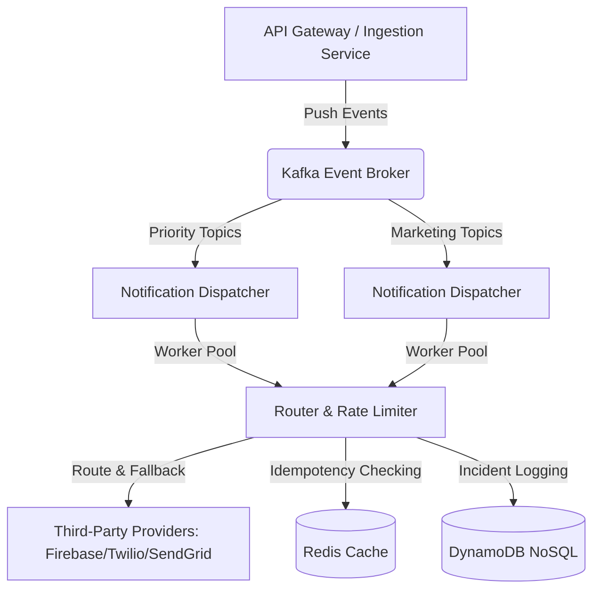

# Thiết Kế Hệ Thống Từ Đầu (Designing a System from Scratch)

## ⚡ Tóm tắt ngắn (30s)
* **Tư duy cốt lõi**: Khi thiết kế một hệ thống từ con số 0, Senior Engineer không bắt đầu bằng việc chọn công nghệ (như dùng Kafka hay Redis). Họ luôn bắt đầu từ **mục tiêu kinh doanh và ràng buộc phi chức năng (Non-Functional Requirements - NFRs)** như throughput (RPS), độ trễ (latency), tính sẵn sàng (Availability), và chi phí vận hành.
* **Nguyên tắc Resiliency**: Thiết kế dựa trên giả định *"Mọi thứ đều có thể đổ vỡ"*. Luôn áp dụng phân tách luồng nóng/lạnh, cơ chế tự vệ chủ động (**Backpressure, Rate Limiting, Graceful Degradation**), và cô lập lỗi bằng kiến trúc hướng sự kiện (Event-Driven).
* **Văn hóa Senior**: Thiết kế hệ thống đơn giản nhất có thể để giải quyết bài toán hiện tại nhưng có khả năng mở rộng dễ dàng khi tải tăng gấp 10 lần (*Design for 10x, implement for 3x, scale for 1x*).

---

## 🔍 Kịch bản thực chiến (STAR Framework)

### 1. Situation (Bối cảnh)
Tại một công ty Super-App (tích hợp gọi xe, giao thức ăn và ví điện tử) với **10 triệu người dùng hoạt động hằng tháng (MAU)**, hệ thống gửi thông báo cũ gặp khủng hoảng nghiêm trọng. Khi chạy các chiến dịch Flash Sale hoặc gửi mã giảm giá giờ vàng, lượng request tăng đột biến khiến hệ thống cũ (chạy luồng đồng bộ gọi trực tiếp API Firebase/Twilio) bị quá tải:
- Thời gian trễ gửi OTP giao dịch tài chính tăng từ **2 giây lên 5 phút**, gây ảnh hưởng nghiêm trọng đến luồng thanh toán.
- Hệ thống bị nghẽn thread pool diện rộng, sập dây chuyền (Cascading Failure) các dịch vụ xung quanh.
- Chi phí gửi SMS tăng vọt vì không có cơ chế tối ưu hóa kênh gửi.
Tôi được giao nhiệm vụ **thiết kế và xây dựng lại từ đầu hệ thống Gửi thông báo đa kênh (Push, SMS, Email, In-app) tập trung** có khả năng tự phục hồi và chịu tải cao.

### 2. Task (Thử thách)
Chịu trách nhiệm kiến trúc sư trưởng thiết kế hệ thống mới từ đầu với các chỉ số kỹ thuật (NFRs) cực kỳ khắt khe:
1. **Khả năng chịu tải (Throughput)**: Hỗ trợ peak load lên tới **15.000 RPS** (tương đương gửi hơn 50 triệu tin nhắn/giờ).
2. **Độ trễ (Latency)**: Đối với tin nhắn ưu tiên cao (OTP, cảnh báo bảo mật), P99 Latency gửi đi phải **dưới 1 giây**. Đối với tin nhắn marketing quảng cáo, P99 Latency dưới 15 phút.
3. **Độ tin cậy (Reliability)**: Tỷ lệ gửi tin nhắn thành công đạt tối thiểu **99.99%**, không bị mất mát dữ liệu (At-least-once delivery) và không gửi trùng lặp (Deduplication).
4. **Cô lập lỗi (Fault Isolation)**: Lỗi nghẽn luồng marketing tuyệt đối không được ảnh hưởng đến luồng gửi OTP giao dịch.

### 3. Action (Hành động)
Tôi đã thiết kế hệ thống theo **Kiến trúc Hướng Sự kiện (Event-Driven Architecture)**, sử dụng mô hình Microservices phân lớp để đảm bảo khả năng mở rộng độc lập và tự vệ chủ động.



Dưới đây là các quyết định thiết kế cốt lõi do tôi trực tiếp thực thi:

* **Bước 1: Phân tách luồng bằng Priority Queue trên Kafka**
  Để ngăn chặn tình trạng tin nhắn quảng cáo đè bẹp tin nhắn OTP, tôi chia nhỏ luồng xử lý trên **Kafka** thành 3 nhóm Topic có độ ưu tiên khác nhau:
  - `notification.critical.otp` (gồm OTP, cảnh báo đăng nhập - Priority 1).
  - `notification.transactional.status` (trạng thái đơn hàng, cuốc xe - Priority 2).
  - `notification.marketing.promotional` (quảng cáo, khuyến mãi - Priority 3).
  Mỗi nhóm topic có cụm Consumer (Worker Engine) riêng biệt. Dù luồng marketing có bị nghẽn hàng triệu bản ghi, cụm Worker xử lý OTP vẫn hoạt động trơn tru vì chúng tiêu thụ dữ liệu từ các phân vùng (partition) hoàn toàn độc lập.

* **Bước 2: Triển khai Dynamic Rate Limiting & Provider Fallback**
  Các nhà mạng hoặc nhà cung cấp dịch vụ thứ ba (ví dụ: Twilio) luôn áp dụng cơ chế giới hạn tần suất gọi API (Rate Limit) và phí SMS rất cao. Tôi đã viết thuật toán tự động định tuyến và hạ tải động (**Token Bucket Rate Limiting** kết hợp **Fallback routing**):
  ```java
  // Minh họa luồng điều phối thông minh tự ngắt mạch và định tuyến dự phòng
  @Service
  public class DeliveryRouter {
      private final RedisRateLimiter rateLimiter;
      private final TwilioProvider twilioProvider;
      private final InfobipProvider infobipProvider; // Cổng dự phòng phí rẻ hơn
  
      public void routeMessage(MessageRequest request) {
          String providerKey = "rate:provider:twilio";
          
          // Kiểm tra xem cổng chính (Twilio) có bị quá giới hạn API không
          if (rateLimiter.acquireToken(providerKey, 500)) { // Giới hạn 500 RPS
              try {
                  twilioProvider.send(request);
              } catch (ProviderException e) {
                  log.error("Twilio failed. Falling back to Infobip. Error: {}", e.getMessage());
                  // Kích hoạt Fallback sang cổng thứ 2 ngay lập tức
                  infobipProvider.send(request);
              }
          } else {
              log.warn("Twilio rate limit reached. Dynamically routing to backup provider Infobip.");
              infobipProvider.send(request);
          }
      }
  }
  ```

* **Bước 3: Cơ chế chống gửi trùng lặp (Message Deduplication)**
  Để tránh việc hệ thống gửi 2 tin nhắn OTP hoặc 2 tin nhắn trừ tiền do lỗi retry từ client, tôi thiết kế cơ chế **Idempotent Consumer**:
  - Mỗi request gửi đi bắt buộc chứa một `idempotency_key` duy nhất (được sinh ra từ upstream, ví dụ: mã giao dịch hoặc hash của nội dung tin nhắn + số điện thoại).
  - Khi worker nhận sự kiện, nó thực hiện lệnh nguyên tử `SETNX` (Set if Not Exists) lên **Redis Cluster** với TTL là 10 phút:
    ```bash
    SET "dedup:notif:<idempotency_key>" "PROCESSING" EX 600 NX
    ```
  - Nếu key đã tồn tại, worker sẽ bỏ qua tin nhắn này để chống trùng lặp tuyệt đối.

* **Bước 4: Lưu trữ Logs hiệu năng cao bằng NoSQL (DynamoDB)**
  Với tải lượng 15.000 RPS, việc ghi log trạng thái gửi của từng tin nhắn vào cơ sở dữ liệu quan hệ (PostgreSQL) sẽ gây thảm họa sập nghẽn ổ đĩa (Disk I/O). Tôi quyết định chọn **DynamoDB** (NoSQL Key-value) để lưu trữ log vòng đời tin nhắn:
  - Partition Key: `recipient_id` (để truy vấn nhanh lịch sử gửi của 1 user).
  - Sort Key: `message_id` + `timestamp`.
  - Thiết lập thuộc tính **TTL (Time to Live)** tự động xóa dữ liệu log sau 30 ngày để tiết kiệm chi phí lưu trữ, chỉ giữ lại báo cáo thống kê tổng hợp.

### 4. Result (Kết quả)
* **Hiệu năng**: Hệ thống mới vận hành ổn định dưới mức tải đỉnh **18.000 RPS** trong chiến dịch Mega Sale 12/12 mà không gây nghẽn.
* **Chất lượng**: Thời gian gửi tin nhắn OTP (P99 Latency) duy trì ổn định ở mức **350ms** (giảm 99.8% so với thời điểm nghẽn của hệ thống cũ).
* **Độ tin cậy**: Tỷ lệ gửi thành công đạt **99.995%**. Cơ chế loại trùng xử lý chính xác hơn **1.2 triệu request gửi lặp**, tiết kiệm cho doanh nghiệp hàng ngàn USD tiền SMS rác.
* **Chi phí**: Tối ưu hóa định tuyến thông minh (ưu tiên gửi Push In-app miễn phí trước, nếu không nhận được sau 10 giây mới tự động fallback sang SMS mất phí) giúp **giảm 40% chi phí viễn thông** (tương đương tiết kiệm hơn $20,000/tháng).

---

## 💡 Nguyên tắc Senior & Bài học đắt giá

1. **Nguyên lý "Design for Failure" (Thiết kế chấp nhận đổ vỡ)**: Trong hệ thống phân tán, các bên thứ ba (Firebase, SMS Gateway, Email Provider) chắc chắn sẽ có lúc bị downtime hoặc phản hồi chậm. Thiết kế hệ thống phải có cơ chế ngắt mạch (Circuit Breaker), hàng đợi chờ gửi lại (Retry Queue với Exponential Backoff + Jitter), và định tuyến dự phòng tự động.
2. **Kỹ nghệ tối ưu hóa DB ghi nhiều (Write-Heavy optimization)**: Tránh ghi log trạng thái realtime trực tiếp vào DB quan hệ. Sử dụng cơ chế ghi đè bất đồng bộ (batch write), đệm message queue, hoặc đẩy log trực tiếp sang các giải pháp log tập trung (Elasticsearch / DynamoDB) để bảo vệ luồng ghi cốt lõi.
3. **Thấu hiểu Trade-offs kỹ thuật**: Không cố làm ra một hệ thống hoàn hảo không độ trễ cho tất cả. Luôn phân loại dữ liệu để áp dụng các mô hình nhất quán khác nhau: OTP cần đồng bộ, nhanh; Marketing chấp nhận bất đồng bộ, nhất quán cuối cùng (Eventual Consistency).

---

## 📊 So sánh phương án quyết định (Trade-offs)

| Kiến trúc lưu trữ log | Điểm mạnh (Pros) | Điểm yếu (Cons) | Use Case Phù hợp |
| :--- | :--- | :--- | :--- |
| **NoSQL Key-Value (DynamoDB/Cassandra)** | - **Khả năng mở rộng vô hạn** (Horizontal Scaling).<br>- Tốc độ ghi cực nhanh, ổn định dưới tải lớn.<br>- Hỗ trợ TTL tự động xóa log rác. | - Chi phí truy vấn theo các điều kiện phức tạp (non-key attributes) rất cao.<br>- Không hỗ trợ transaction phức tạp. | Lưu trữ trạng thái vết tin nhắn (Delivery Logs) với tải lượng khổng lồ. |
| **Relational Database (PostgreSQL/MySQL)** | - Hỗ trợ truy vấn báo cáo cực kỳ linh hoạt (SQL JOIN).<br>- Đảm bảo tính nhất quán dữ liệu ACID tuyệt đối. | - **Nghẽn cổ chai ghi (Write Bottleneck)** khi tải cao.<br>- Chi phí scale dọc rất đắt đỏ. | Hệ thống quản lý mẫu tin nhắn (Template Config), thông tin đại lý hoặc cấu hình định tuyến. |
| **Log Streaming (Kafka + ELK Stack)** | - Tách biệt hoàn toàn việc ghi log ra khỏi luồng ứng dụng.<br>- Hỗ trợ tìm kiếm vết (full-text search) cực mạnh qua Kibana. | - Cần vận hành thêm hệ thống ELK lớn và đắt đỏ.<br>- Dữ liệu ghi nhận có độ trễ nhẹ (Near Realtime). | Phân tích vết lỗi kỹ thuật nâng cao dành cho đội ngũ vận hành (SRE/Ops). |

---

## ⚠️ Common Gotchas (Câu hỏi phỏng vấn đào sâu)

### 1. Nếu cụm Redis lưu giữ các Idempotency Key chống trùng lặp tin nhắn bị sập hoàn toàn (Downtime), hệ thống gửi thông báo của bạn sẽ xử lý thế nào để không gửi trùng tin nhắn mà cũng không làm nghẽn luồng OTP?
* **Trả lời**: Đây là câu hỏi kinh điển về khả năng sống sót cao (Disaster Recovery):
  * **Giải pháp Phòng vệ Đa tầng (Multi-tier Failover)**:
    1. **Bật chế độ Graceful Degradation (Suy thoái mượt mà)**: Khi Redis sập, thư viện ứng dụng client kết nối với Redis sẽ kích hoạt cơ chế bắt ngoại lệ (Timeout/Connection Exception) và tự chuyển sang chế độ dự phòng nội bộ (In-Memory cache cục bộ sử dụng **Caffeine Cache** có kích thước giới hạn trên từng container để kiểm tra trùng lặp tạm thời trong 1-2 phút).
    2. **Fallback sang Transactional DB**: Nếu muốn đảm bảo an toàn tuyệt đối cho luồng quan trọng (OTP), Worker sẽ chuyển sang dùng lệnh ghi khóa độc quyền (Unique Constraint) trực tiếp lên một bảng tạm trong PostgreSQL với cơ chế *Upsert*:
       ```sql
       INSERT INTO processed_notifications (idempotency_key) VALUES ('key_123')
       ON CONFLICT (idempotency_key) DO NOTHING;
       ```
       Nếu câu lệnh chèn không thành công (trả về 0 dòng bị ảnh hưởng), Worker biết ngay tin nhắn này đã được xử lý và bỏ qua. Dù cách này làm tăng tải DB nhưng giúp hệ thống an toàn vượt qua khủng hoảng sập Redis.

### 2. Khi gửi tin nhắn qua Push (Firebase Cloud Messaging - FCM), tin nhắn hiển thị thành công nhưng thiết bị người dùng thực tế không nhận được do mất kết nối mạng. Làm sao bạn thiết kế cơ chế phát hiện và tự động chuyển hướng gửi (Auto-fallback) sang SMS chỉ sau 10 giây?
* **Trả lời**: Đây là bài toán thiết kế trải nghiệm người dùng tối ưu kết hợp giảm chi phí (Cost-effective Delivery):
  * **Thiết kế Cơ chế Hẹn giờ xác nhận (Delayed Confirmation Flow)**:
    1. Khi gửi tin nhắn Push FCM, hệ thống sẽ đánh dấu trạng thái tin nhắn trong DynamoDB là `SENT_PUSH` và đẩy một thông điệp hẹn giờ chờ xác nhận vào một topic chậm hoặc hàng đợi delay (**Kafka Delay Topic / Redis ZSet Delay Queue**) với thời gian đếm ngược 10 giây.
    2. Ứng dụng di động (Mobile App) của người dùng khi nhận được tin nhắn Push sẽ lập tức gửi một request xác nhận ngầm (Silent Heartbeat/Acknowledge) về Gateway: *"Tôi đã nhận được tin nhắn ID: abc"*. Gateway sẽ cập nhật trạng thái tin nhắn trong DynamoDB thành `DELIVERED_PUSH`.
    3. Sau 10 giây, background worker sẽ tiêu thụ tin nhắn từ hàng đợi delay. Worker truy vấn DynamoDB để kiểm tra trạng thái tin nhắn hiện tại. Nếu trạng thái vẫn là `SENT_PUSH` (nghĩa là thiết bị chưa nhận được và chưa phản hồi ACK), worker lập tức kích hoạt lệnh điều phối gửi tin nhắn đó dưới dạng SMS thay thế để đảm bảo người dùng nhận được mã OTP kịp thời.
