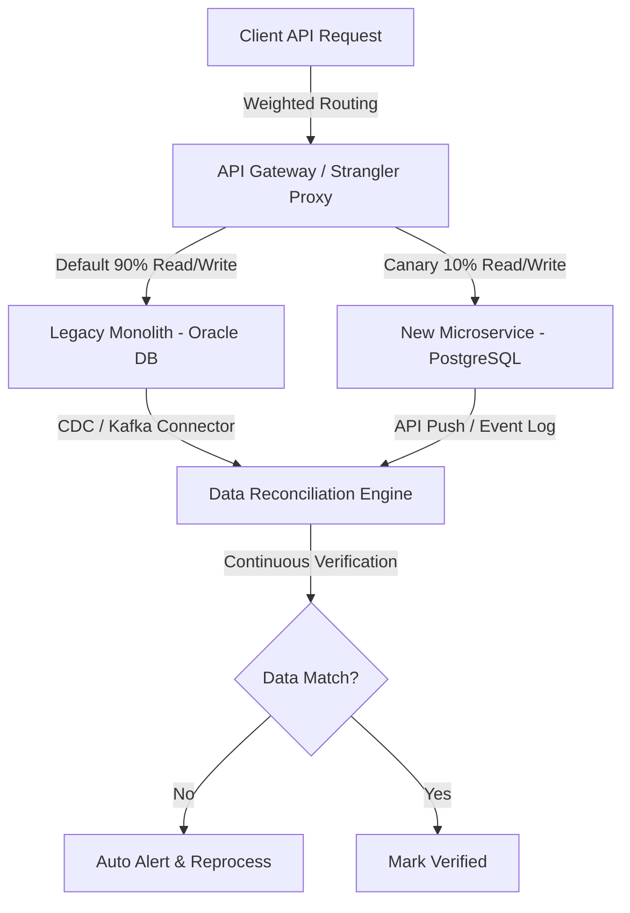

# Di Cư Hệ Thống Lớn Không Downtime (Migrating Large-Scale Systems with Zero Downtime)

## ⚡ Tóm tắt ngắn (30s)
* **Tư duy cốt lõi**: Di cư một hệ thống lớn đang chạy (Legacy System) cũng giống như việc **thay động cơ máy bay khi đang bay**. Nguyên tắc tối thượng của Senior Engineer là **Zero Downtime (Không gián đoạn dịch vụ)** và **Zero Data Loss (Không mất mát/sai lệch dữ liệu)**.
* **Mô hình kinh điển**: Tuyệt đối tránh xa phương pháp *"Big Bang"* (đập đi xây lại toàn bộ và cutover trong một đêm). Hãy sử dụng **Strangler Fig Pattern (Mô hình cây bàng độc lập)** để bóp nghẹt hệ thống cũ từ từ, di cư từng module độc lập qua các giai đoạn: *Ghi kép (Dual Write) → Đối soát dữ liệu (Reconciliation) → Chuyển luồng đọc (Canary Read) → Cắt đứt luồng cũ*.
* **Văn hóa Senior**: Luôn thiết kế đường lui (**Rollback Strategy**) ở mọi bước nhỏ của quy trình di cư. Nếu có bất kỳ sự cố nào xảy ra, hệ thống phải tự động quay về trạng thái cũ an toàn trong vòng vài giây mà không cần can thiệp thủ công.

---

## 🔍 Kịch bản thực chiến (STAR Framework)

### 1. Situation (Bối cảnh)
Hệ thống quản lý Ví điện tử và Sổ cái (Payment Ledger) của chúng tôi vận hành trên kiến trúc Monolith cũ kỹ, sử dụng cơ sở dữ liệu **Oracle Database** tập trung. Hệ thống xử lý hơn **5 triệu USD giao dịch mỗi ngày** với mức tải trung bình **1.200 RPS**. 
Sau 5 năm phát triển, hệ thống bộc lộ những điểm nghẽn nghiêm trọng:
- CPU Oracle DB luôn ở mức 85%, chi phí bản quyền Oracle tăng vọt hàng năm.
- Mã nguồn Monolith bị phình to, việc triển khai tính năng mới cực kỳ chậm và rủi ro.
- Yêu cầu đặt ra là phải di cư toàn bộ luồng xử lý giao dịch và số liệu kế toán sang kiến trúc Microservice mới, sử dụng **PostgreSQL** kết hợp **DynamoDB** mà **tuyệt đối không được phép dừng hệ thống một giây nào**, vì bất kỳ downtime nào của ví điện tử cũng sẽ bị phạt nặng bởi Ngân hàng Nhà nước và gây khủng hoảng truyền thông.

### 2. Task (Thử thách)
Với tư cách là Tech Lead kiêm Kiến trúc sư trưởng của chiến dịch di cư, tôi phải hoàn thành:
1. **Thiết kế quy trình di cư dữ liệu lịch sử** (hơn 500 triệu bản ghi giao dịch) từ Oracle sang PostgreSQL/DynamoDB.
2. **Chuyển dịch luồng ghi và luồng đọc realtime** với cam kết **Zero Downtime** và **Zero Data Inconsistency** (Sai lệch số dư tài khoản bằng 0).
3. Đảm bảo luồng dự phòng rollback tức thì nếu hệ thống mới gặp lỗi tải hoặc bug logic.

### 3. Action (Hành động)
Tôi đã xây dựng và thực thi kế hoạch di cư chia làm 4 giai đoạn chiến thuật cực kỳ chặt chẽ:



* **Giai đoạn 1: Triển khai Ghi kép (Dual Write Pattern)**
  Để chuẩn bị cho hệ thống mới, chúng tôi phát triển Microservice thanh toán mới. Đầu tiên, chúng tôi cấu hình luồng ghi kép ở tầng ứng dụng (Application Layer Dual Write):
  - Khi có request thanh toán, ứng dụng Monolith cũ vẫn ghi dữ liệu vào Oracle DB (luồng chính quyết định số dư thực tế).
  - Đồng thời, một tiến trình bất đồng bộ (Asynchronous Background Thread) sử dụng **Spring Integration / Kafka** sẽ đẩy bản sao giao dịch đó sang Microservice mới để ghi vào PostgreSQL/DynamoDB.
  ```java
  // Minh họa cơ chế Ghi kép bất đồng bộ bảo vệ luồng chính
  @Transactional
  public TransactionResult processPayment(PaymentRequest request) {
      // 1. Ghi vào database cũ (Oracle) - Quyết định luồng sống sót chính
      TransactionResult legacyResult = legacyOracleRepository.save(request);
      
      // 2. Gửi bất đồng bộ sang hệ thống mới qua Message Broker chống blocking
      try {
          kafkaTemplate.send("payment-dual-write-topic", request.getTxId(), request)
              .addCallback(
                  result -> log.info("Dual write sent successfully for tx: {}", request.getTxId()),
                  ex -> log.error("Dual write failed for tx: {}. Error: {}", request.getTxId(), ex.getMessage())
              );
      } catch (Exception e) {
          // Tuyệt đối không để lỗi ghi kép làm sập giao dịch chính của khách hàng
          log.error("Fatal queue error during dual write initialization", e);
      }
      
      return legacyResult;
  }
  ```

* **Giai đoạn 2: Di cư dữ liệu lịch sử (Historical Data Backfill)**
  Chúng tôi viết một công cụ di cư chạy ngầm (**Throttled Migration Tool**) để quét toàn bộ 500 triệu bản ghi cũ từ Oracle DB, chuyển đổi định dạng và import vào PostgreSQL:
  - Để không làm nghẽn Oracle DB đang chạy, công cụ chỉ chạy vào giờ thấp điểm (từ 1h đến 5h sáng), giới hạn tốc độ đọc (Rate Limit) ở mức tối đa **300 RPS**.
  - Sử dụng cơ chế phân trang dựa trên Cursor (Cursor-based Pagination) thay vì Offset để tránh quét toàn bộ bảng (Full Table Scan) gây sập Database.

* **Giai đoạn 3: Đối soát dữ liệu liên tục (Continuous Reconciliation Engine)**
  Đây là chốt chặn quan trọng nhất để đảm bảo dữ liệu không bị sai lệch. Tôi đã thiết lập một hệ thống đối soát tự động chạy song song (**Reconciliation Worker**):
  - Tiến trình này liên tục quét dữ liệu của cả hai hệ thống trong vòng 24 giờ qua.
  - So sánh chi tiết từng giao dịch: trạng thái, số tiền, số dư tài khoản của hai bên.
  - Nếu phát hiện bất kỳ sự lệch pha nào (Data Drift), hệ thống lập tức bắn cảnh báo về Slack và kích hoạt luồng sửa lỗi tự động bằng cách lấy dữ liệu từ Oracle DB ghi đè lên hệ thống mới.
  - Quy trình này được duy trì chạy liên tục trong **3 tuần** cho đến khi tỷ lệ khớp dữ liệu đạt **100% liên tục trong 7 ngày**.

* **Giai đoạn 4: Canary Routing và Chuyển luồng đọc (Cutover)**
  Khi dữ liệu đã đồng bộ hoàn toàn, tôi tiến hành chuyển luồng đọc và ghi chính thức thông qua API Gateway (Kong):
  - *Bước 1 (99% Cũ - 1% Mới)*: Chuyển 1% lượng traffic người dùng nội bộ (Beta Users) sang sử dụng hoàn toàn luồng đọc/ghi của Microservice mới.
  - *Bước 2 (90% Cũ - 10% Mới)*: Tăng dần traffic lên 10%. Theo dõi chặt chẽ biểu đồ APM (Jaeger, Prometheus) và Database CPU của PostgreSQL.
  - *Bước 3 (50% Cũ - 50% Mới)*: Tăng tải lên 50%.
  - *Bước 4 (0% Cũ - 100% Mới)*: Cắt hoàn toàn luồng sang hệ thống mới. Giữ Oracle DB chạy ở chế độ chỉ đọc (Read-only) trong 2 tuần tiếp theo để đề phòng rủi ro cần rollback dữ liệu.

### 4. Result (Kết quả)
* **Kinh doanh & Vận hành**: Chiến dịch di cư hoàn thành xuất sắc sau **2 tháng** nỗ lực mà **không xảy ra bất kỳ sự cố dừng dịch vụ (Zero Downtime) nào**.
* **Độ chính xác**: Hơn **500 triệu bản ghi** được di cư an toàn. Tỷ lệ khớp số liệu kế toán và số dư tài khoản đạt **100% trong các đối soát đã thực hiện**; kết quả được theo dõi qua reconciliation và cơ chế xử lý sai lệch thay vì giả định không có rủi ro.
* **Hiệu năng & Chi phí**: 
  - Tốc độ xử lý giao dịch trung bình (Latency) giảm từ **350ms xuống còn 60ms** nhờ PostgreSQL được tối ưu và thiết kế cơ chế lưu trữ DynamoDB phù hợp.
  - Tắt hoàn toàn cụm Oracle DB đắt đỏ, **tiết kiệm cho công ty hơn $180,000 chi phí bản quyền** hàng năm.

---

## 💡 Nguyên tắc Senior & Bài học đắt giá

1. **Quy luật bất biến của di cư dữ liệu**: *Không nên phụ thuộc duy nhất vào mã nguồn di cư viết một lần (One-off script)*. Dữ liệu thực tế trên Production thường "bẩn" và có cấu trúc dị biệt hơn môi trường Staging. Nên có hệ thống đối soát tự động (Reconciliation Engine) độc lập để kiểm chứng dữ liệu.
2. **Chiến lược "Expand and Contract" (Mở rộng và Thu hẹp)**: Khi thay đổi cấu trúc bảng (Schema Change) trong quá trình di cư lớn, thông thường không nên xóa cột cũ ngay lập tức nếu vẫn cần tương thích ngược hoặc rollback. Bước 1: Thêm cột mới (Expand) → Bước 2: Chuyển đổi code dùng cột mới → Bước 3: Đợi hệ thống chạy ổn định → Bước 4: Xóa cột cũ (Contract) sau khi chắc chắn không cần rollback.
3. **Quản lý tâm lý và rủi ro**: Senior Engineer không bao giờ tự tin thái quá. Luôn chuẩn bị sẵn sàng phương án sụp đổ: Nếu hệ thống mới bị sập ở mức tải 50%, làm sao để đảo ngược Gateway Kong trở về luồng cũ chỉ bằng 1 lệnh cấu hình động mà không mất dữ liệu của những người đã giao dịch trên hệ thống mới.

---

## 📊 So sánh phương án quyết định (Trade-offs)

| Chiến lược di cư | Điểm mạnh (Pros) | Điểm yếu (Cons) | Use Case Phù hợp |
| :--- | :--- | :--- | :--- |
| **Ghi kép ở App Layer (Application Dual Write)** | - Kiểm soát logic nghiệp vụ cực kỳ chi tiết (ví dụ: chuyển đổi định dạng data linh hoạt).<br>- Dễ dàng thiết kế cơ chế fallback và log lỗi. | - Tăng độ phức tạp của mã nguồn ứng dụng cũ.<br>- Có thể làm tăng nhẹ latency luồng chính nếu không xử lý async tốt. | Hệ thống có business logic phức tạp, cấu trúc dữ liệu cũ và mới khác biệt lớn. |
| **Ghi kép ở DB Layer sử dụng CDC (Debezium + Kafka)** | - Ít xâm lấn vào mã nguồn ứng dụng đang chạy.<br>- Thường hạn chế ảnh hưởng lên latency luồng ghi chính, nhưng vẫn cần đo lường chi phí CDC. | - Khó xử lý nếu cấu trúc DB mới khác biệt hoàn toàn cấu trúc cũ (Database Schema Mismatch).<br>- Phụ thuộc lớn vào sự ổn định của hạ tầng CDC. | Di cư database tương thích hoặc ứng dụng cũ không thể sửa đổi mã nguồn. |
| **Di cư "Big Bang" (Dừng hệ thống bảo trì và Cutover)** | - Thiết kế cực kỳ đơn giản, không cần xây dựng hệ thống ghi kép hay đối soát phức tạp.<br>- Chi phí nhân lực thấp. | - **Rủi ro cực kỳ cao**. Nếu lỗi xảy ra sau khi mở lại hệ thống, việc rollback dữ liệu là cực kỳ khó khăn.<br>- Làm mất mát khách hàng và gián đoạn kinh doanh. | Hệ thống nhỏ, phi cốt lõi, chấp nhận downtime định kỳ vào ban đêm (như ứng dụng nội bộ). |

---

## ⚠️ Common Gotchas (Câu hỏi phỏng vấn đào sâu)

### 1. Trong giai đoạn Ghi kép (Dual Write), nếu luồng ghi vào Database cũ thành công, nhưng tiến trình ghi kép bất đồng bộ vào Database mới bị thất bại (ví dụ do sập mạng hoặc hàng đợi Kafka bị tràn), bạn xử lý thế nào để không làm lệch dữ liệu giữa hai bên?
* **Trả lời**: Đây là thử thách thực chiến cực hay về xử lý lỗi bất đồng bộ (Asynchronous Failure Handling):
  * **Giải pháp áp dụng mô hình Outbox Pattern cục bộ**:
    1. Khi tiến trình gửi async lên Kafka bị lỗi hoặc quá thời gian chờ (Timeout), ứng dụng Monolith cũ sẽ không bỏ cuộc. Nó lập tức ghi nhận một bản ghi lỗi vào một bảng phụ trong Oracle gọi là `migration_outbox` ngay trong cùng một Transaction ghi sổ cái ban đầu. Việc này bảo đảm tính nguyên tử trong phạm vi transaction của Oracle: nếu lưu giao dịch thành công thì bản ghi outbox cũng được commit cùng transaction.
    2. Một background process chuyên trách (**Outbox Relayer Worker**) chạy ngầm sẽ liên tục quét bảng `migration_outbox` này để gửi lại (Retry) các giao dịch bị lỗi sang cụm Kafka/PostgreSQL mới.
    3. Khi hệ thống đối soát chạy hàng ngày (Reconciliation Engine) quét dữ liệu, nó sẽ tự động phát hiện ra các giao dịch bị thiếu trong PostgreSQL và tiến hành bù đắp dữ liệu (Data Healing) từ Oracle DB sang để phát hiện và xử lý sai lệch theo mục tiêu đối soát đã định nghĩa vào cuối ngày.

### 2. Làm thế nào bạn xử lý bài toán "Giao dịch ghi đè dữ liệu cũ" (Out-of-order Updates) trong quá trình di cư dữ liệu lịch sử? Ví dụ: Khi công cụ di cư đang copy dữ liệu lịch sử của User A (giao dịch lúc 10h sáng), thì User A đang online trên production thực hiện giao dịch mới (lúc 10h05 sáng) ghi đè lên số dư của họ?
* **Trả lời**: Đây là bài toán quản lý Race Condition trong di cư dữ liệu động:
  * **Giải pháp áp dụng cơ chế Versioning & Last-Write-Wins**:
    1. Trong cấu trúc bảng mới của PostgreSQL/DynamoDB, chúng tôi bắt buộc phải thiết kế một cột phiên bản dữ liệu (`version` hoặc `last_updated_at` mức microsecond).
    2. Khi luồng ghi kép realtime thực hiện cập nhật số dư mới nhất của User A, nó sẽ ghi nhận `last_updated_at` = 10:05:00.
    3. Khi tiến trình di cư lịch sử quét tới User A và cố gắng import bản ghi cũ (lúc 10h00 với `last_updated_at` = 10:00:00), câu lệnh ghi dữ liệu (Upsert) vào DB mới sẽ áp dụng điều kiện kiểm tra phiên bản:
       ```sql
       INSERT INTO user_balances (user_id, balance, last_updated_at) 
       VALUES ('user_A', 100.0, '2026-05-23 10:00:00')
       ON CONFLICT (user_id) DO UPDATE 
       SET balance = EXCLUDED.balance, last_updated_at = EXCLUDED.last_updated_at
       WHERE EXCLUDED.last_updated_at > user_balances.last_updated_at;
       ```
       Vì phiên bản lịch sử (10h00) cũ hơn phiên bản realtime đã ghi (10h05), điều kiện `WHERE` sẽ không thỏa mãn và PostgreSQL sẽ bỏ qua việc ghi đè bản ghi cũ này. Điều này giúp bảo vệ bản ghi mới hơn trong trường hợp timestamp/version đáng tin cậy và mọi đường ghi đều tuân thủ cùng contract versioning.
