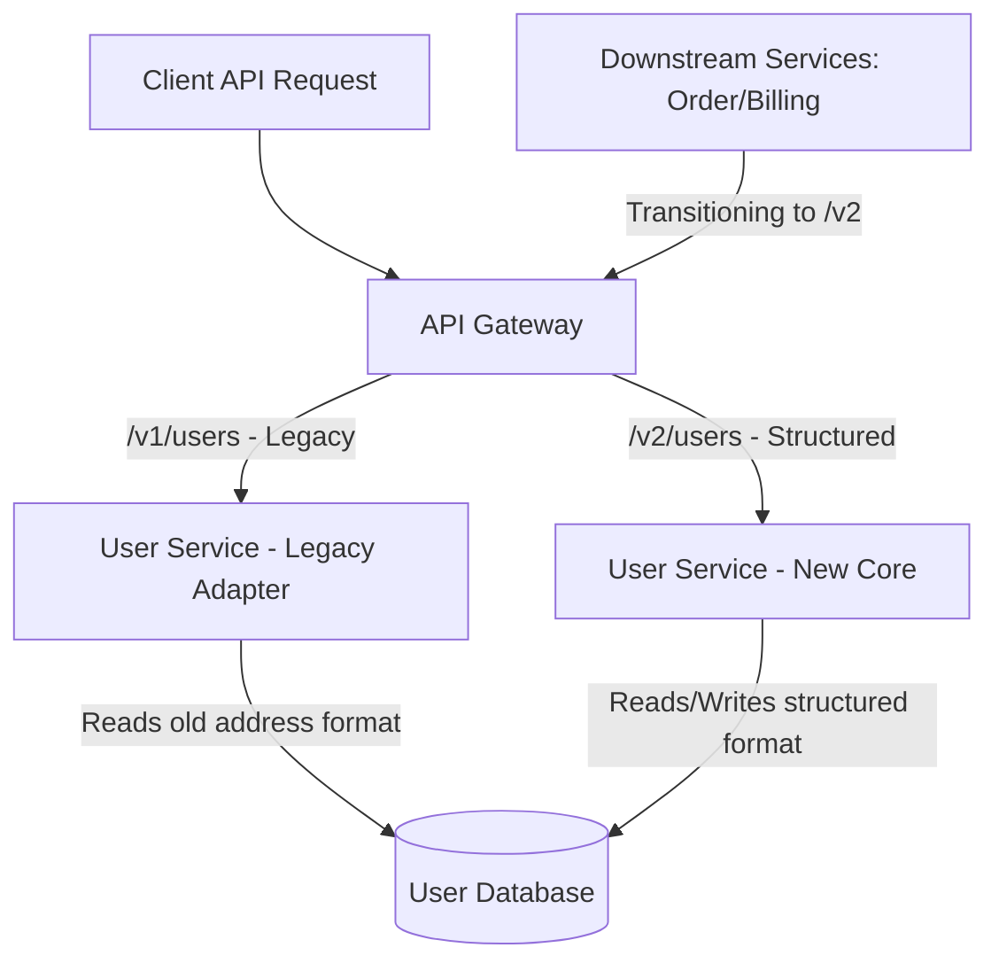

# Xử Lý Breaking Change Giữa Các Service (Handling Breaking Changes Between Services)

## ⚡ Tóm tắt ngắn (30s)
* **Tư duy cốt lõi**: Trong kiến trúc Microservices, việc tự ý thay đổi API Contract (hợp đồng dữ liệu) mà không có sự phối hợp là một **tội ác kỹ thuật**. Nó sẽ ngay lập tức làm sập các service hạ nguồn (Cascading Failure). Senior Engineer coi mọi API nội bộ tương tự như API công khai của Google/Stripe: **Luôn ưu tiên tương thích ngược (Backward Compatibility)**.
* **Chiến thuật cốt lõi**: Áp dụng **Expand and Contract Pattern (Mở rộng và Thu hẹp)** kết hợp **API Versioning (Phiên bản hóa API)**. Chúng ta không bao giờ sửa đổi trực tiếp hoặc xóa một field đang chạy; thay vào đó, ta bổ sung cấu trúc mới (Expand), hỗ trợ song song hai phiên bản, hỗ trợ các team hạ nguồn chuyển dịch dần dần, và chỉ xóa cấu trúc cũ (Contract) khi lượng truy cập về 0.
* **Văn hóa Senior**: Sử dụng công cụ tự động hóa như **Contract Testing (Kiểm thử hợp đồng - Pact)** trong CI/CD pipeline để phát hiện sớm các breaking change trước khi code lọt lên môi trường Staging/Production.

---

## 🔍 Kịch bản thực chiến (STAR Framework)

### 1. Situation (Bối cảnh)
Hệ thống thương mại điện tử của chúng tôi có hơn **15 microservices** độc lập. Trong đó, `User-Service` là dịch vụ lõi (1.200 RPS), cung cấp thông tin người dùng cho các dịch vụ khác (Order, Billing, Delivery, Recommendation, v.v.) qua cả hai giao thức: **REST API đồng bộ** và **Kafka Event Streaming**.
Cấu trúc thông tin địa chỉ người dùng cũ được thiết kế rất sơ sài dưới dạng chuỗi văn bản thuần (Flat String):
```json
{ "user_id": 99, "fullName": "Nguyen Van A", "address": "123 Duong Le Loi, Quan 1, TP.HCM" }
```
Do yêu cầu nghiệp vụ mới để tích hợp với đơn vị vận chuyển tự động, chúng tôi bắt buộc phải bóc tách cột `address` thành một đối tượng có cấu trúc chi tiết (Structured Object):
```json
{
  "user_id": 99,
  "fullName": "Nguyen Van A",
  "address_detail": { "street": "123 Le Loi", "district": "Quan 1", "city": "TP.HCM" }
}
```
Việc xóa bỏ trường `address` và thay bằng `address_detail` là một **Breaking Change** nghiêm trọng. Nếu chúng tôi deploy trực tiếp thay đổi này, toàn bộ luồng tạo đơn hàng (Order), xuất hóa đơn (Billing) và giao hàng (Delivery) của các team khác sẽ sập ngay lập tức do lỗi Parse JSON.

### 2. Task (Thử thách)
Với tư cách là Tech Lead của `User-Service`, tôi phải chủ trì quy trình thay đổi hợp đồng dữ liệu này với các mục tiêu:
1. Thực hiện nâng cấp thành công cấu trúc địa chỉ mới trên toàn bộ hệ thống.
2. Cam kết **không làm gián đoạn bất kỳ dịch vụ hạ nguồn nào (Zero Downtime / Zero Incident)**.
3. Không ép buộc các team khác phải deploy đồng thời cùng lúc với team mình (Decoupled Deployments).

### 3. Action (Hành động)
Tôi đã áp dụng quy trình **Expand and Contract (Mở rộng và Thu hẹp)** chia làm 3 bước chiến lược:



* **Bước 1: Giai đoạn Mở rộng (Expand Phase - Hỗ trợ song song)**
  Chúng tôi không xóa trường `address` cũ trong database và API. Thay vào đó, chúng tôi bổ sung cấu trúc mới `address_detail` và triển khai song hành:
  - *Với REST API*: Chúng tôi tạo phiên bản API mới `/v2/users` trả về cấu trúc chi tiết, đồng thời giữ nguyên `/v1/users` tương thích ngược bằng cách tự động gộp các trường của `address_detail` thành chuỗi phẳng để trả về cho trường `address` cũ.
  - *Với Event Streaming (Kafka)*: Chúng tôi cập nhật Schema trong **Kafka Schema Registry** (sử dụng Avro). Schema mới bổ sung thêm trường `address_detail` (để chế độ `default = null` hoặc `optional` để đảm bảo tính tương thích ngược - Backward Compatible). Tin nhắn phát ra sẽ chứa cả hai trường:
  ```json
  {
    "user_id": 99,
    "fullName": "Nguyen Van A",
    "address": "123 Duong Le Loi, Quan 1, TP.HCM",
    "address_detail": { "street": "123 Le Loi", "district": "Quan 1", "city": "TP.HCM" }
  }
  ```
  - *Minh họa code xử lý Adapter tương thích ngược trên Spring Boot*:
  ```java
  @Data
  @JsonInclude(JsonInclude.Include.NON_NULL)
  public class UserResponseV2 {
      private Long userId;
      private String fullName;
      
      @Deprecated // Đánh dấu cảnh báo cho các team khác biết trường này sẽ bị xóa
      private String address; 
      
      private AddressDetail addressDetail;
  
      // Khớp dữ liệu tự động để luôn phục vụ được cả hai phiên bản API
      public String getAddress() {
          if (this.address != null) return this.address;
          if (this.addressDetail != null) {
              return String.format("%s, %s, %s", 
                  addressDetail.getStreet(), addressDetail.getDistrict(), addressDetail.getCity());
          }
          return null;
      }
  }
  ```

* **Bước 2: Giai đoạn Di trú (Transition/Migrate Phase - Đồng hành dịch chuyển)**
  - Tôi gửi thông báo deprecation chính thức kèm theo tài liệu hướng dẫn tích hợp `/v2/users` cho 15 team hạ nguồn, thiết lập thời hạn dịch chuyển chuyển tiếp (Grace Period) là **4 tuần**.
  - Để giám sát tiến trình di trú, tôi thiết lập **API Telemetry** trên API Gateway (Prometheus + Grafana) để phân tích User-Agent và HTTP Headers, đếm số lượng request gọi vào `/v1/users` theo từng service cụ thể.
  - Đồng thời, chúng tôi đưa **Pact Contract Testing** vào CI/CD pipeline. Bất kỳ sự thay đổi mã nguồn nào của `User-Service` phá vỡ kỳ vọng (contract) đã đăng ký của các service khác sẽ bị CI/CD chặn đứng ngay lập tức ở bước chạy test.

* **Bước 3: Giai đoạn Thu hẹp (Contract Phase - Dọn dẹp mã nguồn cũ)**
  - Hàng tuần, tôi gửi báo cáo danh sách các service vẫn còn gọi API `/v1` cho các Product Manager để thúc giục.
  - Sau 4 tuần, biểu đồ Grafana xác nhận traffic gọi vào `/v1/users` đã giảm hoàn toàn về **0%**.
  - Tôi tiến hành deploy phiên bản `User-Service` mới dọn dẹp (Contract): xóa hoàn toàn API `/v1/users`, xóa các trường `@Deprecated address` trong mã nguồn và xóa cột địa chỉ phẳng cũ trong Database để thu hồi không gian lưu trữ và làm sạch hệ thống.

### 4. Result (Kết quả)
* **Vận hành**: Quá trình nâng cấp cấu trúc API diễn ra hoàn hảo. **100% các service hạ nguồn nâng cấp thành công mà không xảy ra bất kỳ lỗi sập hệ thống (Zero Incident)** nào trên Production.
* **Tính tách biệt (Decoupling)**: Các đội phát triển hạ nguồn hoàn toàn chủ động sắp xếp thời gian di cư sang API mới trong vòng 4 tuần mà không bị phụ thuộc hay phải deploy đồng thời cùng `User-Service`.
* **Kỹ thuật**: Hệ thống mã nguồn mới sạch sẽ, dữ liệu địa chỉ mới chi tiết giúp tỷ lệ giao hàng chính xác của luồng Logistic **tăng thêm 12%**.

---

## 💡 Nguyên tắc Senior & Bài học đắt giá

1. **Nguyên tắc "Postel's Law" (Robustness Principle)**: *"Hãy tỏ ra nghiêm khắc với những gì bạn gửi đi, và tỏ ra khoan dung với những gì bạn nhận về"*. Khi thiết kế API, hãy thiết kế sao cho hệ thống có thể xử lý được các gói tin cũ, thiếu trường mà không bị crash đột ngột.
2. **Tuyệt đối không deploy đồng thời (No Big-Bang Deployments)**: Senior Engineer luôn thiết kế hệ thống sao cho mỗi Microservice có thể deploy độc lập vào bất kỳ thời điểm nào trong ngày mà không cần họp bàn phối hợp deploy chéo giữa các team. Nếu việc deploy service A bắt buộc phải deploy kèm service B, bạn đang làm "Distributed Monolith" chứ không phải Microservices.
3. **Mọi thay đổi API đều phải đo lường được (Telemetry-Driven)**: Đừng bao giờ tắt một API cũ dựa trên cảm tính hoặc lời hứa miệng của các team khác. Hãy tin vào dữ liệu Log và Telemetry trên API Gateway. Chỉ khi số liệu thống kê thực tế về 0 mới được phép tắt an toàn.

---

## 📊 So sánh phương án quyết định (Trade-offs)

| Phương pháp Versioning API | Điểm mạnh (Pros) | Điểm yếu (Cons) | Use Case Phù hợp |
| :--- | :--- | :--- | :--- |
| **URL Versioning (`/v1/users`, `/v2/users`)** | - Cực kỳ rõ ràng, dễ đọc, dễ kiểm thử bằng trình duyệt hoặc Postman.<br>- Cấu hình định tuyến (Routing) trên API Gateway rất đơn giản. | - Làm phình to số lượng Endpoint cần duy trì.<br>- Có thể vi phạm triết lý thiết kế REST (URI nên đại diện cho tài nguyên duy nhất). | Lựa chọn phổ biến nhất cho hầu hết các Web API công khai và nội bộ. |
| **Header Versioning (`Accept: app.v2+json`)** | - Giữ URI sạch sẽ và đại diện đúng tài nguyên.<br>- Cho phép quản lý phiên bản linh hoạt ở mức Content Negotiation. | - Khó kiểm thử thủ công.<br>- Gây phức tạp cho việc cấu hình Cache trên CDN hoặc Gateway (vì phải cache dựa trên header `Vary`). | Các hệ thống lớn có yêu cầu thiết kế RESTful cực kỳ chuẩn chỉ (như GitHub API). |
| **Ghi đè trường tùy chọn (Optional Fields - Không đổi Version)** | - Không cần tạo endpoint mới hay quản lý phiên bản phức tạp.<br>- Mã nguồn gọn nhẹ. | - Nếu logic nghiệp vụ thay đổi hoàn toàn, việc cố gắng nhồi nhét vào 1 endpoint sẽ gây rối loạn mã nguồn và dễ bug. | Các thay đổi nhỏ, chỉ thêm trường mới hoặc thay đổi không mang tính phá vỡ (Non-breaking). |

---

## ⚠️ Common Gotchas (Câu hỏi phỏng vấn đào sâu)

### 1. Nếu đến hạn chót (Grace Period) là 4 tuần mà vẫn còn 1 service cực kỳ quan trọng (như `Billing-Service`) chưa chịu di cư sang API mới vì team họ quá bận chạy tính năng kinh doanh khác, bạn xử lý thế nào để tự vệ kỹ thuật cho `User-Service` mà không gây thảm họa sập hệ thống?
* **Trả lời**: Đây là bài toán quản lý con người và thứ tự ưu tiên thực tế trong doanh nghiệp:
  * **Giải pháp tự vệ kỹ thuật (Graceful Push & Visibility Enhancement)**:
    1. **Tuyệt đối không tự ý tắt API**: Tôi sẽ không tắt API `/v1` theo lịch cứng nhắc vì điều đó sẽ gây lỗi nghiêm trọng cho thanh toán của công ty (tự sát kỹ thuật).
    2. **Áp dụng Throttling / Rate Limiting chọn lọc**: Tôi sẽ cấu hình trên API Gateway để giới hạn băng thông (Rate Limit) riêng cho `Billing-Service` khi gọi vào `/v1` trên môi trường Staging/UAT, hoặc chủ động chèn thêm độ trễ (latency injection - ví dụ làm API chậm đi 2 giây). Điều này khiến hệ thống của họ bị cảnh báo chậm trên Staging, buộc họ phải ưu tiên xử lý nâng cấp lên `/v2`.
    3. **Chuyển dịch trách nhiệm (Risk Transfer)**: Tôi sẽ tổ chức cuộc họp với PM của cả hai team và CTO, trình bày biểu đồ rủi ro kỹ thuật: *"Việc duy trì luồng `/v1` cũ khiến `User-Service` không thể bật các tính năng bảo mật mới. Nếu duy trì thêm, chi phí bảo trì phát sinh là X USD/tuần. Nếu hệ thống sập do lỗ hổng này, team Billing sẽ chịu trách nhiệm."* Việc định lượng rõ ràng này luôn thúc đẩy Ban giám đốc ép team Billing phải phân bổ tài nguyên di cư ngay lập tức.

### 2. Khi sử dụng Kafka Event Streaming, nếu cấu hình Schema Registry ở chế độ `BACKWARD` compatibility, làm thế nào để đảm bảo khi `User-Service` phát ra Event address mới (V2) thì các Consumer cũ (V1) vẫn có thể đọc và xử lý tin nhắn bình thường mà không bị văng Exception?
* **Trả lời**: Đây là kỹ nghệ Schema Evolution thực chiến:
  * **Giải pháp thiết kế Schema tương thích ngược**:
    1. **Thiết lập chế độ tương thích ngược (BACKWARD)**: Chế độ này quy định rằng mã nguồn mới (Consumer V2) phải đọc được dữ liệu cũ do Producer V1 phát ra. Tuy nhiên, để bảo vệ Consumer V1 cũ không bị sập khi gặp Event V2 mới, chúng tôi cần cấu hình Schema Registry ở chế độ `FULL` compatibility (cả tương thích ngược và tương thích xuôi).
    2. **Nguyên tắc vàng khi sửa Schema Avro**:
       - Khi thêm trường mới (`address_detail`), chúng tôi **bắt buộc phải định nghĩa giá trị mặc định (Default Value)** cho trường đó trong file schema `.avsc` (ví dụ: `"default": null`).
       - Tuyệt đối **không được thay đổi tên trường cũ** (`address`) hoặc xóa nó đi ở bước này.
    3. Khi Consumer V1 cũ nhận được Event V2, thư viện Avro Deserializer sẽ đọc Schema từ Registry. Nhờ có cấu hình `default` và tương thích xuôi, Consumer V1 cũ sẽ đơn giản bỏ qua trường `address_detail` mới mà nó không biết, và vẫn trích xuất trường `address` cũ bình thường để xử lý mà không phát sinh bất kỳ lỗi runtime nào.
