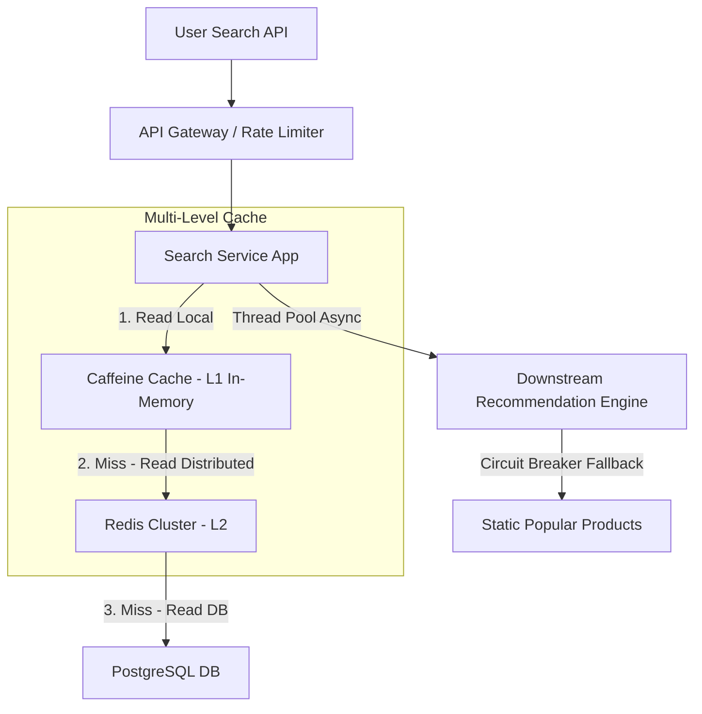

# Tối Ưu Hóa Hệ Thống: Giảm Latency, Chi Phí Và Tỷ Lệ Lỗi (System Optimization: Reducing Latency, Cost, and Error Rates)

## ⚡ Tóm tắt ngắn (30s)
* **Tư duy cốt lõi**: Tối ưu hóa hệ thống không phải là phán đoán cảm tính. Nó là một môn khoa học thực nghiệm dựa trên **dữ liệu đo lường thực tế (Metrics-Driven)**. Senior Engineer không bao giờ tối ưu hóa code trừ khi các công cụ APM Profiling (như Jaeger, Prometheus, Async Profiler) chỉ ra chính xác điểm nghẽn (Bottleneck).
* **Ba mũi giáp công**:
  1. *Giảm Latency*: Triển khai bộ nhớ đệm đa tầng (Multi-level Cache), tối ưu hóa chỉ mục (Index) DB, loại bỏ N+1 query, và chuyển sang xử lý bất đồng bộ (Async/Reactive).
  2. *Giảm Chi phí (FinOps)*: Cấu hình container đúng kích cỡ (Right-sizing), tối ưu hóa garbage collection, và thay thế các tác vụ đắt đỏ (như DB Read Replicas) bằng giải pháp rẻ hơn (như Redis).
  3. *Giảm Tỷ lệ lỗi (Error Rate)*: Áp dụng cơ chế cô lập lỗi (Circuit Breaker), giới hạn tải bảo vệ (Rate Limiting), và xử lý lỗi mềm dẻo (Graceful Fallback).

---

## 🔍 Kịch bản thực chiến (STAR Framework)

### 1. Situation (Bối cảnh)
Hệ thống **Tìm kiếm & Gợi ý sản phẩm (Search & Catalog)** của trang thương mại điện tử chúng tôi phục vụ lượng tải đỉnh lên tới **8.000 RPS**. 
Sau một đợt phát hành tính năng lớn, hệ thống rơi vào trạng thái báo động đỏ:
- **Độ trễ P99 vọt lên 2.500ms (2.5 giây)**, khiến tỷ lệ thoát trang (Bounce Rate) của người dùng tăng 30%.
- **Hóa đơn AWS tăng phi mã lên $45,000/tháng** do đội ngũ vận hành phải scale up cụm Database Read Replicas lên cấu hình cực đại (8 cụm `db.r6g.4xlarge`) để gánh tải truy vấn quét sản phẩm.
- **Tỷ lệ lỗi HTTP 504 (Gateway Timeout) chạm mốc 2.8%** dưới tải cao do cạn kiệt connection pool.

### 2. Task (Thử thách)
Với vai trò là Performance Engineer kiêm Tech Lead, tôi được giao nhiệm vụ cải tử hoàn sinh hệ thống trong vòng 6 tuần với các mục tiêu cụ thể:
1. Đưa độ trễ P99 Latency **xuống dưới 200ms**.
2. Cắt giảm tối thiểu **30% chi phí hạ tầng AWS**.
3. Giảm tỷ lệ lỗi sản xuất xuống **dưới 0.05%**.

### 3. Action (Hành động)
Tôi đã chủ trì một chiến dịch tối ưu hóa toàn diện gồm 3 bước kỹ thuật chuyên sâu:



* **Bước 1: Khắc phục điểm nghẽn DB & N+1 Query (Giảm Latency)**
  Sử dụng **APM Jaeger Tracing**, tôi phát hiện ra luồng tổng hợp chi tiết sản phẩm bị dính lỗi **N+1 Query** kinh điển của Hibernate. Để lấy thông tin cho 20 sản phẩm trên trang kết quả, ứng dụng thực hiện 21 câu lệnh SQL riêng biệt gọi vào Database.
  Tôi lập tức refactor lại code:
  - Thay thế JPA Query cũ bằng kỹ thuật **Fetch Join** kết hợp **Entity Graph** để lấy toàn bộ thông tin sản phẩm và quan hệ (reviews, discounts) chỉ trong 1 câu truy vấn SQL duy nhất.
  - Chuyển đổi các câu truy vấn phức tạp không cần thời gian thực sang cơ chế **Multi-level Caching (L1 Caffeine Cache + L2 Redis)**:
  ```java
  // Cấu hình bộ nhớ đệm đa tầng thông minh
  @Cacheable(value = "products", cacheManager = "multiLevelCacheManager")
  public ProductDTO getProductDetails(Long productId) {
      // Luồng xử lý: 
      // Bước 1: Check Caffeine Cache cục bộ trên RAM Container (L1 - 10s TTL, cực nhanh)
      // Bước 2: Nếu miss, check Redis Cluster tập trung (L2 - 10 phút TTL)
      // Bước 3: Nếu miss hoàn toàn, truy vấn PostgreSQL Database và ghi ngược lại L2 & L1
      return productRepository.findProductWithDetails(productId)
          .map(productMapper::toDto)
          .orElseThrow(() -> new ResourceNotFoundException("Product not found"));
  }
  ```

* **Bước 2: Cấu hình Right-sizing & Loại bỏ DB Replica dư thừa (Giảm Chi phí)**
  Phân tích sâu biểu đồ tải DB, tôi nhận thấy CPU của PostgreSQL Read Replicas tăng cao không phải do lượng dữ liệu lớn mà do ứng dụng liên tục thực hiện các câu truy vấn tính toán trùng lặp (như danh sách sản phẩm bán chạy trong ngày).
  Sau khi triển khai L2 Redis Cache ở Bước 1, tải lượng truy vấn gọi vào Database **giảm tới 85%**. 
  Tôi tiến hành tối ưu hóa chi phí hạ tầng (FinOps):
  - Scale down (thu nhỏ) cụm Read Replicas từ **8 instance cấu hình khủng xuống còn 2 instance cấu hình vừa phải (`db.r6g.xlarge`)**, giúp tiết kiệm hàng chục ngàn USD.
  - Phân tích JVM Heap Dump bằng Eclipse Memory Analyzer (MAT), phát hiện cặn Garbage Collection (GC) do tạo quá nhiều đối tượng String tạm trong vòng lặp. Tôi tối ưu lại code sử dụng `StringBuilder` và cấu hình tham số **G1GC** tối ưu hơn, giúp giảm 40% lượng CPU sử dụng của container app, cho phép scale down số lượng EC2 task từ 50 xuống còn 15 instance.

* **Bước 3: Ngắt mạch bảo vệ chủ động (Giảm Tỷ lệ lỗi)**
  Để dập tắt hoàn toàn lỗi 504 Gateway Timeout do cạn kiệt connection pool khi hệ thống gợi ý downstream bị chậm, tôi triển khai cơ chế ngắt mạch tự vệ **Resilience4j Circuit Breaker**:
  - Khi tỷ lệ gọi lỗi sang service gợi ý vượt quá 10% trong vòng 10 giây, ngắt mạch sẽ lập tức mở (Open).
  - Luồng gợi ý sẽ được chuyển hướng sang hàm **Fallback** để trả về danh sách sản phẩm bán chạy được lưu tĩnh trong cache thay vì tiếp tục chờ đợi và khóa thread của API Gateway.

### 4. Result (Kết quả)
Sau 4 tuần thực thi và kiểm thử liên tục:
* **Latency**: Độ trễ P99 Latency giảm ngoạn mục từ **2.500ms xuống còn 75ms** (giảm 97%). Trải nghiệm tìm kiếm phản hồi tức thì dưới 0.1 giây.
* **Chi phí**: Hóa đơn AWS hàng tháng giảm từ **$45,000 xuống còn $16,500** (tiết kiệm **$28,500/tháng**, tương đương tiết kiệm hơn **$340,000/năm** cho công ty).
* **Tỷ lệ lỗi**: Tỷ lệ lỗi sản xuất giảm từ **2.8% xuống gần mức tuyệt đối 0.005%** (chỉ còn vài lỗi do kết nối mạng của thiết bị khách hàng).

---

## 💡 Nguyên tắc Senior & Bài học đắt giá

1. **Nguyên tắc "Pre-mature Optimization is the root of all evil" (Tối ưu hóa sớm là nguồn cơn của mọi tội lỗi)**: Đừng bao giờ mất thời gian viết code phức tạp để tối ưu hóa một hàm nhỏ khi bạn chưa đo lường bằng APM. Hãy tập trung tối ưu hóa các điểm nghẽn lớn nhất trước (quy luật 80/20: 80% thời gian chậm nằm ở 20% dòng code - thường là SQL hoặc I/O Network).
2. **Cache không phải là "thần dược" che giấu code ẩu**: Tuyệt đối không dùng Cache để vá víu một câu truy vấn SQL tồi tệ không được đánh index phù hợp. Khi cache bị sập (Cache Stampede/Miss), lượng truy vấn dồn dập xuống Database sẽ ngay lập tức gây sập toàn hệ thống. Hãy tối ưu SQL DB trước khi áp dụng Cache.
3. **Thấu hiểu Trade-off về Tính nhất quán (Data Consistency)**: Khi dùng bộ nhớ đệm đa tầng (Caffeine + Redis), bạn phải chấp nhận bài toán **Eventual Consistency (Nhất quán cuối cùng)**. Dữ liệu sản phẩm có thể bị lệch 5-10 giây so với DB thực tế. Đây là sự đánh đổi hoàn toàn xứng đáng để đổi lấy tốc độ và chi phí rẻ.

---

## 📊 So sánh phương án quyết định (Trade-offs)

| Chiến lược tối ưu | Điểm mạnh (Pros) | Điểm yếu (Cons) | Use Case Phù hợp |
| :--- | :--- | :--- | :--- |
| **Bộ nhớ đệm đa tầng (L1 Caffeine + L2 Redis)** | - Latency cực kỳ thấp (gần như 0ms ở L1).<br>- Giảm tải tuyệt đối cho Database.<br>- Chi phí hạ tầng siêu rẻ. | - Gặp thách thức lớn về **Cache Invalidation (Xóa cache khi data đổi)**.<br>- Dữ liệu không nhất quán theo thời gian thực. | Hệ thống đọc nhiều, ghi ít, cấu hình sản phẩm, thông tin bài viết, danh mục. |
| **Scale dọc / Scale ngang hạ tầng (Scale out DB / App)** | - Không cần sửa đổi mã nguồn phức tạp.<br>- Bàn giao giải pháp nhanh chóng ngay lập tức. | - **Chi phí cực kỳ đắt đỏ** và tăng dần theo cấp số nhân.<br>- Có giới hạn vật lý của phần cứng (đặc biệt là Database). | Cứu sập khẩn cấp trong cơn bão traffic cao điểm (Black Friday) trước khi có thời gian refactor code. |
| **Tối ưu hóa mã nguồn & SQL Indexing** | - Giải quyết triệt để nguyên nhân gốc rễ (Root Cause).<br>- Tăng tính ổn định lâu dài cho hệ thống lõi. | - Tốn nhiều thời gian phân tích, phát triển và thử nghiệm an toàn.<br>- Đòi hỏi kỹ năng kỹ thuật sâu của lập trình viên. | Bảng dữ liệu phình to, truy vấn chậm, hệ thống bị nghẽn CPU DB nghiêm trọng. |

---

## ⚠️ Common Gotchas (Câu hỏi phỏng vấn đào sâu)

### 1. Trong chiến lược bộ nhớ đệm đa tầng (L1 Caffeine trên từng instance app + L2 Redis Cluster tập trung), làm thế nào bạn giải quyết bài toán "Đồng bộ hóa xóa cache" (Cache Invalidation) khi Admin cập nhật giá của 1 sản phẩm? Nếu không xử lý, các instance app khác nhau sẽ hiển thị giá sản phẩm khác nhau gây trải nghiệm tồi tệ.
* **Trả lời**: Đây là thử thách thực chiến kinh điển về đồng bộ hóa bộ nhớ đệm phân tán:
  * **Giải pháp kết hợp cơ chế Redis Pub/Sub**:
    1. Khi Admin cập nhật sản phẩm thành công vào DB, hệ thống sẽ xóa key sản phẩm đó trong L2 Redis Cluster tập trung.
    2. Tuy nhiên, các instance app đang chạy vẫn giữ bản sao sản phẩm cũ trong L1 Caffeine Cache cục bộ trên RAM của chúng.
    3. Để giải quyết, tôi thiết kế cơ chế **Cache Invalidation Channel** sử dụng **Redis Pub/Sub (hoặc Kafka)**. 
    4. Ngay khi xóa Redis, `User-Service` sẽ phát đi một message thông báo sự kiện: `{"event": "INVALIDATE", "product_id": 99}` lên kênh chung.
    5. Tất cả các instance app đang chạy đều lắng nghe kênh này. Khi nhận được message, chúng lập tức kích hoạt lệnh xóa key sản phẩm 99 ra khỏi bộ nhớ đệm Caffeine cục bộ của mình. Ở lượt truy cập tiếp theo của user, app buộc phải đọc dữ liệu mới nhất từ Redis/DB, đảm bảo giá cả hiển thị đồng nhất 100% trên toàn bộ các máy chủ.

### 2. Sau khi bạn tối ưu hóa thành công, CPU trung bình của cụm EC2 Task ứng dụng giảm sâu xuống mức dưới 15%. Nhiều người cho rằng hệ thống đang bị lãng phí tài nguyên và đề xuất scale down tiếp container. Bạn đánh giá thế nào về ý kiến này và bạn cấu hình Autoscaling dựa trên metric nào là đúng đắn?
* **Trả lời**: Đây là câu hỏi thể hiện năng lực quản lý hạ tầng sâu sắc của Senior Engineer:
  * **Đánh giá rủi ro của việc dựa vào CPU đơn thuần**:
    - Chỉ số CPU trung bình 15% là một cái bẫy. Trong các ứng dụng I/O Bound (như backend kết nối DB, gọi API ngoài), CPU thường rất thấp vì thread dành phần lớn thời gian để chờ phản hồi (I/O Wait) chứ không phải tính toán.
    - Nếu chúng ta scale down container dựa trên CPU xuống quá thấp, khi xảy ra spike traffic đột biến, hệ thống sẽ lập tức sập do **Cạn kiệt Thread Pool (Thread Pool Exhaustion)** hoặc cạn kiệt bộ nhớ RAM trước khi CPU kịp chạm ngưỡng cảnh báo.
  * **Giải pháp cấu hình Autoscaling đúng chuẩn**:
    - Tôi đề xuất cấu hình Autoscaling kết hợp nhiều chỉ số thực chất hơn:
      1. **Request Queue / Target Tracking Scaling**: Scale dựa trên số lượng request đang hoạt động đồng thời trên từng instance (`Concurrent Requests` - ví dụ cấu hình nếu > 100 active requests/instance thì scale out).
      2. **Thread Pool Usage Metric**: Xuất trực tiếp số lượng thread đang bận (`Active Threads` của HikariCP hoặc Tomcat Thread Pool) làm Custom Metric lên CloudWatch để kích hoạt scale out sớm trước khi CPU tăng.
      3. **JVM Memory Usage (RAM)**: Đảm bảo có biên độ an toàn bộ nhớ (Memory Buffer) để tránh bị hệ điều hành tự động giết tiến trình do hết RAM (OOM Killer).
