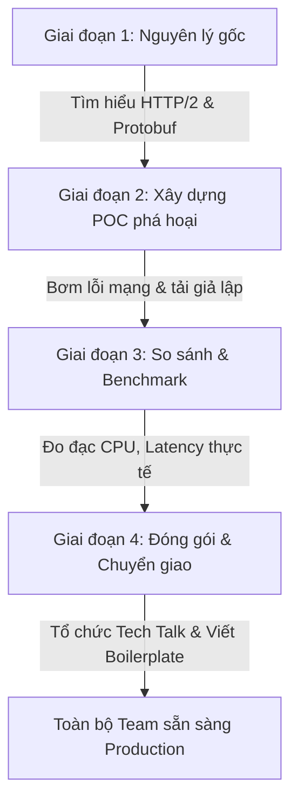

# Phương Pháp Học Công Nghệ Mới Của Senior Engineer (How a Senior Engineer Learns New Technology)

## ⚡ Tóm tắt ngắn (30s)
* **Tư duy cốt lõi**: Trong thế giới công nghệ thay đổi chóng mặt, Senior Engineer không chạy theo trào lưu (Hype) hay ghi nhớ cú pháp (Syntax) một cách sáo rỗng. Họ học bằng **tư duy nguyên lý gốc (First Principles)**: Tìm hiểu bản chất khoa học máy tính đằng sau công nghệ mới (như HTTP/2, cơ chế lưu trữ đĩa, lý thuyết đồ thị) và đánh giá chi tiết bài toán thực tế mà công nghệ đó giải quyết.
* **Quy trình 4 tầng (STAR Learning Framework)**:
  1. *Lý thuyết gốc (Why & How)*: Đọc tài liệu đặc tả (Specifications), RFC, hoặc trực tiếp xem mã nguồn mở thay vì chỉ xem video hướng dẫn nhanh.
  2. *POC phá hoại (Failure-Driven POC)*: Xây dựng một ứng dụng nhỏ thử nghiệm và chủ động **gây lỗi hệ thống** để xem công nghệ đó đổ vỡ ra sao dưới tải lớn hoặc lỗi mạng.
  3. *Tối ưu hóa & Đo lường (Benchmark)*: Tự tay đo đạc hiệu năng và so sánh khách quan với công nghệ cũ.
  4. *Truyền dạy (Teach to Learn)*: Đóng gói kiến thức thành các tài liệu tiêu chuẩn, template và chia sẻ lại cho đồng nghiệp trong team.

---

## 🔍 Kịch bản thực chiến (STAR Framework)

### 1. Situation (Bối cảnh)
Hệ thống thương mại điện tử của công ty chúng tôi có kế hoạch mở rộng tải gấp 10 lần để chuẩn bị cho chiến dịch vươn ra khu vực Đông Nam Á. 
Khi phân tích điểm nghẽn, tôi nhận thấy các cuộc gọi đồng bộ REST (HTTP/1.1 + JSON) giữa các microservices nội bộ chiếm tới **35% tổng độ trễ của luồng thanh toán** và gây quá tải CPU do chi phí nén/giải nén chuỗi JSON quá lớn. 
Tôi đề xuất giải pháp dịch chuyển sang giao thức truyền tải hiệu năng cao **gRPC** (HTTP/2 + Protocol Buffers). Tuy nhiên, tại thời điểm đó, **không một ai trong toàn bộ tổ chức kỹ thuật (gần 40 dev) có kinh nghiệm thực chiến hay kiến thức sâu về gRPC hoặc HTTP/2**.

### 2. Task (Thử thách)
Với tư cách là Tech Lead, tôi phải:
1. Bản thân phải **làm chủ hoàn toàn công nghệ gRPC** ở mức độ chuyên gia trong vòng **2 tuần**.
2. Đánh giá tính khả thi và chứng minh hiệu năng thực tế của gRPC thông qua một bản thử nghiệm (POC).
3. Đào tạo, chuẩn hóa quy trình và chuyển giao kiến thức cho toàn bộ đội ngũ kỹ sư để họ có thể tự tin phát triển các service mới bằng gRPC.

### 3. Action (Hành động)
Tôi đã tự mình áp dụng và dẫn dắt team thực hiện quy trình học tập kỹ thuật sâu chia làm 4 giai đoạn:

* **Giai đoạn 1: Đào sâu Nguyên lý gốc (First Principles)**
  Tôi không bắt đầu bằng việc tìm thư viện gRPC cho Spring Boot hay copy code trên mạng. Tôi dành 3 ngày đầu tiên để đọc tài liệu đặc tả:
  - Đọc tài liệu chuẩn **HTTP/2 RFC 7540** để hiểu cơ chế dồn kênh (Multiplexing), nén Header (HPACK), và luồng nhị phân (Binary Framing).
  - Đọc đặc tả Protocol Buffers của Google để nắm rõ cách dữ liệu được mã hóa thành các byte nhị phân thay vì chuỗi văn bản (JSON), giúp tôi hiểu tại sao gRPC lại nhanh và tốn ít dung lượng đường truyền hơn.

* **Giai đoạn 2: Xây dựng bản POC phá hoại (Failure-Driven POC)**
  Tôi tự tay viết một cụm ứng dụng gRPC nhỏ (gồm 2 service bằng Java và Go để kiểm chứng tính năng gọi đa ngôn ngữ). Thay vì chỉ code luồng chạy đúng (Happy Path), tôi dành phần lớn thời gian để **chủ động phá hỏng hệ thống**:
  - *Bơm lỗi mạng (Network Latency Injection)*: Dùng lệnh `tc` (traffic control) của Linux để giả lập mạng bị trễ 200ms và mất gói tin 5% giữa các container gRPC để xem cơ chế kết nối HTTP/2 (Keep-alive, Connection Pooling) phản ứng ra sao.
  - *Thay đổi Schema (Schema Evolution Test)*: Cố tình thay đổi kiểu dữ liệu của một trường trong file `.proto` từ `int32` thành `string` rồi deploy service A để xem service B cũ có bị crash khi nhận tin nhắn hay không. Qua đó, tôi đúc rút ra quy tắc vàng về quản lý chỉ số trường (Field Number) trong Protobuf để hướng dẫn cho team.

* **Giai đoạn 3: Đo đạc và So sánh khách quan (Benchmark)**
  Tôi viết script chạy kiểm thử tải bằng công cụ **ghz** (công cụ chuyên dụng test tải gRPC) so sánh trực tiếp với REST API cũ trên cùng một tài nguyên CPU/RAM:
  - Đo đạc Latency (P95, P99) dưới các dải tải từ 1.000 RPS đến 10.000 RPS.
  - Theo dõi mức độ chiếm dụng CPU/RAM của tiến trình Serialization (mã hóa dữ liệu).

* **Giai đoạn 4: Đóng gói Kiến thức và Truyền dạy**
  Sau khi làm chủ công nghệ và có kết quả benchmark thuyết phục, tôi đóng gói kiến thức để chuyển giao cho tổ chức:
  - Tạo ra một dự án mẫu tiêu chuẩn (**gRPC Boilerplate / Template project**) tích hợp sẵn các cấu hình tối ưu (Connection timeout, Keep-alive, Prometheus metrics, và Interceptors để ghi log Correlation ID).
  - Viết tài liệu quy chuẩn kỹ thuật (Engineering Standards) về cách đặt tên, quản lý version của file `.proto`.
  - Tổ chức cuộc họp kỹ thuật chung (Tech Talk) dài 2 tiếng, hướng dẫn thực hành (Hands-on workshop) giúp toàn bộ dev tự tay xây dựng một API gRPC từ con số 0.

### 4. Result (Kết quả)
* **Tốc độ làm chủ**: Tôi hoàn thành bản POC và tài liệu hướng dẫn chuẩn chỉ trong **9 ngày**.
* **Hiệu suất di chuyển**: Toàn bộ **40 kỹ sư** trong team nắm bắt và sẵn sàng phát triển gRPC chỉ sau 1 tuần tiếp cận template.
* **Hiệu năng hệ thống**: Chúng tôi áp dụng gRPC cho 8 dịch vụ cốt lõi. Độ trễ giao tiếp nội bộ (Internal Latency) **giảm sâu tới 68%**, CPU hao tốn cho việc parse JSON **giảm 45%**, giúp hệ thống vận hành cực kỳ mượt mà, sẵn sàng chịu tải chiến dịch khu vực.

---

## 💡 Nguyên tắc Senior & Bài học đắt giá

1. **Quy tắc "Failure-Driven Learning" (Học từ sự sụp đổ)**: Bạn chưa thực sự hiểu một công nghệ mới cho đến khi bạn tự tay phá hỏng nó và hiểu rõ **nó sập như thế nào (Failure Modes)**. Biết cách cấu hình chạy đúng chỉ chiếm 20% kiến thức; biết cách debug, cấu hình timeout, xử lý mất kết nối mới chiếm 80% giá trị thực chiến của một Senior.
2. **Nói không với "Hype-driven Development" (Phát triển theo trào lưu)**: Không chọn công nghệ mới chỉ vì nó đang hot trên GitHub hay nghe hoành tráng trong các hội thảo. Mỗi công nghệ mới đều mang theo **nợ kỹ thuật ẩn (Cognitive Load & Learning Curve)**. Chỉ áp dụng khi lợi ích kinh doanh/hiệu năng của nó vượt trội rõ rệt so với chi phí học và vận hành của team.
3. **Mã nguồn là tài liệu trung thực nhất**: Khi tài liệu hướng dẫn chính thức quá sơ sài hoặc gặp lỗi khó hiểu, Senior Engineer không dừng lại ở việc tra cứu StackOverflow. Họ sẽ mở mã nguồn mở của thư viện đó ra để đọc hiểu logic xử lý bên dưới. Đây là cách nhanh nhất và chính xác nhất để giải quyết mọi bug dị biệt.

---

## 📊 So sánh phương án quyết định (Trade-offs)

| Cách tiếp cận học tập | Điểm mạnh (Pros) | Điểm yếu (Cons) | Use Case Phù hợp |
| :--- | :--- | :--- | :--- |
| **Đào sâu đặc tả & RFC (First Principles)** | - Nắm giữ **kiến thức gốc rễ vững chắc**, không bị phụ thuộc vào các thư viện cụ thể. - Khả năng tự debug lỗi hệ thống cực tốt. | - Tốn nhiều thời gian và công sức đọc các tài liệu dài, khô khan. - Đòi hỏi nền tảng khoa học máy tính tốt. | Khi cần áp dụng các công nghệ lõi, hạ tầng quan trọng (gRPC, Kafka, DB Engine, OAuth2). |
| **Học qua Video/Mì ăn liền (Quick Tutorials)** | - Tiếp thu nhanh, dựng được ứng dụng chạy cơ bản trong vòng vài chục phút. - Trực quan, dễ tiếp cận. | - Kiến thức rất nông, dễ bị hổng nguyên lý cơ bản. - Gặp lỗi phức tạp trên Production sẽ hoàn toàn bế tắc không biết cách debug. | Tìm hiểu nhanh các thư viện tiện ích nhỏ, các tool phụ trợ hoặc làm prototype cực nhanh. |
| **Xây dựng POC phá hoại (Failure-Driven POC)** | - Rút ngắn khoảng cách giữa lý thuyết và thực chiến sản xuất. - Phát hiện sớm 90% lỗi sẽ gặp trên Production trước khi deploy. | - Cần có môi trường test giả lập tốt (như Docker/Kubernetes địa phương). - Yêu cầu tính kiên trì và tư duy phản biện cao. | **Bắt buộc** đối với mọi kiến trúc sư trước khi đưa một công nghệ/thư viện mới vào hệ thống production. |

---

## ⚠️ Common Gotchas (Câu hỏi phỏng vấn đào sâu)

### 1. Làm thế nào bạn đánh giá một công nghệ/thư viện mới (ví dụ một cơ sở dữ liệu NoSQL mới nổi) có đủ độ chín muồi (Production-Ready) để đưa vào áp dụng cho một dự án cốt lõi của công ty, tránh tình trạng mang nợ kỹ thuật lớn cho tương lai?
* **Trả lời**: Đây là câu hỏi thể hiện tầm vóc của một Tech Lead có trách nhiệm cao với doanh nghiệp:
  * **Bộ tiêu chí đánh giá Độ chín kỹ thuật (Production-Readiness Matrix)**:
    1. **Sức khỏe cộng đồng (Community Health)**: Số lượng sao GitHub không quan trọng bằng: Tần suất commit gần đây? Số lượng Issue đang mở và tốc độ giải quyết issue của core team? Số lượng câu hỏi và giải đáp trên StackOverflow/Reddit có năng động không?
    2. **Mức độ áp dụng thực tế (Industry Adoption)**: Có các doanh nghiệp lớn nào khác (Big Tech hoặc các công ty có quy mô tương đương) đã deploy thư viện này trên môi trường Production của họ và chia sẻ bài viết thực tế (Case Studies) chưa?
    3. **Chính sách tương thích ngược (Backward Compatibility Policy)**: Core team của công nghệ đó có cam kết rõ ràng về Semantic Versioning (SemVer) và cung cấp đường đi di cư (Migration Path) an toàn khi lên version mới không? Hay họ liên tục đập đi xây lại cấu trúc cũ?
    4. **Sự phù hợp của Đội ngũ (Team Skill Gap)**: Team hiện tại mất bao lâu để học và làm chủ công cụ này? Nếu kỹ sư duy nhất nắm công cụ này nghỉ việc, ai sẽ là người bảo trì?
    5. **Kiểm tra Giới hạn cực hạn (Stress Test & Failure Modes)**: Thư viện đó phản ứng ra sao khi bị tràn bộ nhớ (Out of Memory), nghẽn luồng ghi, hoặc rớt kết nối mạng? Nếu nó không có cơ chế tự vệ tốt, tôi kiên quyết bác bỏ.

### 2. Khi bạn giới thiệu một công nghệ mới vào dự án, các kỹ sư Junior trong team thường có xu hướng áp dụng nó một cách quá đà (Over-engineering), lạm dụng các tính năng phức tạp ở những chỗ không cần thiết. Bạn làm thế nào để định hướng và đặt ra ranh giới bảo vệ cho họ?
* **Trả lời**: Đây là nghệ thuật dẫn dắt và huấn luyện kỹ thuật trong team:
  * **Giải pháp thiết kế Ranh giới tự động hóa và Quy trình rà soát**:
    1. **Đóng gói công nghệ sau lớp giao diện sạch (Abstraction encapsulation)**: Tôi không cho phép Junior gọi trực tiếp các thư viện gRPC phức tạp ở khắp nơi trong mã nguồn. Tôi viết một thư viện chung nội bộ (Internal SDK) bọc ngoài gRPC, cung cấp các hàm đơn giản. Junior chỉ cần gọi hàm sạch sẽ, toàn bộ logic phức tạp về timeout, retry, circuit breaker đều được đóng gói an toàn bên dưới.
    2. **Xây dựng Bộ quy tắc Linter và CI/CD gate**: Tôi cấu hình các công cụ quét code tự động (như SonarQube hoặc Custom ArchUnit tests) để quét mã nguồn. Nếu phát hiện Junior cố tình áp dụng các tính năng nâng cao hoặc sai cấu trúc quy chuẩn, CI/CD pipeline sẽ tự động báo lỗi đỏ và từ chối merge code.
    3. **Quy trình Code Review thực chiến**: Trong các buổi review pull request, tôi luôn hỏi Junior 2 câu hỏi: *"Tính năng này có thực sự cần sự phức tạp này không? Nếu dùng cách viết đơn giản truyền thống thì gặp vấn đề gì?"*. Việc này rèn luyện cho họ tư duy tối giản và tập trung vào giá trị thực tế của dòng code thay vì phô diễn kỹ năng.
