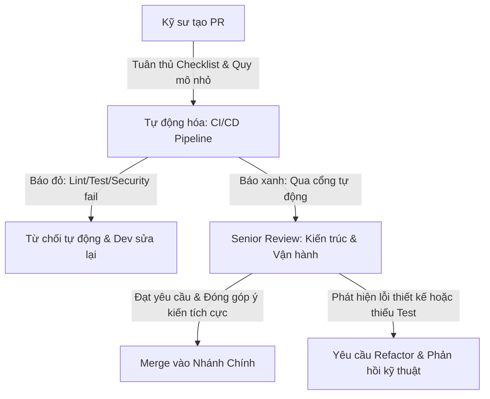

# Cách Đánh Giá Một Pull Request Tốt Của Senior Engineer (Evaluating a Good Pull Request)

## ⚡ Tóm tắt ngắn (30s)
* **Tư duy cốt lõi**: Đối với một Senior Engineer, việc review Pull Request (PR) không đơn thuần là tìm lỗi cú pháp (Syntax) hay phong cách viết code (Linting) vốn có thể tự động hóa bằng công cụ. PR review là **quá trình bảo vệ chất lượng kiến trúc hệ thống, chia sẻ kiến thức và xây dựng văn hóa kỹ thuật**. Một PR tốt cần đảm bảo tính rõ ràng về ngữ cảnh, sự tối giản về phạm vi thay đổi và sự sẵn sàng cho môi trường production.
* **Quy tắc "3 Tầng Kiểm Duyệt"**:
  1. *Ngữ cảnh & Mục tiêu (Context & Intent)*: PR phải trả lời được câu hỏi "Tại sao chúng ta làm thay đổi này?" và "Giải pháp này ảnh hưởng gì tới các module khác?".
  2. *Kiến trúc & Thiết kế (Architecture & Core Logic)*: Kiểm tra tính đúng đắn của giải thuật, ranh giới transaction, luồng bất đồng bộ, rò rỉ bộ nhớ, tính bảo mật và hiệu năng DB.
  3. *Khả năng vận hành (Operability & Maintainability)*: Đảm bảo có đủ unit test chất lượng, có cấu hình log rõ ràng, đầy đủ các chỉ số đo lường (metrics) và kế hoạch rollback khi deploy lỗi.

---

## 🔍 Kịch bản thực chiến (STAR Framework)

### 1. Situation (Bối cảnh)
Tại dự án Fintech cốt lõi của công ty chúng tôi, hệ thống đang phải chịu áp lực tích hợp rất nhiều tính năng mới từ 5 đội ngũ phát triển độc lập (hơn 25 kỹ sư). Do tốc độ bàn giao (delivery) quá nhanh, quy trình code review cũ chỉ diễn ra hời hợt: kiểm tra nhanh xem code chạy được không, không báo đỏ CI/CD là merge. 
Hậu quả là trong vòng 1 tháng, chúng tôi gặp **3 sự cố sập production nghiêm trọng** (trong đó có một lỗi do đóng kết nối DB không đúng cách gây cạn kiệt Connection Pool và một lỗi do quên ranh giới Transaction khiến dữ liệu số dư ví của khách hàng bị sai lệch).

### 2. Task (Thử thách)
Với vai trò là Tech Lead/Senior Architect, tôi phải tái cấu trúc lại quy trình kiểm soát chất lượng code, định nghĩa ra **bộ tiêu chuẩn thế nào là một Pull Request tốt (PR Standard Guide)** và hướng dẫn đội ngũ kỹ sư áp dụng thực tế để triệt tiêu hoàn toàn các lỗi sơ đẳng trước khi mã nguồn được merge vào nhánh chính.

### 3. Action (Hành động)
Tôi đã xây dựng và áp dụng bộ khung đánh giá PR nâng cao, kết hợp tự động hóa tối đa và rà soát thủ công tập trung vào kiến trúc hệ thống:

* **Bước 1: Tự động hóa những gì máy móc làm tốt hơn con người (CI/CD Gates)**
  Tôi thiết lập một pipeline CI/CD nghiêm ngặt để loại bỏ hoàn toàn các tranh cãi nhỏ nhặt (style wars) khi review thủ công:
  - Tích hợp **Checkstyle / Spotless** để tự động định dạng code và báo lỗi nếu vi phạm chuẩn viết code của Java.
  - Sử dụng **SonarQube** để đo đạc độ phức tạp chu kỳ (Cyclomatic Complexity), phát hiện các đoạn code trùng lặp (Code Duplication) và đảm bảo Code Coverage của Unit Test tối thiểu phải đạt 80%.
  - Tích hợp **Snyk** để tự động quét các lỗ hổng bảo mật trong các thư viện bên thứ ba (Dependencies).

* **Bước 2: Xây dựng Tiêu chuẩn "PR Nhỏ & Đơn Nhiệm" (Atomic Pull Request)**
  Tôi đưa ra quy định nghiêm khắc về quy mô của một PR:
  - Một PR tốt **không nên vượt quá 300 dòng thay đổi** (không tính code tự động generate). Các PR lớn hơn bắt buộc phải được chia nhỏ bằng kỹ thuật **Feature Flags (Feature Toggles)** hoặc chia tách nhỏ thành các tầng riêng (ví dụ: PR 1 thiết kế Database Schema -> PR 2 viết tầng Repository -> PR 3 viết tầng Service và Controller).
  - PR phải có phần mô tả ngắn gọn nhưng đầy đủ theo mẫu chuẩn: *Tại sao thay đổi này cần thiết? Giải pháp kỹ thuật là gì? Đoạn code nào nhạy cảm cần lưu ý? Ảnh chụp màn hình kết quả chạy thực tế (nếu có).*

* **Bước 3: Quy trình Review 3 Tầng của Senior**
  Khi review thủ công một PR đã vượt qua cổng CI/CD, tôi áp dụng bộ tư duy sâu:
  - **Tầng 1 - Thiết kế Hệ thống & Luồng Dữ liệu**:
    * Tôi kiểm tra ranh giới `@Transactional` có quá rộng không (gây giữ lock DB lâu) hoặc có bị gọi nội bộ trong cùng một class dẫn đến mất tính năng Proxy của Spring AOP không.
    * Đảm bảo luồng xử lý không có điểm nghẽn hiệu năng như: gọi query DB trong vòng lặp (N+1 query), load quá nhiều record lên memory mà không phân trang.
  - **Tầng 2 - Khả năng Phòng ngự & Xử lý Ngoại lệ (Defensive Programming)**:
    * Kiểm tra xem các tài nguyên (như `InputStream`, `Connection`, `ClientSession`) đã được đóng an toàn bằng cấu trúc `try-with-resources` chưa.
    * Đảm bảo các tham số đầu vào được validate nghiêm ngặt (sử dụng Bean Validation `@Valid` và Assertions).
    * Check các exception có bị nuốt (swallow) hay không, hoặc log lỗi có kèm theo đầy đủ stack trace hay không.
  - **Tầng 3 - Khả năng Vận hành thực tế (Production Readiness)**:
    * Có log Correlation ID để trace lỗi liên service không? Log có bị lộ thông tin cá nhân (PII - Personally Identifiable Information) như mật khẩu, số thẻ ngân hàng của user không?
    * Có viết đầy đủ unit test cho các case biên (Edge Cases) và ngoại lệ (Exceptions) không?

### 4. Result (Kết quả)
* **Chất lượng code tăng vọt**: Tỷ lệ lỗi lọt lên production giảm **85%** trong vòng quý đầu tiên áp dụng.
* **Tốc độ Review tối ưu**: Do các PR được chia nhỏ (< 300 dòng) và mô tả rõ ràng, thời gian trung bình để duyệt một PR giảm từ **1.5 ngày xuống còn dưới 3 tiếng**.
* **Nâng cao trình độ đội ngũ**: Các cuộc thảo luận trong PR trở thành những bài học kiến thức sống động, giúp các kỹ sư Junior tiến bộ vượt bậc chỉ sau vài tháng làm việc chung.

---

## 💡 Nguyên tắc Senior & Bài học đắt giá

1. **Review Code chứ không Review Con người (Blameless Code Review)**: Ngôn từ sử dụng trong PR review cực kỳ quan trọng đối với văn hóa team. Tránh các câu mang tính công kích cá nhân như: *"Tại sao bạn lại viết code ngu ngốc như thế này?"*. Thay vào đó, hãy dùng đại từ khách quan và tập trung vào giải pháp: *"Đoạn code xử lý ở dòng 45 có thể gặp vấn đề deadlock nếu nhiều request đồng thời gọi tới. Liệu chúng ta có thể chuyển sang dùng cơ chế Optimistic Locking ở đây được không?"*.
2. **Quy tắc "Leave the campground cleaner than you found it" (Cải tiến liên tục)**: Khi review một PR, nếu phát hiện ra một đoạn code cũ kế cận bị xấu hoặc thiếu test, Senior nên khuyến khích dev refactor lại nhẹ nhàng (nếu phạm vi cho phép) hoặc tự tay viết bổ sung test. Tuy nhiên, cần tránh lạm dụng khiến phạm vi PR bị phình to (Scope Creep).
3. **Đừng biến mình thành "Bức tường ngăn cản" (Nitpicking block)**: Senior cần phân biệt rõ ràng giữa **Lỗi chí mạng (Blockers)** và **Ý kiến cá nhân / Phong cách viết (Non-blockers / Nitpicks)**. Nếu là lỗi chí mạng (lỗi bảo mật, hiệu năng DB, logic sai), kiên quyết yêu cầu sửa. Nếu chỉ là góp ý cho code đẹp hơn hoặc giải pháp thay thế không quá chênh lệch hiệu năng, hãy đánh dấu `[Optional]` hoặc `[Nitpick]` để dev tự quyết định và không giữ chân PR của họ.

---

## 📊 So sánh phương án quyết định (Trade-offs)

| Cách tiếp cận Review | Ưu điểm (Pros) | Nhược điểm (Cons) | Use Case Phù hợp |
| :--- | :--- | :--- | :--- |
| **Review Tập Trung Cao Độ (Senior Gatekeeper)** | - Đảm bảo **chất lượng hệ thống ở mức tuyệt đối**. - Tránh hoàn toàn các lỗi thiết kế nguy hiểm lọt lên Production. | - Tạo ra **điểm nghẽn (bottleneck) tại Senior**. - Dev trong team bị thụ động, giảm tính tự chủ và tốc độ release. | Hệ thống tài chính cốt lõi, module thanh toán, bảo mật hoặc hạ tầng dùng chung nhạy cảm. |
| **Review Chéo Đồng Cấp (Peer-to-Peer Review)** | - Tốc độ merge code cực nhanh. - Chia sẻ kiến thức rộng khắp trong team, tăng tính bình đẳng. | - Dễ rơi vào tình trạng **review hời hợt ("Looks Good To Me" - LGTM)**. - Thiếu cái nhìn toàn cảnh về kiến trúc của Senior. | Các dự án startup tốc độ nhanh, module ít rủi ro (internal tool, back-office admin), code frontend đơn giản. |
| **Kết hợp Tự động hóa + Rà soát Phân tầng (Hybrid Approach)** | - Giải phóng Senior khỏi các lỗi vặt vãnh nhờ CI/CD. - Tập trung thời gian rà soát vào kiến trúc sâu. - Cân bằng tuyệt vời giữa tốc độ và an toàn. | - Tốn chi phí xây dựng, cấu hình ban đầu cho pipeline CI/CD. - Đòi hỏi kỷ luật cao từ toàn bộ thành viên. | **Bắt buộc áp dụng** cho mọi hệ thống doanh nghiệp (Enterprise Services) quy mô vừa và lớn. |

---

## ⚠️ Common Gotchas (Câu hỏi phỏng vấn đào sâu)

### 1. Làm thế nào để bạn xử lý một tình huống khi một kỹ sư Senior khác trong team liên tục viết những PR rất lớn (hơn 1.500 dòng), chứa nhiều tính năng trộn lẫn và kiên quyết không muốn chia nhỏ PR vì cho rằng việc đó tốn thời gian và làm gián đoạn mạch code của họ?
* **Trả lời**: Đây là bài toán quản trị xung đột kỹ thuật giữa các nhân sự cấp cao. Tôi sẽ giải quyết bằng sự khéo léo kết hợp quy chuẩn chung:
  * **Giải pháp từng bước**:
    1. **Nói chuyện riêng (1-1 Alignment)**: Tránh chất vấn họ trên kênh chung của team. Tôi sẽ mời họ uống cà phê và chia sẻ góc nhìn: *"PR lớn khiến việc review cực kỳ rủi ro và mệt mỏi cho người khác. Nếu có bug lọt lên production, việc rollback một PR 1.500 dòng chứa 3-4 tính năng sẽ cực kỳ phức tạp và có thể kéo sập các tính năng đang chạy ổn định của người khác."*
    2. **Đưa ra giải pháp kỹ thuật cụ thể (Trình bày kỹ thuật Branching/Toggle)**: Hướng dẫn và cùng họ thiết lập quy trình dùng **Feature Flags**. Giải thích rằng họ có thể merge code chạy dở lên nhánh chính mà không sợ ảnh hưởng user vì tính năng đó vẫn đang tắt. Việc này giúp họ giải phóng code liên tục mà mạch code không bị ngắt quãng.
    3. **Chuẩn hóa bằng Quy trình chung (Team Agreement)**: Đưa quy chuẩn giới hạn kích thước PR (< 400 dòng) vào tài liệu làm việc chung của team (Working Agreement) và được toàn bộ team biểu quyết thông qua. Khi quy chế đã được đồng thuận, mọi người (kể cả Senior hay Tech Lead) đều phải tuân thủ một cách công bằng.

### 2. Khi review code, làm thế nào bạn phát hiện ra một đoạn mã có nguy cơ rò rỉ kết nối database (DB Connection Leak) hoặc cạn kiệt luồng (Thread Exhaustion) khi viết bằng Spring Boot và JPA/Hibernate?
* **Trả lời**: Đây là kỹ năng đọc code chuyên sâu mà một Senior bắt buộc phải có để bảo vệ hạ tầng:
  * **Dấu hiệu nhận biết kết nối DB bị leak**:
    1. **Sử dụng EntityManager hoặc Connection thủ công không an toàn**: Nếu lập trình viên tự mở kết nối DB bằng `dataSource.getConnection()` hoặc `entityManager.getTransaction().begin()` mà không đặt toàn bộ logic nghiệp vụ trong khối `try-finally` để đảm bảo lệnh `connection.close()` luôn được gọi, đó là điểm đen rò rỉ kết nối chắc chắn.
    2. **Sử dụng Java Stream trên các API truy vấn lớn của JPA**: Khi dùng `@Query` trả về một `Stream<Entity>` để xử lý dữ liệu lớn, kết nối DB sẽ được giữ mở cho đến khi Stream được đóng. Nếu dev không bọc Stream trong khối `try-with-resources` (vì Stream kế thừa `AutoCloseable`), kết nối DB đó sẽ bị treo vĩnh viễn.
  * **Dấu hiệu Thread Exhaustion**:
    1. **Gọi dịch vụ bên ngoài (External API) đồng bộ không cấu hình Timeout**: Tìm kiếm các thư viện như `RestTemplate`, `WebClient`, hoặc `HttpClient` trong PR. Nếu phát hiện họ khởi tạo Client mà không chỉ rõ các tham số `connectTimeout` và `readTimeout`, tôi sẽ chặn PR lập tức. Dưới tải lớn, nếu dịch vụ bên ngoài bị chậm, toàn bộ thread của Tomcat/Undertow sẽ bị block để chờ đợi, kéo sập toàn bộ ứng dụng Spring Boot.
    2. **Lạm dụng `@Async` không chỉ định ThreadPool cụ thể**: Nếu dùng `@Async` mà không cấu hình một `Executor` riêng (custom thread pool) thông qua tham số (ví dụ: `@Async("myTaskExecutor")`), Spring Boot theo mặc định sẽ dùng `SimpleAsyncTaskExecutor`. Thư viện mặc định này **không tái sử dụng thread** mà sẽ tạo mới một OS thread cho mỗi task bất đồng bộ, nhanh chóng dẫn đến lỗi `OutOfMemoryError: unable to create new native thread` khi hệ thống chịu tải cao.
