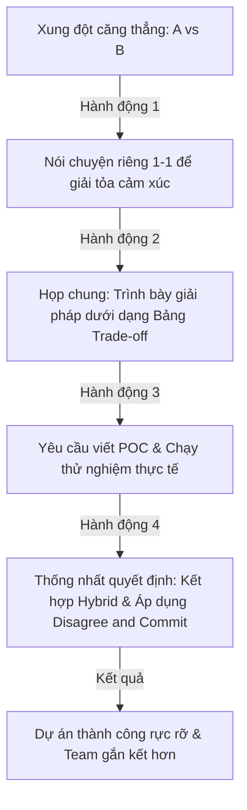

# Cách Xử Lý Xung Đột Trong Team Của Senior Engineer (Conflict Resolution in Engineering Teams)

## ⚡ Tóm tắt ngắn (30s)
* **Tư duy cốt lõi**: Xung đột (Conflict) trong một đội ngũ kỹ thuật là điều **không thể tránh khỏi và thậm chí là lành mạnh** nếu nó bắt nguồn từ mong muốn tối ưu hóa hệ thống (Task Conflict). Trách nhiệm của một Senior Engineer/Tech Lead không phải là dập tắt hay né tránh xung đột, mà là **chuyển hóa xung đột cá nhân (Relationship Conflict) thành cuộc thảo luận kỹ thuật dựa trên dữ liệu, nguyên lý kỹ thuật và giá trị kinh doanh**.
* **Quy trình Giải quyết Xung đột 4 Bước (STAR Conflict Resolution)**:
  1. *Hạ nhiệt cảm xúc (De-escalate)*: Tách biệt con người ra khỏi vấn đề kỹ thuật, tạo không gian an toàn để các bên bày tỏ quan điểm.
  2. *Làm rõ góc nhìn bằng Dữ liệu (Clarify with Data)*: Yêu cầu các bên định lượng các tuyên bố chung chung bằng các chỉ số đo lường, benchmark hoặc POC thực tế.
  3. *Đặt hệ quy chiếu chung (Align on Goals)*: Định vị xung đột dưới lăng kính của khách hàng, deadline dự án và khả năng vận hành của hệ thống.
  4. *Cam kết & Ownership (Commit & Own)*: Ra quyết định dựa trên sự đồng thuận hoặc quyền biểu quyết của Tech Lead, áp dụng tinh thần *"Disagree and Commit"* để toàn đội tiến về phía trước.

---

## 🔍 Kịch bản thực chiến (STAR Framework)

### 1. Situation (Bối cảnh)
Trong một dự án tái cấu trúc (refactoring) hệ thống Core Invoice của công ty, hai kỹ sư giỏi nhất của tôi (một Senior Java Dev có tư duy truyền thống, đề cao sự ổn định và một Senior Dev trẻ tuổi đầy nhiệt huyết, đề cao công nghệ hiện đại) rơi vào trạng thái **xung đột kỹ thuật cực kỳ căng thẳng**. 
Xung đột xoay quanh việc lựa chọn kiến trúc lưu trữ và xử lý thanh toán:
- Kỹ sư A kiên quyết chọn giải pháp lưu trữ trạng thái đồng bộ hoàn toàn vào cơ sở dữ liệu quan hệ (PostgreSQL) thông qua cơ chế khóa nghiêm ngặt (Pessimistic Locking) để đảm bảo tính nhất quán dữ liệu tối đa.
- Kỹ sư B kiên quyết bảo vệ giải pháp chuyển dịch sang kiến trúc hướng sự kiện (Event-Driven Architecture) sử dụng Apache Kafka làm hàng đợi tin nhắn và xử lý trạng thái bất đồng bộ (Eventual Consistency) để tối ưu throughput gấp 5 lần.
Cả hai bắt đầu tranh cãi gay gắt trong các buổi họp, chỉ trích giải pháp của nhau là *"lạc hậu, chậm chạp"* hoặc *"mạo hiểm, thiếu an toàn"*, khiến tiến độ dự án bị đình trệ 2 tuần và không khí trong team cực kỳ nặng nề.

### 2. Task (Thử thách)
Với tư cách là Tech Lead, tôi phải can thiệp để:
1. Giải quyết triệt để sự rạn nứt mối quan hệ giữa hai kỹ sư cột trụ, ngăn chặn xung đột lan rộng ra toàn bộ team.
2. Đưa ra quyết định kỹ thuật tối ưu nhất cho bài toán thanh toán hóa đơn của công ty mà cả hai bên đều đồng thuận thực hiện với tính sở hữu (ownership) cao.

### 3. Action (Hành động)
Tôi đã áp dụng quy trình chuyển hóa xung đột kỹ thuật bài bản qua các hành động cụ thể:

* **Bước 1: Hạ nhiệt cảm xúc bằng các buổi nói chuyện riêng (1-1 De-escalation)**
  Tôi tổ chức các buổi gặp riêng 1-1 với từng kỹ sư để lắng nghe toàn bộ bức xúc của họ. Tôi giúp họ nhận thức rõ ràng: *"Tôi đánh giá rất cao sự tận tâm của bạn với hệ thống. Sự bất đồng này chứng minh cả hai đều muốn làm điều tốt nhất cho dự án. Tuy nhiên, chúng ta cần thảo luận dựa trên dữ liệu kỹ thuật, tuyệt đối không công kích cá nhân."*

* **Bước 2: Chuẩn hóa cuộc thảo luận bằng Tài liệu So sánh (Structured Framing)**
  Tôi yêu cầu cả hai kỹ sư cùng ngồi lại, chuẩn bị một tài liệu so sánh chung (**Technical RFC - Request for Comments**) với cấu trúc chuẩn chỉ, không dùng các tính từ cảm tính (như "tồi tệ", "quá tuyệt vời") mà tập trung vào:
  - Khả năng chịu tải (Throughput) mục tiêu của dự án là bao nhiêu?
  - Độ chính xác dữ liệu (Consistency) yêu cầu đối với nghiệp vụ hóa đơn tài chính ở mức độ nào?
  - Chi phí vận hành, giám sát (Observability) và khả năng debug lỗi của mỗi giải pháp ra sao?

* **Bước 3: Thực chứng bằng Thử nghiệm nhỏ (Proof of Concept - POC)**
  Khi nhận thấy tài liệu vẫn chưa đủ để ngã ngũ, tôi giao nhiệm vụ cụ thể cho cả hai:
  - Cho phép Kỹ sư B có 3 ngày để dựng một POC chạy thử nghiệm luồng bất đồng bộ với Kafka, đo đạc tỷ lệ mất mát gói tin hoặc xử lý out-of-order dưới tải giả lập.
  - Cho phép Kỹ sư A tối ưu hóa index PostgreSQL và chạy benchmark giải pháp đồng bộ xem giới hạn throughput thực tế đạt được bao nhiêu.

* **Bước 4: Ra quyết định Hybrid & Đồng thuận tiến lên (Disagree and Commit)**
  Sau khi có dữ liệu benchmark thực tế, tôi tổ chức cuộc họp quyết định:
  - **Kết quả thực tế**: Luồng Event-Driven qua Kafka có throughput cực cao nhưng gặp rủi ro lớn về tính nhất quán khi xử lý hóa đơn hoàn tiền (refund), đòi hỏi viết code xử lý bù trừ (Saga Compensation) cực kỳ phức tạp. Trong khi đó, luồng đồng bộ PostgreSQL chạy ổn định tuyệt đối nhưng nghẽn cổ chai ở luồng ghi dữ liệu lịch sử (audit log).
  - **Quyết định cuối cùng**: Tôi đưa ra giải pháp lai (**Hybrid Architecture**): *Toàn bộ luồng trừ tiền và cập nhật trạng thái hóa đơn bắt buộc chạy đồng bộ trên PostgreSQL để bảo toàn tính nhất quán dữ liệu (ACID). Toàn bộ luồng ghi lịch sử audit log, gửi email thông báo, và tích hợp sang đối tác bên thứ ba sẽ chạy bất đồng bộ qua Kafka.*
  - Cả hai kỹ sư đều nhìn thấy dữ liệu khách quan và sự hợp lý trong quyết định lai này. Tôi tuyên bố: *"Đây là giải pháp tối ưu nhất cho doanh nghiệp lúc này. Chúng ta thống nhất quyết định tại đây. Kể từ giờ phút này, chúng ta cùng đồng lòng làm chủ và chịu trách nhiệm cho kiến trúc này."*

### 4. Result (Kết quả)
* **Giải quyết xung đột triệt để**: Hai kỹ sư vui vẻ bắt tay nhau hợp tác, Kỹ sư B chịu trách nhiệm luồng Kafka, Kỹ sư A phụ trách luồng PostgreSQL. Sự rạn nứt hoàn toàn biến mất.
* **Hệ thống vận hành xuất sắc**: Kiến trúc Hybrid giúp hệ thống chịu tải tăng gấp **6 lần** so với trước đó, trong khi độ chính xác của giao dịch tài chính vẫn được bảo đảm **100%**, không xảy ra bất kỳ lỗi sai lệch số dư nào trên Production.
* **Văn hóa đổi mới lành mạnh**: Quy trình giải quyết xung đột bằng POC và Dữ liệu khách quan trở thành văn hóa tiêu chuẩn của team khi có bất đồng ý kiến sau này.

---

## 💡 Nguyên tắc Senior & Bài học đắt giá

1. **"Disagree and Commit" (Không đồng ý nhưng vẫn cam kết)**: Đây là nguyên tắc vàng của Amazon mà mọi Senior bắt buộc phải hiểu. Trong kỹ thuật, không có giải pháp nào hoàn hảo 100%, mỗi quyết định đều là sự cân bằng (trade-off). Một khi cuộc thảo luận đã kết thúc và quyết định đã được Tech Lead đưa ra, toàn bộ team - kể cả những người phản đối trước đó - phải cam kết cống hiến hết sức mình để thực thi giải pháp được chọn thành công. Tuyệt đối không được giữ tư thế phá hoại ngầm hay chờ đợi hệ thống lỗi để nói *"Tôi đã bảo rồi mà"*.
2. **Tách biệt Bản ngã khỏi Dòng code (Egoless Engineering)**: Senior phải làm gương cho team trong việc không để bản ngã cá nhân (Ego) can thiệp vào các quyết định kỹ thuật. Code bạn viết ra không phải là con người bạn. Khi ai đó chỉ trích giải pháp của bạn, họ đang phân tích dòng code, không phải tấn công năng lực hay nhân phẩm của bạn.
3. **Quy tắc "Nguyên lý 3 Tùy chọn" (Rule of Three Options)**: Khi xảy ra xung đột gay gắt giữa hai phương án đối lập A và B, Senior khôn ngoan luôn cố gắng tìm kiếm phương án thứ 3 (Option C - Hybrid hoặc một giải pháp hoàn toàn khác). Thường thì giải pháp thứ 3 này sẽ là nơi dung hòa tốt nhất các ưu điểm và giảm thiểu nhược điểm của hai phương án ban đầu.

---

## 📊 So sánh phương án quyết định (Trade-offs)

| Phong cách xử lý xung đột | Ưu điểm (Pros) | Nhược điểm (Cons) | Use Case Phù hợp |
| :--- | :--- | :--- | :--- |
| **Áp đặt Mệnh lệnh (Authority-driven / Top-down)** | - Ra quyết định cực nhanh, dập tắt tranh cãi lập tức. - Đảm bảo dự án không bị trễ hạn do cãi vã. | - Triệt tiêu động lực đổi mới sáng tạo của dev. - Gây ức chế ngầm trong team, làm giảm tính sở hữu (ownership) khi thực thi. | Khi thời gian khẩn cấp (sự cố sản xuất đang xảy ra), hoặc khi trình độ của dev dưới quyền còn quá non nớt. |
| **Thảo luận Dựa trên Dữ liệu & POC (Data-driven consensus)** | - Đưa ra quyết định **chính xác, khách quan nhất** dựa trên thực tế kỹ thuật. - Dev hoàn toàn thuyết phục và tự nguyện cam kết làm việc chung. | - Tốn nhiều thời gian và nguồn lực để viết code POC và chạy benchmark thử nghiệm. | Các quyết định kiến trúc cốt lõi, mang tính chất sống còn dài hạn đối với hệ thống của doanh nghiệp. |
| **Né tránh / Dĩ hòa vi quý (Avoidance / Compromise)** | - Giữ được hòa khí bề mặt trong thời gian ngắn. - Tránh được sự đối đầu trực tiếp gay gắt. | - Tích tụ **nợ kỹ thuật âm thầm** do chọn giải pháp nửa vời. - Xung đột ngầm sẽ bùng nổ dữ dội hơn trong tương lai. | **Tuyệt đối không sử dụng** đối với các quyết định kỹ thuật quan trọng của một Senior Engineer. |

---

## ⚠️ Common Gotchas (Câu hỏi phỏng vấn đào sâu)

### 1. Làm thế nào để bạn xử lý một xung đột phi kỹ thuật (xung đột cá nhân - Relationship Conflict) xảy ra giữa một kỹ sư Junior và một kỹ sư Senior khác trong team, khi Senior liên tục có những lời lẽ hạ thấp hoặc thiếu tôn trọng năng lực của Junior trong các buổi review code?
* **Trả lời**: Đây là tình huống thử thách năng lực lãnh đạo con người (People Leadership) và bảo vệ văn hóa tâm lý an toàn (Psychological Safety) của team:
  * **Hành động quyết đoán của Senior/Tech Lead**:
    1. **Bảo vệ Junior ngay lập tức nhưng tinh tế**: Trong buổi họp chung, nếu Senior có lời lẽ không chuẩn mực, tôi sẽ ngắt lời một cách lịch sự: *"Hãy tập trung phân tích dòng code xử lý lỗi ở đây, chúng ta không đánh giá năng lực cá nhân của nhau."*
    2. **Làm việc riêng với Senior (Crucial Conversation)**: Tôi sẽ tổ chức một buổi gặp riêng 1-1 với kỹ sư Senior đó. Tôi sẽ nói rõ ranh giới văn hóa: *"Năng lực kỹ thuật của bạn rất giỏi, nhưng một kỹ sư Senior thực thụ được đo lường bằng việc bạn nâng tầm người khác lên như thế nào (mentorship). Cách bạn giao tiếp đang làm Junior sợ hãi, phá hủy sự tự tin của họ và khiến họ che giấu lỗi thay vì học hỏi. Điều này cực kỳ nguy hiểm cho chất lượng code của toàn team. Tôi yêu cầu bạn thay đổi cách giao tiếp trong các buổi review sau."*
    3. **Hỗ trợ Junior**: Gặp riêng Junior để trấn an, khuyến khích họ đặt câu hỏi và giải thích rõ ràng rằng sai sót khi mới làm quen hệ thống là hoàn toàn bình thường, và chỉ ra hướng cải thiện cụ thể.

### 2. Khi bạn đề xuất một kiến trúc mới mà bạn tin chắc 100% là đúng cho tương lai dài hạn của dự án, nhưng toàn bộ dàn Senior và Tech Lead của các team khác đều phản đối quyết liệt vì họ ngại thay đổi và sợ rủi ro. Bạn sẽ làm thế nào để thuyết phục họ?
* **Trả lời**: Đây là nghệ thuật tạo sức ảnh hưởng không cần quyền lực danh nghĩa (Influencing without Authority):
  * **Chiến lược thuyết phục nhiều tầng**:
    1. **Không đối đầu trực tiếp diện rộng**: Tránh việc tranh luận nảy lửa trong một cuộc họp lớn đông người, vì lúc đó bản ngã của họ sẽ trỗi dậy để bảo vệ ý kiến trước đám đông.
    2. **Thuyết phục từng người một (Lobbying 1-1)**: Tôi sẽ tìm gặp riêng từng Senior có tầm ảnh hưởng lớn nhất trong tổ chức. Tôi sẽ lắng nghe mối quan ngại thực sự của họ (thường là sợ hệ thống sập gây mất uptime, sợ tốn thời gian maintain code mới). Tôi sẽ giải thích giải pháp của mình thiết kế riêng để giải quyết đúng nỗi sợ đó của họ.
    3. **Chiến lược "Tằm ăn dâu" (Incremental Rollout)**: Thay vì yêu cầu chuyển dịch toàn bộ hệ thống lớn ngay lập tức, tôi sẽ đề xuất: *"Hãy cho tôi thử nghiệm kiến trúc mới này trên một dịch vụ phụ ít rủi ro nhất (ví dụ: service gửi notification). Tôi cam kết tự chịu trách nhiệm nếu xảy ra sự cố. Sau 1 tháng, chúng ta sẽ cùng nhìn vào chỉ số uptime và tài nguyên tiêu hao để đánh giá tiếp."*
    4. **Chứng minh bằng số liệu trực quan**: Khi dịch vụ phụ chạy thành công với số liệu benchmark giảm 50% tài nguyên CPU và hoạt động trơn tru, sức mạnh của thực tế sẽ tự động thuyết phục toàn bộ những người phản đối còn lại mà không cần cãi vã thêm.
