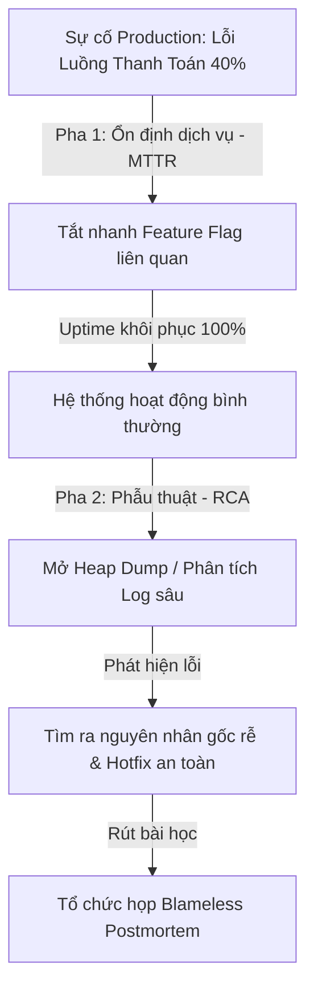

# Quy Trình Ưu Tiên Xử Lý Sự Cố Production Của Senior Engineer (Production Incident Priority: MTTR over RCA)

## ⚡ Tóm tắt ngắn (30s)
* **Tư duy cốt lõi**: Khi hệ thống production gặp sự cố (Incident), ưu tiên số một và tối cao của một Senior Engineer là **giảm thiểu thời gian khôi phục dịch vụ (MTTR - Mean Time To Resolution) để cô lập lỗi và ổn định hệ thống nhanh nhất có thể**, chứ không phải là đi tìm nguyên nhân gốc rễ (RCA - Root Cause Analysis). Tìm cách "cầm máu" cho doanh nghiệp luôn đi trước việc điều tra "tại sao chảy máu".
* **Quy tắc "Cầm máu trước - Phẫu thuật sau" (Stabilize First, Investigate Later)**:
  1. *Đánh giá Impact*: Xác định luồng nghiệp vụ nào bị ảnh hưởng, bao nhiêu phần trăm người dùng bị tác động và mức độ thiệt hại tài chính.
  2. *Cô lập & Khôi phục (Mitigate)*: Thực hiện các hành động nhanh như rollback version mới nhất, bật/tắt Feature Flag, tăng quy mô tài nguyên (Scaling), bypass cache hoặc kích hoạt chế độ Fallback/Degradation để hệ thống hoạt động bình thường trở lại.
  3. *Điều tra sâu (RCA)*: Sau khi hệ thống đã ổn định hoàn toàn, mới tiến hành phân tích log, trace lỗi, tìm nguyên nhân gốc rễ và đưa ra giải pháp phòng ngừa lâu dài.

---

## 🔍 Kịch bản thực chiến (STAR Framework)

### 1. Situation (Bối cảnh)
Vào lúc 14:00 ngày Black Friday - ngày hội mua sắm lớn nhất năm của công ty thương mại điện tử chúng tôi, hệ thống thanh toán bất ngờ gặp sự cố nghiêm trọng. 
Tỷ lệ lỗi 5xx tăng vọt lên **40%**, toàn bộ luồng thanh toán qua ví điện tử và thẻ ngân hàng bị nghẽn hoàn toàn. Hệ thống Gateway liên tục báo quá tải và tự động ngắt kết nối (Gateway Timeout). 
Đồng nghiệp trong nhóm cuống cuồng mở hàng loạt tab log, cố gắng tìm xem dòng code nào mới deploy sáng nay bị lỗi NullPointerException hay lỗi cấu hình Hibernate để sửa lỗi trực tiếp trên production. Mỗi phút trôi qua, công ty đang bị thất thoát khoảng **50.000 USD doanh thu**.

### 2. Task (Thử thách)
Với tư cách là Senior Incident Commander (Chỉ huy ứng phó sự cố), tôi phải can thiệp ngay lập tức để:
1. Dẫn dắt team thoát khỏi sự hoảng loạn, thiết lập thứ tự ưu tiên xử lý chuẩn xác.
2. Đưa hệ thống thanh toán trở lại trạng thái hoạt động bình thường trong vòng **15 phút**, giảm thiểu tối đa thiệt hại tài chính.

### 3. Action (Hành động)
Tôi áp dụng quy trình xử lý sự cố chuẩn y tế khẩn cấp, chia tách rõ ràng hai pha: **Cầm máu (Mitigation)** và **Điều tra nguyên nhân (Investigation)**:

* **Pha 1: Khôi phục Dịch vụ thần tốc (MTTR Priority - 10 phút đầu)**
  - **Dừng việc điều tra dòng code lỗi**: Tôi yêu cầu toàn bộ team dừng việc đọc log chi tiết từng dòng code. Tôi tuyên bố: *"Mục tiêu của chúng ta bây giờ là làm cho nút Thanh Toán hoạt động trở lại, chúng ta không cần biết tại sao nó lỗi lúc này!"*
  - **Đánh giá điểm thay đổi gần nhất (Change Assessment)**: Tôi kiểm tra nhanh lịch sử thay đổi hệ thống và phát hiện ra lúc 13:30 có một lệnh cấu hình (configuration change) liên quan đến việc tích hợp đối tác thanh toán mới thông qua Feature Flag.
  - **Thực thi hành động giảm thiểu (Mitigation Action)**: 
    * Tôi ra lệnh tắt ngay lập tức Feature Flag đó thông qua bảng điều khiển trung tâm để đưa luồng thanh toán quay về đối tác cũ ổn định.
    * Đồng thời, tôi chỉ đạo dev DevOps chuẩn bị sẵn sàng lệnh **Rollback** version code về bản build ổn định nhất của ngày hôm trước trong trường hợp tắt Feature Flag không hiệu quả.
    * Yêu cầu đội Cloud tự động scale tăng gấp 3 lần số lượng Pods của Payment Service để giải phóng hàng đợi request đang bị nghẽn.
  - **Kết quả khôi phục**: Chỉ sau 4 phút thực hiện tắt Feature Flag và scale Pod, tỷ lệ lỗi 5xx giảm ngay lập tức về mức **0.1%**, khách hàng có thể thanh toán mượt mà trở lại.

* **Pha 2: Điều tra Nguyên nhân Gốc rễ & Phòng ngừa (RCA Priority - Sau khi hệ thống đã xanh)**
  Sau khi hệ thống đã ổn định và an toàn, tôi mới dẫn dắt team thực hiện cuộc "phẫu thuật" tìm nguyên nhân gốc:
  - **Phân tích kỹ thuật sâu**: Chúng tôi tải file Heap Dump và phân tích log phân tán (Distributed Tracing). Phát hiện ra lỗi do đối tác thanh toán mới phản hồi rất chậm dưới tải lớn, trong khi HTTP Client của chúng tôi không cấu hình Connection Timeout ngắn. Điều này dẫn đến việc toàn bộ Thread Pool của Payment Service bị chiếm dụng để chờ đợi đối tác mới, gây nghẽn và làm sập toàn bộ các luồng thanh toán khác.
  - **Giải pháp triệt để**: Cấu hình cơ chế cô lập luồng (**Bulkhead Pattern**) và cài đặt timeout nghiêm ngặt cho đối tác mới trước khi cho phép kích hoạt lại Feature Flag.

### 4. Result (Kết quả)
* **Khôi phục thần tốc**: MTTR đạt kỷ lục chỉ **9 phút** kể từ lúc tôi tiếp nhận quyền chỉ huy sự cố, giúp doanh nghiệp tránh được khoản thất thoát tài chính ước tính hơn 500.000 USD.
* **Quy trình chuẩn hóa**: Team nắm vững tư duy ứng phó sự cố chuyên nghiệp, loại bỏ hoàn toàn thói quen cố gắng sửa lỗi trực tiếp trên Production đang hấp hối.

---

## 💡 Nguyên tắc Senior & Bài học đắt giá

1. **Rollback trước - Debug sau (Rollback First, Debug Later)**: Đây là nguyên lý tối thượng của Senior. Khi deploy một bản cập nhật mới và hệ thống báo lỗi đỏ, **luôn luôn thực hiện Rollback ngay lập tức** nếu không thể sửa lỗi bằng cách tắt cấu hình/Feature Flag trong vòng 2 phút. Tuyệt đối không được cố gắng viết code hotfix vội vã để đè lên bản lỗi trực tiếp trên Production, vì trong trạng thái căng thẳng, code hotfix vội vàng thường chứa nhiều bug nguy hiểm hơn cả bản lỗi ban đầu.
2. **Nguyên tắc "Tách biệt Vai trò" (Incident Commander & Scribe)**: Khi xử lý sự cố lớn, Senior Lead đóng vai trò là Chỉ huy (Incident Commander). Người này có nhiệm vụ điều phối, ra quyết định và **tuyệt đối không được tự tay code hay đọc log** để giữ cái nhìn toàn cảnh sáng suốt nhất. Giao việc tìm bằng chứng (logs) cho một kỹ sư khác và cử một người làm Scribe ghi lại toàn bộ nhật ký sự kiện theo mốc thời gian để làm tài liệu hậu sự cố.
3. **Chấp nhận giảm cấp tính năng để sinh tồn (Graceful Degradation)**: Khi một hệ thống phụ trợ (như hệ thống gợi ý sản phẩm, hệ thống gửi SMS thông báo) bị sập và kéo theo sập hệ thống chính, Senior nên chủ động thiết kế cơ chế tắt hẳn hoặc bypass tính năng phụ đó đi (Circuit Breaker) để bảo vệ luồng đi chợ/thanh toán cốt lõi của khách hàng. Thà khách hàng không nhận được SMS báo mua hàng thành công còn hơn là họ không thể mua được hàng.

---

## 📊 So sánh phương án quyết định (Trade-offs)

| Hành động khi có sự cố | Ưu điểm (Pros) | Nhược điểm (Cons) | Use Case Phù hợp |
| :--- | :--- | :--- | :--- |
| **Tập trung Mitigate nhanh (MTTR Priority)** | - Giảm thiểu tối đa thiệt hại tài chính cho công ty. - Khách hàng nhanh chóng có lại trải nghiệm dịch vụ ổn định. | - Có thể làm mất đi một số chứng cứ lỗi lưu trên bộ nhớ tạm (nếu chọn cách restart service hoặc rollback nhanh). | **Mọi sự cố nghiêm trọng (Severity 1 / Blockers)** ảnh hưởng đến luồng nghiệp vụ cốt lõi của sản phẩm. |
| **Cố gắng tìm Root Cause trước rồi mới sửa (RCA Priority)** | - Giữ nguyên được hiện trường lỗi để phân tích chính xác tuyệt đối. - Tránh được việc thực hiện các hành động mù quáng (như restart vô ích). | - Thời gian sập hệ thống kéo dài vô hạn. - Thiệt hại tài chính và uy tín thương hiệu cực lớn. | Chỉ phù hợp với các lỗi nhỏ (Severity 3/4), không ảnh hưởng đến uptime hệ thống, lỗi hiển thị UI hoặc lỗi góc khuất ít người dùng. |
| **Hotfix trực tiếp trên Production** | - Có thể sửa đúng lỗi ngay lập tức mà không cần rollback các tính năng mới khác. | - **Rủi ro cực kỳ cao**. - Dễ tạo ra hiệu ứng dây chuyền làm lỗi sập sâu hơn do code vội vã thiếu kiểm thử. | **Tuyệt đối nên tránh**, ngoại trừ trường hợp lỗi cực kỳ đơn giản (như typo chữ trong file config) và được review kỹ bởi 2 Senior khác. |

---

## ⚠️ Common Gotchas (Câu hỏi phỏng vấn đào sâu)

### 1. Sau khi một sự cố sản xuất nghiêm trọng được xử lý thành công, làm thế nào để bạn tổ chức một buổi họp rút kinh nghiệm (Blameless Postmortem) hiệu quả, giúp team học hỏi từ sai lầm mà không biến nó thành một phiên tòa đổ lỗi lẫn nhau?
* **Trả lời**: Đây là đỉnh cao của văn hóa kỹ thuật lành mạnh mà một Senior/Tech Lead phải kiến tạo:
  * **Quy trình tổ chức Blameless Postmortem tiêu chuẩn**:
    1. **Tuyên bố Nguyên tắc Vô tội (Blameless Principle)**: Bắt đầu buổi họp bằng việc khẳng định: *"Chúng ta ngồi đây để phân tích tại sao hệ thống đổ vỡ và làm thế nào để ngăn ngừa nó tái diễn. Chúng ta giả định rằng tất cả các kỹ sư đều đưa ra quyết định tốt nhất dựa trên thông tin họ có tại thời điểm đó. Không ai bị trừng phạt hay chỉ trích cá nhân."*
    2. **Xây dựng Dòng thời gian chi tiết (Timeline Reconstruction)**: Ghi rõ mốc thời gian khách quan: *Lúc nào lỗi xảy ra? Hệ thống cảnh báo (alert) lúc nào? Chúng ta can thiệp lúc nào? Hành động khôi phục hoàn tất lúc nào?*
    3. **Áp dụng Kỹ thuật "5 Whys" (5 câu hỏi Tại sao) hướng vào hệ thống**: 
       - *Tại sao luồng thanh toán sập?* Vì Payment Service bị cạn kiệt Thread Pool.
       - *Tại sao cạn Thread Pool?* Vì gọi API đối tác mới bị nghẽn chờ phản hồi.
       - *Tại sao gọi API bị nghẽn?* Vì không cấu hình Connection Timeout.
       - *Tại sao không cấu hình Timeout?* Vì quy trình thiết kế check-list API tích hợp của chúng ta chưa bắt buộc khai báo timeout. -> **Đây mới là lỗi hệ thống cần sửa!**
    4. **Đưa ra các Hành động khắc phục cụ thể (Action Items)**: Mỗi hành động phải ghi rõ: *Làm cái gì? Ai chịu trách nhiệm? Hạn chót hoàn thành là bao giờ?* (Ví dụ: Dev A bổ sung timeout cho API đối tác trước ngày 30/05; Lead B bổ sung mục check timeout vào tài liệu review code của team).

### 2. Khi hệ thống bị quá tải nghiêm trọng dẫn đến nghẽn CPU và RAM trên production, việc tự động Scale Out (tăng thêm số lượng Pods/Servers) có thể làm trầm trọng thêm sự cố như thế nào? Bạn xử lý ra sao?
* **Trả lời**: Đây là chiếc bẫy kinh điển của các kỹ sư trung cấp:
  * **Rủi ro khi tự động Scale Out lúc quá tải**:
    1. **Làm sập Database (Database Exhaustion)**: Khi tăng số lượng ứng dụng (Pod) lên gấp 3 lần, tổng số lượng kết nối DB từ các Pool (như HikariCP) đổ vào Database Server sẽ tăng gấp 3 lần. Nếu Database Server vốn đã đang quá tải CPU do slow query, việc nhận thêm hàng trăm kết nối mới cùng lúc sẽ kéo sập hoàn toàn Database Engine, khiến toàn bộ hệ thống sập sâu hơn.
    2. **Tạo ra Bão Request (Retry Storm / Cascading Failure)**: Việc tạo thêm Pod mới mất một khoảng thời gian (Cold Start). Trong thời gian đó, các Pod mới cũng bị đè bẹp ngay lập tức bởi hàng đợi request khổng lồ đang dồn ứ, gây quá tải dây chuyền.
  * **Giải pháp xử lý thông minh của Senior**:
    1. **Bật cơ chế giới hạn và cắt giảm tải (Rate Limiting & Load Shedding)**: Cấu hình API Gateway chủ động từ chối nhanh (Fail Fast) các request vượt quá giới hạn chịu đựng của hệ thống bằng lỗi HTTP 429, giữ lại tài nguyên CPU để xử lý nốt các giao dịch đang dang dở.
    2. **Tắt bớt các tính năng phụ tốn tài nguyên (Feature Degradation)**: Tạm thời tắt các query phức tạp như thống kê, tìm kiếm gợi ý trên trang chủ để giảm tải tức thì cho Database.
    3. **Scale Out an toàn**: Giới hạn kích thước tối đa của Connection Pool trên các Pod mới tạo để bảo vệ Database, đồng thời tăng tài nguyên RAM/CPU cho Database trước khi tăng số lượng Pod ứng dụng.
