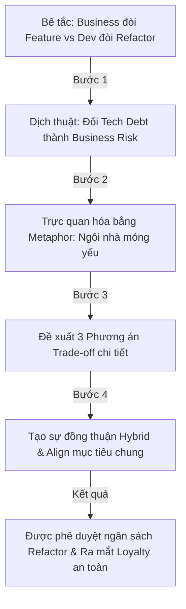

# Nghệ Thuật Truyền Thông Kỹ Thuật Cho Stakeholders Của Senior Engineer (Communicating Technical Trade-offs to Non-technical Stakeholders)

## ⚡ Tóm tắt ngắn (30s)
* **Tư duy cốt lõi**: Non-technical stakeholders (như Product Owners, Business Directors, CEO) không quan tâm đến các thuật ngữ kỹ thuật trừu tượng như "Clean Architecture", "Polymorphism", "Garbage Collection" hay "Database Normalization". Đối với họ, công nghệ là **công cụ để tạo ra giá trị kinh doanh**. Senior Engineer xuất sắc là người dịch chuyển được ngôn ngữ kỹ thuật (Technical Syntax) thành **ngôn ngữ kinh doanh (Business Semantics)**: Doanh thu, Chi phí, Tốc độ đưa ra thị trường (Time to Market), Rủi ro vận hành và Trải nghiệm khách hàng.
* **Quy tắc "3 Không - 3 Nên" (Business-centric Communication)**:
  - *Không*: Không dùng thuật ngữ kỹ thuật (Jargon); Không phàn nàn chung chung về "code xấu"; Không đưa ra duy nhất một giải pháp áp đặt.
  - *Nên*: Dịch chuyển "nợ kỹ thuật" (Tech Debt) thành rủi ro tài chính hoặc giới hạn kinh doanh; Đưa ra tối thiểu 3 phương án lựa chọn kèm theo phân tích Trade-off rõ ràng; Sử dụng các phép so sánh (Metaphors) gần gũi với đời sống thực tế để giải thích cơ chế phức tạp.

---

## 🔍 Kịch bản thực chiến (STAR Framework)

### 1. Situation (Bối cảnh)
Hệ thống lõi quản lý thông tin khách hàng (CRM) của công ty chúng tôi được xây dựng từ 6 năm trước. Sau nhiều năm chắp vá tính năng, mã nguồn của hệ thống đã rơi vào trạng thái phình to cực độ và cơ sở dữ liệu bị phân mảnh nặng nề. 
Đội ngũ phát triển mất trung bình **3 tuần chỉ để thêm một trường dữ liệu đơn giản** vào hệ thống, và tỷ lệ xuất hiện bug mới mỗi khi deploy tính năng mới lên tới **25%**. 
Là Tech Lead, tôi nhận thấy hệ thống đã chạm giới hạn chịu đựng và bắt buộc phải dành ra **2 tháng đóng băng toàn bộ tính năng mới để tiến hành tái cấu trúc (Refactoring)** toàn bộ module lõi. 
Tuy nhiên, Giám đốc Kinh doanh (Business Director - người nắm ngân sách và mục tiêu doanh số quý) phản đối quyết liệt: *"Tôi không quan tâm code đẹp hay xấu. Chúng ta đang cần ra mắt tính năng Loyalty Points trong vòng 1 tháng tới để cạnh tranh trực tiếp với đối thủ. Biến mất 2 tháng để làm sạch code là điều kiên quyết không thể chấp nhận!"*

### 2. Task (Thử thách)
Tôi phải thuyết phục được Giám đốc Kinh doanh đồng thuận dành ra nguồn lực quý giá để giải quyết nợ kỹ thuật của hệ thống, cân bằng giữa mục tiêu kinh doanh ngắn hạn (ra mắt tính năng Loyalty) và sự ổn định, linh hoạt dài hạn của hệ thống.

### 3. Action (Hành động)
Tôi đã xây dựng chiến lược truyền thông phi kỹ thuật bài bản qua các bước hành động cụ thể:

* **Bước 1: "Dịch thuật" nợ kỹ thuật thành rủi ro tài chính & vận hành**
  Tôi hoàn toàn loại bỏ các slide thuyết trình nói về Spring JPA, Clean Code hay N+1 query. Tôi lập một bảng tính toán chuyển hóa tác hại của code xấu thành con số tài chính:
  - *"Nếu tiếp tục giữ hệ thống cũ, để làm tính năng Loyalty, chúng ta sẽ tốn **45 ngày công** thay vì **10 ngày công**. Chi phí nhân sự tăng thêm là **15.000 USD** chỉ cho một tính năng."*
  - *"Tỷ lệ lỗi 25% có nghĩa là cứ 4 khách hàng mua hàng sẽ có 1 người gặp lỗi thanh toán. Ước tính chúng ta sẽ mất **5% tổng doanh thu** giao dịch mỗi tháng do khách hàng bỏ giỏ hàng vì lỗi hệ thống sập."*

* **Bước 2: Sử dụng phép so sánh thực tế (Metaphor)**
  Tôi giải thích trạng thái hệ thống cho Giám đốc Kinh doanh bằng hình ảnh trực quan:
  * *"Hãy tưởng tượng hệ thống hiện tại của chúng ta như một ngôi nhà cấp 4 được xây trên nền móng yếu. Qua nhiều năm, chúng ta liên tục chồng thêm tầng 2, tầng 3 (các tính năng mới). Bây giờ, anh muốn xây thêm một hồ bơi lớn trên sân thượng (tính năng Loyalty phức tạp). Nếu chúng ta cố xây ngay lập tức mà không dành thời gian gia cố nền móng (Refactoring), toàn bộ ngôi nhà có nguy cơ đổ sập hoàn toàn bất cứ lúc nào dưới sức nặng của hồ bơi."*

* **Bước 3: Đưa ra 3 Phương án lựa chọn rõ ràng (The Rule of Three Options)**
  Tôi không đưa ra tối hậu thư *"phải refactor mới làm tiếp được"*. Tôi đề xuất 3 giải pháp chi tiết để Giám đốc Kinh doanh tự đưa ra quyết định dựa trên bài toán Trade-off:
  - **Phương án 1 (Chạy đua nóng - Hype Path)**: Làm ngay tính năng Loyalty trên hệ thống cũ.
    * *Trade-off*: Ra mắt đúng hạn 1 tháng, nhưng rủi ro sập hệ thống thanh toán cực cao (50%) và sau đó tốc độ phát triển các tính năng tiếp theo sẽ giảm thêm 2 lần nữa.
  - **Phương án 2 (Đóng băng hoàn toàn - Clean Path)**: Dành trọn 2 tháng chỉ để refactor, hoãn vô thời hạn tính năng Loyalty.
    * *Trade-off*: Hệ thống chạy siêu mượt mà, nhưng công ty mất đi cơ hội kinh doanh và lợi thế cạnh tranh trong mùa mua sắm sắp tới.
  - **Phương án 3 (Kiến trúc Song hành - Hybrid Path - Khuyên dùng)**: Chia đôi lộ trình.
    * *Trade-off*: Trong 1 tháng đầu, chúng tôi sẽ xây dựng tính năng Loyalty dưới dạng một module độc lập nhỏ bên ngoài (Microservice tách biệt) để không đụng vào đống code cũ nát của lõi, giúp kịp thời gian ra mắt. Ngay sau đó, trong tháng thứ 2, chúng tôi sẽ tiến hành refactor module lõi cũ và tích hợp sạch sẽ module Loyalty vào sau.

### 4. Result (Kết quả)
* **Nhận được sự phê duyệt lập tức**: Giám đốc Kinh doanh hoàn toàn bị thuyết phục bởi Phương án 3 (Hybrid Path). Ông phát biểu: *"Tôi hiểu rõ các rủi ro rồi. Phương án 3 rất hợp lý, vừa giúp tôi có tính năng kịp chiến dịch, vừa đảm bảo ngôi nhà của chúng ta không bị sập."*
* **Bàn giao thành công**: Tính năng Loyalty được tung ra thị trường đúng hạn, thu hút hơn 100.000 user đăng ký mới. Sau đó, quá trình refactoring lõi được thực hiện suôn sẻ trong tháng tiếp theo theo đúng kế hoạch.
* **Gắn kết mật thiết**: Mối quan hệ giữa bộ phận Tech và Business trở nên vô cùng gắn kết và thấu hiểu lẫn nhau.

---

## 💡 Nguyên tắc Senior & Bài học đắt giá

1. **Stakeholder không phải là kẻ thù của Code Đẹp (Alignment Mindset)**: Nhiều kỹ sư thường phàn nàn: *"Business không hiểu gì, họ chỉ muốn ép deadline và bắt viết code rác"*. Đây là tư duy sai lầm và thiếu trưởng thành. Business Stakeholders là người chịu trách nhiệm cho sự sống còn tài chính của công ty (nơi trả lương cho kỹ sư). Nhiệm vụ của Senior là đồng hành cùng họ, giúp họ nhìn thấy **nợ kỹ thuật thực chất là một khoản nợ tài chính có lãi suất cắt cổ (Technical Debt has compound interest)** để cùng đưa ra quyết định đầu tư đúng đắn.
2. **Quy tắc "Trình bày 3 Cột" (Problem - Business Impact - Options)**: Khi báo cáo bất kỳ vấn đề kỹ thuật nào cho sếp lớn, hãy luôn tóm tắt trong 3 ý chính:
   - *Vấn đề là gì?* (Dùng từ ngữ siêu giản lược).
   - *Nó ảnh hưởng thế nào đến túi tiền hoặc khách hàng của công ty?*
   - *Chúng ta có những lựa chọn nào để giải quyết, cái giá phải trả và lợi ích của từng lựa chọn là gì?*
3. **Thước đo của Senior không chỉ là Code**: Kỹ năng giao tiếp (Communication), thương lượng (Negotiation) và tạo sức ảnh hưởng (Influence) chiếm tới **50% sự thành công của một Senior/Lead**. Viết code giỏi đến đâu mà không thuyết phục được tổ chức đầu tư vào kiến trúc đúng thì hệ thống đó cuối cùng vẫn sẽ sụp đổ dưới sức ép của bài toán kinh doanh.

---

## 📊 So sánh phương án quyết định (Trade-offs)

| Cách tiếp cận Giao tiếp | Ưu điểm (Pros) | Nhược điểm (Cons) | Use Case Phù hợp |
| :--- | :--- | :--- | :--- |
| **Giao tiếp theo Ngữ cảnh Kinh doanh (Business-centric)** | - Stakeholders thấu hiểu sâu sắc bản chất vấn đề. - Nhận được **ngân sách và sự ủng hộ tuyệt đối** để cải tiến kỹ thuật. - Nâng cao vị thế và uy tín cá nhân của Senior. | - Đòi hỏi Senior tốn thời gian học thêm kiến thức về kinh doanh, sản phẩm và tài chính. | **Bắt buộc áp dụng** trong mọi cuộc họp báo cáo, thương lượng lộ trình kỹ thuật với Ban Giám đốc và các phòng ban khác. |
| **Giao tiếp thuần Kỹ thuật (Technical Jargon)** | - Trình bày vấn đề nhanh, không cần chuyển đổi từ ngữ. - Dễ trao đổi với các kỹ sư khác. | - Khiến stakeholders cảm thấy **bị cô lập, khó hiểu và phòng thủ**. - Đề xuất kỹ thuật thường bị bác bỏ thẳng thừng vì sếp không thấy giá trị thực tế. | Chỉ sử dụng trong các cuộc họp nội bộ sâu giữa các dev với nhau (Tech-only syncs). |
| **Im lặng & Viết code rác để kịp deadline (Passive Compliance)** | - Làm hài lòng stakeholders tức thời do bàn giao nhanh. - Tránh được mọi cuộc tranh luận căng thẳng. | - Tích tụ **nợ kỹ thuật khổng lồ nhanh chóng kéo sập hệ thống**. - Senior đánh mất lòng tự tôn nghề nghiệp và uy tín dài hạn khi hệ thống sập. | **Tuyệt đối nên tránh**, đây là biểu hiện của sự thiếu trách nhiệm kỹ thuật (Lack of Professional Ownership). |

---

## ⚠️ Common Gotchas (Câu hỏi phỏng vấn đào sâu)

### 1. Làm thế nào bạn giải thích khái niệm phức tạp về tính nhất quán dữ liệu eventual consistency (nhất quán sau) trong hệ thống hướng sự kiện (Event-Driven) cho một Product Manager phi kỹ thuật đang kiên quyết yêu cầu dữ liệu phải nhất quán ngay lập tức (Strong Consistency) trong mọi màn hình của người dùng?
* **Trả lời**: Đây là thử thách kinh điển đòi hỏi khả năng dùng Metaphor đỉnh cao:
  * **Cách giải thích trực quan**:
    - Tôi sẽ mời Product Manager uống cà phê và nói: *"Hãy tưởng tượng anh vào một quán cà phê Starbucks. Có hai cách phục vụ:*
      * **Cách 1 (Strong Consistency)**: Anh gọi đồ uống tại quầy. Người thu ngân nhận order, tự tay đi pha cà phê cho anh, rồi đưa cho anh. Trong suốt thời gian đó, hàng dài khách hàng phía sau phải đứng chờ đợi, không ai được gọi đồ tiếp. Quán chỉ phục vụ được 1 người một lúc.
      * **Cách 2 (Eventual Consistency)**: Anh gọi đồ tại quầy. Người thu ngân in hóa đơn, đưa cho anh một chiếc thẻ rung, rồi lập tức nhận order của người tiếp theo. Ở phía sau, 3 nhân viên pha chế khác nhìn vào màn hình order để làm đồ uống độc lập. Khi đồ uống của anh xong, thẻ của anh rung lên và anh ra nhận đồ.
    - Tôi sẽ chốt lại: *Nếu anh muốn màn hình hiển thị số dư ví hay lịch sử mua hàng của user phải cập nhật ngay lập tức trong 0.01 giây ở mọi nơi (Cách 1), hệ thống của chúng ta sẽ rất chậm và chỉ phục vụ được tối đa 100 người mua cùng lúc. Nếu chấp nhận việc màn hình hiển thị có độ trễ nhẹ khoảng 1-2 giây (Cách 2), hệ thống sẽ chạy cực nhanh và phục vụ được 10.000 người mua cùng lúc mà không bị sập. Với nghiệp vụ mua sắm thông thường, khách hàng hoàn toàn thoải mái với việc chờ 1 giây để thấy trạng thái đơn hàng cập nhật."*
    - Cách giải thích này giúp PM lập tức nhìn thấy bức tranh Trade-off giữa Throughput hệ thống và Trải nghiệm thời gian thực để đưa ra quyết định đúng đắn.

### 2. Khi sếp lớn (VP of Engineering hoặc CTO) yêu cầu bạn ước lượng (Estimate) thời gian hoàn thành một dự án kiến trúc phức tạp kéo dài nhiều tháng, làm thế nào bạn đưa ra một con số estimate vừa thực tế, vừa bảo vệ được team khỏi áp lực trễ hạn (Overtime), vừa làm hài lòng ban giám đốc?
* **Trả lời**: Đây là kỹ thuật quản lý kỳ vọng (Expectation Management) nâng cao:
  * **Quy trình đưa ra Estimate chuyên nghiệp**:
    1. **Không đưa ra một con số duy nhất**: Tuyệt đối không nói *"Dự án sẽ xong vào đúng ngày 15/09"*. Việc này tạo ra một cái bẫy tự sát kỹ thuật vì có quá nhiều biến số (thiếu nhân sự, đối tác chậm API, lỗi hạ tầng).
    2. **Áp dụng Kỹ thuật Ước lượng 3 Điểm (Three-point Estimating)**: Đưa ra estimate dưới dạng một dải thời gian (Range) dựa trên 3 kịch bản:
       - *Kịch bản Tốt nhất (Optimistic)*: 2 tháng (Nếu mọi việc chạy hoàn hảo không lỗi).
       - *Kịch bản Thực tế nhất (Most Likely)*: 3 tháng (Có tính đến một số ngày nghỉ phép, họp hành và sửa bug thông thường).
       - *Kịch bản Tệ nhất (Pessimistic)*: 4.5 tháng (Nếu đối tác cung cấp API chậm hoặc gặp sự cố bảo mật lớn).
    3. **Chia nhỏ và Bàn giao từng chặng (Milestone Delivery)**: Thuyết phục sếp lớn bằng cách cam kết bàn giao các mốc nhỏ: *"Chúng tôi không bắt anh chờ 3 tháng mới thấy sản phẩm. Cứ mỗi 3 tuần, chúng tôi sẽ hoàn thành và demo cho anh xem một phần chạy thử ổn định (ví dụ: Tuần 3 xong luồng Auth; Tuần 6 xong luồng Checkout). Việc này giúp anh kiểm soát tiến độ thực tế liên tục mà không lo lắng."*
    4. **Bổ sung đệm rủi ro (Buffer)**: Luôn cộng thêm **20-30% buffer** vào estimate thực tế nhất để bảo vệ an toàn cho sức khỏe tinh thần của team trước các tình huống bất khả kháng.
