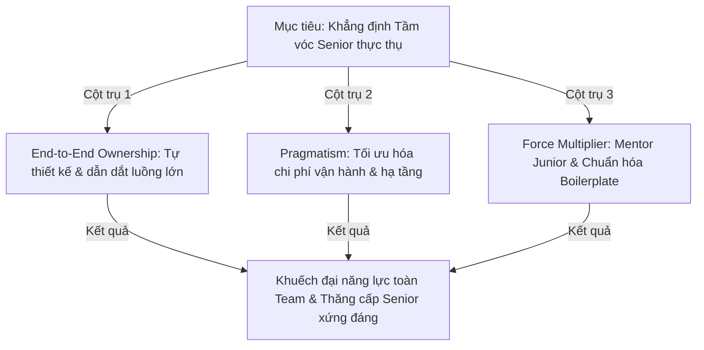

# Định Nghĩa Tầm Vóc Senior Engineer Của Bản Thân (Defining Seniority: Ownership, Impact & Mentorship)

## ⚡ Tóm tắt ngắn (30s)
* **Tư duy cốt lõi**: Sự khác biệt lớn nhất giữa một Mid-level Engineer và một Senior Engineer thực thụ không nằm ở số năm kinh nghiệm hay số lượng ngôn ngữ lập trình/framework họ biết sử dụng. Seniority được định nghĩa bằng **Tầm ảnh hưởng (Impact), Khả năng gánh vác trách nhiệm (Ownership), Tư duy thực tế cân bằng (Pragmatism) và Khả năng nâng tầm đồng đội (Mentorship)**.
* **Bộ 3 Cột Trụ Của Seniority**:
  1. *Làm chủ bài toán từ đầu đến cuối (End-to-End Ownership)*: Không chỉ viết dòng code chạy đúng, Senior chịu trách nhiệm cho thiết kế kiến trúc, khả năng chịu tải, bảo mật, vận hành và sự thành bại về mặt kinh doanh của tính năng đó trên Production.
  2. *Tư duy Thực tế và Trade-offs (Pragmatism & Business Alignment)*: Hiểu rõ công nghệ chỉ là công cụ. Luôn chọn giải pháp đơn giản nhất, tối ưu nhất cho doanh nghiệp thay vì phô diễn kỹ năng phức tạp.
  3. *Tăng trưởng Tập thể (Force Multiplier)*: Senior là người khuếch đại năng lực của toàn đội ngũ bằng cách viết boilerplate tiêu chuẩn, rà soát code kỹ lưỡng, mentor junior và xây dựng văn hóa tâm lý an toàn.

---

## 🔍 Kịch bản thực chiến (STAR Framework)

### 1. Situation (Bối cảnh)
Sau 3 năm gia nhập công ty công nghệ hiện tại, tôi nhận thấy bộ phận kỹ thuật của chúng tôi (gần 35 kỹ sư) đang gặp một vấn đề lớn: sự chia cắt thông tin và thiếu tinh thần chịu trách nhiệm cuối cùng (Ownership Gap). 
Các kỹ sư Mid-level và Junior chỉ tập trung viết code theo đúng ticket được giao trên Jira. Khi code deploy lên production bị lỗi do thiếu cấu hình hạ tầng hoặc xung đột dữ liệu với service khác, họ thường nói: *"Code của em chạy tốt ở local, lỗi này chắc do bên DevOps cấu hình sai hoặc do DB chậm"*. 
Hậu quả là dự án liên tục bị trễ hạn, các phòng ban đổ lỗi cho nhau, và chất lượng sản phẩm giảm sút trầm trọng.

### 2. Task (Thử thách)
Với tư cách là một kỹ sư khao khát khẳng định tầm vóc Senior thực thụ, tôi phải:
1. Chứng minh năng lực gánh vác trách nhiệm cao nhất bằng cách đứng ra giải quyết các bài toán kiến trúc liên phòng ban phức tạp nhất.
2. Dẫn dắt và chuyển đổi tư duy của đội ngũ kỹ sư từ trạng thái *"chỉ viết dòng code"* sang trạng thái *"làm chủ trọn vẹn sản phẩm"* (Product Ownership).
3. Kiến tạo các công cụ và bộ khung quy chuẩn chung để nâng cao năng lực kỹ thuật của toàn bộ tổ chức.

### 3. Action (Hành động)
Tôi đã thực hiện chuỗi hành động cụ thể trên cả 3 khía cạnh cốt lõi để khẳng định giá trị Seniority của mình:

* **Khía cạnh 1: Thực thi Tính sở hữu trọn vẹn (End-to-End Ownership)**
  - Khi công ty cần xây dựng hệ thống thanh toán mới (Payment Gateway) tích hợp đa kênh quốc tế - một dự án cực kỳ phức tạp và nhạy cảm về bảo mật tài chính. Tôi chủ động xung phong đứng ra làm **Architect kiêm Tech Lead** cho luồng này từ con số 0.
  - Tôi không chỉ ngồi viết code Spring Boot. Tôi chủ trì các buổi thảo luận thiết kế cơ sở dữ liệu với DBA, đàm phán contract API với đối tác thanh toán, cùng DevOps thiết kế CI/CD pipeline an toàn và viết tài liệu runbook hướng dẫn chi tiết cách xử lý sự cố cho đội vận hành (Operations).
  - Khi hệ thống go-live, tôi trực tiếp cấu hình hệ thống giám sát (Grafana/Prometheus) và tự nguyện nhận ca trực trực sự cố 24/7 để bảo vệ Uptime của hệ thống thanh toán.

* **Khía cạnh 2: Tư duy Thực tế hướng tới giá trị Kinh doanh (Pragmatism)**
  - Trong dự án tối ưu hóa tài nguyên đám mây (Cloud Cost Optimization), thay vì đề xuất một kế hoạch đập đi xây lại phức tạp bằng Kubernetes tiên tiến (Over-engineering tốn gần 6 tháng), tôi đã chọn giải pháp thực tế hơn: *Dành 2 tuần rà soát lại toàn bộ slow queries DB, cấu hình tối ưu lại Connection Pool và tinh chỉnh JVM heap sizes.*
  - Kết quả là chúng tôi giảm ngay lập tức **40% hóa đơn tiền AWS** hàng tháng cho công ty mà không cần thay đổi bất kỳ dòng code kiến trúc phức tạp nào, giúp doanh nghiệp tiết kiệm hàng chục nghìn USD tức thì.

* **Khía cạnh 3: Khuếch đại năng lực của đồng đội (Force Multiplier)**
  - Tôi nhận thấy các kỹ sư trẻ tốn quá nhiều thời gian để cấu hình ban đầu cho microservices mới. Tôi đã tự mình xây dựng **Spring Boot Starter Kit nội bộ** tích hợp sẵn bảo mật OAuth2, Logging chuẩn, Health checks và Dockerfile tối ưu. Bộ công cụ này giúp rút ngắn thời gian khởi tạo dự án mới từ **3 ngày xuống còn 10 phút**.
  - Tôi tổ chức chương trình **Mentorship hàng tuần**: Dành 2 tiếng mỗi chiều thứ Sáu để review code chuyên sâu, giảng dạy các chủ đề như *Database Indexing, Concurrency control, hay Spring Transaction Internals* cho các kỹ sư Junior.

### 4. Result (Kết quả)
* **Tầm ảnh hưởng hệ thống**: Hệ thống thanh toán tích hợp do tôi thiết kế vận hành mượt mà với Uptime đạt **99.99%**, xử lý hàng triệu giao dịch an toàn không thất thoát.
* **Sức mạnh tập thể tăng vọt**: Thời gian phát triển tính năng mới của toàn team giảm **30%** nhờ sử dụng Starter Kit. Ba kỹ sư Junior được tôi mentor trực tiếp đã tiến bộ vượt bậc và được thăng cấp lên Mid-level trong năm.
* **Khẳng định Vị thế**: Tôi được Ban Giám đốc và toàn bộ đồng nghiệp trong công ty công nhận là một Senior Engineer/Tech Lead cột trụ, có tiếng nói quyết định đối với định hướng công nghệ của tổ chức nhờ tầm ảnh hưởng khách quan và tư duy gánh vác trách nhiệm cao.

---

## 💡 Nguyên tắc Senior & Bài học đắt giá

1. **"Junior viết code phức tạp - Senior viết code đơn giản" (Simplicity is Ultimate Sophistication)**: Những kỹ sư thiếu kinh nghiệm thường cố gắng viết code thật phức tạp, lạm dụng hàng loạt design patterns hay các thư viện thời thượng để chứng tỏ mình giỏi. Senior Engineer thực thụ viết những dòng code siêu đơn giản, rõ ràng, dễ đọc đến mức một dev mới vào nghề cũng có thể hiểu và sửa được ngay lập tức. Code đơn giản là code dễ bảo trì và ít chứa bug nhất.
2. **Khuếch đại năng lực tập thể (Force Multiplier)**: Một lập trình viên dù xuất sắc đến đâu cũng chỉ có 8 tiếng một ngày và chỉ có thể viết tối đa vài trăm dòng code tốt. Nhưng nếu bạn giúp 10 lập trình viên khác viết code tốt hơn 20%, tổng giá trị bạn tạo ra cho công ty lớn hơn rất nhiều so với việc bạn tự mình làm mọi thứ. Seniority là sự chuyển dịch từ **hiệu suất cá nhân sang hiệu suất tập thể**.
3. **Thái độ "Tôn trọng và Khiêm tốn" (Humility in Engineering)**: Senior thực thụ luôn giữ thái độ cởi mở và khiêm tốn. Họ hiểu rằng công nghệ thay đổi mỗi ngày và họ hoàn toàn có thể học hỏi từ một kỹ sư Junior. Họ không bao giờ dùng kiến thức của mình để đè bẹp, hạ thấp hay mỉa mai người khác trong các buổi thảo luận.

---

## 📊 So sánh phương án quyết định (Trade-offs)

| Định nghĩa Seniority | Ưu điểm (Pros) | Nhược điểm (Cons) | Tầm ảnh hưởng dài hạn |
| :--- | :--- | :--- | :--- |
| **Chuyên gia Công nghệ Đơn độc (The Lone Wolf)** | - Giải quyết các bài toán giải thuật, lỗi code dị cực kỳ nhanh. - Có khả năng code xuyên đêm để hoàn thành tính năng một mình. | - **Không có tính kế thừa**; nếu họ nghỉ việc, hệ thống sẽ rơi vào bế tắc. - Thường gây xung đột văn hóa do cái tôi quá lớn. - Thiếu cái nhìn toàn cảnh về sản phẩm và con người. | **Tầm ảnh hưởng thấp**. Thích hợp làm chuyên gia kỹ thuật sâu độc lập (Individual Contributor - IC) nhưng không thể làm Tech Lead dẫn dắt tổ chức lớn. |
| **Senior Toàn diện (Ownership & Mentorship - Khuyên dùng)** | - Kiến tạo **giá trị bền vững, kế thừa** cho toàn doanh nghiệp. - Xây dựng đội ngũ kế cận mạnh mẽ. - Cân bằng xuất sắc giữa bài toán kinh doanh và kiến trúc công nghệ. | - Tốn nhiều thời gian cho việc giao tiếp, họp hành, mentor con người thay vì chỉ tập trung code thuần túy. | **Tầm ảnh hưởng cực cao**. Đây là mẫu hình kỹ sư Architect/Tech Lead được mọi Big Tech và các tập đoàn lớn săn đón hàng đầu. |

---

## ⚠️ Common Gotchas (Câu hỏi phỏng vấn đào sâu)

### 1. Ở level Senior, làm thế nào bạn cân bằng giữa việc dành thời gian tự mình viết code (Hands-on) và việc dành thời gian cho các nhiệm vụ phi kỹ thuật như họp hành thiết kế, review code, mentor junior và hỗ trợ stakeholders?
* **Trả lời**: Đây là bài toán quản trị thời gian kinh điển của mọi Senior:
  * **Giải pháp chia tách thời gian hiệu quả (Time Blocking)**:
    1. **Quy tắc 50/50**: Tôi luôn cố gắng giữ tỷ lệ tối thiểu **50% thời gian** trong tuần để trực tiếp viết code và làm kỹ thuật sâu (Coding, Proof of Concepts, Refactoring). Việc này giúp tôi không bị rời xa thực tế công nghệ và luôn nắm rõ "hơi thở" của codebase.
    2. **Chặn thời gian tập trung (Deep Work Blocks)**: Tôi thiết lập 2 khoảng thời gian Deep Work cố định trong ngày (ví dụ: từ 8:30 - 11:30 sáng) - tắt hoàn toàn Slack/Teams để tập trung code các tính năng cốt lõi hoặc thiết kế kiến trúc sâu mà không bị ngắt quãng.
    3. **Ủy quyền thông minh (Empowered Delegation)**: Tôi không tự ôm đồm làm tất cả các task khó. Tôi chọn những task khó có tính chất khuôn mẫu bàn giao cho các kỹ sư Mid-level làm kèm theo sự định hướng thiết kế từ tôi. Việc này vừa giải phóng thời gian cho tôi, vừa giúp họ có cơ hội thử thách để trưởng thành.
    4. **Tập hợp lịch họp**: Yêu cầu gom các lịch họp phi kỹ thuật vào một số buổi chiều cố định trong tuần để tránh việc mạch code bị cắt vụn thành các khoảng 30 phút vô ích.

### 2. Làm thế nào bạn định nghĩa và đo lường nợ kỹ thuật (Technical Debt) của một dự án để báo cáo cho ban giám đốc, và bạn làm thế nào để đảm bảo nợ kỹ thuật luôn được giải quyết đều đặn mà không làm ảnh hưởng đến tiến độ bàn giao tính năng mới của Product Manager?
* **Trả lời**: Đây là kỹ năng quản lý nợ kỹ thuật chuyên nghiệp:
  * **Định nghĩa và Đo lường nợ kỹ thuật**:
    - Tôi không báo cáo chung chung là "code xấu". Tôi phân loại nợ kỹ thuật thành các chỉ số định lượng:
      1. *Chỉ số Uptime/Error Rate*: Tần suất sập hệ thống do lỗi code cũ.
      2. *Thời gian Bàn giao (Lead Time for Changes)*: Thời gian trung bình để hoàn thành một ticket tính năng tương đương tăng lên bao nhiêu phần trăm theo thời gian.
      3. *Độ bao phủ Test (Code Coverage)* và độ phức tạp code quét bởi SonarQube.
  * **Chiến lược giải quyết nợ kỹ thuật không ảnh hưởng Product (Quy tắc 20%)**:
    1. **Quy tắc 80/20 trong mỗi Sprint**: Tôi đàm phán thống nhất với Product Manager: Trong mỗi sprint phát triển, chúng tôi sẽ dành **80% nguồn lực** cho các ticket tính năng kinh doanh mới (Product Backlog), và luôn dành cố định **20% nguồn lực** còn lại để giải quyết nợ kỹ thuật, viết unit test và refactor (Tech Backlog).
    2. **Refactor lồng ghép (Opportunistic Refactoring)**: Khi dev vào sửa code để làm một tính năng mới A, tôi khuyến khích họ áp dụng quy tắc hướng đạo sinh: dọn dẹp sạch sẽ đống nợ kỹ thuật ngay tại file code đó. Cách làm này giúp nợ kỹ thuật được trả dần một cách tự nhiên mà không cần xin một khoảng thời gian đóng băng dự án riêng biệt từ Product Manager.
