# Sự khác biệt giữa `==` và `equals()` trong Java

## ⚡ Tóm tắt ngắn (30s)
* **`==`** là một toán tử (operator) dùng để so sánh **địa chỉ vùng nhớ** (reference) của 2 đối tượng trên Heap (hoặc so sánh giá trị đối với kiểu dữ liệu nguyên thủy - primitive).
* **`equals()`** là một phương thức (method) kế thừa từ lớp `Object`, dùng để so sánh **giá trị nội dung** (logical equivalence) của 2 đối tượng. Mặc định nếu không được override, `equals()` sẽ sử dụng toán tử `==`.

---

## 🔍 Chi tiết bản chất

### 1. Toán tử `==`
* Đối với kiểu dữ liệu nguyên thủy (primitive like `int`, `char`, `double`,...): so sánh trực tiếp giá trị của chúng trên Stack.
* Đối với kiểu dữ liệu tham chiếu (reference types): so sánh địa chỉ vùng nhớ mà con trỏ trỏ tới trên Heap. Nếu 2 biến trỏ đến cùng một đối tượng duy nhất, `==` trả về `true`.

### 2. Phương thức `equals()`
* Được định nghĩa trong lớp `java.lang.Object` như sau:
  ```java
  public boolean equals(Object obj) {
      return (this == obj);
  }
  ```
* Các lớp kế thừa thường override lại phương thức này để định nghĩa tiêu chuẩn "bằng nhau về nội dung". Ví dụ: `String`, `Integer`, `LocalDate`,... so sánh các trường thuộc tính bên trong thay vì địa chỉ vùng nhớ.

---

## 🎨 Sơ đồ trực quan (Memory Heap vs Stack)

```mermaid
graph TD
    subgraph Stack
        S1["String s1 = new String('Hello')"]
        S2["String s2 = new String('Hello')"]
        S3["String s3 = s1"]
    end
    subgraph Heap
        H1["Object 1 (Address: 0x001) <br> value: 'Hello'"]
        H2["Object 2 (Address: 0x002) <br> value: 'Hello'"]
    end
    S1 --> H1
    S3 --> H1
    S2 --> H2

    style H1 fill:#1a365d,stroke:#3182ce,stroke-width:2px
    style H2 fill:#1a365d,stroke:#3182ce,stroke-width:2px
```



* **`s1 == s2`** $\rightarrow$ `false` (0x001 khác 0x002)
* **`s1.equals(s2)`** $\rightarrow$ `true` (Cùng nội dung "Hello")
* **`s1 == s3`** $\rightarrow$ `true` (Cùng trỏ tới 0x001)

---

## 💻 Code Example

### BAD ❌ (Dùng toán tử `==` để so sánh nội dung Object)
```java
String input1 = new String("admin");
String input2 = new String("admin");

if (input1 == input2) { // ❌ Sai lầm! Luôn trả về false do new String tạo vùng nhớ mới
    System.out.println("Access Granted!");
}
```

### GOOD ✅ (Sử dụng `equals()` và xử lý Null-Safe)
```java
String input1 = "admin";
String input2 = getNullableInput();

// Sử dụng Objects.equals để tránh NullPointerException nếu input2 null
if (Objects.equals(input1, input2)) { 
    System.out.println("Access Granted!");
}

// Hoặc nếu biết chắc chắn chuỗi so sánh không null:
if ("admin".equals(input2)) { // ✅ An toàn trước NPE
    System.out.println("Access Granted!");
}
```

---

## 📊 Trade-off Analysis

| Tiêu chí | Toán tử `==` | Phương thức `equals()` |
| :--- | :--- | :--- |
| **Loại** | Toán tử cấp thấp của ngôn ngữ | Phương thức của Object có thể override |
| **Tốc độ** | Cực kỳ nhanh (chỉ so sánh bit địa chỉ) | Phụ thuộc logic override (thường chậm hơn) |
| **Null-safety**| Luôn an toàn (`null == null` $\rightarrow$ `true`) | Dễ gây `NullPointerException` nếu gọi từ biến null |
| **Mục đích** | So sánh đồng nhất thực thể (Identity) | So sánh tương đương ngữ nghĩa (Equivalence) |

---

## ⚠️ Common Gotchas & Questions follow-up
1. **String Constant Pool**:
   ```java
   String a = "Hello";
   String b = "Hello";
   System.out.println(a == b); // Trả về true! Do JVM tối ưu hóa chuỗi literal trong pool.
   ```
2. **Autoboxing Cache**: Các lớp wrapper nguyên thủy từ `-128` đến `127` (ví dụ `Integer`) được cache lại.
   ```java
   Integer x = 127;
   Integer y = 127;
   System.out.println(x == y); // true!
   Integer m = 128;
   Integer n = 128;
   System.out.println(m == n); // false!
   ```
   👉 **Câu hỏi đào sâu từ interviewer**: Làm thế nào để đảm bảo so sánh giá trị an toàn tuyệt đối cho kiểu Wrapper? (Trả lời: Luôn dùng `equals()` hoặc kiểu nguyên thủy `int`).