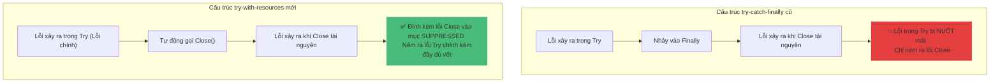

# Cơ chế hoạt động của try-with-resources trong Java

## ⚡ Tóm tắt ngắn (30s)
* **try-with-resources** (ra mắt từ Java 7) là cấu trúc quản lý tài nguyên giúp **tự động đóng (close)** các đối tượng như file, database connection, network socket... sau khi ra khỏi khối `try`.
* **Điều kiện**: Các tài nguyên khai báo bên trong cặp ngoặc đơn `try(...)` bắt buộc phải triển khai (implement) interface **`java.lang.AutoCloseable`** hoặc **`java.lang.Closeable`**.
* **Lợi ích vượt trội**: Loại bỏ hoàn toàn mã dọn dẹp dài dòng ở khối `finally`, giải quyết triệt để rò rỉ bộ nhớ (Resource Leak) và giữ nguyên vết lỗi nhờ cơ chế ngoại lệ bị nén **Suppressed Exceptions**.

---

## 🔍 Chi tiết bản chất

### 1. Trình biên dịch sinh mã gì bên dưới? (Decompiled)
try-with-resources chỉ là cú pháp viết tắt tiện lợi. Khi biên dịch sang Bytecode, trình biên dịch Java tự động dịch chuyển nó thành cấu trúc `try-catch-finally` truyền thống nhưng có cơ chế kiểm tra lỗi phức tạp hơn nhiều.
* **Cú pháp ngắn gọn của nhà phát triển**:
  ```java
  try (BufferedReader br = new BufferedReader(new FileReader("test.txt"))) {
      System.out.println(br.readLine());
  }
  ```
* **Mã nguồn thực tế do trình biên dịch sinh ra**:
  ```java
  BufferedReader br = new BufferedReader(new FileReader("test.txt"));
  Throwable primaryExc = null;
  try {
      System.out.println(br.readLine());
  } catch (Throwable t) {
      primaryExc = t; // Lưu giữ ngoại lệ chính xảy ra trong try
      throw t;
  } finally {
      if (br != null) {
          if (primaryExc != null) {
              try {
                  br.close(); // Đóng tài nguyên
              } catch (Throwable suppressedExc) {
                  primaryExc.addSuppressed(suppressedExc); // Nén ngoại lệ phụ vào lỗi chính
              }
          } else {
              br.close(); // Đóng bình thường nếu không có lỗi trong try
          }
      }
  }
  ```

### 2. Sự kỳ diệu của Suppressed Exceptions
Trong cú pháp `try-catch-finally` cũ:
* Nếu khối `try` ném ra `IOException` (ví dụ: đĩa cứng hỏng).
* Khối `finally` gọi `close()` ném ra một lỗi `CloseException` khác.
* Kết quả: Lỗi nguyên bản `IOException` trong khối `try` **bị nuốt mất hoàn toàn** và chỉ lỗi `CloseException` ở khối `finally` được hiển thị ra ngoài stack trace $\rightarrow$ Gây khó khăn lớn cho việc xác định nguyên nhân lỗi thực sự.
Với **try-with-resources**, Exception trong khối `try` luôn được ưu tiên hàng đầu làm ngoại lệ chính. Lỗi phát sinh trong lúc đóng tài nguyên sẽ được đính kèm bên trong mục **Suppressed** của ngoại lệ chính, giúp lập trình viên có cái nhìn toàn cảnh về mọi lỗi đã xảy ra.

---

## 🎨 Sơ đồ So sánh Cơ chế Xử lý Lỗi của try-catch-finally cũ vs try-with-resources mới



---

## 💻 Code Example

### BAD ❌ (Cách tiếp cận cổ điển dễ rò rỉ tài nguyên và nuốt mất lỗi gốc)
```java
public String readFirstLine(String path) throws IOException {
    BufferedReader br = new BufferedReader(new FileReader(path));
    try {
        return br.readLine(); // 💥 Giả sử ném Exception A
    } finally {
        br.close(); // 💥 Nếu close() ném Exception B, Exception A sẽ biến mất vĩnh viễn!
    }
}
```

### GOOD ✅ (try-with-resources gọn gàng, tự động đóng nhiều tài nguyên cùng lúc)
```java
public String readFirstLine(String path) throws IOException {
    // Tự động đóng theo thứ tự ngược lại với thứ tự khai báo (BufferedReader đóng trước, FileReader đóng sau)
    try (FileReader fr = new FileReader(path);
         BufferedReader br = new BufferedReader(fr)) { // ✅ An toàn tuyệt đối, không sợ leak
        return br.readLine();
    }
}
```

---

## 📊 Bảng so sánh Đặc tính

| Tiêu chí | Sử dụng try-catch-finally truyền thống | Sử dụng try-with-resources (Java 7+) |
| :--- | :--- | :--- |
| **Độ dài và sự sạch sẽ của mã**| Dài dòng, nhiều khối `try` lồng nhau trong `finally` | **Cực kỳ ngắn gọn, trực quan** |
| **Rủi ro rò rỉ tài nguyên** | Cao (nếu lập trình viên quên viết khối close) | **Bằng 0** (JVM tự động hóa hoàn toàn) |
| **Xử lý đa tài nguyên** | Phức tạp, dễ viết lỗi thứ tự đóng | Rất đơn giản, phân tách bằng dấu chấm phẩy `;` |
| **Bảo toàn ngoại lệ gốc** | Tệ (dễ bị lỗi trong finally đè mất lỗi gốc) | **Tuyệt vời** (bảo toàn qua cơ chế Suppressed Exception) |

---

## ⚠️ Common Gotchas & Questions follow-up
* **Khai báo đối tượng bên ngoài khối `try(...)`**:
  Nếu khởi tạo đối tượng trước và chỉ truyền biến vào cặp ngoặc của `try`:
  ```java
  BufferedReader br = new BufferedReader(new FileReader("test.txt"));
  try (br) { // Tính năng mới từ Java 9 (hỗ trợ biến effectively final)
      System.out.println(br.readLine());
  } // ✅ br vẫn tự động đóng bình thường.
  ```
  Nhưng nếu `br` bị thay đổi giá trị trước khi vào khối `try`, trình biên dịch sẽ chặn lỗi ngay lập tức.
* 👉 **Câu hỏi đào sâu**: *Làm thế nào để lấy ra các ngoại lệ bị nén (Suppressed Exceptions) khi bắt lỗi?*
  *(Trả lời: Sử dụng phương thức `Throwable.getSuppressed()` trên đối tượng ngoại lệ được catch. Phương thức này trả về một mảng các đối tượng `Throwable[]` đại diện cho tất cả các lỗi xảy ra trong quá trình đóng tài nguyên).*