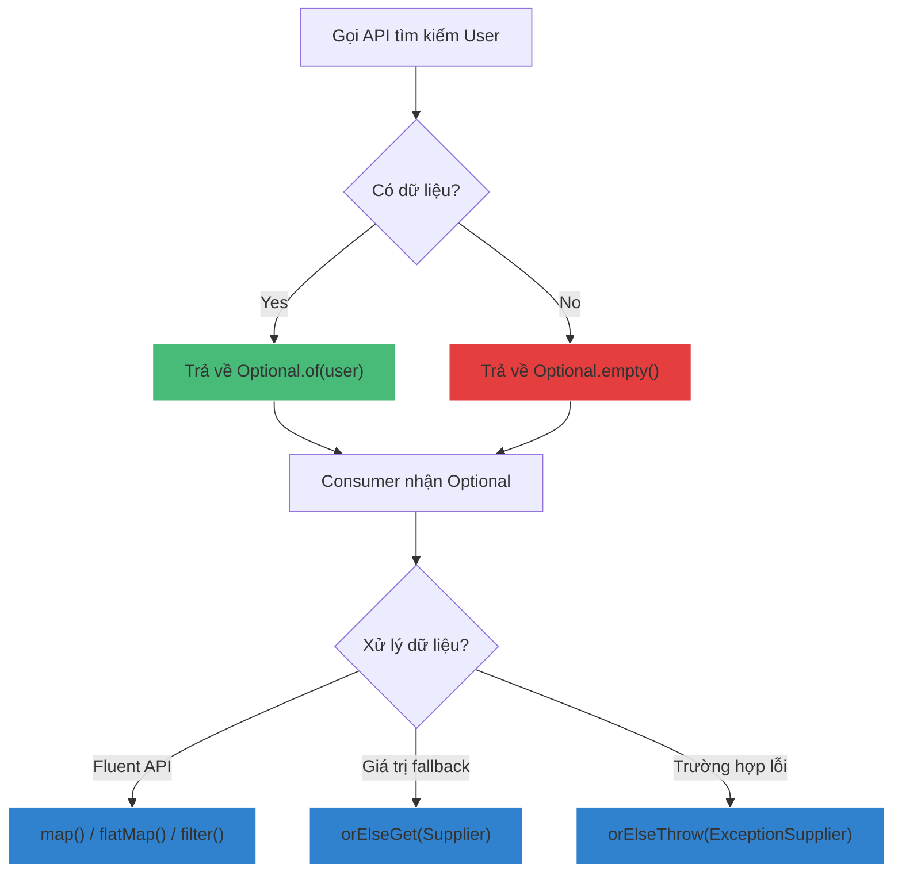

# Optional nên và không nên dùng trong trường hợp nào?

## ⚡ Tóm tắt ngắn (30s)
* **`Optional`** (Java 8) được thiết kế đặc thù để làm **kiểu trả về (method return type)** biểu diễn sự có hoặc vắng mặt của dữ liệu, giúp người gọi API nhận biết và chủ động xử lý null-safety.
* **Nên dùng**: Chỉ dùng làm kiểu trả về của các public method khi giá trị tìm kiếm có khả năng không tồn tại (ví dụ: query DB, find element).
* **Không nên dùng**:
  1. Không dùng làm tham số đầu vào (Method parameters) -> Thay bằng overloading hoặc validation thông thường.
  2. Không dùng làm trường dữ liệu (Class Fields) -> Gây tốn RAM Heap và không thể tuần tự hóa (`Serializable`).
  3. Không dùng cho Collections -> Trả về danh sách rỗng (`Collections.emptyList()` hoặc tương tự) thay vì `Optional<List>`.
  4. Không dùng cho kiểu nguyên thủy -> Dùng `OptionalInt`, `OptionalLong` để tránh chi phí đùm bọc (autoboxing).

---

## 🔍 Chi tiết bản chất

### 1. Triết lý thiết kế của Java Architects
Brian Goetz (Java Language Architect) đã nhấn mạnh: *"Optional sinh ra không phải để giải quyết mọi lỗi NullPointerException trên thế giới. Mục đích duy nhất của nó là cung cấp một cơ chế thư viện để biểu diễn kết quả trả về của phương thức khi có khả năng không có giá trị, và người gọi bắt buộc phải đối mặt với thực tế đó."*

### 2. Gánh nặng hiệu năng của Optional (Heap Allocation Pressure)
* `Optional` là một đối tượng Wrapper thực sự trên bộ nhớ Heap. Nó chứa một tham chiếu trỏ tới đối tượng thực.
* Nếu lạm dụng bọc `Optional` cho mọi biến trong chương trình, bạn sẽ nhân đôi số lượng đối tượng cần dọn dẹp, gây áp lực cực lớn lên bộ dọn rác (Garbage Collector).
* JVM đôi khi không thể tối ưu hóa giải phóng `Optional` trên Stack bằng kỹ thuật **Escape Analysis** (Phân tích thoát) do sự phức tạp của luồng API.

---

## 🎨 Sơ đồ Phân cấp luồng xử lý với Optional an toàn



---

## 💻 Code Example

### BAD ❌ (Lạm dụng Optional làm tham số và trường thuộc tính)
```java
public class Employee {
    private String id;
    private Optional<String> middleName; // ❌ Thiết kế tồi! Gây tốn 16-24 byte Heap vô ích và lỗi khi Serialization

    // ❌ Thiết kế tồi! Bắt người gọi phải bọc Optional thủ công khi gọi hàm
    public void updateAddress(String id, Optional<String> street) {
        if (street.isPresent()) {
            this.street = street.get();
        }
    }
}
```

### GOOD ✅ (Optional làm kiểu trả về, sử dụng Fluent API)
```java
public class EmployeeService {
    
    // ✅ Chuẩn chỉnh: Người gọi biết chắc chắn kết quả có thể trống
    public Optional<Employee> findEmployeeById(String id) {
        return employeeRepository.findById(id); 
    }

    public EmployeeDto getEmployeeDto(String id) {
        return findEmployeeById(id)
            .filter(Employee::isActive) // ✅ Lọc điều kiện mượt mà
            .map(this::convertToDto)    // ✅ Chuyển đổi an toàn không lo null
            .orElseThrow(() -> new EmployeeNotFoundException("Không tìm thấy nhân viên: " + id)); // ✅ Ném lỗi tường minh
    }
}
```

---

## 📊 Phân tích Đánh đổi (Trade-off)

| Tiêu chí so sánh | Sử dụng Check Null kiểu truyền thống | Sử dụng Optional (Java 8+) |
| :--- | :--- | :--- |
| **Độ rõ ràng của API** | Kém (Phải đọc tài liệu hoặc đoán xem phương thức có trả về null không) | **Tuyệt vời** (Kiểu dữ liệu bắt buộc người gọi phải xử lý) |
| **Chi phí bộ nhớ (RAM)** | **Bằng 0** (Chỉ so sánh con trỏ trực tiếp trên Stack) | Tốn Heap (Tạo đối tượng Optional chứa giá trị) |
| **Độ phức tạp mã nguồn**| Dễ tạo ra các khối `if-else` lồng nhau (Pyramid of Doom) | Viết mã theo phong cách **Declarative** (mượt mà, chuỗi lệnh liên tiếp) |
| **Phù hợp Serialization**| Có hỗ trợ đầy đủ | **Không hỗ trợ** (Gây lỗi crash khi truyền qua mạng/giao thức) |

---

## ⚠️ Common Gotchas & Questions follow-up
1. **Cạm bẫy sử dụng `orElse()` thay vì `orElseGet()`**:
   ```java
   // ❌ Tệ hại! dbQueryService.fetchDefault() LUÔN được thực thi dù userOpt có giá trị hay không!
   User user = userOpt.orElse(dbQueryService.fetchDefault()); 

   // ✅ Chuẩn mực: dbQueryService.fetchDefault() chỉ được gọi LƯỜI (lazy) khi userOpt thực sự rỗng.
   User user = userOpt.orElseGet(() -> dbQueryService.fetchDefault()); 
   ```
2. 👉 **Câu hỏi đào sâu từ interviewer**: *Optional có giải quyết được hoàn toàn lỗi NullPointerException trong dự án không?*
   *(Trả lời: Không. Optional chỉ là một công cụ hỗ trợ thiết kế API. Nếu lập trình viên gọi trực tiếp phương thức `.get()` mà không kiểm tra bằng `.isPresent()` trước, JVM vẫn ném ra `NoSuchElementException` gây crash ứng dụng. Hơn nữa, nếu gán biến Optional bằng `null` (ví dụ: `Optional<User> opt = null;`), thì khi gọi `opt.isPresent()` vẫn bị NPE như thường. Do đó, quy tắc vàng là không bao giờ gán `null` cho biến Optional, luôn dùng `Optional.empty()`).*