# record trong Java dùng để làm gì? Khi nào nên dùng?

## ⚡ Tóm tắt ngắn (30s)
* **`record`** (ra mắt chính thức từ Java 16) là một loại lớp đặc biệt (special class) đóng vai trò là **vật mang dữ liệu bất biến (Immutable Data Carrier)**.
* Nó giúp loại bỏ hoàn toàn mã boilerplate bằng cách tự động sinh ra: các trường dữ liệu `private final`, constructor chuẩn (canonical constructor), các getter không có tiền tố "get" (ví dụ: `name()` thay vì `getName()`), cùng các phương thức `equals()`, `hashCode()`, và `toString()` tự động.
* **Nên dùng**: Làm các lớp DTO (Data Transfer Object), Value Object, khóa (Key) trong HashMap, hoặc cấu trúc dữ liệu tạm thời trong Stream pipeline.
* **Không nên dùng**: Tuyệt đối không dùng làm các thực thể cơ sở dữ liệu **JPA / Hibernate Entities** do tính chất bất biến không tương thích với cơ chế proxy và dirty checking.

---

## 🔍 Chi tiết bản chất

### 1. Cơ chế hoạt động của JVM dưới background (Decompiled)
Khi bạn khai báo một `record`:
```java
public record User(String id, String name) {}
```
Trình biên dịch Java tự động sinh ra một class tương đương như sau:
```java
public final class User extends java.lang.Record {
    private final String id;
    private final String name;

    public User(String id, String name) {
        this.id = id;
        this.name = name;
    }

    public String id() { return this.id; }
    public String name() { return this.name; }
    
    // Tự động override equals(), hashCode(), toString() dựa trên các trường trên.
}
```

### 2. Các ràng buộc thiết kế cốt lõi của Record
* **Đơn kế thừa bắt buộc**: Vì mọi record đều ngầm định kế thừa lớp abstract `java.lang.Record` và được khai báo là `final`, **record không thể kế thừa bất kỳ class nào khác** và cũng không class nào có thể kế thừa record. Tuy nhiên, record có thể triển khai (implement) các interface.
* **Tính bất biến tuyệt đối**: Tất cả các trường khai báo trong record header đều tự động là `private final`. Bạn không thể khai báo thêm các trường thực thể (instance fields) khác bên trong thân record, ngoại trừ các biến tĩnh (`static fields`).
* **Compact Constructor**: Cho phép viết mã xác thực dữ liệu (validation) cực kỳ ngắn gọn mà không cần viết lại các lệnh gán `this.x = x`.

---

## 🎨 Sơ đồ So sánh Cấu trúc Class POJO truyền thống vs Java Record

```mermaid
classDiagram
    class java_lang_Record {
        <<abstract>>
        +equals()
        +hashCode()
        +toString()
    }
    
    class UserRecord {
        <<final>>
        -id: String
        -name: String
        +UserRecord(id, name)
        +id() String
        +name() String
    }
    
    class ClassicUserPOJO {
        -id: String
        -name: String
        +ClassicUserPOJO()
        +getId() String
        +setId(id) void
        +getName() String
        +setName(name) void
        +equals(Object) boolean
        +hashCode() int
        +toString() String
    }
    
    java_lang_Record <|-- UserRecord
    style UserRecord fill:#1a365d,stroke:#3182ce,stroke-width:2px
    style ClassicUserPOJO fill:#2d3748,stroke:#a0aec0
```



---

## 💻 Code Example

### BAD ❌ (Viết class DTO thủ công quá dài dòng hoặc lạm dụng Lombok mutable)
```java
// Mất 50+ dòng code hoặc lạm dụng Lombok tạo ra đối tượng có thể thay đổi trạng thái tự do
public class UserDto {
    private String id;
    private String email;

    public UserDto(String id, String email) {
        this.id = id;
        this.email = email;
    }
    // Hàng tá getter, setter, equals, hashCode thủ công...
}
```

### GOOD ✅ (Dùng record ngắn gọn kết hợp Compact Constructor chuyên nghiệp)
```java
public record UserDto(String id, String email) {
    
    // Compact Constructor: Xác thực dữ liệu đầu vào thanh thoát
    public UserDto {
        Objects.requireNonNull(id, "ID không được phép null");
        if (!email.contains("@")) {
            throw new IllegalArgumentException("Định dạng email không hợp lệ");
        }
        email = email.toLowerCase().trim(); // Sửa đổi dữ liệu trước khi gán tự động
    }
}
```

---

## 📊 Trade-off Analysis

| Tiêu chí | Class POJO truyền thống | Dùng Lombok (`@Data`) | Java `record` |
| :--- | :--- | :--- | :--- |
| **Mức độ Boilerplate** | Rất cao (Viết thủ công hàng chục dòng code) | Rất thấp (Nhờ Annotation processor) | **Không có** (Tích hợp trực tiếp vào cú pháp ngôn ngữ) |
| **Tính bất biến (Immutable)**| Tùy biến (Khó bắt buộc toàn bộ dev làm đúng) | Tùy biến (Mặc định @Data sinh ra các setter mutable) | **Bắt buộc tuyệt đối** (Tất cả trường đều là final) |
| **Khả năng kế thừa** | Tự do kế thừa | Tự do kế thừa | **Không hỗ trợ** (Chỉ cho phép implement interface) |
| **Sự phụ thuộc thư viện** | Không | Yêu cầu tích hợp thư viện Lombok bên ngoài | **Không** (Hỗ trợ gốc từ JDK 16+) |
| **Sử dụng cho JPA Entity**| **Rất tốt** | Tốt (Cần lưu ý equals/hashCode để tránh tuần hoàn) | **Không thể** (Không hỗ trợ lazy loading/proxy) |

---

## ⚠️ Common Gotchas & Questions follow-up
1. **Shallow Immutability (Bất biến nông)**:
   Mặc dù bản thân các tham chiếu trường của record là `final`, nếu một trường là một đối tượng khả biến (ví dụ: `List`, `Map`), nội dung bên trong đối tượng đó **vẫn có thể bị sửa đổi**.
   👉 **Khắc phục**: Sử dụng các Collection bất biến (`List.copyOf()`, `Map.copyOf()`) trong constructor.
2. 👉 **Câu hỏi đào sâu**: *Làm thế nào để sử dụng record như một cấu trúc dữ liệu tạm thời tối ưu trong Java Stream API?*
   *(Trả lời: Chúng ta có thể định nghĩa một local record ngay bên trong thân phương thức chứa Stream pipeline. Điều này giúp gộp nhóm dữ liệu trung gian cực kỳ gọn gàng mà không làm ô nhiễm sơ đồ class chung của toàn bộ dự án).*