# Sealed class là gì? Khi nào nên dùng?

## ⚡ Tóm tắt ngắn (30s)
* **`sealed` class/interface** (Java 17) cho phép lập trình viên **giới hạn quyền kế thừa hoặc triển khai** cho một danh sách các lớp con cụ thể được định nghĩa trước bằng từ khóa **`permits`**.
* **Mục đích**: Đóng hệ thống phân cấp lớp (class hierarchy) một cách có kiểm soát, ngăn chặn sự mở rộng tùy tiện của các lớp con nằm ngoài thiết kế của kiến trúc sư hệ thống.
* **Quy tắc bắt buộc**: Các lớp con được phép kế thừa (`permits`) bắt buộc phải khai báo rõ ràng một trong ba trạng thái bổ từ: **`final`** (đóng hoàn toàn), **`sealed`** (tiếp tục giới hạn lớp con), hoặc **`non-sealed`** (mở lại quyền kế thừa tự do).

---

## 🔍 Chi tiết bản chất

### 1. Giải quyết lỗ hổng của cơ chế Kế thừa truyền thống
Trước Java 17, để giới hạn quyền kế thừa, chúng ta chỉ có 2 lựa chọn cực đoan:
1. Khai báo lớp là **`final`**: Không một lớp nào được quyền kế thừa (Đóng hoàn toàn).
2. Khai báo lớp là **`package-private`**: Chỉ cho phép kế thừa trong cùng package (Thiếu linh hoạt).
`Sealed` ra đời cung cấp giải pháp trung hòa hoàn hảo: Cho phép kế thừa rộng rãi ở nhiều package khác nhau, nhưng chỉ đích danh những lớp nào được quyền làm điều đó.

### 2. Sự kết hợp hoàn hảo với Pattern Matching & Switch Expression
Khi bạn sử dụng cấu trúc `switch-case` trên một đối tượng `sealed` class:
* Trình biên dịch (Compiler) biết chính xác có bao nhiêu lớp con khả dĩ.
* Do đó, compiler có thể kiểm tra tính **phủ kín (exhaustiveness)** của các case. Nếu bạn đã xử lý đầy đủ các lớp con, **không cần phải viết khối `default` nữa**.
* Nếu trong tương lai, một lớp con mới được bổ sung vào danh sách `permits`, trình biên dịch sẽ lập tức báo lỗi đỏ tại toàn bộ các khối switch-case cũ, ngăn ngừa hoàn toàn rủi ro sót logic nghiệp vụ (Bug-free refactoring).

---

## 🎨 Sơ đồ Phân cấp Kế thừa có kiểm soát với Sealed Class

```mermaid
graph TD
    Parent["sealed class Shape <br> permits Circle, Quad, Polygon"]
    
    Circle["final class Circle"]
    Quad["sealed class Quad <br> permits Square"]
    Polygon["non-sealed class Polygon"]
    
    Square["final class Square"]
    
    Parent -->|permits| Circle
    Parent -->|permits| Quad
    Parent -->|permits| Polygon
    
    Quad -->|permits| Square
    
    Polygon -->|kế thừa tự do| FreeSubclass["class Triangle"]
    
    style Parent fill:#1a365d,stroke:#3182ce,stroke-width:2px
    style Circle fill:#2d3748,stroke:#a0aec0
    style Quad fill:#2d3748,stroke:#ed8936,stroke-width:1px
    style Polygon fill:#48bb78,stroke:#fff,stroke-width:1px
```



---

## 💻 Code Example

### BAD ❌ (polymorphism mở tự do dễ sót logic nghiệp vụ khi có thêm loại thẻ mới)
```java
public abstract class DiscountPolicy {
    public abstract double calculateDiscount(double amount);
}

// Khi dùng:
public double getFinalPrice(DiscountPolicy policy, double amount) {
    if (policy instanceof VipDiscount) return amount * 0.9;
    if (policy instanceof MemberDiscount) return amount * 0.95;
    // ❌ Rất nguy hiểm! Nếu ai đó tự ý tạo thêm class NewDiscount kế thừa DiscountPolicy
    // Hệ thống sẽ âm thầm trả về 0 mà không hề cảnh báo lúc compile.
    return 0; 
}
```

### GOOD ✅ (Dùng Sealed class đảm bảo an toàn tuyệt đối lúc Compile-time)
```java
// Định nghĩa cấu trúc sealed phân cấp chặt chẽ
public sealed interface DiscountPolicy permits VipDiscount, MemberDiscount, GuestDiscount {}

public final class VipDiscount implements DiscountPolicy {}
public final class MemberDiscount implements DiscountPolicy {}
public final class GuestDiscount implements DiscountPolicy {}

// Sử dụng switch expression chuẩn Java 21 - Không cần block default!
public double getFinalPrice(DiscountPolicy policy, double amount) {
    return amount - switch (policy) {
        case VipDiscount vip -> amount * 0.1;
        case MemberDiscount member -> amount * 0.05;
        case GuestDiscount guest -> 0.0;
        // ✅ An toàn tuyệt đối! Thêm lớp con mới vào interface bắt buộc phải sửa code tại đây, compiler sẽ báo lỗi lập tức.
    };
}
```

---

## 📊 So sánh cơ chế đóng gói kế thừa

| Tiêu chí so sánh | Lớp Final | Lớp Package-private | Lớp Sealed (Java 17+) |
| :--- | :--- | :--- | :--- |
| **Mức độ đóng gói** | Đóng hoàn toàn (Không cho phép bất kỳ lớp con nào) | Đóng trong package (Giới hạn kế thừa trong package) | **Đóng theo danh sách chọn lọc** (Chỉ cho phép các lớp chỉ định) |
| **Phạm vi sử dụng lớp con**| Không áp dụng | Chỉ giới hạn trong cùng package | Cho phép khai báo lớp con ở package/module khác |
| **Tính phủ kín (Exhaustive)**| Có (chỉ có 1 lớp duy nhất) | Không hỗ trợ kiểm tra compile | **Có** (Hỗ trợ switch-case không cần default) |
| **Use case tốt nhất** | Các lớp tiện ích (Utility), hằng số, lớp lõi như String | Các logic nội bộ trong một thư viện nhỏ | Các mô hình dữ liệu nghiệp vụ (Domain Model - ADTs) |

---

## ⚠️ Common Gotchas & Questions follow-up
* **Quy tắc về vị trí khai báo**:
  Các lớp con được chỉ định trong danh sách `permits` phải nằm trong **cùng một package** hoặc **cùng một module** với lớp `sealed` gốc. Nếu khai báo chúng ở các package khác nhau mà không dùng module system, trình biên dịch sẽ báo lỗi lập tức.
* 👉 **Câu hỏi đào sâu**: *Algebraic Data Types (ADTs) là gì và tại sao Sealed Class lại là mảnh ghép quan trọng cho ADTs trong Java?*
   *(Trả lời: ADTs là kỹ thuật biểu diễn dữ liệu bằng sự kết hợp của "Product Types" (các class/record chứa nhiều trường dữ liệu kết hợp) và "Sum Types" (các sealed class đại diện cho một tập hợp hữu hạn các trạng thái của thực thể). Sự kết hợp này giúp lập trình viên mô hình hóa các trạng thái nghiệp vụ (ví dụ: trạng thái đơn hàng OrderState chỉ có thể là Pending, Processing, Shipped, Cancelled) một cách cực kỳ chính xác và loại bỏ hoàn toàn các lỗi runtime bất ngờ).*