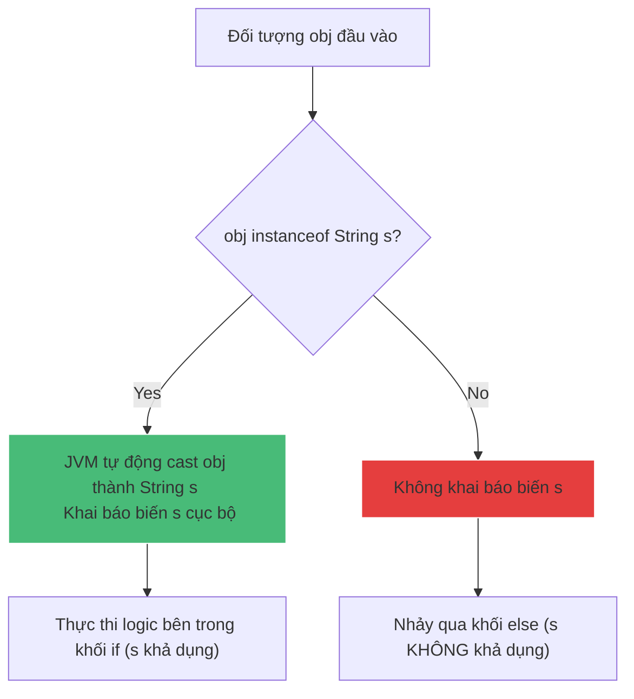

# Pattern matching trong Java giúp ích gì?

## ⚡ Tóm tắt ngắn (30s)
* **`Pattern Matching`** (bắt đầu áp dụng cho `instanceof` từ Java 16, cho `switch` từ Java 21) sinh ra để giải quyết sự cồng kềnh của việc **kiểm tra kiểu và ép kiểu (casting) thủ công**.
* Nó kết hợp phép kiểm tra kiểu (predicates) và tự động gán giá trị đã ép kiểu vào một biến cục bộ mới (gọi là **Pattern Variable**) ngay khi điều kiện thỏa mãn.
* **Lợi ích**: Giúp mã nguồn ngắn gọn hơn, loại bỏ hoàn toàn nguy cơ gõ sai tên Class dẫn đến lỗi crash `ClassCastException` tại runtime, tăng tính dễ đọc cho các luồng xử lý đa nhánh phức tạp.

---

## 🔍 Chi tiết bản chất

### 1. Cơ chế Smart Casting và Phép Flow Scoping (Phạm vi luồng)
Trong Java 16+, cú pháp hoạt động như sau:
```java
if (obj instanceof String s) {
    // Biến s tự động được khai báo và ép kiểu từ obj
    System.out.println(s.toUpperCase()); 
}
```
* **Cơ chế Flow Scoping**: Biến `s` chỉ có hiệu lực ở những nơi mà trình biên dịch chắc chắn điều kiện kiểm tra là **đúng (true)**.
* **Ví dụ toán tử `&&`**: Hợp lệ do cơ chế short-circuit đảm bảo vế sau chỉ chạy khi vế trước đúng.
  ```java
  if (obj instanceof String s && s.length() > 5) { ... } // Hợp lệ!
  ```
* **Ví dụ toán tử `||`**: Không hợp lệ và gây lỗi compile do nếu vế trước sai, vế sau vẫn chạy nhưng `s` chưa được khởi tạo.
  ```java
  if (obj instanceof String s || s.length() > 5) { ... } // LỖI BIÊN DỊCH!
  ```

### 2. Trích xuất cấu trúc (Deconstruction) với Record Patterns (Java 21)
Java 21 tiến thêm một bước xa bằng cách cho phép deconstruct trực tiếp các thành phần của một `record` ngay khi kiểm tra kiểu, giúp trích xuất dữ liệu thẳng thắn mà không cần gọi các phương thức getter.
```java
record Point(int x, int y) {}

if (obj instanceof Point(int x, int y)) {
    System.out.println("Tọa độ là: " + x + ", " + y); // Không cần gọi point.x() hay point.y()!
}
```

---

## 🎨 Sơ đồ luồng hoạt động của instanceof Pattern Matching



---

## 💻 Code Example

### BAD ❌ (Kiểm tra kiểu dữ liệu và ép kiểu thủ công kiểu cũ rườm rà)
```java
public void processResponse(Object msg) {
    if (msg instanceof TextMessage) {
        TextMessage textMsg = (TextMessage) msg; // ❌ Ép kiểu thủ công lặp lại
        System.out.println("Nội dung: " + textMsg.getText());
    } else if (msg instanceof ImageMessage) {
        ImageMessage imgMsg = (ImageMessage) msg; // ❌ Dễ gõ sai tên class gây lỗi
        renderImage(imgMsg.getUrl(), imgMsg.getWidth());
    }
}
```

### GOOD ✅ (Sử dụng switch pattern matching & Record pattern chuẩn Java 21)
```java
public record TextMessage(String text) implements Message {}
public record ImageMessage(String url, int width, int height) implements Message {}

public void processResponse(Object msg) {
    switch (msg) {
        // ✅ Khai báo biến tự động và khớp điều kiện ngọt ngào
        case TextMessage(String text) -> 
            System.out.println("Nội dung: " + text);
            
        // ✅ Vừa deconstruct vừa kiểm tra điều kiện bổ sung (guard clause) bằng 'when'
        case ImageMessage(String url, int w, int h) when w > 1920 -> 
            renderHighResImage(url);
            
        case ImageMessage(String url, int w, int h) -> 
            renderStandardImage(url);
            
        case null -> 
            throw new IllegalArgumentException("Thông điệp không được null");
            
        default -> 
            System.out.println("Định dạng thông điệp không được hỗ trợ");
    }
}
```

---

## 📊 Bảng so sánh Sự khác biệt

| Tiêu chí | Tiếp cận kiểu cũ (Java 15 trở về trước) | Dùng Pattern Matching hiện đại (Java 21+) |
| :--- | :--- | :--- |
| **Boilerplate Code** | Nhiều (Phải lặp lại dòng khai báo biến và ép kiểu `(Type) obj`) | **Không có** (Kiểm tra và tự động cast trong 1 dòng) |
| **An toàn kiểu dữ liệu** | Kém (Dễ xảy ra lỗi gõ nhầm class lúc cast tại runtime) | **Tuyệt đối** (Trình biên dịch tự động suy luận kiểu an toàn) |
| **Xử lý Null** | Phải viết check `obj != null` thủ công trước khi kiểm tra | Tích hợp tự động (`case null` hoặc bỏ qua an toàn) |
| **Deconstruction** | Phải gọi thủ công các phương thức getter | **Hỗ trợ gốc** (Bóc tách dữ liệu Record trực tiếp) |

---

## ⚠️ Common Gotchas & Questions follow-up
* **Biến Shadowing (Che khuất biến)**:
  Nếu biến pattern variable trùng tên với một biến thành viên (field) của lớp, biến pattern variable sẽ che khuất biến thành viên đó bên trong phạm vi khối `if`. Hãy đặt tên biến trực quan và tránh trùng lặp để giữ code sáng sủa.
* 👉 **Câu hỏi đào sâu từ interviewer**: *Từ khóa `when` trong switch pattern matching khác gì so với toán tử `if` lồng trong case?*
  *(Trả lời: Từ khóa `when` (được giới thiệu từ Java 19/21 thay thế cho dấu `&`) được gọi là Guard Clause (mệnh đề bảo vệ). Nó cho phép gắn điều kiện logic trực tiếp vào case pattern. Trình biên dịch sẽ đánh giá case đó chỉ khớp khi cả kiểu dữ liệu và mệnh đề `when` đều trả về true, giúp cấu trúc switch phẳng hoàn toàn, không cần viết các khối `if-else` lồng nhau bên trong case).*