# So sánh chi tiết Interface và Abstract Class trong Java hiện đại

## ⚡ Tóm tắt ngắn (30s)
Sự khác biệt cốt lõi giữa hai khái niệm này nằm ở **Mục đích thiết kế (Design Intent)** chứ không chỉ là các đặc tính cú pháp:
* **Interface** định nghĩa **Hợp đồng hành vi (Contract - WHAT it does)**. Một lớp có thể triển khai nhiều interface (Đa kế thừa). Từ Java 8+, interface có thêm default/static method và Java 9+ có private method, nhưng interface **tuyệt đối không thể lưu giữ trạng thái đối tượng** (không có instance fields).
* **Abstract Class** định nghĩa **Bản sắc cốt lõi (Identity - WHO it is)**. Nó đóng vai trò là một lớp cha cơ sở cung cấp chung cả hành vi lẫn **trạng thái đối tượng (instance fields - mutable state)**. Một lớp con chỉ có thể kế thừa duy nhất 1 abstract class (Đơn kế thừa).

---

## 🔍 Chi tiết bản chất

### 1. Khác biệt sâu sắc về mặt Bộ nhớ & Quản lý Trạng thái (State)
* **Abstract Class**: Có thể khai báo các trường dữ liệu thực thể có thể thay đổi trạng thái (`private String name`), có các phương thức khởi tạo (Constructor). Lớp con khi kế thừa bắt buộc phải gọi constructor của lớp cha thông qua từ khóa `super()` để phân bổ bộ nhớ cho các trường trạng thái cha trên Heap.
* **Interface**: Chỉ được phép khai báo các hằng số tĩnh (`public static final`). Không có constructor và hoàn toàn không chiếm giữ trạng thái thực thể của đối tượng.

### 2. Triết lý Thiết kế Hệ thống
* **Quan hệ kế thừa IS-A (Là một)**: Dùng `Abstract Class`. Khi các lớp con thực sự có chung nguồn gốc bản chất. Ví dụ: `Dog` và `Cat` thực chất "Là một" `Animal`.
* **Quan hệ năng lực CAN-DO (Có khả năng làm gì)**: Dùng `Interface`. Khi muốn gán một năng lực hành vi cho các lớp không hề có họ hàng gì với nhau. Ví dụ: Cả `UserService`, `LogReader`, và `DatabaseConnection` đều có năng lực "Tự đóng tài nguyên" nên cùng triển khai interface `AutoCloseable`.

---

## 🎨 Sơ đồ So sánh Thiết kế: Đa kế thừa Interface vs Đơn kế thừa Abstract Class

```mermaid
classDiagram
    class Flyable {
        <<interface>>
        +fly()* void
    }
    class Swimmable {
        <<interface>>
        +swim()* void
    }
    
    class Animal {
        <<abstract>>
        -name: String
        -age: int
        +Animal(name, age)
        +eat() void
    }
    
    class Duck {
        +eat() void
        +fly() void
        +swim() void
    }
    
    Animal <|-- Duck : Kế thừa duy nhất (IS-A)
    Flyable <|.. Duck : Triển khai năng lực (CAN-DO)
    Swimmable <|.. Duck : Triển khai năng lực (CAN-DO)
    
    style Animal fill:#2d3748,stroke:#ed8936,stroke-width:2px
    style Flyable fill:#1a365d,stroke:#3182ce,stroke-width:1px
    style Swimmable fill:#1a365d,stroke:#3182ce,stroke-width:1px
    style Duck fill:#48bb78,stroke:#fff,stroke-width:2px
```



---

## 💻 Code Example

### BAD ❌ (Lạm dụng Abstract Class làm API Contract hạn chế khả năng mở rộng)
```java
// Thiết kế tồi: Ép buộc tất cả các bộ xử lý thanh toán phải kế thừa lớp này
public abstract class PaymentProcessor {
    public abstract void process(double amount);
}

// Lớp này đã kế thừa một BaseService khác từ trước, nay không thể dùng PaymentProcessor do Java đơn kế thừa!
public class StripeService extends BaseService implements PaymentProcessor { // ❌ LỖI BIÊN DỊCH!
}
```

### GOOD ✅ (Thiết kế mẫu chuẩn: Interface làm Contract, Abstract Class làm Base Implementation)
```java
// 1. Định nghĩa Contract mượt mà bằng Interface
public interface PaymentProcessor {
    void process(double amount);
}

// 2. Tạo một Abstract Class chứa các logic và trạng thái dùng chung (Template Method Pattern)
public abstract class AbstractPaymentProcessor implements PaymentProcessor {
    protected final Logger logger = LoggerFactory.getLogger(getClass()); // Trạng thái chung
    
    @Override
    public final void process(double amount) { // Khóa luồng chạy chính
        logger.info("Bắt đầu xử lý thanh toán lượng tiền: {}", amount);
        executePayment(amount); // Ủy quyền cho lớp con
        logger.info("Hoàn tất xử lý thanh toán");
    }
    
    protected abstract void executePayment(double amount); // Lớp con bắt buộc triển khai
}

// 3. Lớp con cụ thể gọn gàng
public class StripeProcessor extends AbstractPaymentProcessor {
    @Override
    protected void executePayment(double amount) {
        // Thực thi gọi API của Stripe thực tế
    }
}
```

---

## 📊 Bảng so sánh Thuộc tính Kỹ thuật (Cập nhật Java 21)

| Tiêu chí đặc tính | Interface | Abstract Class |
| :--- | :--- | :--- |
| **Kế thừa** | Một lớp có thể triển khai (implement) **nhiều** interface | Một lớp chỉ được phép kế thừa (extends) **1** abstract class |
| **Biến thành viên** | Mặc định luôn là `public static final` (Hằng số tĩnh) | Có thể khai báo mọi loại phạm vi (`private`, `protected`, `mutable instance variables`) |
| **Phương thức khởi tạo (Constructor)**| **Tuyệt đối không có** | Có đầy đủ (Dùng để khởi tạo trạng thái cho lớp con) |
| **Phương thức có body (Code thực thi)**| Được phép (default, static từ Java 8; private từ Java 9) | Được phép khai báo bất kỳ phương thức nào có body |
| **Tốc độ thực thi** | Chậm hơn một chút (do JVM phải tra bảng phương thức qua invokeinterface) | Nhanh hơn (gọi qua invokevirtual trực tiếp) |

---

## ⚠️ Common Gotchas & Questions follow-up
* **Xung đột Default Method (Diamond Problem)**:
  Nếu một lớp triển khai 2 interface có cùng 2 phương thức `default` trùng tên và chữ ký hàm, trình biên dịch sẽ chặn lỗi ngay lập tức. Bạn bắt buộc phải ghi đè (`override`) phương thức đó tại lớp con để giải quyết sự tranh chấp.
* 👉 **Câu hỏi đào sâu từ interviewer**: *Tại sao Java thiết kế đa kế thừa interface nhưng chỉ cho phép đơn kế thừa abstract class?*
  *(Trả lời: Nhằm loại bỏ hoàn toàn thảm họa Đa kế thừa trạng thái (Multiple Inheritance of State). Nếu một lớp kế thừa từ nhiều lớp cha có các trường dữ liệu và constructor độc lập, việc giải quyết xung đột vùng nhớ của các thuộc tính trùng tên, thứ tự gọi constructor cha, và sự phân bổ trên Heap sẽ cực kỳ hỗn loạn, làm phức tạp hóa cấu trúc của JVM).*