# Default method trong interface giải quyết vấn đề gì?

## ⚡ Tóm tắt ngắn (30s)
* **`default method`** (ra mắt từ Java 8) cho phép nhà phát triển **thêm các phương thức mới có sẵn phần triển khai (code body)** vào một Interface hiện có mà **không làm sập (break) các lớp cũ đang triển khai interface đó**.
* **Mục đích sống còn**: Bảo toàn tính tương thích ngược (**Backward Compatibility**) của các thư viện và framework lớn khi nâng cấp hệ thống (ví dụ: JDK 8 có thể bổ sung hàm `forEach()` vào interface `Iterable` mà không bắt hàng triệu dự án Java cũ trên toàn thế giới phải viết lại code triển khai).
* **Ứng dụng**: Cho phép viết các phương thức tiện ích (utility) hoặc thiết kế theo mẫu Adapter trực tiếp trong interface.

---

## 🔍 Chi tiết bản chất

### 1. Vấn đề của Interface truyền thống trước Java 8
Trước Java 8, Interface là một hợp đồng cực kỳ cứng nhắc:
* Nếu bạn thêm dù chỉ 1 phương thức vào interface $\rightarrow$ Tất cả các lớp đang triển khai interface đó trên toàn hệ thống lập tức bị lỗi biên dịch vì không tìm thấy mã ghi đè phương thức đó.
* Điều này khiến việc nâng cấp thư viện cốt lõi của JDK (như Collection API để hỗ trợ Streams) trở nên bất khả thi nếu không có cơ chế phương thức mặc định.

### 2. Vấn đề đa kế thừa kim cương (Diamond Problem)
Khi một lớp triển khai hai interface khác nhau cùng chứa một phương thức `default` trùng hoàn toàn chữ ký hàm (tên và tham số):
* JVM sẽ rơi vào tình trạng nhập nhằng không biết chọn code triển khai nào để chạy.
* **Giải pháp bắt buộc**: Lớp con **bắt buộc phải override** phương thức trùng lặp đó.
* Trong hàm override của lớp con, bạn có thể tự viết logic mới, hoặc chỉ định gọi cụ thể phương thức của interface mong muốn bằng cú pháp đặc biệt:
  ```java
  InterfaceName.super.methodName();
  ```

### 3. Quy tắc ưu tiên giải quyết xung đột của JVM
Khi phân tích lời gọi hàm, JVM áp dụng 3 quy tắc vàng sau:
1. **Lớp cha luôn thắng (Class Wins)**: Nếu lớp cha cung cấp phương thức trùng tên với default method của interface, phương thức của lớp cha được ưu tiên tối tuyệt đối.
2. **Interface con luôn thắng (Sub-interface Wins)**: Nếu interface `B extends A` và cả hai đều chứa default method trùng tên, phương thức của interface con `B` được chọn.
3. **Chỉ định thủ công**: Nếu không thuộc 2 trường hợp trên, lập trình viên phải tự override giải quyết.

---

## 🎨 Sơ đồ Giải quyết Xung đột Đa kế thừa Phương thức Mặc định

```mermaid
graph TD
    InterfaceA["interface A <br> default void log()"] --> ClassC["class C implements A, B"]
    InterfaceB["interface B <br> default void log()"] --> ClassC
    
    ClassC -->|Tranh chấp xung đột| Decision{"Có override log()?"}
    
    Decision -- No --> Error["LỖI BIÊN DỊCH! <br> (Ambiguity)"]
    Decision -- Yes --> OK["Biên dịch THÀNH CÔNG"]
    
    OK --> CodeChoice["1. Tự viết logic mới"]
    OK --> CodeA["2. Gọi A.super.log()"]
    OK --> CodeB["3. Gọi B.super.log()"]
    
    style ClassC fill:#2d3748,stroke:#ed8936,stroke-width:2px
    style Error fill:#e53e3e,stroke:#fff,stroke-width:1px
    style OK fill:#48bb78,stroke:#fff,stroke-width:1px
```



---

## 💻 Code Example

### BAD ❌ (Viết logic nghiệp vụ phức tạp trực tiếp vào default method)
```java
public interface OrderService {
    void createOrder(Order order);
    
    // ❌ Thiết kế tồi: Viết logic nghiệp vụ lớn, chứa các kết nối DB/I/O mạng vào default method
    // Làm lu mờ đi tính trừu tượng của Interface và không thể unit test độc lập
    default void processPayment(Order order) {
        String paymentGatewayUrl = "http://payment.com/api";
        // Gọi HTTP Client, ghi log DB, xử lý Exception phức tạp...
    }
}
```

### GOOD ✅ (Sử dụng default method làm helper/adapter hoặc liên kết API)
```java
public interface Logger {
    void log(String message, LogLevel level);

    // ✅ Tuyệt vời: Cung cấp các phương thức tiện ích rút gọn cho người dùng
    default void info(String message) {
        log(message, LogLevel.INFO);
    }

    default void error(String message) {
        log(message, LogLevel.ERROR);
    }
}

// Lớp triển khai chỉ cần viết đúng 1 phương thức gốc duy nhất!
public class ConsoleLogger implements Logger {
    @Override
    public void log(String message, LogLevel level) {
        System.out.printf("[%s] %s%n", level, message);
    }
}
```

---

## 📊 Trade-off Analysis

| Lợi ích của Default Method | Nhược điểm & Rủi ro | Giải pháp thiết kế |
| :--- | :--- | :--- |
| **Tương thích ngược**: Nâng cấp Interface lớn không gây sập ứng dụng cũ. | **Làm bẩn Interface**: Interface có nguy cơ biến thành "bãi rác" chứa đầy các đoạn code triển khai hỗn tạp. | Chỉ dùng default method cho các logic cực kỳ đơn giản (utility/helper). |
| **Mẫu hình thiết kế Adapter**: Giảm thiểu việc phải tạo ra các Class Adapter trung gian. | **Tranh chấp đa kế thừa**: Dễ xảy ra xung đột tên phương thức khi triển khai nhiều interface. | Bắt buộc override chủ động tại lớp con để làm tường minh logic. |
| **Tiết kiệm mã nguồn**: Tránh việc lặp lại mã ở các lớp con. | **Không thể giữ trạng thái**: Không thể truy cập trường dữ liệu (instance state) do interface không có. | Sử dụng Abstract Class nếu thực sự cần quản lý và thay đổi trạng thái đối tượng. |

---

## ⚠️ Common Gotchas & Questions follow-up
1. **Default method không thể ghi đè phương thức của Object**:
   Bạn không thể khai báo một default method cho `equals()`, `hashCode()`, hoặc `toString()` trong interface. Trình biên dịch sẽ báo lỗi lập tức.
   *Lý do*: Lớp cha luôn thắng (Class wins). Vì mọi đối tượng trong Java đều kế thừa lớp `Object`, phương thức của `Object` luôn có độ ưu tiên cao hơn bất kỳ default method nào, khiến default method đó trở nên vô nghĩa.
2. 👉 **Câu hỏi đào sâu**: *Sự khác biệt giữa default method của interface và method thông thường của abstract class là gì?*
   *(Trả lời: Điểm khác biệt mấu chốt là khả năng truy cập trạng thái. Phương thức trong abstract class có thể truy cập, sửa đổi các biến thực thể (instance fields) và gọi constructor của lớp. Còn default method trong interface chỉ có thể gọi các phương thức khác của chính interface đó và không thể lưu giữ hay thay đổi bất kỳ trạng thái thực thể nào của đối tượng).*