# Inner class, static nested class, anonymous class khác nhau thế nào?

## ⚡ Tóm tắt ngắn (30s)
* **`Static Nested Class`** (Lớp lồng tĩnh): Khai báo với từ khóa `static` bên trong lớp ngoài (Outer). Hoàn toàn **độc lập** với thực thể của Outer Class. Chỉ truy cập được các thành viên tĩnh của Outer. Tiết kiệm bộ nhớ và cực kỳ an toàn.
* **`Inner Class`** (Lớp lồng phi tĩnh): Gắn liền trực tiếp với **một thực thể (instance)** của Outer Class. Có quyền truy cập mọi thành viên của Outer (kể cả private). Giữ một **tham chiếu ẩn** trỏ về Outer instance (`this$0`) $
ightarrow$ Dễ gây ra **rò rỉ bộ nhớ (Memory Leak)** nếu vòng đời của đối tượng Inner Class dài hơn Outer Class.
* **`Local Class`** (Lớp cục bộ): Khai báo bên trong một khối lệnh (thường là trong method). Chỉ có giá trị sử dụng trong phạm vi khối lệnh đó.
* **`Anonymous Class`** (Lớp ẩn danh): Là một Inner Class không có tên, định nghĩa và khởi tạo cùng lúc. Thường dùng để cài đặt nhanh interface hoặc kế thừa class dùng một lần. Hiện nay đa phần đã được thay thế bằng **Lambda Expressions** (Java 8+).

---

## 🔍 Chi tiết bản chất

### 1. Tham chiếu ẩn `this$0` và Hiểm họa Rò rỉ Bộ nhớ (Memory Leak)
* Khi trình biên dịch Java xử lý một `Inner Class` (không tĩnh), nó tự động chèn một trường ẩn là `final Outer this$0;` vào trong bytecode của Inner Class và gán giá trị này thông qua constructor.
* Nếu bạn khởi tạo Inner Class và bàn giao nó cho một thành phần sống lâu (như một luồng chạy nền chạy vô hạn, hoặc một static cache), thì thực thể Outer Class chứa nó cũng sẽ **không bao giờ được dọn rác (GC)** dù bạn không còn dùng Outer Class nữa.
* Để triệt tiêu hoàn toàn rủi ro này, quy tắc vàng là: **Luôn ưu tiên dùng `static nested class` trừ khi thực sự cần truy cập trực tiếp trạng thái thực thể của Outer Class**.

### 2. Cơ chế Capture biến của Local & Anonymous Class
* Khi Local/Anonymous Class sử dụng biến cục bộ của phương thức bao quanh nó, biến đó bắt buộc phải là `final` hoặc `effectively final` (không thay đổi giá trị sau khi gán).
* **Bản chất**: JVM thực chất sao chép (copy) giá trị của biến cục bộ đó vào một trường bên trong của Local/Anonymous Class. Nếu biến đó được phép thay đổi giá trị ở ngoài, sự bất đồng bộ dữ liệu giữa bản sao trong class và bản chính trong method sẽ xảy ra.

---

## 🎨 Sơ đồ trực quan (Memory Layout Heap: Inner Class vs Static Nested Class)

```mermaid
graph TD
    subgraph HeapMemory["Vùng nhớ Heap"]
        subgraph InnerClassCase["Trường hợp 1: Inner Class (Non-static)"]
            OuterInstance1["Outer Object <br> (Address: 0x001)"]
            InnerInstance["Inner Object <br> (Address: 0x002)"]
            InnerInstance -->|Tham chiếu ẩn this$0| OuterInstance1
        end
        subgraph StaticNestedCase["Trường hợp 2: Static Nested Class"]
            OuterInstance2["Outer Object <br> (Address: 0x010)"]
            NestedInstance["Static Nested Object <br> (Address: 0x020)"]
            NestedInstance -.->|Không giữ tham chiếu thực thể| OuterInstance2
        end
    end
    
    style OuterInstance1 fill:#e53e3e,stroke:#fff,stroke-width:1px
    style InnerInstance fill:#1a365d,stroke:#3182ce,stroke-width:2px
    style OuterInstance2 fill:#48bb78,stroke:#fff,stroke-width:1px
    style NestedInstance fill:#2d3748,stroke:#a0aec0,stroke-width:2px
```



---

## 💻 Code Example

### BAD ❌ (Rò rỉ bộ nhớ nghiêm trọng do dùng Inner Class phi tĩnh chạy luồng ngầm)
```java
public class WeatherService {
    private String cacheData = "Important Weather Info";

    public void startMonitoring() {
        // ❌ Tạo đối tượng runnable từ Inner Class phi tĩnh
        // Runnable này giữ tham chiếu ẩn WeatherService.this
        new Thread(new Runnable() { // Anonymous Inner Class
            @Override
            public void run() {
                while (true) { // Chạy vô hạn
                    System.out.println("Data: " + cacheData); 
                    try { Thread.sleep(5000); } catch (Exception e) {}
                }
            }
        }).start();
    }
}
// 💥 Hậu quả: Dù ứng dụng không còn giữ WeatherService instance, đối tượng WeatherService 
// vẫn không thể được dọn rác do Thread chạy vô hạn giữ tham chiếu ẩn tới nó qua Anonymous Class!
```

### GOOD ✅ (Dùng Static Nested Class độc lập kết hợp WeakReference để bảo vệ bộ nhớ)
```java
public class WeatherService {
    private String cacheData = "Important Weather Info";

    public void startMonitoring() {
        // ✅ Khởi động thread truyền vào một Static Nested Class cực kỳ an toàn
        new Thread(new SafeMonitor(this)).start();
    }

    // ✅ Lớp lồng tĩnh (Static Nested Class)
    private static class SafeMonitor implements Runnable {
        // Dùng WeakReference để tránh giữ cứng tham chiếu làm cản trở bộ dọn rác GC
        private final WeakReference<WeatherService> serviceRef;

        public SafeMonitor(WeatherService service) {
            this.serviceRef = new WeakReference<>(service);
        }

        @Override
        public void run() {
            while (true) {
                WeatherService service = serviceRef.get();
                if (service == null) {
                    System.out.println("Outer class has been GCed! Stopping thread.");
                    break; // Dừng luồng an toàn khi lớp ngoài đã bị dọn rác
                }
                System.out.println("Data: " + service.cacheData);
                try { Thread.sleep(5000); } catch (Exception e) {}
            }
        }
    }
}
```

---

## 📊 Trade-off Analysis

| Đặc điểm so sánh | Static Nested Class | Inner Class (Non-static) | Anonymous Class |
| :--- | :--- | :--- | :--- |
| **Liên kết Outer Instance**| **Không**: Hoàn toàn tách biệt. | **Có**: Bắt buộc phải có thực thể Outer mới khởi tạo được. | **Có**: Cài đặt trên instance của Outer bao quanh. |
| **Truy cập Outer Members** | Chỉ truy cập được các thành viên tĩnh (static). | Truy cập được mọi thành viên (kể cả private). | Truy cập được mọi thành viên Outer và các biến local `effectively final`. |
| **Cú pháp khởi tạo** | `new Outer.NestedClass()` | `outerInstance.new InnerClass()` | Định nghĩa trực tiếp lúc gọi `new Interface() { ... }` |
| **Rủi ro Memory Leak** | **Không** | **Rất cao** (Do tham chiếu ẩn `this$0`) | **Rất cao** (Do tham chiếu ẩn `this$0`) |
| **Sự thay thế hiện đại** | Không có (Vẫn là best practice cho Builder Pattern). | Ít dùng trừ trường hợp gom nhóm UI components. | Hầu như bị thay thế bởi **Lambda Expressions** (Java 8+). |

---

## ⚠️ Common Gotchas & Questions follow-up
1. **Tại sao ta không thể khai báo biến hoặc phương thức static bên trong Inner Class thông thường?**
   * *Trước Java 16*, Inner Class phi tĩnh không được phép chứa các thành viên tĩnh (static fields/methods) trừ khi chúng là hằng số compile-time (`static final`). Lý do là Inner Class được thiết kế gắn liền với trạng thái của một thực thể cụ thể. Việc khai báo thành viên tĩnh (vốn gắn với cấp độ Class) bên trong một ngữ cảnh phụ thuộc instance sẽ làm mâu thuẫn triết lý thiết kế. (Tuy nhiên từ Java 16 trở đi, hạn chế này đã được dỡ bỏ để hỗ trợ các tính năng như record lồng).
2. **Lambda Expression khác gì Anonymous Class về mặt bytecode?**
   * **Anonymous Class**: Tạo ra một file `.class` vật lý riêng biệt tại thời điểm compile-time (ví dụ `Outer$1.class`) và khởi tạo đối tượng thông qua lệnh `new`.
   * **Lambda Expression**: Sử dụng chỉ thị bytecode `invokedynamic` (từ Java 7+) kết hợp với thư viện runtime `LambdaMetafactory` để sinh ra mã thực thi động. Lambda **không** sinh thêm file `.class` phụ, giúp giảm dung lượng jar và tăng tốc độ nạp class, đồng thời không giữ tham chiếu ẩn `this` trừ khi nó thực sự cần truy cập biến instance của lớp ngoài.
3. 👉 **Câu hỏi đào sâu từ interviewer**: *Làm sao để phát hiện và gỡ rối lỗi rò rỉ bộ nhớ gây ra bởi Inner Class trong môi trường Production?*
   * *(Trả lời: Sử dụng các công cụ JVM Profiler (như Eclipse Memory Analyzer - MAT, JProfiler, hoặc VisualVM) để chụp ảnh bộ nhớ (Heap Dump). Sau đó phân tích đường dẫn tham chiếu ngắn nhất tới GC Roots (Shortest Paths to GC Roots). Nếu thấy các đối tượng nghiệp vụ lớn bị giữ lại bởi các đối tượng Runnable/Callback ngầm qua liên kết `this$0`, đó chính là thủ phạm).*