# Reflection là gì? Có nhược điểm gì?

## ⚡ Tóm tắt ngắn (30s)
* **`Reflection API`** (Phản chiếu) là tính năng cực kỳ mạnh mẽ của Java cho phép chương trình **kiểm tra, phân tích, tự sửa đổi cấu trúc và hành vi** (lớp, interface, thuộc tính, phương thức) của chính nó ngay tại **thời điểm thực thi (runtime)**.
* **Khả năng đặc biệt**: Có thể vượt qua lớp bảo vệ đóng gói để đọc/ghi các trường `private` bằng cách gọi `field.setAccessible(true)`.
* **Nhược điểm cốt lõi**:
  1. **Hiệu năng chậm**: JVM không thể thực hiện các tối ưu hóa biên dịch (như JIT inlining), tốn chi phí kiểm tra kiểu động.
  2. **Rủi ro bảo mật & Đóng gói**: Phá vỡ tính đóng gói hướng đối tượng, dễ gây lỗi runtime tiềm ẩn (thay vì phát hiện ở compile-time).
  3. **Không an toàn kiểu (Type Safety)**: Dễ gặp các ngoại lệ runtime như `ClassNotFoundException`, `NoSuchMethodException`.

---

## 🔍 Chi tiết bản chất

### 1. Hoạt động bên dưới JVM
* Khi JVM nạp một file class, nó lưu trữ dữ liệu siêu cấu trúc (metadata) của lớp đó vào vùng nhớ **Metaspace**.
* Với mỗi lớp được nạp, JVM tạo ra một đối tượng duy nhất kiểu `java.lang.Class` đại diện cho lớp đó.
* Reflection hoạt động bằng cách truy vấn đối tượng `Class` này trong Metaspace để trích xuất danh sách các `Constructor`, `Field`, `Method` và thực hiện các thao tác động.

### 2. Tại sao Reflection lại chậm?
* **Không thể tối ưu biên dịch**: Trình biên dịch JIT (Just-In-Time) và các bộ tối ưu hóa của JVM phụ thuộc rất lớn vào tính tĩnh của mã nguồn để tối ưu hóa (ví dụ: gộp/inline các đoạn mã ngắn lại với nhau). Với Reflection, mọi thứ đều là động, JVM bắt buộc phải thực hiện tra cứu tên chuỗi (string lookup) và kiểm tra quyền truy cập ở mỗi lần gọi.
* **Boxing/Unboxing**: Các tham số truyền vào qua Reflection đều phải bọc lại dưới dạng Object (ví dụ: truyền `int` phải wrap thành `Integer`), gây tốn bộ nhớ tạm thời trên Heap.

### 3. Giải pháp thay thế hiện đại
* **`MethodHandles` & `VarHandle`** (từ Java 7/9): Được thiết kế như một phiên bản Reflection hiệu năng cao, cung cấp khả năng truy cập trực tiếp bằng các chỉ thị cấp thấp của JVM, được JIT compiler tối ưu hóa tốt hơn nhiều so với Reflection truyền thống.

---

## 🎨 Sơ đồ hoạt động Reflection vs Gọi trực tiếp chuẩn

```mermaid
graph TD
    subgraph DirectCall["1. Luồng Gọi Trực Tiếp (Standard Direct Call)"]
        A["Mã nguồn: user.getName()"] -->|Compile-time| B["Kiểm tra kiểu tĩnh tuyệt đối <br> Biên dịch thành bytecode invokevirtual"]
        B -->|Runtime| C["JVM thực thi trực tiếp địa chỉ hàm <br> (Có JIT compiler tối ưu hóa inlining cực nhanh)"]
    end
    
    subgraph ReflectionCall["2. Luồng Reflection (Dynamic Reflection Call)"]
        D["Mã nguồn: method.invoke(user)"] -->|Compile-time| E["Không kiểm tra kiểu dữ liệu <br> (Chỉ chấp nhận kiểu Object chung)"]
        E -->|Runtime| F["JVM tra cứu Metaspace tìm tên hàm 'getName'"]
        F --> G["Kiểm tra quyền truy cập (Access Control)"]
        G --> H["Thực hiện ép kiểu động & Boxing tham số"]
        H --> I["Thực thi hàm động (Chậm, không thể inline)"]
    end
    
    style C fill:#48bb78,stroke:#fff,stroke-width:1px
    style I fill:#e53e3e,stroke:#fff,stroke-width:1px
```



---

## 💻 Code Example

### BAD ❌ (Lạm dụng Reflection làm hỏng tính đóng gói và làm code chậm chạp)
```java
public class User {
    private String secretToken = "ABC123XYZ";
}

// ❌ Sử dụng reflection bừa bãi chỉ để đọc một giá trị riêng tư trong logic nghiệp vụ thường
public class AccessService {
    public void printToken(User user) throws Exception {
        Class<?> clazz = user.getClass();
        Field field = clazz.getDeclaredField("secretToken"); // Tra cứu chuỗi chậm chạp
        field.setAccessible(true); // Phá vỡ đóng gói OOP
        String token = (String) field.get(user); // Ép kiểu dynamic không an toàn
        System.out.println("Token: " + token);
    }
}
```

### GOOD ✅ (Sử dụng cấu trúc Reflection tối ưu: Caching siêu dữ liệu & sử dụng MethodHandles)
```java
import java.lang.invoke.MethodHandle;
import java.lang.invoke.MethodHandles;
import java.lang.invoke.MethodType;
import java.util.Map;
import java.util.concurrent.ConcurrentHashMap;

public class HighPerformanceReflection {
    // ✅ Lưu trữ cache các MethodHandle để loại bỏ hoàn toàn chi phí tra cứu lặp đi lặp lại
    private static final Map<String, MethodHandle> HANDLE_CACHE = new ConcurrentHashMap<>();

    public Object invokeMethodHelper(Object target, String methodName) throws Throwable {
        MethodHandle handle = HANDLE_CACHE.computeIfAbsent(methodName, name -> {
            try {
                MethodHandles.Lookup lookup = MethodHandles.lookup();
                // Tìm kiếm handle hiệu năng cao của JVM
                return lookup.findVirtual(target.getClass(), name, MethodType.methodType(String.class));
            } catch (Exception e) {
                throw new RuntimeException("Method not found: " + name, e);
            }
        });
        
        // ✅ Thực thi nhanh gần bằng gọi trực tiếp do JIT có thể tối ưu hóa MethodHandle
        return handle.invoke(target); 
    }
}
```

---

## 📊 Trade-off Analysis

| Tiêu chí | Gọi trực tiếp (Direct Call) | Reflection API | MethodHandles (Java 7+) |
| :--- | :--- | :--- | :--- |
| **Tốc độ thực thi** | **Cực nhanh** ($O(1)$, tối ưu bởi JIT) | **Rất chậm** (Tốn chi phí tra cứu và kiểm tra quyền) | **Nhanh** (Gần bằng gọi trực tiếp khi được cache đúng cách) |
| **An toàn kiểm thử**| Phát hiện lỗi ngay lúc compile-time. | Chỉ phát hiện lỗi tại runtime (dễ sập ứng dụng). | Chỉ phát hiện lỗi tại runtime khi tra cứu, nhưng an toàn hơn. |
| **Tính đóng gói** | Tôn trọng tuyệt đối giới hạn `private/protected`. | **Có thể phá vỡ hoàn toàn** qua `setAccessible(true)`. | Tôn trọng quyền truy cập của ngữ cảnh tra cứu (Lookup context). |
| **Use Case** | Hầu hết các tác vụ logic nghiệp vụ hàng ngày. | Viết thư viện dùng chung, Frameworks (Spring DI, Hibernate). | Viết code động hiệu năng cao, tối ưu hóa JVM bytecode. |

---

## ⚠️ Common Gotchas & Questions follow-up
1. **Tại sao Spring Framework sử dụng rất nhiều Reflection nhưng ứng dụng vẫn chạy nhanh?**
   * *Bí quyết*: Spring chỉ sử dụng Reflection trong giai đoạn **Khởi động ứng dụng (Startup phase)** để quét các annotation, liên kết dependency (Dependency Injection) và xây dựng Application Context. Sau khi hệ thống đã khởi động xong, toàn bộ thông tin cấu hình và mối liên kết đã được lưu vào bộ nhớ cache. Trong suốt quá trình phục vụ request ở runtime, Spring gọi trực tiếp các Bean đã cấu hình chứ không dùng Reflection nữa, do đó hiệu năng request không bị ảnh hưởng.
2. **Từ Java 9, Module System (Project Jigsaw) ảnh hưởng thế nào đến Reflection?**
   * Java 9 đưa vào cơ chế đóng gói cực kỳ nghiêm ngặt giữa các module. Theo mặc định, một module khác **không thể** sử dụng Reflection để truy cập các thành viên `private` của một module khác trừ khi module sở hữu khai báo tường minh bằng từ khóa `opens` trong file `module-info.java`. Điều này giúp tăng tính bảo mật của nền tảng Java đáng kể, tránh các lỗ hổng bảo mật do phản chiếu bừa bãi.
3. 👉 **Câu hỏi đào sâu**: *Làm sao để vô hiệu hóa hoàn toàn khả năng can thiệp private của Reflection trong dự án sản xuất nhạy cảm?*
   * *(Trả lời: Cấu hình sử dụng **Java Security Manager** (hoặc JVM options hiện đại từ Java 17 như `--illegal-access=deny`). Khi đó, bất kỳ hành vi gọi `setAccessible(true)` nào xâm phạm vào nội bộ JDK hoặc các gói bảo mật sẽ bị ném ngoại lệ `InaccessibleObjectException` ngay lập tức, ngăn chặn hoàn toàn việc hack/đọc trộm vùng nhớ)*.