# Tại sao phải override hashCode() khi override equals()?

## ⚡ Tóm tắt ngắn (30s)
* Theo **Hợp đồng của lớp Object (Object Contract)**: Nếu hai đối tượng **bằng nhau** theo phương thức `equals()`, thì mã băm **`hashCode()` của chúng phải giống nhau**.
* Nếu chỉ override `equals()` mà không override `hashCode()`, các bộ sưu tập dạng băm như `HashMap`, `HashSet` sẽ bị phá vỡ nguyên lý hoạt động $
ightarrow$ Dẫn tới trùng lặp khóa hoặc không thể lấy ra phần tử dù khóa bằng nhau về giá trị.

---

## 🔍 Chi tiết bản chất

### Hợp đồng của `equals()` và `hashCode()`
1. **Consistency**: Gọi `hashCode()` nhiều lần trên cùng một đối tượng phải trả về cùng một số nguyên (với điều kiện thông tin so sánh trong `equals()` không thay đổi).
2. **Bằng nhau $
ightarrow$ Cùng Hash**: Nếu `obj1.equals(obj2) == true`, thì `obj1.hashCode() == obj2.hashCode()`.
3. **Khác nhau $
ightarrow$ Không bắt buộc khác Hash**: Nếu `obj1.equals(obj2) == false`, thì `obj1.hashCode()` không bắt buộc phải khác nhau (nhưng nếu khác nhau sẽ giúp cấu trúc băm hoạt động tối ưu hơn - tránh đụng độ).

### Hậu quả nếu vi phạm hợp đồng (Ví dụ trong HashMap)
Khi tìm kiếm một key trong `HashMap`, JVM thực hiện 2 bước:
1. Tính toán `hashCode()` để xác định vị trí thùng băm (**bucket**).
2. Khi tìm thấy bucket, duyệt qua các node và dùng `equals()` để tìm chính xác phần tử.

Nếu `hashCode()` bị lệch, hai đối tượng giống hệt nhau về thuộc tính sẽ rơi vào **2 bucket khác nhau** trên bộ nhớ $
ightarrow$ `HashMap.get()` trả về `null` mặc dù key truyền vào hoàn toàn trùng nội dung với key đã lưu!

---

## 🎨 Sơ đồ luồng hoạt động HashMap khi tìm kiếm (get)

```mermaid
graph TD
    A["Yêu cầu get(Key K2)"] --> B["Tính K2.hashCode()"]
    B --> C{"Tìm bucket trùng khớp?"}
    C -- No --> D["Trả về null"]
    C -- Yes --> E["Duyệt danh sách liên kết/Cây trong Bucket"]
    E --> F{"K2.equals(Node.key)?"}
    F -- Yes --> G["Trả về Node.value"]
    F -- No --> H["Kiểm tra Node tiếp theo"]
    H --> F
    
    style C fill:#2d3748,stroke:#ed8936,stroke-width:2px
    style F fill:#2d3748,stroke:#ed8936,stroke-width:2px
```



---

## 💻 Code Example

### BAD ❌ (Vi phạm hợp đồng - Chỉ override equals)
```java
public class User {
    private String id;
    private String name;

    public User(String id, String name) { this.id = id; this.name = name; }

    @Override
    public boolean equals(Object o) {
        if (this == o) return true;
        if (!(o instanceof User)) return false;
        User user = (User) o;
        return Objects.equals(id, user.id);
    }
    // ❌ Thiếu hashCode()
}

// 💥 Sử dụng:
Map<User, String> map = new HashMap<>();
map.put(new User("123", "Alice"), "Gold Member");

// Dưới đây sẽ trả về null! 
String role = map.get(new User("123", "Alice")); 
System.out.println(role); // Output: null
```

### GOOD ✅ (Override cả hai phương thức đồng bộ)
```java
public class User {
    private String id;
    private String name;

    public User(String id, String name) { this.id = id; this.name = name; }

    @Override
    public boolean equals(Object o) {
        if (this == o) return true;
        if (o == null || getClass() != o.getClass()) return false;
        User user = (User) o;
        return Objects.equals(id, user.id);
    }

    @Override
    public int hashCode() {
        // Sử dụng thuật toán băm chuẩn của JDK hoặc nhân tử số nguyên tố (31)
        return Objects.hash(id); 
    }
}
```

---

## 📊 Trade-off Analysis

| Cách tiếp cận | Ưu điểm | Nhược điểm |
| :--- | :--- | :--- |
| **Dùng thư viện tự sinh (Lombok `@EqualsAndHashCode` / Record)** | An toàn tuyệt đối, nhanh chóng, tự cập nhật khi thêm trường mới. | Ít kiểm soát được các trường logic nghiệp vụ (business key vs database ID). |
| **Override thủ công (`Objects.hash` hoặc IDE tự tạo)** | Kiểm soát chi tiết từng thuộc tính tham gia băm và so sánh. | Dễ quên cập nhật lại khi thêm thuộc tính mới cho class. |

---

## ⚠️ Common Gotchas & Questions follow-up
* **Lỗi Performance khi dùng trường Mutable**:
  Nếu dùng một thuộc tính có thể thay đổi (ví dụ: `name`) làm thành phần tính `hashCode()`, sau khi đưa đối tượng vào `Map`, bạn thay đổi giá trị `name`. Lúc này `hashCode()` của đối tượng thay đổi, và đối tượng đó sẽ bị **kẹt vĩnh viễn** trong `Map` (Memory leak) vì không thể tìm lại được nữa!
* 👉 **Câu hỏi đào sâu từ interviewer**: *Business key là gì và tại sao nên dùng nó cho equals/hashCode thay vì database ID?*
  *(Trả lời: Database ID chỉ có sau khi entity được persist. Nếu dùng nó, thực thể trước và sau khi lưu vào DB sẽ có hashCode khác nhau. Nên dùng các trường immutable duy nhất như Email, UUID, Code làm Business Key).*