# Annotation hoạt động như thế nào?

## ⚡ Tóm tắt ngắn (30s)
* **`Annotation`** (Chú thích) là một dạng siêu dữ liệu (metadata) được gắn trực tiếp vào mã nguồn Java (class, method, field, parameter...) mà **không làm thay đổi trực tiếp** logic thực thi của chương trình.
* **Vòng đời (Retention Policy)** quyết định phạm vi hoạt động của Annotation:
  1. **`SOURCE`**: Bị xóa bỏ ngay sau khi biên dịch (ví dụ `@Override`, `@Getter` của Lombok). Dùng cho **Annotation Processors** để kiểm tra lỗi hoặc sinh code tự động lúc compile.
  2. **`CLASS`**: Được giữ lại trong file `.class` nhưng bị JVM lược bỏ lúc nạp vào bộ nhớ (Default).
  3. **`RUNTIME`**: Được nạp đầy đủ vào **Metaspace** và có thể đọc được ở thời điểm thực thi (runtime) thông qua **Reflection**.
* **Cơ chế hoạt động runtime**: Khi ta truy vấn một Annotation, JVM sử dụng kỹ thuật **Dynamic Proxy** dưới background để tạo ra một lớp proxy động cài đặt interface của Annotation đó, trả về các giá trị thuộc tính tương ứng khi được gọi.

---

## 🔍 Chi tiết bản chất

### 1. Mức độ Retention và Cách thức hoạt động thực tế
* **SOURCE**: Trình biên dịch Java nạp mã nguồn, chạy các **Annotation Processors** đăng ký sẵn. Các processor này đọc thông tin annotation để tự động sinh thêm các file mã nguồn mới (ví dụ thư viện MapStruct sinh code mapper, Lombok sinh code getter/setter). Sau khi biên dịch hoàn tất, các annotation này biến mất hoàn toàn, không có dấu vết trong bytecode `.class`.
* **RUNTIME**: Khi ClassLoader nạp file `.class` vào bộ nhớ Metaspace, thông tin về các RUNTIME Annotations được chuyển vào một bảng cấu trúc siêu dữ liệu. Khi chương trình gọi `method.getAnnotation(MyAnnotation.class)`, JVM sẽ:
  * Tạo một lớp Proxy ẩn dạng `com.sun.proxy.$ProxyX` triển khai interface `MyAnnotation`.
  * Khi ta gọi các phương thức thuộc tính trên đối tượng annotation (ví dụ `anno.value()`), lớp proxy này sẽ trả về giá trị được cấu hình tĩnh trong bytecode.

### 2. Cảnh báo Hiệu năng đối với Classpath Scanning
* Các framework như Spring Boot quét toàn bộ classpath để tìm các class được chú thích `@Component`, `@Service` bằng cách nạp bytecode của tất cả các file class lên để phân tích mà không cần khởi tạo đối tượng (sử dụng các thư viện phân tích bytecode như ASM). Tiến trình quét này tốn khá nhiều CPU và RAM lúc khởi động nếu classpath quá lớn.

---

## 🎨 Sơ đồ hoạt động của Annotation: Biên dịch (Compile-time) vs Thực thi (Runtime)

```mermaid
graph TD
    subgraph CompileTime["1. Xử lý lúc Biên dịch (SOURCE Retention - Compile-time)"]
        Source["Mã nguồn có @Lombok / @Override"] -->|Compiler| Process["Annotation Processor <br> (Đọc cấu trúc & sinh file .java mới)"]
        Process -->|Biên dịch tiếp| BytecodeClean["Bytecode sạch (.class) <br> (Annotation biến mất hoàn toàn)"]
    end
    
    subgraph RuntimeTime["2. Xử lý lúc Thực thi (RUNTIME Retention - Runtime)"]
        BytecodeAnno["Bytecode chứa @Component / @Autowired"] -->|ClassLoader| Metaspace["Nạp vào Metaspace của JVM"]
        Metaspace -->|Reflection request| ProxyGen["JVM sinh Dynamic Proxy <br> (Cài đặt interface của Annotation)"]
        ProxyGen -->|Client call| Value["Trả về giá trị cấu hình tĩnh"]
    end
    
    style BytecodeClean fill:#48bb78,stroke:#fff,stroke-width:1px
    style ProxyGen fill:#1a365d,stroke:#3182ce,stroke-width:2px
```



---

## 💻 Code Example

### BAD ❌ (Quét classpath runtime thủ công bằng reflection liên tục gây tắc nghẽn startup)
```java
// Một annotation runtime thông thường
@Retention(RetentionPolicy.RUNTIME)
@Target(ElementType.TYPE)
public @interface SimpleComponent {}

// ❌ Cách quét thủ công thiếu tối ưu: Quét lại toàn bộ package qua Reflection ở mỗi lần xử lý
public class BadScanner {
    public void scan() throws Exception {
        // Quét thủ công sử dụng thư viện phản chiếu không có bộ cache
        Reflections reflections = new Reflections("com.myapp");
        Set<Class<?>> annotated = reflections.getTypesAnnotatedWith(SimpleComponent.class);
        for (Class<?> clazz : annotated) {
            System.out.println("Found component: " + clazz.getSimpleName());
            // Khởi tạo đối tượng dynamic tốn kém
            clazz.getDeclaredConstructor().newInstance();
        }
    }
}
```

### GOOD ✅ (Định nghĩa Annotation chuyên nghiệp và thiết kế Compile-time Annotation Processor)
```java
import javax.annotation.processing.*;
import javax.lang.model.SourceVersion;
import javax.lang.model.element.Element;
import javax.lang.model.element.TypeElement;
import javax.tools.JavaFileObject;
import java.io.PrintWriter;
import java.util.Set;

// 1. Định nghĩa annotation cấp SOURCE - Cực kỳ tiết kiệm bộ nhớ và an toàn hiệu năng
@Retention(RetentionPolicy.SOURCE)
@Target(ElementType.TYPE)
public @interface AutoRegister {}

// 2. Viết Annotation Processor để sinh code trực tiếp khi compile (Lưu ý: Phải đăng ký trong META-INF/services)
@SupportedAnnotationTypes("AutoRegister")
@SupportedSourceVersion(SourceVersion.RELEASE_17)
public class RegisterProcessor extends AbstractProcessor {
    @Override
    public boolean process(Set<? extends TypeElement> annotations, RoundEnvironment roundEnv) {
        for (Element element : roundEnv.getElementsAnnotatedWith(AutoRegister.class)) {
            String className = element.getSimpleName().toString();
            String packageName = processingEnv.getElementUtils().getPackageOf(element).getQualifiedName().toString();
            try {
                // Sinh một file class helper tự động lúc biên dịch
                JavaFileObject builderFile = processingEnv.getFiler().createSourceFile(packageName + "." + className + "Registry");
                try (PrintWriter out = new PrintWriter(builderFile.openWriter())) {
                    out.println("package " + packageName + ";");
                    out.println("public class " + className + "Registry {");
                    out.println("    public static void register() {");
                    out.println("        System.out.println("Registered class: " + className);");
                    out.println("    }");
                    out.println("}");
                }
            } catch (Exception e) {
                processingEnv.getMessager().printMessage(javax.tools.Diagnostic.Kind.ERROR, e.getMessage());
            }
        }
        return true; // Kết thúc xử lý annotation này
    }
}
```

---

## 📊 Trade-off Analysis

| Retention Policy | Ưu điểm nổi bật | Nhược điểm & Rủi ro | Use Case thực tế |
| :--- | :--- | :--- | :--- |
| **`SOURCE`** | **Hiệu năng tuyệt đối**: Không tốn một byte RAM nào lúc runtime. Phát hiện lỗi sớm khi biên dịch. | Phức tạp khi triển khai (phải viết Annotation Processor xử lý cây cú pháp AST). | Lombok (`@Getter/@Setter`), MapStruct, Dagger (DI compile-time). |
| **`CLASS`** | Tiết kiệm RAM runtime hơn RUNTIME. Giúp phân tích bytecode tĩnh trước khi chạy ứng dụng. | Không thể đọc được từ Reflection thông thường trong code Java lúc chạy. | Bytecode manipulation tools (như ASM, CGLIB, AspectJ). |
| **`RUNTIME`** | **Cực kỳ linh hoạt**: Dễ viết, dễ đọc thông qua Reflection API, hỗ trợ động cao. | Làm chậm thời gian khởi động ứng dụng do quét classpath, tốn bộ nhớ Metaspace cho các Proxy. | Spring Framework (`@Autowired`, `@Transactional`), Jackson (`@JsonProperty`). |

---

## ⚠️ Common Gotchas & Questions follow-up
1. **Tại sao ghi đè `@Retention` là CLASS mà gọi `getAnnotation()` ở runtime lại trả về `null`?**
   * *Bản chất*: Retention Policy mặc định nếu không khai báo chính là `CLASS`. Do đó, nếu bạn tự tạo một custom annotation mà quên ghi đè `@Retention(RetentionPolicy.RUNTIME)`, bạn sẽ không thể nào đọc được nó từ Reflection lúc chạy $
ightarrow$ API luôn trả về `null`. Đây là lỗi kinh điển của các lập trình viên mới bắt đầu tự tạo Annotation.
2. **Có thể kế thừa (extends) một Annotation không?**
   * **Không**. Trong Java, tất cả các Annotation ngầm định kế thừa interface `java.lang.annotation.Annotation` dưới background. Theo đặc tả ngôn ngữ Java, một annotation interface không thể kế thừa bất kỳ interface hay annotation nào khác. Tuy nhiên ta có thể lồng các annotation hoặc tạo các Meta-Annotation (đính kèm annotation này trên đầu annotation kia, giống như Spring làm với `@SpringBootApplication`).
3. 👉 **Câu hỏi đào sâu từ interviewer**: *Làm sao để tối ưu hóa thời gian quét Classpath chứa Annotation lúc khởi động của Spring Boot trong một microservice cực lớn?*
   * *(Trả lời: Từ Spring 5+, ta có thể sử dụng thư viện **spring-context-indexer**. Thư viện này hoạt động như một compile-time Annotation Processor, quét toàn bộ annotation lúc build và xuất ra một file index tĩnh dạng `META-INF/spring.components`. Khi chạy, Spring chỉ việc nạp file index này lên và khởi tạo Bean mà không cần duyệt quét thủ công hàng nghìn file class trên ổ đĩa nữa, rút ngắn thời gian khởi động từ 20-30% đối với dự án lớn)*.