# Tại sao String trong Java được thiết kế bất biến (Immutable)?

## ⚡ Tóm tắt ngắn (30s)
String là lớp được sử dụng nhiều nhất trong Java. Việc thiết kế String là **Immutable** mang lại 4 lợi ích sống còn cho nền tảng:
1. **String Constant Pool**: Giúp tiết kiệm lượng lớn bộ nhớ Heap bằng cách tái sử dụng chuỗi trùng lặp.
2. **Bảo mật (Security)**: Ngăn chặn việc thay đổi dữ liệu nhạy cảm (như URL kết nối DB, username, path hệ thống) sau khi đã kiểm tra đầu vào.
3. **Thread Safety**: An toàn tuyệt đối đa luồng mà không cần cơ chế đồng bộ hóa hay locking.
4. **Tối ưu hóa Hashcode (Caching)**: Tính toán mã băm duy nhất một lần và cache lại $\rightarrow$ Tăng tốc độ tối đa khi làm khóa (Key) trong các cấu trúc dữ liệu Map/Set.

---

## 🔍 Chi tiết bản chất

### 1. String Constant Pool
Khi tạo chuỗi bằng cách viết chuỗi literal, JVM trước hết sẽ tìm kiếm trong vùng nhớ đặc biệt mang tên String Pool:
* Nếu chuỗi đã tồn tại $\rightarrow$ Trả về tham chiếu tới đối tượng có sẵn.
* Nếu chuỗi chưa tồn tại $\rightarrow$ Tạo mới chuỗi đó trong pool.
Nếu String là khả biến (Mutable), việc Thread A thay đổi chuỗi "Hello" thành "Hell" sẽ vô tình phá hủy giá trị của Thread B đang dùng chung tham chiếu này.

### 2. Khía cạnh Bảo mật (Security)
Trong hệ thống Java, String được dùng để truyền tham số nhạy cảm:
* Kết nối cơ sở dữ liệu: `jdbc:mysql://...`
* Đường dẫn hệ thống: `System.loadLibrary("secure_path")`
Nếu String thay đổi được, kẻ tấn công có thể vượt qua bước thẩm định (Validation), sau đó dùng luồng khác sửa đổi chuỗi tham chiếu để trỏ đến file hoặc thư mục độc hại trước khi tiến hành thực thi (tấn công TOCTOU - Time of Check to Time of Use).

### 3. Tối ưu khóa cấu trúc dữ liệu
Trong lớp `String`, thuộc tính `hash` lưu giữ mã băm được khai báo lười (lazy):
```java
private int hash; // Mặc định là 0
```
Do tính chất bất biến, giá trị của các trường bên trong String không bao giờ đổi $\rightarrow$ `hashCode()` được đảm bảo không đổi suốt vòng đời. Nhờ đó, JVM chỉ cần tính toán mã băm trong lần đầu tiên sử dụng, các lần sau chỉ việc đọc từ bộ nhớ cache.

---

## 🎨 Sơ đồ hoạt động String Constant Pool

```mermaid
graph TD
    subgraph Stack
        ref1["String s1 = 'Java'"]
        ref2["String s2 = 'Java'"]
        ref3["String s3 = new String('Java')"]
    end
    subgraph Heap
        subgraph StringConstantPool
            objPool["String Object ('Java')"]
        end
        objHeap["String Object ('Java')"]
    end

    ref1 --> objPool
    ref2 --> objPool
    ref3 --> objHeap
    
    style objPool fill:#1a365d,stroke:#3182ce,stroke-width:2px
    style objHeap fill:#2d3748,stroke:#a0aec0,stroke-width:2px
```



---

## 💻 Code Example

### Kẻ hở bảo mật giả thuyết nếu String khả biến (Mutable)
```java
// Giả định String có thể sửa đổi bằng phương thức setChar
public void connectDatabase(String dbUrl) {
    if (!dbUrl.startsWith("jdbc:mysql://safe-domain")) {
        throw new SecurityException("Unauthorized DB URL!");
    }
    
    // Tấn công TOCTOU đa luồng: Thread khác sửa đổi giá trị dbUrl tại đây!
    // dbUrl.setChar(..., "malicious-domain"); 
    
    executeConnection(dbUrl); // Kết nối bị chuyển sang máy chủ độc hại
}
```

### Sử dụng String bất biến an toàn thực tế
```java
public class SecureClass {
    private final String configKey;

    public SecureClass(String key) {
        this.configKey = key; // An toàn tuyệt đối, không sợ bị thay đổi giá trị từ bên ngoài
    }
}
```

---

## 📊 Phân tích Đánh đổi

| Lợi thế thiết kế bất biến | Bất lợi phát sinh | Giải pháp khắc phục |
| :--- | :--- | :--- |
| **Tiết kiệm RAM**: Nhờ cơ chế String Pool chia sẻ tham chiếu. | **Tốn bộ nhớ tạm**: Khi liên tục xử lý hoặc biến đổi chuỗi. | Dùng `StringBuilder` / `StringBuffer` để gom nhóm xử lý. |
| **An toàn luồng**: Không cần lock, tranh chấp tài nguyên. | **Resizing**: Thao tác ghép nối chuỗi lớn tốn chi phí copy mảng. | Định nghĩa trước dung lượng dự kiến của buffer mảng ký tự. |
| **Tốc độ làm Key**: Hashcode được tính toán 1 lần duy nhất. | **Lọc rác**: Rác sinh ra từ việc ghép chuỗi literal gây gánh nặng GC. | Sử dụng Java 9+ với tính chất Compact Strings (sử dụng byte[] thay char[]). |

---

## ⚠️ Common Gotchas & Questions follow-up
* **Lớp String khai báo với từ khóa `final`**:
  Lớp `String` được định nghĩa là `public final class String`. Điều này cực kỳ quan trọng vì nó ngăn cản lập trình viên kế thừa lớp `String` và override các phương thức để làm giả tính chất bất biến (ví dụ: tạo lớp con khả biến nhưng che mắt hệ thống).
* 👉 **Câu hỏi đào sâu từ interviewer**: *Làm sao để lưu trữ mật khẩu an toàn trong Java? Có nên dùng String không?*
  *(Trả lời: Tuyệt đối không dùng String để lưu mật khẩu chưa mã hóa. Vì String là immutable, nó sẽ tồn tại trong String Pool hoặc Heap rất lâu và lập trình viên không thể chủ động xóa nó khỏi RAM được. Kẻ tấn công đọc dump bộ nhớ (Heap dump) sẽ thấy mật khẩu. Nên dùng mảng ký tự `char[]` để sau khi sử dụng xong có thể chủ động ghi đè hoặc xóa sạch dữ liệu trên RAM).*