# Sự khác biệt giữa `final`, `finally` và `finalize()` trong Java

## ⚡ Tóm tắt ngắn (30s)
Dù có tên gọi tương tự nhau, ba từ khóa/phương thức này phục vụ ba mục đích hoàn toàn độc lập trong Java:
* **`final`**: Là một từ khóa bổ từ (modifier) dùng để áp đặt **tính bất biến** cho biến (hằng số), phương thức (ngăn chặn override) hoặc lớp (ngăn chặn kế thừa).
* **`finally`**: Là một khối lệnh đi kèm cặp `try-catch`, đảm bảo các đoạn mã dọn dẹp tài nguyên bên trong nó **luôn được thực thi** dù có xảy ra ngoại lệ hay không.
* **`finalize()`**: Là một phương thức của lớp `java.lang.Object`, được bộ dọn rác (GC) gọi trước khi giải phóng đối tượng khỏi bộ nhớ. **Cực kỳ không nên dùng và đã bị Deprecated** kể từ Java 9.

---

## 🔍 Chi tiết bản chất

### 1. Từ khóa `final`
* **Biến final (Final Variables)**:
  * Kiểu nguyên thủy: Không thể thay đổi giá trị sau khi gán.
  * Kiểu tham chiếu: Không thể thay đổi **địa chỉ vùng nhớ** (con trỏ) trỏ tới đối tượng khác. Tuy nhiên, nội dung bên trong đối tượng đó vẫn có thể bị sửa đổi bình thường.
* **Phương thức final (Final Methods)**: Ngăn chặn các lớp con ghi đè (override) phương thức này. JVM có thể tối ưu hóa hiệu năng thông qua kỹ thuật **inlining** (nhúng trực tiếp mã của hàm vào nơi gọi thay vì thực hiện lời gọi hàm thực sự).
* **Lớp final (Final Classes)**: Ngăn chặn hoàn toàn việc kế thừa lớp này (ví dụ: lớp `String`, `Integer`, `Math`).

### 2. Khối `finally`
* Dùng để giải phóng các tài nguyên mở (như file, connection, socket) trước khi kết thúc khối `try`.
* **Trường hợp ngoại lệ khối `finally` KHÔNG chạy**:
  1. Gọi lệnh hủy hệ thống trực tiếp: `System.exit(0);`
  2. Sự cố phần cứng/hệ điều hành, mất điện hoặc tiến trình JVM bị kill (`kill -9`).
  3. Xảy ra vòng lặp vô hạn hoặc deadlock trong khối `try`.
* **Cạm bẫy Return**: Nếu cả `try` và `finally` đều chứa lệnh `return`, giá trị trả về trong khối `finally` sẽ ghi đè lên giá trị của `try`.

### 3. Phương thức `finalize()`
* Được JVM gọi khi GC xác định đối tượng không còn tham chiếu nào trỏ tới.
* **Tại sao bị Deprecated & Gỡ bỏ?**
  * **Không đảm bảo thời gian**: GC có thể chạy bất kỳ lúc nào hoặc thậm chí không chạy trước khi chương trình kết thúc. Do đó, việc dọn dẹp tài nguyên quan trọng trong `finalize()` là cực kỳ nguy hiểm.
  * **Lỗi Performance**: Đối tượng có `finalize()` yêu cầu GC quét qua ít nhất 2 vòng chu kỳ dọn rác mới có thể giải phóng bộ nhớ, gây chậm tiến trình thu gom rác.
  * **Bảo mật (Finalizer Attack)**: Kẻ tấn công có thể kế thừa lớp nhạy cảm, override `finalize()` để giữ lại tham chiếu tới đối tượng chưa hoàn thiện nhằm vượt qua các lớp bảo vệ bảo mật.

---

## 🎨 Sơ đồ xử lý Ngoại lệ & Khối finally

```mermaid
graph TD
    A["Bắt đầu khối try"] --> B["Thực thi các lệnh"]
    B --> C{"Có ngoại lệ xảy ra?"}
    C -- No --> D["Chạy hết khối try"]
    C -- Yes --> E["Tìm kiếm catch trùng khớp"]
    E --> F{"Tìm thấy catch?"}
    F -- Yes --> G["Thực thi khối catch"]
    F -- No --> H["Chuẩn bị đẩy lỗi lên Stack Trace"]
    D --> I["Bắt buộc thực thi khối finally"]
    G --> I
    H --> I
    I --> J["Kết thúc tiến trình"]
    
    style I fill:#1a365d,stroke:#3182ce,stroke-width:2px
```



---

## 💻 Code Example

### BAD ❌ (Ví dụ về cạm bẫy nuốt lỗi / ghi đè return trong finally)
```java
public int calculateValue() {
    try {
        int a = 10 / 0; // 💥 Ném ArithmeticException
        return 1;
    } catch (ArithmeticException e) {
        return 2;
    } finally {
        return 3; // ❌ Tồi tệ! Giá trị trả về luôn là 3, ArithmeticException bị nuốt mất!
    }
}
```

### GOOD ✅ (Dọn dẹp tài nguyên chuyên nghiệp và sử dụng final tối ưu)
```java
public final class SecureReader { // ✅ Ngăn chặn kế thừa để bảo mật thuật toán đọc
    private final String filePath; // ✅ Hằng số đường dẫn bất biến

    public SecureReader(String filePath) {
        this.filePath = filePath;
    }

    public void readFile() {
        // Khối try-finally dùng dọn dẹp tài nguyên (an toàn trước NPE)
        BufferedReader br = null;
        try {
            br = new BufferedReader(new FileReader(filePath));
            System.out.println(br.readLine());
        } catch (IOException e) {
            System.err.println("Lỗi đọc file: " + e.getMessage());
        } finally {
            if (br != null) {
                try {
                    br.close(); // ✅ Đảm bảo file luôn được đóng dù xảy ra exception
                } catch (IOException ex) {
                    System.err.println("Lỗi khi đóng BufferedReader");
                }
            }
        }
    }
}
```

---

## 📊 Trade-off Analysis

| Tiêu chí | final | finally | finalize() |
| :--- | :--- | :--- | :--- |
| **Bản chất** | Từ khóa bổ từ (Modifier) | Khối lệnh kiểm soát ngoại lệ | Phương thức của Object |
| **Mục đích** | Thiết lập tính bất biến, bảo mật mã | Đảm bảo giải phóng tài nguyên an toàn | Thu dọn tài nguyên trước khi GC xóa đối tượng |
| **Thời điểm chạy**| Compile-time (ràng buộc kiểm tra cú pháp) | Ngay sau khi kết thúc khối `try-catch` | Không xác định (do GC tự quyết định ở runtime) |
| **Khuyến nghị** | Khuyên khích dùng tối đa để tối ưu hóa | Rất tốt (nhưng Java 7+ nên dùng try-with-resources) | **Tuyệt đối tránh dùng** (Đã bị loại bỏ trong các JDK mới) |

---

## ⚠️ Common Gotchas & Questions follow-up
1. **Thay đổi đối tượng final**:
   ```java
   final List<String> list = new ArrayList<>();
   list.add("Java"); // ✅ Hoàn toàn hợp lệ! Đối tượng vẫn khả biến.
   // list = new ArrayList<>(); // ❌ Lỗi biên dịch! Không thể gán lại địa chỉ vùng nhớ mới.
   ```
2. 👉 **Câu hỏi đào sâu từ interviewer**: *Thay thế finalize() bằng cách nào trong Java hiện đại?*
   *(Trả lời: Sử dụng interface AutoCloseable với cú pháp try-with-resources để chủ động giải phóng tài nguyên. Đối với trường hợp dọn dẹp tài nguyên bất đồng bộ hoặc không thuộc quyền quản lý của mã nguồn, sử dụng lớp `java.lang.ref.Cleaner` hoặc `PhantomReference` để thay thế an toàn và hiệu quả hơn).*