# Java là Pass-by-value hay Pass-by-reference?

## ⚡ Tóm tắt ngắn (30s)
* **Java LUÔN LUÔN là Pass-by-value (Truyền tham trị)**. Không có bất kỳ ngoại lệ nào.
* Khi bạn truyền một đối tượng vào phương thức, thứ thực sự được truyền đi là **bản sao giá trị của tham chiếu** (địa chỉ vùng nhớ), chứ không phải bản thân đối tượng gốc hay biến tham chiếu gốc.
* Do đó, bạn có thể thay đổi trạng thái bên trong của đối tượng thông qua bản sao tham chiếu này, nhưng việc gán biến đó cho một đối tượng mới hoàn toàn sẽ **không hề ảnh hưởng** tới biến gốc ở ngoài phương thức.

---

## 🔍 Chi tiết bản chất

### 1. Phân biệt khái niệm
* **Pass-by-value**: JVM tạo ra một bản sao giá trị của biến và truyền bản sao này vào phương thức. Mọi thao tác thay đổi giá trị của biến trong phương thức chỉ có tác dụng trên bản sao, biến gốc hoàn toàn không đổi.
* **Pass-by-reference**: Phương thức nhận trực tiếp địa chỉ của biến gốc. Thay đổi giá trị của biến bên trong phương thức sẽ thay đổi giá trị của biến gốc ở ngoài. Java **không hỗ trợ** cơ chế này (khác với C++ có tham chiếu `&` hay C# có từ khóa `ref`/`out`).

### 2. Hành vi của JVM trên vùng nhớ (Stack và Heap)
* **Kiểu dữ liệu nguyên thủy (Primitive Types)**:
  Giá trị của biến được lưu trữ trực tiếp trên **Stack**. Khi truyền vào method, JVM nhân bản giá trị đó (ví dụ: số `5` thành một số `5` mới). Thay đổi biến này hoàn toàn cô lập.
* **Kiểu dữ liệu tham chiếu (Reference Types)**:
  Bản thân đối tượng nằm trên **Heap**, còn biến tham chiếu (chứa địa chỉ vùng nhớ trỏ tới đối tượng trên Heap) nằm trên **Stack**.
  Khi truyền đối tượng vào method, JVM **sao chép địa chỉ vùng nhớ** này và gán cho tham số cục bộ của phương thức trên Stack.
  * Nếu dùng bản sao này gọi hàm thay đổi thuộc tính (`user.setName("Bob")`): Cả biến gốc và biến sao đều trỏ tới cùng một đối tượng trên Heap, nên đối tượng gốc sẽ bị thay đổi.
  * If gán bản sao này cho một đối tượng mới (`user = new User("Bob")`): Con trỏ của tham số cục bộ bị chuyển sang đối tượng mới trên Heap, còn con trỏ của biến gốc ở ngoài vẫn trỏ vào đối tượng cũ ban đầu.

---

## 🎨 Sơ đồ trực quan vùng nhớ khi truyền tham chiếu đối tượng

```mermaid
graph TD
    subgraph STACK_Main["Stack - Hàm main()"]
        VarOriginal["User mainUser <br> (Địa chỉ: 0x001)"]
    end
    subgraph STACK_Method["Stack - Hàm changeUser()"]
        VarCopy["User methodUser <br> (Bản sao địa chỉ: 0x001)"]
    end
    subgraph HEAP["Memory Heap"]
        Obj["User Object (Address: 0x001) <br> name: 'Alex'"]
        NewObj["User Object (Address: 0x999) <br> name: 'Bob'"]
    end

    VarOriginal --> Obj
    VarCopy --> Obj
    
    style Obj fill:#1a365d,stroke:#3182ce,stroke-width:2px
    style NewObj fill:#2d3748,stroke:#a0aec0,stroke-width:2px
```



* **Trạng thái ban đầu**: Cả hai biến `mainUser` và `methodUser` đều cùng giữ giá trị `0x001` trỏ đến cùng đối tượng chứa tên "Alex".
* **Nếu thực hiện gán**: `methodUser = new User("Bob")` $
ightarrow$ Biến cục bộ `methodUser` sẽ đổi giá trị lưu trữ thành `0x999` để trỏ vào đối tượng mới, trong khi biến `mainUser` vẫn giữ nguyên `0x001` trỏ vào đối tượng cũ.

---

## 💻 Code Example

### Đoạn code làm rõ bản chất Pass-by-value của đối tượng
```java
public class ReferenceTest {
    public static void main(String[] args) {
        User originalUser = new User("Alex");

        // Thao tác 1: Thay đổi thuộc tính đối tượng
        modifyName(originalUser);
        System.out.println(originalUser.getName()); // Output: "Alex Changed" 
        // 💥 Giải thích: Cả 2 biến trỏ chung đối tượng, nên nội dung đối tượng bị thay đổi.

        // Thao tác 2: Gán đối tượng mới bên trong phương thức
        reassignUser(originalUser);
        System.out.println(originalUser.getName()); // Output: "Alex Changed" (Không phải "Bob")
        // 💥 Giải thích: Việc gán mới chỉ làm thay đổi con trỏ của biến cục bộ bên trong method.
    }

    public static void modifyName(User user) {
        user.setName("Alex Changed"); // Thay đổi trạng thái của đối tượng đang trỏ tới
    }

    public static void reassignUser(User user) {
        user = new User("Bob"); // Gán tham chiếu cục bộ cho đối tượng mới hoàn toàn
        user.setName("Bob Changed");
    }
}
```

---

## 📊 Bảng so sánh Bản chất Truyền trong Java

| Kiểu truyền | Biến nguyên thủy (`int`, `double`...) | Biến tham chiếu (`Object`, `String`...) |
| :--- | :--- | :--- |
| **Giá trị thực tế được sao chép**| Giá trị số học hoặc ký tự trực tiếp | Địa chỉ vật lý của đối tượng trên Heap |
| **Tác động khi sửa thuộc tính** | Không áp dụng (không có thuộc tính) | **Có ảnh hưởng** tới đối tượng gốc (do trỏ chung vùng nhớ) |
| **Tác động khi gán lại đối tượng**| Thay đổi biến cục bộ, biến ngoài giữ nguyên | Thay đổi tham chiếu cục bộ, biến ngoài giữ nguyên |

---

## ⚠️ Common Gotchas & Questions follow-up
* **Trường hợp của lớp String và các Wrapper Class**:
  Nếu truyền một đối tượng `String` hoặc `Integer` vào phương thức và thay đổi giá trị của nó, giá trị bên ngoài **không bao giờ thay đổi**.
  *Lý do*: Lớp `String` và các Wrapper là **bất biến (Immutable)**. Bất kỳ thao tác thay đổi giá trị nào (như nối chuỗi, phép cộng) thực tế đều là tạo ra đối tượng mới và gán lại tham chiếu $
ightarrow$ Làm thay đổi tham chiếu cục bộ của phương thức chứ không thay đổi đối tượng ban đầu.
* 👉 **Câu hỏi đào sâu**: *Làm thế nào để viết một phương thức hoán đổi (swap) giá trị của 2 đối tượng trong Java?*
  *(Trả lời: Không thể thực hiện swap tham chiếu trực tiếp như C++. Ta chỉ có thể swap nội dung thuộc tính bên trong đối tượng, hoặc bọc chúng vào một đối tượng chứa thứ ba (Wrapper) và thực hiện swap các thuộc tính của đối tượng bọc).*