# Autoboxing và Unboxing trong Java: Cơ chế và Hệ lụy Hiệu năng

## ⚡ Tóm tắt ngắn (30s)
* **Autoboxing**: Là quá trình trình biên dịch Java tự động chuyển đổi kiểu dữ liệu nguyên thủy (primitive) thành đối tượng Class bọc tương ứng (Wrapper class). Ví dụ: `int` $\rightarrow$ `Integer`.
* **Unboxing**: Là quá trình ngược lại, tự động chuyển đổi từ Wrapper class về kiểu primitive. Ví dụ: `Double` $\rightarrow$ `double`.
* **Rủi ro chí tử**:
  1. **`NullPointerException` (NPE)** khi thực hiện Unboxing một đối tượng Wrapper có giá trị `null`.
  2. **Suy giảm hiệu năng nghiêm trọng** do sinh ra quá nhiều đối tượng rác trên Heap nếu thực hiện autoboxing trong vòng lặp lớn.
  3. **Sai lệch logic so sánh** khi lập trình viên lạm dụng toán tử `==` trên kiểu Wrapper.

---

## 🔍 Chi tiết bản chất

### 1. Trình biên dịch hoạt động như thế nào bên dưới?
Cú pháp Autoboxing thực chất chỉ là "Cú pháp ngọt" (Syntactic Sugar). Trình biên dịch tự động chèn các phương thức chuyển đổi lúc compile:
* **Autoboxing**: JVM thay thế bằng lời gọi hàm tĩnh **`Wrapper.valueOf(primitive)`**
  ```java
  Integer num = 10; // Biên dịch thành: Integer num = Integer.valueOf(10);
  ```
* **Unboxing**: JVM thay thế bằng lời gọi phương thức thực thể **`wrapper.primitiveValue()`**
  ```java
  int val = num; // Biên dịch thành: int val = num.intValue();
  ```

### 2. Các rủi ro hệ trọng trong dự án Enterprise

#### A. Thảm họa `NullPointerException` (NPE)
Nếu một đối tượng Wrapper có giá trị `null` tham gia vào các phép toán nguyên thủy hoặc gán cho kiểu nguyên thủy, JVM sẽ gọi hàm unboxing từ một tham chiếu `null` $\rightarrow$ Ném ra lỗi crash hệ thống NPE ngay lập tức tại runtime.
```java
Integer count = getNullableCount(); // Trả về null
int total = count; // 💥 Crash! Unboxing gọi count.intValue() gây NullPointerException
```

#### B. Thắt nút cổ chai Performance (Garbage Collection Pressure)
Kiểu nguyên thủy lưu trên Stack cực nhanh và tự hủy khi thoát hàm. Kiểu Wrapper là đối tượng trên Heap, tiêu tốn 16-24 bytes bộ nhớ cho phần Header của Object và gieo rắc gánh nặng dọn dẹp cho Garbage Collector.
```java
Long sum = 0L; // wrapper
for (int i = 0; i < 1_000_000; i++) {
    sum += i; // ❌ Mỗi vòng lặp sẽ unbox sum, cộng, sau đó box lại thành đối tượng Long mới!
} // Tạo ra 1,000,000 đối tượng Long rác trên Heap chỉ trong vài mili giây.
```

---

## 🎨 Sơ đồ cơ chế Autoboxing & Cache trong JVM Memory

```mermaid
graph LR
    P["int primitive = 100"] -- Autoboxing --> W["Integer Object"]
    W -- Unboxing --> P
    
    subgraph HeapMemory["Bộ nhớ Heap & Pool Cache"]
        W
        Cache["IntegerCache Pool <br> (Lưu sẵn các giá trị từ -128 đến 127)"]
    end
    
    style Cache fill:#1a365d,stroke:#3182ce,stroke-width:2px
```



---

## 💻 Code Example

### BAD ❌ (Tính toán tổng số học gây sụt giảm hiệu năng 10 lần)
```java
public class OrderService {
    public Long calculateTotalAmount(List<Long> itemPrices) {
        Long total = 0L; // ❌ Sử dụng Wrapper
        for (Long price : itemPrices) {
            if (price != null) {
                total += price; // ❌ Liên tục Autoboxing & Unboxing ngầm
            }
        }
        return total;
    }
}
```

### GOOD ✅ (Tận dụng kiểu nguyên thủy tối đa và xử lý Null-Safe)
```java
public class OrderService {
    public long calculateTotalAmount(List<Long> itemPrices) {
        long total = 0L; // ✅ Dùng primitive cho biến tích lũy
        for (Long price : itemPrices) {
            if (price != null) {
                total += price.longValue(); // ✅ Unbox chủ động và an toàn
            }
        }
        return total;
    }
}
```

---

## 📊 Trade-off Analysis: Primitive vs Wrapper

| Tiêu chí so sánh | Kiểu nguyên thủy (Primitive - `int`, `long`) | Kiểu đối tượng bọc (Wrapper - `Integer`, `Long`) |
| :--- | :--- | :--- |
| **Vị trí lưu trữ** | Stack Memory (cực nhanh, gọn nhẹ) | Heap Memory (chậm hơn, tốn tài nguyên quản lý) |
| **Khả năng nhận trị null**| **Không thể** (Luôn có giá trị mặc định, e.g. `0`) | **Có thể** (Rất hữu ích khi làm việc với Database - trường NULL) |
| **Generics / Collections**| Không hỗ trợ (Không thể viết `List<int>`) | **Hỗ trợ đầy đủ** (`List<Integer>`) |
| **Tốc độ so sánh `==`** | So sánh trực tiếp giá trị | So sánh địa chỉ vùng nhớ (Dễ gây bug logic) |

---

## ⚠️ Common Gotchas & Questions follow-up
* **Lỗi so sánh Wrapper**:
  ```java
  Integer a = 128;
  Integer b = 128;
  System.out.println(a == b); // ❌ In ra FALSE! Vì 128 nằm ngoài bộ nhớ cache của Integer (-128 đến 127).
  
  Integer c = 127;
  Integer d = 127;
  System.out.println(c == d); // ✅ In ra TRUE! Vì cùng trỏ tới 1 thực thể được cache sẵn trong IntegerCache.
  ```
  👉 **Quy tắc vàng**: Luôn luôn so sánh giá trị Wrapper bằng phương thức `.equals()`, tuyệt đối không dùng toán tử `==`.
* 👉 **Câu hỏi đào sâu từ interviewer**: *Làm sao cấu hình tăng kích thước Integer Cache của JVM?*
  *(Trả lời: Ta có thể cấu hình thông qua tham số khởi động của JVM: `-XX:AutoBoxCacheMax=<size>` để tăng giới hạn tối đa vượt quá 127 nhằm tối ưu hóa bộ nhớ cho các số lớn được sử dụng lặp lại nhiều lần).*