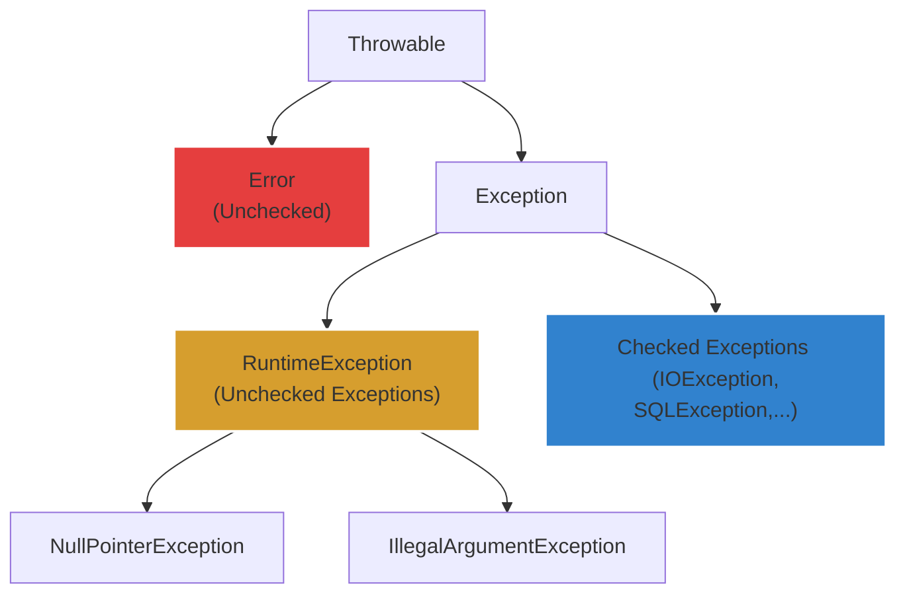

# Phân biệt Checked Exception và Unchecked Exception trong Java

## ⚡ Tóm tắt ngắn (30s)
* **Checked Exception** (kế thừa lớp `Exception` ngoại trừ `RuntimeException`): Là các ngoại lệ **bắt buộc phải được khai báo** bằng từ khóa `throws` ở chữ ký hàm hoặc xử lý bằng khối `try-catch` tại thời điểm biên dịch (Compile-time). Thường đại diện cho các lỗi hệ thống khách quan nằm ngoài tầm kiểm soát của code (như mất mạng, mất file, lỗi DB).
* **Unchecked Exception** (kế thừa lớp `RuntimeException`): Là các ngoại lệ **không bắt buộc phải xử lý** lúc compile-time. Thường xảy ra do lỗi logic lập trình (bug) của nhà phát triển (như chia cho 0, null pointer, tràn mảng).

---

## 🔍 Chi tiết bản chất

### 1. Phân cấp kế thừa (Exception Hierarchy)
Mọi Exception trong Java đều bắt nguồn từ lớp cha `java.lang.Throwable`. Dưới đó chia thành hai nhánh chính:
* **`Error`**: Lỗi nghiêm trọng của hệ thống/phần cứng, ứng dụng không nên cố gắng catch (ví dụ: `OutOfMemoryError`, `StackOverflowError`).
* **`Exception`**: Các ngoại lệ có thể phục hồi.
  * Nhánh con `RuntimeException` $
ightarrow$ sinh ra các **Unchecked Exception**.
  * Các nhánh con khác kế thừa trực tiếp từ `Exception` $
ightarrow$ tạo nên các **Checked Exception** (như `IOException`, `SQLException`, `FileNotFoundException`).

### 2. Triết lý thiết kế & Xu hướng hiện đại
* **Checked Exception**: Yêu cầu lập trình viên phải lập kế hoạch dự phòng (Recoverable conditions). Ví dụ: Nếu không tìm thấy file cấu hình, chương trình cần bắt lỗi và nạp file mặc định thay vì sập hệ thống.
* **Unchecked Exception**: Đại diện cho các lỗi lập trình không thể tự phục hồi tại runtime (Programming errors). Cách khắc phục duy nhất là sửa code của lập trình viên chứ không phải viết khối catch để bỏ qua lỗi.
* **Xu hướng hiện đại**: Checked Exception đang bị chỉ trích nhiều vì làm mã nguồn cồng kềnh (boilerplate code) và phá vỡ khả năng kết hợp của Functional Programming (Streams/Lambda không cho phép ném ra checked exception dễ dàng). Hầu hết các framework lớn như Spring Framework đều chuyển đổi toàn bộ Checked Exception thành Unchecked Exception (ví dụ: `SQLException` $
ightarrow$ `DataAccessException`).

---

## 🎨 Sơ đồ Cấu trúc Cây Kế thừa Throwable trong Java



---

## 💻 Code Example

### BAD ❌ (Nuốt Exception nguy hại do bị bắt buộc catch checked exception)
```java
public void loadConfig() {
    try {
        FileReader fr = new FileReader("config.txt"); // Checked Exception
    } catch (FileNotFoundException e) {
        // ❌ Tồi tệ! Nuốt lỗi âm thầm chỉ để đối phó compiler. 
        // Khi chạy thực tế ứng dụng sẽ lỗi hành vi mà không có dấu vết log!
    }
}
```

### GOOD ✅ (Bọc Checked Exception thành Unchecked để làm sạch code)
```java
public void loadConfig() {
    try {
        FileReader fr = new FileReader("config.txt");
    } catch (FileNotFoundException e) {
        // ✅ Chuyển đổi thành RuntimeException kèm theo nguyên nhân gốc (cause)
        throw new CustomSystemException("File cấu hình hệ thống bị thiếu!", e);
    }
}
```

---

## 📊 Trade-off & Comparison Table

| Tiêu chí | Checked Exception | Unchecked Exception |
| :--- | :--- | :--- |
| **Kế thừa trực tiếp** | `java.lang.Exception` | `java.lang.RuntimeException` |
| **Thời điểm bắt buộc**| Compile-time (Trình biên dịch chặn nếu thiếu) | Runtime (Chỉ phát hiện khi thực thi) |
| **Mục đích thiết kế** | Xử lý lỗi khách quan từ môi trường bên ngoài | Cảnh báo lỗi logic lập trình của Dev |
| **Hành vi xử lý** | Phải `try-catch` hoặc khai báo `throws` | Không bắt buộc khai báo hay xử lý |
| **Use case chuẩn** | Thao tác File I/O, Network kết nối, SQL query | Kiểm tra tham số đầu vào (`null`, kích thước mảng) |

---

## ⚠️ Common Gotchas & Questions follow-up
1. **Lỗi Nuốt Exception (Swallowing Exception)**:
   Catch lỗi nhưng để trống block catch hoặc chỉ in ra log mà không ném lại lỗi làm mất dấu luồng xử lý của hệ thống, gây khó khăn cực độ cho việc debug.
2. **Khởi tạo Exception mà không ném**:
   ```java
   if (user == null) {
       new IllegalArgumentException("User cannot be null"); // ❌ Vô nghĩa! Thiếu từ khóa throw.
   }
   ```
3. 👉 **Câu hỏi đào sâu từ interviewer**: *Làm thế nào để xử lý Checked Exception trong Lambda Expression của Stream API mà không làm bẩn code?*
   *(Trả lời: Sử dụng kỹ thuật "Lombok Snippet SneakyThrows" hoặc tự viết một Functional interface Wrapper chuyển đổi checked exception thành unchecked exception tại chỗ).*