# Khi nào nên tự thiết kế Custom Exception trong Java?

## ⚡ Tóm tắt ngắn (30s)
* **Custom Exception** chỉ nên được tạo ra khi các lớp Exception chuẩn của JDK (như `IllegalArgumentException`, `IllegalStateException`...) không thể diễn tả đầy đủ ngữ nghĩa nghiệp vụ của lỗi.
* Sử dụng Custom Exception giúp:
  1. **Tách biệt lỗi nghiệp vụ (Business errors)** khỏi lỗi kỹ thuật thông thường để xử lý tập trung (ví dụ: ném lỗi `InsufficientBalanceException` để hệ thống tự động map mã HTTP Status `422 Unprocessable Entity` trả về API Client).
  2. **Đính kèm thêm metadata nghiệp vụ** (ví dụ: mã lỗi chuyên biệt, ID giao dịch, thời điểm xảy ra lỗi) phục vụ phân tích log.

---

## 🔍 Chi tiết bản chất

### 1. Khi nào KHÔNG nên tạo Custom Exception?
Tránh tình trạng "Lạm phát Class" (Class Explosion). Đừng tạo custom class nếu chỉ để đặt một cái tên khác mà không có bất kỳ logic xử lý hay dữ liệu đặc trưng nào đi kèm.
Hãy sử dụng lại các Exception chuẩn của JDK:
* `IllegalArgumentException`: Khi tham số truyền vào phương thức không hợp lệ (ví dụ: truyền tuổi âm).
* `IllegalStateException`: Khi trạng thái của đối tượng chưa sẵn sàng thực thi lệnh (ví dụ: gọi lệnh gửi email khi chưa thiết lập kết nối SMTP).
* `UnsupportedOperationException`: Khi phương thức chưa được hỗ trợ.

### 2. Thiết kế Custom Exception chuẩn mực Enterprise
Khi thực sự cần tạo một Custom Exception:
1. **Luôn kế thừa `RuntimeException` (Unchecked)**: Để giảm bớt gánh nặng khai báo cú pháp cho người gọi, trừ khi bạn có lý do cực kỳ đặc biệt yêu cầu bắt buộc xử lý tại compile-time.
2. **Khai báo đầy đủ các constructor tiêu chuẩn**: Đảm bảo kế thừa cơ chế truyền thông điệp lỗi (`message`) và nguyên nhân gốc (`cause`) để lưu lại dấu vết Stack Trace đầy đủ.
3. **Giữ tính bất biến (Immutable)**: Chỉ cung cấp getter cho các trường metadata tùy biến, không cung cấp setter.

---

## 🎨 Sơ đồ Luồng Xử lý Exception Nghiệp vụ Tập trung

```mermaid
graph TD
    A["Nghiệp vụ: Thanh toán hóa đơn"] --> B{"Số dư đủ?"}
    B -- No --> C["throw new InsufficientBalanceException(needed, actual)"]
    C --> D["GlobalExceptionHandler (Spring ControllerAdvice)"]
    D --> E["Ghi log chi tiết Metadata kèm mã giao dịch"]
    D --> F["Trả về JSON API chuẩn: HTTP Status 422 <br> errorCode: 'PAYMENT_004'"]
    
    style C fill:#e53e3e,stroke:#fff,stroke-width:2px
    style D fill:#1a365d,stroke:#3182ce,stroke-width:2px
```



---

## 💻 Code Example

### BAD ❌ (Sử dụng Exception chung chung cho logic nghiệp vụ chuyên sâu)
```java
public void withdraw(double amount) {
    if (amount > balance) {
        // ❌ Quá chung chung! Người gọi không thể biết thiếu bao nhiêu tiền để gợi ý người dùng nạp thêm.
        throw new RuntimeException("Không đủ tiền trong tài khoản"); 
    }
    balance -= amount;
}
```

### GOOD ✅ (Triển khai Custom Exception chuyên nghiệp kèm Metadata nghiệp vụ)
```java
// Định nghĩa Custom Exception bất biến (Immutable)
public class InsufficientBalanceException extends RuntimeException {
    private final double requiredAmount;
    private final double currentBalance;
    private final String errorCode;

    public InsufficientBalanceException(String message, double requiredAmount, double currentBalance) {
        super(message);
        this.requiredAmount = requiredAmount;
        this.currentBalance = currentBalance;
        this.errorCode = "BANKING_ERR_009"; // Mã lỗi định danh nghiệp vụ
    }

    public double getRequiredAmount() { return requiredAmount; }
    public double getCurrentBalance() { return currentBalance; }
    public String getErrorCode() { return errorCode; }
}

// Sử dụng:
public void withdraw(double amount) {
    if (amount > balance) {
        throw new InsufficientBalanceException("Giao dịch thất bại: Số dư tài khoản không đủ.", amount, balance);
    }
    balance -= amount;
}
```

---

## 📊 Bảng phân tích So sánh Thiết kế

| Đặc tính | Sử dụng Exception chuẩn của JDK | Sử dụng Custom Exception |
| :--- | :--- | :--- |
| **Độ phức tạp mã nguồn**| Rất thấp (không cần tạo file class mới) | Trung bình (cần viết và bảo trì thêm class) |
| **Mức độ diễn tả ngữ nghĩa**| Kém, mang tính chất kỹ thuật thuần túy | **Tuyệt vời**, ánh xạ trực tiếp ngôn ngữ nghiệp vụ |
| **Khả năng đính kèm dữ liệu**| Không thể (chỉ lưu được chuỗi String message)| **Rất tốt** (thêm được bất cứ trường đối tượng nào) |
| **Hỗ trợ xử lý tập trung**| Khó phân loại khi viết khối catch | Dễ dàng bắt chính xác loại lỗi để xử lý riêng biệt |

---

## ⚠️ Common Gotchas & Questions follow-up
* **Quên truyền nguyên nhân gốc (`cause`)**:
  Khi bắt một exception kỹ thuật để chuyển đổi thành exception nghiệp vụ, nếu lập trình viên không truyền exception cũ vào constructor `super(message, cause)`, toàn bộ dấu vết Stack Trace gốc từ database hay thư viện bên dưới sẽ bị xóa sạch, khiến việc tìm kiếm nguyên nhân thực sự của lỗi trở nên bất khả thi.
* 👉 **Câu hỏi đào sâu từ interviewer**: *Làm sao tích hợp Custom Exception của bạn với cơ chế Spring Boot để tự động hóa việc trả về HTTP status và Error Code chuẩn xác cho client?*
  *(Trả lời: Sử dụng annotation `@ResponseStatus` trực tiếp trên class Custom Exception hoặc tạo một lớp `@ControllerAdvice` kết hợp `@ExceptionHandler(CustomException.class)` để bắt lỗi tập trung, trích xuất metadata và build đối tượng `ResponseEntity` chuẩn trả về cho phía Frontend).*