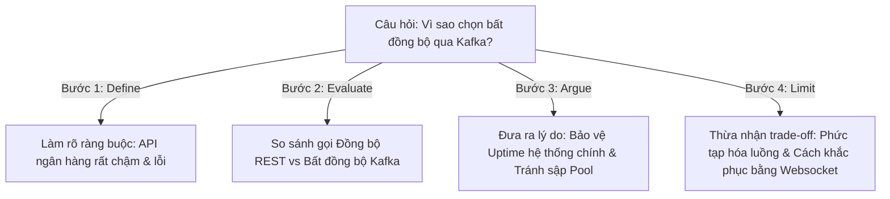

# Khung Tư Duy Trả Lời Câu Hỏi "Vì Sao Bạn Chọn Cách Đó?" (Technical Choice Justification Framework)

## ⚡ Tóm tắt ngắn (30s)
* **Tư duy cốt lõi**: Khi interviewer hỏi *"Vì sao bạn chọn cách đó?"*, họ không muốn nghe những câu trả lời thiên vị công nghệ (như *"Vì nó đang hot"*, *"Vì tôi quen dùng nó"*). Họ đang đánh giá **quy trình ra quyết định kỹ thuật (Decision-Making Process), khả năng tư duy đa chiều và sự thấu hiểu sâu sắc các ràng buộc thực tế** của một Senior Engineer.
* **Bộ khung trả lời 4 Cột Trụ (DEAL Framework)**:
  1. *Ràng buộc & Bối cảnh (Define Constraints)*: Làm rõ các giới hạn về thời gian, ngân sách, nhân sự, hạ tầng và mục tiêu kinh doanh.
  2. *Đánh giá các Phương án (Evaluate Options)*: Trình bày ít nhất 2 phương án khả thi khác mà bạn đã cân nhắc, so sánh khách quan.
  3. *Lý do Quyết định (Argue the Choice)*: Chỉ ra lý do cốt lõi tại sao phương án được chọn giải quyết tốt nhất các ràng buộc trên.
  4. *Giới hạn & Khắc phục (Limit & Mitigate)*: Trung thực thừa nhận nhược điểm (trade-off) của phương án đã chọn và nêu cách kiểm soát/giám sát nó.

---

## 🔍 Kịch bản thực chiến (STAR Framework)

### 1. Situation (Bối cảnh)
Trong một buổi phỏng vấn vị trí Senior Backend Engineer/System Architect tại một tập đoàn tài chính công nghệ (Fintech) lớn, sau khi tôi hoàn thành bản vẽ thiết kế hệ thống xử lý giao dịch hoàn tiền (Refund Processing System) có khả năng chịu tải cao và tích hợp nhiều ngân hàng. 
Interviewer nhìn vào mô hình của tôi và đặt câu hỏi đào sâu bất ngờ: *"Tôi thấy bạn thiết kế luồng gọi ngân hàng qua cơ chế hàng đợi Kafka và Worker xử lý bất đồng bộ, thay vì cho API Gateway gọi trực tiếp đồng bộ sang ngân hàng rồi trả kết quả ngay cho người dùng. Vì sao bạn lại chọn cách phức tạp đó?"*

### 2. Task (Thử thách)
Tôi phải đưa ra một câu trả lời thuyết phục cao độ, chứng minh được tư duy kiến trúc sắc bén của một Senior thực thụ, chuyển giao từ phản xạ tự nhiên sang một khung lập luận logic, có cấu trúc chặt chẽ đè bẹp mọi nghi ngờ của interviewer.

### 3. Action (Hành động)
Tôi áp dụng bộ khung lập luận **DEAL (Define - Evaluate - Argue - Limit)** để trả lời một cách tự tin:

* **Bước 1: Làm rõ Ràng buộc & Bối cảnh thực tế (Define Constraints)**
  Tôi bắt đầu bằng việc thiết lập hệ quy chiếu:
  - *"Để trả lời câu hỏi này, chúng ta cần nhìn vào các ràng buộc thực tế cực kỳ khắc nghiệt của hệ thống thanh toán: API của các ngân hàng đối tác thường rất chậm (độ trễ trung bình từ 1 - 5 giây) và có tỷ lệ downtime hoặc lỗi mạng bất ngờ lên tới 2%."*

* **Bước 2: So sánh khách quan các Phương án (Evaluate Options)**
  Tôi đưa ra sự so sánh chi tiết giữa hai cách tiếp cận:
  - **Phương án A (Gọi đồng bộ trực tiếp)**: API Gateway -> Core Service -> Bank API.
    * *Ưu điểm*: Cực kỳ đơn giản để lập trình, trả về kết quả thành công/thất bại ngay lập tức cho client.
    * *Nhược điểm*: Khi API ngân hàng bị chậm hoặc sập, toàn bộ thread của Core Service sẽ bị block để chờ đợi phản hồi. Dưới tải trung bình, Thread Pool của ứng dụng sẽ nhanh chóng bị cạn kiệt (Thread Exhaustion), gây sập dây chuyền toàn bộ hệ thống chính (Cascading Failure).
  - **Phương án B (Bất đồng bộ qua Kafka - Được chọn)**: API Gateway nhận yêu cầu -> Ghi nhận vào DB với trạng thái `PENDING` -> Đẩy sự kiện vào Kafka -> Trả ngay HTTP 202 Accepted cho Client -> Worker lấy sự kiện ra gọi Bank API độc lập.

* **Bước 3: Đưa ra Lý do cốt lõi quyết định (Argue the Choice)**
  Tôi chỉ ra tại sao Phương án B là lựa chọn sống còn:
  - *"Tôi chọn phương án bất đồng bộ qua Kafka vì nó giải quyết được hai bài toán tối cao của hệ thống Enterprise:*
    1. **Bảo vệ Uptime hệ thống nội bộ (Fault Isolation / Bulkhead)**: Nếu ngân hàng đối tác bị sập hoàn toàn trong 2 tiếng, hệ thống chính của chúng ta vẫn chạy mượt mà, khách hàng vẫn bấm nút refund được và không hề nhận ra sự cố. Các yêu cầu refund sẽ được xếp hàng an toàn trong Kafka.
    2. **Khả năng tự động phục hồi (Self-Healing via Retry)**: Khi ngân hàng hoạt động trở lại, các Worker sẽ tự động tiêu thụ nốt các message trong Kafka và hoàn tất giao dịch cho khách hàng mà không cần bất kỳ sự can thiệp thủ công nào."*

* **Bước 4: Trung thực thừa nhận Trade-off & Nêu giải pháp khắc phục (Limit & Mitigate)**
  Tôi khép lại lập luận bằng việc chủ động nêu khuyết điểm và cách tôi kiểm soát nó:
  - *"Tất nhiên, tôi hiểu phương án này mang lại hai trade-offs lớn:*
    1. **Tăng độ phức tạp về UI/UX**: Khách hàng không thấy kết quả ngay. Tôi khắc phục bằng cách thiết kế cơ chế kết nối **Websocket/Server-Sent Events (SSE)** từ Frontend hoặc ứng dụng cơ chế **Polling** ngắn để cập nhật trạng thái tự động lên màn hình khi Worker hoàn tất cuộc gọi.
    2. **Rủi ro trùng lặp tin nhắn (Duplicate Message)**: Tôi giải quyết triệt để bằng cách thiết kế Worker hoạt động theo cơ chế **Idempotent Consumer**, sử dụng Transaction ID làm khóa duy nhất để đảm bảo mỗi yêu cầu refund chỉ được thực thi đúng 1 lần duy nhất tại phía ngân hàng."*

### 4. Result (Kết quả)
* **Thuyết phục interviewer tuyệt đối**: Người phỏng vấn gật đầu đồng ý hoàn toàn và ghi chú tích cực vào hồ sơ: *"Ứng viên có tư duy hệ thống xuất sắc, hiểu rõ ranh giới giữa lý thuyết và thực chiến vận hành."*
* **Chứng minh tầm vóc**: Khung câu trả lời DEAL giúp tôi nổi bật hơn 95% ứng viên khác vốn chỉ biết nói về cú pháp hay thư viện.

---

## 💡 Nguyên tắc Senior & Bài học đắt giá

1. **Không có giải pháp hoàn hảo, chỉ có giải pháp phù hợp nhất (No Silver Bullets)**: Mọi quyết định kiến trúc lớn đều là sự thỏa hiệp. Sự trưởng thành của một Senior Engineer thể hiện ở việc bạn hiểu rõ **cái giá phải trả (Trade-offs)** của giải pháp mình chọn là gì và bạn chấp nhận cái giá đó vì lợi ích kinh doanh lớn hơn mà nó mang lại.
2. **Quy tắc "Tiêu chuẩn hóa RFC" (Technical RFC Standard)**: Trong thực tế công việc tại doanh nghiệp, khi đề xuất bất kỳ thay đổi công nghệ nào, Senior nên viết một tài liệu RFC ngắn gọn trình bày đúng theo khung tư duy DEAL để nhận ý kiến đóng góp từ các team khác, tránh tranh luận cảm tính vô ích.
3. **Nói chuyện bằng con số định lượng**: Thay vì nói *"Tôi chọn Redis vì nó nhanh hơn"*, hãy nói *"Tôi chọn Redis làm lớp đệm cache vì nó giúp giảm tải cho database PostgreSQL từ 5.000 QPS xuống còn 200 QPS, cải thiện p99 latency từ 300ms xuống còn 12ms."*

---

## 📊 So sánh phương án quyết định (Trade-offs)

| Khung lập luận | Điểm mạnh (Pros) | Điểm yếu (Cons) | Tầm ảnh hưởng phỏng vấn |
| :--- | :--- | :--- | :--- |
| **Lập luận theo Công nghệ (Tech-driven argument)** | - Dễ nói, không cần chuẩn bị nhiều. - Thể hiện sự say mê công nghệ. | - Rất hời hợt, mang tính chủ quan. - Tạo cảm giác ứng viên bị "nghiện công nghệ" (Hype-driven Dev). | **Thấp**. Thường bị đánh giá ở level Junior/Mid do thiếu tư duy thực tế doanh nghiệp. |
| **Lập luận DEAL (Business & Constraints Framework - Khuyên dùng)** | - Thể hiện **tầm nhìn vĩ mô của một Architect**. - Lập luận chặt chẽ, không thể bị phản bác. - Trung thực thừa nhận giới hạn giúp tăng tính thuyết phục. | - Đòi hỏi ứng viên phải có tư duy hệ thống tốt và sự chuẩn bị kỹ lưỡng trước phỏng vấn. | **Cực cao**. Khẳng định chắc chắn năng lực ở level Senior/Staff Engineer. |

---

## ⚠️ Common Gotchas (Câu hỏi phỏng vấn đào sâu)

### 1. Nếu interviewer phản biện rằng: "Giải pháp bất đồng bộ qua Kafka của bạn quá đắt đỏ và phức tạp để vận hành cho một team startup nhỏ chỉ có 3 dev. Bạn có thay đổi quyết định của mình không?"
* **Trả lời**: Đây là câu hỏi bẫy kiểm tra tính linh hoạt và thực tế của bạn (Pragmatism vs Dogmatism):
  * **Cách ứng phó thông minh**:
    - Tôi sẽ lập tức đồng tình và điều chỉnh giải pháp: *"Đó là một phản biện cực kỳ chính xác. Ràng buộc về nguồn lực vận hành (Team Size & DevOps capability) là một ràng buộc tối quan trọng.*
    - *Nếu nằm trong bối cảnh team startup nhỏ 3 dev, tôi kiên quyết **rút lại giải pháp Kafka** để tiết kiệm chi phí hạ tầng và cognitive load cho team.*
    - *Thay vào đó, tôi sẽ chọn giải pháp trung gian đơn giản hơn nhiều nhưng vẫn đảm bảo an toàn:*
      1. **Spring Boot `@Async` với Thread Pool giới hạn**: Vẫn gọi Bank API bất đồng bộ ngay trong nội bộ bộ nhớ của JVM.
      2. **Transactional Outbox Pattern tối giản bằng Database**: Lưu yêu cầu refund vào một bảng `outbox` trong cùng transaction ghi hóa đơn, sau đó dùng một thư viện cực nhẹ như **ShedLock** để chạy background job quét bảng và gửi sang ngân hàng.
    - *Cách làm này giúp chúng ta đạt được 80% lợi ích cô lập lỗi của Kafka mà không tốn 1 đồng chi phí hạ tầng hay vận hành phức tạp nào."*

### 2. Làm thế nào bạn tự bảo vệ mình khỏi thiên kiến xác nhận (Confirmation Bias) - tức là bạn luôn có xu hướng lựa chọn công nghệ mà bạn đã rất thành thạo trước đó, thay vì chọn công nghệ thực sự phù hợp nhất cho dự án mới?
* **Trả lời**: Đây là câu hỏi kiểm tra khả năng tự nhận thức (Self-awareness) và kỷ luật tư duy:
  * **Giải pháp kiểm soát thiên kiến**:
    1. **Sử dụng Bảng Ma Trận Quyết Định (Decision Matrix)**: Tôi không ra quyết định dựa trên cảm xúc. Tôi lập bảng so sánh các công nghệ dựa trên các tiêu chí cứng được trọng số hóa: *Hiệu năng (Performance), Độ an toàn (Security), Độ trưởng thành thư viện (Maturity), Đường cong học tập của team (Learning Curve), Khả năng tương thích hệ thống cũ (Compatibility).*
    2. **Mời phản biện độc lập (Peer Review / Architecture Guild)**: Tôi luôn gửi bản thiết kế thiết kế của mình cho các Senior/Architect ở các team khác - những người không có thiên kiến giống tôi - và yêu cầu họ chủ động tìm ra các lỗ hổng hoặc chỉ ra những chỗ tôi đang "thiên vị" một công nghệ cụ thể.
    3. **Chấp nhận làm Prototype kiểm chứng**: Nếu phân vân giữa công nghệ tôi cực kỳ quen (ví dụ: Spring Boot) và một công nghệ mới phù hợp hơn (ví dụ: Go/Rust cho service tính toán hiệu năng cao), tôi sẽ dành 2 ngày viết một ứng dụng siêu nhỏ bằng cả hai ngôn ngữ để đo đạc chỉ số RAM/CPU thực tế trước khi đưa ra quyết định cuối cùng.
