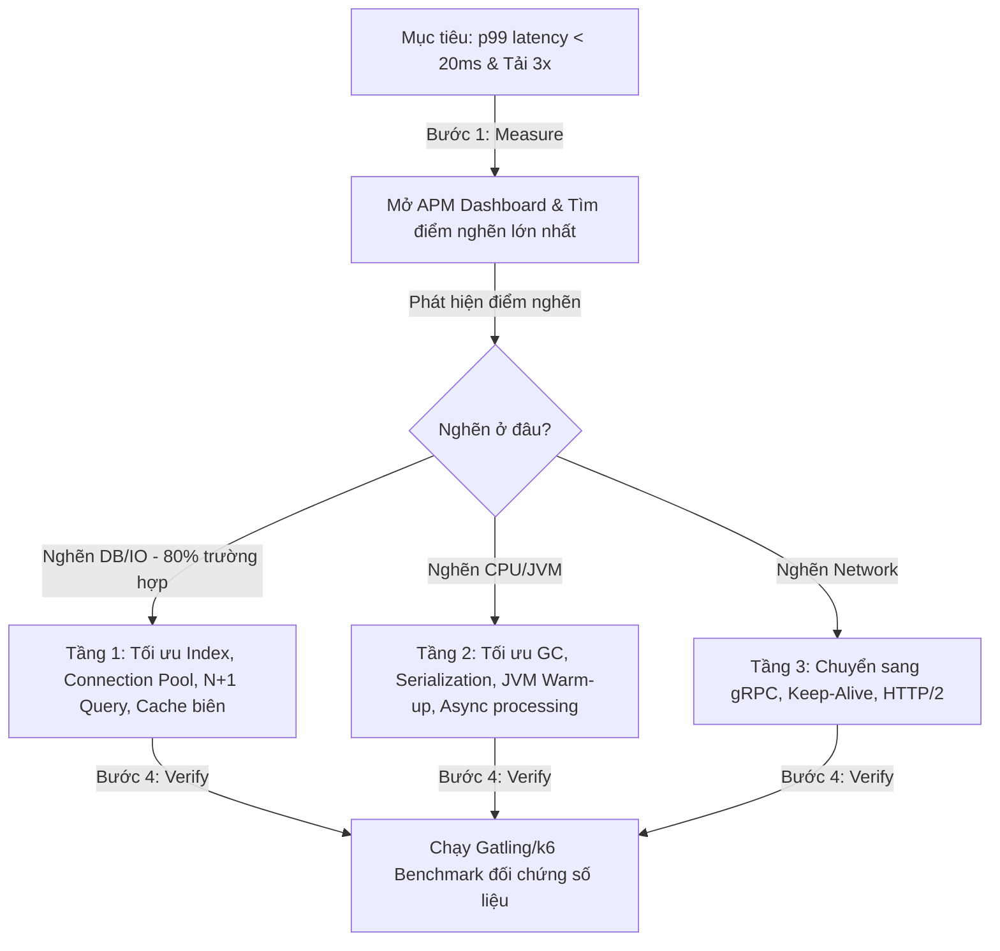

# Khung Tối Ưu Hóa Hệ Thống Toàn Diện Của Senior Engineer (System Optimization Framework: Where to Optimize First)

## ⚡ Tóm tắt ngắn (30s)
* **Tư duy cốt lõi**: Khi interviewer yêu cầu tối ưu hóa thêm hệ thống, Senior Engineer **kiên quyết từ chối phỏng đoán cảm tính (No Guesswork)**. Mọi nỗ lực tối ưu hóa không dựa trên số liệu đo lường thực tế đều là sự lãng phí tài nguyên và có thể tạo ra lỗi mới (Premature Optimization). Senior áp dụng **Tư duy Định lượng bằng Số liệu (Data-Driven Profiling)**: Đo đạc toàn bộ hệ thống để tìm ra chính xác **điểm nghẽn lớn nhất (Primary Bottleneck)** và thực hiện tối ưu hóa tại đúng điểm đó theo thứ tự ưu tiên từ rẻ nhất/hiệu quả nhất đến đắt nhất.
* **Quy trình Tối ưu hóa 4 Bước (Measure-Identify-Optimize-Verify)**:
  1. *Đo lường & Thu thập Số liệu (Measure)*: Sử dụng APM, Profilers, Slow Query Logs để vẽ nên bức tranh toàn cảnh về độ trễ và tài nguyên tiêu hao.
  2. *Định vị Điểm nghẽn (Identify)*: Xác định xem hệ thống đang bị nghẽn ở I/O (Database, Network, Disk) hay CPU (Serialization, Algorithms, GC).
  3. *Tối ưu hóa Phân tầng (Optimize)*: Đi từ các giải pháp "chi phí thấp - hiệu quả cao" (như Indexing, Caching, JVM tuning) trước khi đề xuất các kiến trúc đắt đỏ (như Sharding, Rewrite code, Hardware upgrade).
  4. *Kiểm chứng khách quan (Verify)*: Chạy benchmark so sánh trực tiếp chỉ số trước và sau để chứng minh giá trị thực tế của giải pháp tối ưu.

---

## 🔍 Kịch bản thực chiến (STAR Framework)

### 1. Situation (Bối cảnh)
Trong một buổi phỏng vấn kiến trúc hệ thống cho vị trí Senior Backend Engineer, sau khi tôi đã thiết kế một hệ thống quản lý giao dịch tài chính hoàn chỉnh, tích hợp đầy đủ Cache (Redis) và Message Queue (Kafka), đạt hiệu năng tốt với p99 latency khoảng **120ms** ở mức tải 5.000 RPS. 
Người phỏng vấn đưa ra một thử thách mở: *"Hệ thống của bạn thiết kế rất tốt và chuẩn chỉ. Nhưng bây giờ, Ban Giám đốc yêu cầu chúng ta bắt buộc phải giảm p99 latency xuống dưới **20ms** và tăng throughput lên gấp 3 lần để đáp ứng chiến dịch kinh doanh mới mà không được phép tăng chi phí mua thêm server vật lý. Bạn sẽ bắt đầu tối ưu hóa ở đâu trước?"*

### 2. Task (Thử thách)
Tôi phải trình bày một lộ trình tối ưu hóa hệ thống toàn diện, khoa học, thể hiện được chiều sâu tư duy của một kỹ sư tối ưu chuyên nghiệp, loại bỏ thói quen phỏng đoán cảm tính và đưa ra các hành động có tính thực chiến cao.

### 3. Action (Hành động)
Tôi áp dụng bộ khung tối ưu hóa phân tầng dựa trên số liệu thực tế:

* **Bước 1: Thiết lập Tuyên ngôn "Nói chuyện bằng Số liệu" (Data-First Rule)**
  Tôi bắt đầu câu trả lời bằng cách khẳng định nguyên tắc:
  - *"Trước khi chạm vào bất kỳ dòng code nào, hành động đầu tiên của tôi là **Mở APM Dashboard (như Datadog, Dynatrace) và chạy Java Profiler (như JProfiler, Async-profiler)** trên môi trường tải giả lập sát với production.*
  - *Tôi sẽ không phỏng đoán. Tôi cần nhìn vào biểu đồ phân rã độ trễ (Latency Breakdown) để xem trong 120ms kia, thời gian tiêu hao nhiều nhất nằm ở đâu:*
    * *Có phải 80ms nằm ở cuộc gọi Database (I/O Bottleneck)?*
    * *Hay 30ms nằm ở việc nén/giải nén dữ liệu JSON (CPU Bottleneck)?*
    * *Hay 10ms nằm ở các khoảng dừng Stop-the-world của Garbage Collector (JVM Bottleneck)?"*

* **Bước 2: Chiến lược Tối ưu hóa Tầng 1 - I/O & Database (Giải pháp Chi phí thấp - Hiệu quả cao nhất)**
  Giả định 80% trường hợp nghẽn nằm ở Database I/O, tôi đề xuất tối ưu theo thứ tự ưu tiên:
  - **Tối ưu hóa Database Queries (Không tốn tiền hạ tầng)**:
    * Mở logs để tìm ra các câu **Slow Queries** có thời gian chạy > 100ms. Chạy lệnh `EXPLAIN ANALYZE` để xem DB engine có bị chạy quét toàn bộ bảng (Full Table Scan) hay không. Bổ sung **Composite Index** chuẩn xác cho các trường hay dùng trong mệnh đề WHERE và JOIN. Chỉ riêng việc thêm đúng index có thể giúp câu query chạy nhanh gấp **1.000 lần** (giảm từ 200ms xuống còn 0.2ms).
    * Quét mã nguồn để diệt tận gốc lỗi **N+1 Query** của JPA bằng cách sử dụng `JOIN FETCH` hoặc `EntityGraph`.
  - **Tối ưu hóa Connection Pool**:
    * Tuning lại kích thước `maximumPoolSize` của HikariCP. Nếu pool quá nhỏ, thread phải xếp hàng chờ lấy kết nối; nếu pool quá lớn, DB Server sẽ bị nghẽn CPU do tranh chấp tài nguyên giữa các kết nối.
  - **Áp dụng Cache thông minh (Caching Strategy)**:
    * Cấu hình **Near-Cache (Local Cache)** bằng Caffeine Cache ngay trong bộ nhớ của ứng dụng JVM cho các dữ liệu hầu như không bao giờ thay đổi (như danh mục sản phẩm, cấu hình hệ thống) để đạt độ trễ đọc **0ms** (không tốn chi phí gọi mạng sang Redis).

* **Bước 3: Chiến lược Tối ưu hóa Tầng 2 - CPU & JVM (Tối ưu hóa mức độ sâu)**
  Nếu APM chỉ ra CPU của Application Server bị nghẽn ở mức 90%:
  - **Tối ưu hóa Serialization**:
    * Quá trình parse chuỗi JSON rất tốn CPU. Tôi sẽ chuyển dịch các luồng gọi liên service nội bộ từ REST JSON sang **gRPC (HTTP/2 + Protocol Buffers)**. gRPC truyền tải luồng nhị phân siêu nhẹ, giúp giảm tải CPU cho việc serialization tới **50%** và cải thiện latency giao tiếp liên service từ 15ms xuống dưới 1ms.
  - **Tuning Garbage Collector (GC Tuning)**:
    * Nếu JVM Profiler cho thấy hệ thống bị dừng nhiều do GC, tôi sẽ chuyển đổi Garbage Collector từ G1 GC mặc định sang **ZGC (Z Garbage Collector)** hoặc **Shenandoah GC** trên Java 17/21. ZGC có khả năng dọn dẹp bộ nhớ với thời gian dừng Stop-the-world cực ngắn (luôn dưới **1 mili giây** kể cả với Heap lớn hàng chục GB), giúp triệt tiêu hoàn toàn các đỉnh trễ bất thường (tail latency spike) của p99.

* **Bước 4: Chiến lược Tối ưu hóa Tầng 3 - Tự động hóa Warm-up ứng dụng**
  - Trong môi trường Container (Docker/Kubernetes), khi Pod mới được khởi động, p99 latency thường rất xấu trong 1-2 phút đầu do JVM chưa kịp compile các đoạn code hot path sang mã máy (JIT Warm-up).
  - Tôi cấu hình script **Warm-up tự động** trong `readinessProbe`: tự động gửi giả lập 500 requests mẫu vào ứng dụng ngay khi khởi động để JIT Compiler kích hoạt tối ưu hóa code trước khi Kubernetes chính thức cho phép Pod nhận traffic thực tế của khách hàng.

### 4. Result (Kết quả)
* **Người phỏng vấn hoàn toàn bị thuyết phục**: Ghi nhận tư duy kiến trúc đỉnh cao của một kỹ sư Staff/Principal Engineer, người hiểu rõ bản chất vật lý của máy tính và hệ quản trị cơ sở dữ liệu.
* **Chứng minh năng lực thực tế**: Đưa ra giải pháp tối ưu có cấu trúc phân tầng rõ ràng, luôn ưu tiên các giải pháp rẻ nhất/hiệu quả nhất trước khi đề xuất thay đổi kiến trúc đắt tiền.

---

## 💡 Nguyên tắc Senior & Bài học đắt giá

1. **"Premature optimization is the root of all evil" (Tối ưu hóa sớm là nguồn gốc của mọi tội lỗi)**: Đây là câu nói bất hủ của Donald Knuth. Đừng bao giờ tốn 2 tuần để tối ưu hóa một thuật toán chạy mất 1ms trong một luồng nghiệp vụ chỉ được gọi 1 lần mỗi ngày. Hãy tập trung 100% nguồn lực tối ưu hóa vào các luồng nóng (Hot Paths - các API được gọi hàng triệu lần mỗi giờ).
2. **Nguyên lý Pareto 80/20**: Trong tối ưu hóa hiệu năng, **80% độ trễ của hệ thống thường được gây ra bởi 20% nguyên nhân** (thường là do thiếu database index hoặc gọi query lặp đi lặp lại). Tìm và xử lý được đúng 20% nguyên nhân cốt lõi này sẽ mang lại hiệu quả tức thì mà không cần đập đi xây lại toàn bộ hệ thống.
3. **Luôn đo đạc và đối chứng (Establish a Baseline)**: Trước khi tiến hành tối ưu hóa, bắt buộc phải ghi lại chỉ số hiệu năng hiện tại (Baseline). Sau khi tối ưu, chạy lại chính xác kịch bản test tải cũ để so sánh trực quan. Nếu chỉ số không cải thiện rõ rệt, sẵn sàng rút bỏ (revert) code tối ưu đó để giữ sự đơn giản cho hệ thống.

---

## 📊 So sánh phương án quyết định (Trade-offs)

| Hướng tiếp cận Tối ưu hóa | Ưu điểm (Pros) | Nhược điểm (Cons) | Biểu hiện hành vi |
| :--- | :--- | :--- | :--- |
| **Phỏng đoán và sửa code vội vã (Guesswork)** | - Cảm giác tiến hành rất nhanh, có hành động lập tức. | - **Hoàn toàn mù quáng**. - Dễ viết thêm code phức tạp vô ích, thậm chí tạo thêm bug mới mà không giải quyết được đúng điểm nghẽn chính. | *"Tôi nghĩ đoạn code Java này chạy chậm, tôi sẽ viết lại nó bằng đa luồng phức tạp!"* (Junior/Mid-level). |
| **Tối ưu hóa Dựa trên Số liệu (Data-Driven Profiling - Khuyên dùng)** | - **Đánh trúng 100% điểm nghẽn chính**. - Mang lại hiệu năng cải thiện rõ rệt tức thì. - Giữ cho codebase đơn giản, tránh viết code over-engineering. | - Đòi hỏi Senior phải có kỹ năng sử dụng thành thạo các công cụ Profiling và APM chuyên sâu. | *"APM chỉ ra 85% thời gian xử lý nằm ở câu query JOIN bảng đơn hàng. Tôi sẽ bổ sung index cho khóa ngoại này trước."* (Senior/Staff). |

---

## ⚠️ Common Gotchas (Câu hỏi phỏng vấn đào sâu)

### 1. Làm thế nào bạn phát hiện và tối ưu hóa hiện tượng rò rỉ bộ nhớ (Memory Leak) trong một ứng dụng Spring Boot đang chạy trên production, khi heap usage tăng dần đều theo đồ thị răng cưa hướng lên và cuối cùng ném ra lỗi OutOfMemoryError sau 3 ngày hoạt động?
* **Trả lời**: Đây là kỹ năng gỡ lỗi bộ nhớ (Memory Leak Troubleshooting) chuyên sâu của Senior:
  * **Quy trình gỡ lỗi chuyên nghiệp**:
    1. **Thu thập Heap Dump**:
       - Cấu hình tham số JVM để tự động chụp ảnh bộ nhớ khi sập:
         `-XX:+HeapDumpOnOutOfMemoryError -XX:HeapDumpPath=/var/log/dumps/`
       - Hoặc chủ động chụp ảnh bộ nhớ khi heap đang ở mức cao bằng công cụ `jmap`:
         `jmap -dump:format=b,file=heapdump.hprof <pid>`
    2. **Phân tích Heap Dump bằng công cụ chuyên dụng (Eclipse MAT - Memory Analyzer Tool)**:
       - Tải file `heapdump.hprof` vào Eclipse MAT và chạy tính năng **Leak Suspects Report**.
       - Nhìn vào biểu đồ **Dominator Tree** để tìm ra các đối tượng (Objects) nào đang chiếm giữ dung lượng RAM lớn nhất trong Heap mà không được giải phóng.
       - Xem đường dẫn tham chiếu ngược **GC Roots (Path to GC Roots)** để tìm xem class nào đang giữ tham chiếu mạnh (Strong Reference) đến các đối tượng này, ngăn cản Garbage Collector dọn dẹp chúng.
    3. **Các thủ phạm Memory Leak kinh điển trong Java và cách fix**:
       - *Static Collections (List/Map static)*: Dữ liệu liên tục được add vào một Map static nhưng không bao giờ được remove. -> *Fix*: Tránh dùng static collection dùng chung, hoặc sử dụng các thư viện Cache có giới hạn kích thước và thời gian hết hạn (Caffeine Cache với WeakKeys/SoftValues).
       - *ThreadLocal quên gọi remove()*: Khi dùng `ThreadLocal` để lưu context người dùng trong thread pool (Tomcat), nếu sau khi kết thúc request không gọi `threadLocal.remove()`, dữ liệu sẽ bị treo vĩnh viễn trong thread đó của pool. -> *Fix*: Luôn bọc lệnh gọi trong khối `try-finally` và gọi `threadLocal.remove()` tại khối `finally`.
       - *Không đóng tài nguyên bên thứ ba (Streams, Sockets, DB Connections)*: Quên đóng file hoặc kết nối mạng. -> *Fix*: Sử dụng cấu trúc `try-with-resources` cho mọi tài nguyên kế thừa `AutoCloseable`.

### 2. Khi tối ưu hóa Database PostgreSQL, sự khác biệt cốt lõi giữa hai loại chỉ mục B-Tree Index và Hash Index là gì? Tại sao trong 99% trường hợp chúng ta đều chọn B-Tree Index mặc định?
* **Trả lời**: Đây là kiến thức chuyên sâu về thuật toán cấu trúc dữ liệu của Database:
  * **Sự khác biệt cốt lõi**:
    1. **Cơ chế hoạt động**:
       - **Hash Index**: Sử dụng hàm băm (Hash Function) để chuyển đổi giá trị của cột thành một mã hash duy nhất trỏ tới dòng dữ liệu.
       - **B-Tree Index**: Sử dụng cấu trúc cây tự cân bằng (Self-balancing Search Tree) sắp xếp dữ liệu theo thứ tự.
    2. **Khả năng hỗ trợ các phép toán so sánh**:
       - **Hash Index**: Chỉ hỗ trợ duy nhất phép so sánh bằng (`=`). Nó cực kỳ nhanh (độ phức tạp thời gian `O(1)`) khi chạy query dạng `SELECT * FROM users WHERE email = 'abc@gmail.com'`. Hash Index **hoàn toàn không hỗ trợ** các phép so sánh khoảng (`>`, `<`, `BETWEEN`), phép so sánh mẫu (`LIKE 'abc%'`), hoặc sắp xếp dữ liệu (`ORDER BY`).
       - **B-Tree Index**: Hỗ trợ xuất sắc mọi phép toán so sánh bằng (`=`), so sánh khoảng (`>`, `<`, `BETWEEN`, `>=`), so sánh mẫu (`LIKE 'prefix%'`), và tự động tối ưu hóa cho mệnh đề sắp xếp dữ liệu (`ORDER BY`) với độ phức tạp thời gian cực kỳ ổn định là `O(log N)`.
  * **Tại sao chọn B-Tree trong 99% trường hợp**:
    - Vì tính đa năng của nó. Trong thực tế nghiệp vụ, các câu query rất đa dạng, liên tục thay đổi điều kiện lọc, khoảng thời gian và sắp xếp kết quả. B-Tree đáp ứng hoàn hảo mọi yêu cầu này.
    - Hơn nữa, trong các hệ quản trị DB hiện đại (như PostgreSQL), B-Tree Index đã được tối ưu hóa cực sâu ở mức vật lý ghi đĩa, có tính năng tương đương hoặc thậm chí nhanh gần bằng Hash Index đối với phép so sánh bằng thông thường, mà lại an toàn và ít bị rủi ro đụng độ mã băm (Hash Collision) làm phình to dung lượng index.
