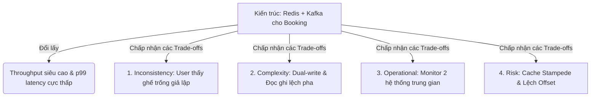

# Khung Phân Tích Và Trình Bày Trade-offs Kiến Trúc Của Senior Engineer (Architectural Trade-offs Analysis Framework)

## ⚡ Tóm tắt ngắn (30s)
* **Tư duy cốt lõi**: Trong kiến trúc phần mềm, **không có giải pháp tốt nhất (No Best Solution), chỉ có sự đánh đổi (Every Solution is a Trade-off)**. Khi interviewer hỏi *"Trade-off của giải pháp này là gì?"*, họ đang kiểm tra xem bạn có nhìn thấy mặt tối của công nghệ bạn vừa vẽ ra hay không, hay bạn đang bị che mắt bởi sự hào nhoáng của nó.
* **Bộ khung phân tích Trade-off toàn cảnh (TIGHTS Framework)**:
  1. *Độ phức tạp nhận thức (Complexity / Cognitive Load)*: Giải pháp mới làm tăng bao nhiêu độ khó cho dev mới gia nhập team?
  2. *Chi phí Vận hành (Operational Overhead & Cost)*: Tốn thêm bao nhiêu tiền hạ tầng, công sức giám sát (Observability) và bảo trì?
  3. *Hiệu năng & Tài nguyên (Performance & Resource Consumption)*: Cải thiện độ trễ (latency) nhưng làm tốn thêm bao nhiêu RAM/CPU hoặc băng thông?
  4. *Tính Nhất quán & Tính Khả dụng (Consistency vs Availability)*: Theo đuổi CAP Theorem ở khía cạnh nào?
  5. *Độ tin cậy & Rủi ro sụp đổ (Reliability & Blast Radius)*: Điểm nghẽn duy nhất (Single Point of Failure) mới xuất hiện ở đâu?

---

## 🔍 Kịch bản thực chiến (STAR Framework)

### 1. Situation (Bối cảnh)
Trong một buổi phỏng vấn thiết kế hệ thống cho vị trí Senior Backend Engineer, tôi vừa trình bày một kiến trúc microservices phân tán phức tạp cho hệ thống đặt vé xem phim (Booking System) có khả năng chịu tải hàng chục nghìn RPS lúc mở bán phim bom tấn. 
Tôi đề xuất tách luồng hiển thị danh sách ghế trống (Seat Availability) sử dụng Redis Cluster làm lớp đệm cache hiệu năng cao, cập nhật bất đồng bộ trạng thái qua Kafka mỗi khi có user đặt ghế thành công để giảm tải tối đa cho Database PostgreSQL lõi. 
Interviewer cười và hỏi một câu hỏi kiểm tra độ chín muồi thực tế của tôi: *"Giải pháp Redis + Kafka này nghe rất hoành tràng. Nhưng trade-off thực sự của nó là gì? Bạn đã chấp nhận đánh đổi những điều gì để có được throughput cao?"*

### 2. Task (Thử thách)
Tôi phải phân tích và trình bày một cách tường tận, khách quan toàn bộ mặt trái của kiến trúc tôi vừa vẽ ra, sử dụng một cấu trúc lập luận chuẩn mực, chứng minh bản thân không bị say sưa công nghệ và có cái nhìn thực tế sâu sắc.

### 3. Action (Hành động)
Tôi áp dụng bộ khung lập luận **TIGHTS (Complexity - Operations - Consistency - Reliability - Metaphor)** để phân tích chi tiết:

* **Bước 1: Chấp nhận đánh đổi về Nhất quán dữ liệu (Consistency Trade-off)**
  Tôi thẳng thắn thừa nhận việc phá vỡ tính nhất quán mạnh (Strong Consistency):
  - *"Đầu tiên, tôi đã **chấp nhận từ bỏ tính Nhất quán mạnh để đổi lấy tính Khả dụng cao (AP over CP trong CAP Theorem)**. 
  - Do cập nhật trạng thái ghế trống qua Redis và Kafka là bất đồng bộ, hệ thống chắc chắn sẽ xảy ra tình trạng **Nhất quán sau (Eventual Consistency)**. Trong vòng 1-2 giây, User A có thể vẫn nhìn thấy ghế số 12 trống trong khi thực tế User B đã thanh toán thành công cho ghế đó rồi. 
  - Tôi chấp nhận điều này vì nghiệp vụ đặt vé xem phim cho phép xảy ra tỷ lệ đặt trùng nhẹ (Double Booking) ở mức < 0.5% (và xử lý hoàn tiền/chuyển ghế thủ công), đổi lại 99.5% khách hàng khác có trải nghiệm mua vé cực kỳ mượt mà, không bị nghẽn trang chủ."*

* **Bước 2: Phân tích Độ phức tạp của Mã nguồn (Cognitive Load & Complexity)**
  Tôi chỉ ra điểm khó khăn cho đội ngũ phát triển:
  - *"Thứ hai, độ phức tạp của mã nguồn tăng lên gấp 3 lần. Chúng tôi phải xử lý bài toán **Dual-write (Ghi song song)**: Làm sao đảm bảo ghi thành công vào DB rồi mới update Redis và đẩy sang Kafka an toàn. 
  - Dev trong team bắt buộc phải hiểu cơ chế xử lý lỗi nâng cao như: *Idempotent consumer, cơ chế Retry với Exponential Backoff* để xử lý khi Kafka bị mất kết nối giữa chừng, tránh tạo ra dữ liệu ma (Orphan Data)."*

* **Bước 3: Phân tích Chi phí Vận hành & Giám sát (Operational Overhead)**
  Tôi liệt kê gánh nặng hạ tầng:
  - *"Thứ ba, chi phí vận hành tăng lên đáng kể. Để vận hành trơn tru, đội DevOps bắt buộc phải duy trì, bảo trì và giám sát thêm hai cụm hạ tầng lớn là Redis Cluster và Apache Kafka Cluster. 
  - Chúng tôi phải xây dựng thêm các dashboard cảnh báo chi tiết về: *Kafka Consumer Lag, Redis Memory Eviction rate, và luồng kiểm toán dữ liệu (Reconciliation Job)* chạy mỗi đêm để đối soát, tự động phát hiện và đồng bộ lại các ghế bị lệch trạng thái giữa Redis và DB."*

* **Bước 4: Sử dụng phép so sánh thực tế để chứng minh tính thực tiễn (Metaphor)**
  Tôi dùng hình ảnh trực quan để interviewer dễ hình dung:
  - *"Nó giống như việc chuyển từ một siêu thị truyền thống (Strong Consistency - mọi mặt hàng đều được kiểm đếm chính xác tại quầy thu ngân duy nhất) sang một kho hàng phân phối nhanh của Amazon (Eventual Consistency - hàng hóa di chuyển liên tục trên các băng chuyền, số lượng tồn kho trên website có thể lệch nhẹ vài giây so với thực tế trong kho, nhưng tốc độ xuất xưởng hàng hóa nhanh gấp 100 lần)."*

### 4. Result (Kết quả)
* **Interviewer đánh giá cực cao**: Người phỏng vấn mỉm cười và nhận xét: *"Đây là câu trả lời của một kỹ sư thực chiến đã từng nếm trải nỗi đau vận hành hệ thống phân tán phức tạp trên production, chứ không phải học thuộc lòng lý thuyết sách vở."*
* **Xác lập chuẩn Seniority**: Khẳng định vững chắc khả năng tự phản biện và chịu trách nhiệm cho các quyết định thiết kế của mình.

---

## 💡 Nguyên tắc Senior & Bài học đắt giá

1. **"Every choice has a dark side" (Mọi lựa chọn đều có mặt tối)**: Khi đề xuất một công nghệ mới, Senior không bao giờ chỉ nói về mặt tốt (Pros). Việc chủ động nêu ra nhược điểm (Cons) và cách khắc phục chứng minh bạn là một kỹ sư có tinh thần trách nhiệm và có sự chuẩn bị kỹ lưỡng cho các rủi ro tương lai.
2. **Không Over-engineer (Tránh phức tạp hóa vô ích)**: Chỉ chấp nhận sự phức tạp (Complexity trade-off) khi và chỉ khi các chỉ số kinh doanh cốt lõi (như Throughput, Latency, Uptime) bắt buộc phải có nó để sinh tồn. Nếu hệ thống chỉ có 100 giao dịch mỗi ngày, hãy chọn giải pháp đơn giản nhất: ghi đồng bộ trực tiếp vào database PostgreSQL, không Redis, không Kafka.
3. **Quy tắc "Cân bằng CAP"**: Khi thiết kế bất kỳ luồng phân tán nào, Senior luôn phải tự hỏi: *"Luồng này cần ưu tiên Tính khả dụng (Availability) hay Tính nhất quán (Consistency)?"* Ví dụ: luồng hiển thị số dư ví tiền cần CP (nhất quán tuyệt đối); luồng hiển thị danh sách sản phẩm gợi ý cần AP (khả dụng tối đa).

---

## 📊 So sánh phương án quyết định (Trade-offs)

| Góc nhìn về Công nghệ | Ưu điểm (Pros) | Nhược điểm (Cons) | Biểu hiện hành vi |
| :--- | :--- | :--- | :--- |
| **Thiên lệch một chiều (Technology Fanboy)** | - Tràn đầy nhiệt huyết với công nghệ mới. - Có khả năng thuyết trình rất cuốn hút về mặt lý thuyết. | - **Mù quáng trước các rủi ro vận hành**. - Dễ đưa team vào vết xe đổ Over-engineering gây nợ kỹ thuật lớn. | *"Chúng ta bắt buộc phải dùng microservices và Kubernetes vì chúng là chuẩn mực hiện đại nhất lúc này!"* (Junior/Mid-level). |
| **Phân tích Đa chiều (Pragmatic Architect - Khuyên dùng)** | - Đưa ra các thiết kế **bền vững, thực tế, an toàn** cho doanh nghiệp. - Kiểm soát chặt chẽ rủi ro và chi phí vận hành. | - Thường bị đánh giá là "an toàn", ngại thử nghiệm cái mới nếu không chuẩn bị kỹ lưỡng. | *"Kiến trúc Monolith hiện tại vẫn đáp ứng tốt tải 2000 RPS. Việc tách sang microservices lúc này sẽ tăng chi phí hạ tầng gấp 3 lần và làm chậm tốc độ release của team. Chúng ta chưa nên tách."* (Senior/Staff). |

---

## ⚠️ Common Gotchas (Câu hỏi phỏng vấn đào sâu)

### 1. Làm thế nào bạn giải thích cho ban giám đốc phi kỹ thuật hiểu rằng: "Việc chúng ta chấp nhận đánh đổi sự hoàn hảo của code (Clean Code) để viết code nhanh (Quick & Dirty) để kịp ngày ra mắt sản phẩm thương mại là một quyết định kinh doanh đúng đắn"?
* **Trả lời**: Đây là câu hỏi thử thách tư duy thực tế kinh doanh của một Senior/Lead:
  * **Giải pháp thuyết phục**:
    - Tôi sẽ giải thích thông qua khái niệm **"Nợ kỹ thuật có tính toán" (Strategic Technical Debt)**:
      * *"Trong kinh doanh, tốc độ chiếm lĩnh thị trường (Time to Market) đôi khi quyết định sự sống còn của doanh nghiệp. Nếu chúng ta mất 6 tháng để viết một codebase hoàn hảo 100% không tì vết, đối thủ sẽ ra mắt trước và giành lấy toàn bộ khách hàng. Lúc đó, đống code hoàn hảo của chúng ta trở thành vô giá trị vì công ty đã sập tiệm.*
      * *Vì vậy, tôi đồng thuận với ban giám đốc chấp nhận vay một khoản 'Nợ kỹ thuật ngắn hạn': viết code nhanh để kịp launch sản phẩm trong 1 tháng. Tuy nhiên, cái giá phải trả (Trade-off) là chúng ta bắt buộc phải trả khoản nợ này ngay lập tức sau đó. Tôi yêu cầu ban giám đốc cam kết dành riêng **sprint tiếp theo ngay sau khi launch (khoảng 2 tuần)** để team tiến hành refactor, dọn dẹp đống nợ kỹ thuật đó trước khi nó sinh lãi suất cắt cổ làm tê liệt tốc độ phát triển sau này."*

### 2. Khi thiết kế hệ thống lưu trữ file (Image/Video Upload), việc lựa chọn lưu file trực tiếp vào Database dưới dạng BLOB/Binary so với việc lưu file lên Object Storage (như AWS S3) rồi lưu URL vào DB có những trade-offs cốt lõi nào?
* **Trả lời**: Đây là câu hỏi kiểm tra kiến thức hạ tầng thực tế:
  * **Bảng so sánh Trade-offs chi tiết**:
    1. **Lưu trực tiếp vào Database (BLOB)**:
       * *Pros*: Tính nhất quán tuyệt đối (Transaction an toàn, xóa record là mất file, không lo file mồ côi - orphan file); Bảo mật tuyệt vời vì truy cập file đi qua lớp kiểm tra quyền của DB.
       * *Cons*: Database phình to cực nhanh; các tác vụ Backup/Restore DB trở thành thảm họa (tốn hàng chục tiếng); CPU/RAM của DB Server bị tiêu hao nặng nề cho việc truyền tải file nhị phân lớn, kéo sập hiệu năng của các query nghiệp vụ thông thường khác.
    2. **Lưu trên Object Storage (AWS S3) + URL in DB (Khuyên dùng)**:
       * *Pros*: Chi phí lưu trữ siêu rẻ (S3 rẻ hơn ổ cứng DB 10-20 lần); Tốc độ truyền tải cực nhanh nhờ tích hợp mạng phân phối nội dung (CDN); Backup DB siêu nhẹ vì chỉ chứa các chuỗi text URL.
       * *Cons*: Nguy cơ lệch dữ liệu (ghi URL vào DB thành công nhưng upload lên S3 fail, hoặc ngược lại); Phải viết thêm background job để cleanup các file mồ côi trên S3; Quản lý bảo mật phức tạp hơn (phải dùng Signed URLs).
