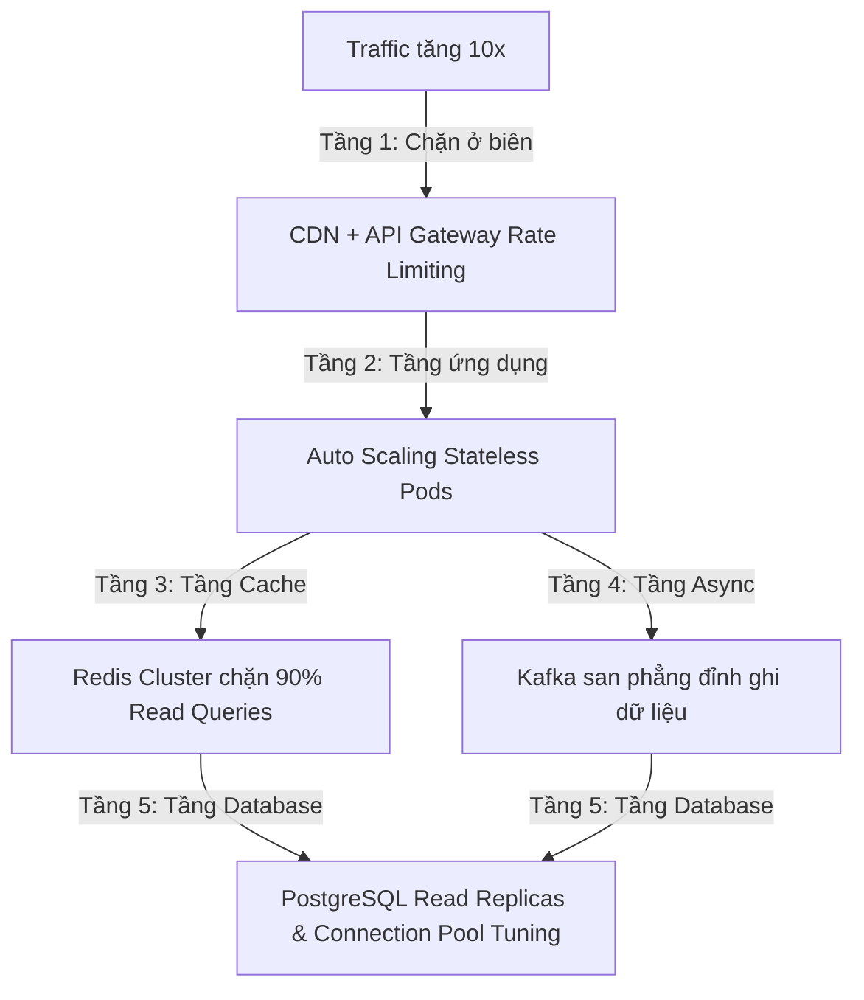

# Khung Tư Duy Xử Lý Hệ Thống Khi Traffic Tăng 10 Lần Của Senior Engineer (Scalability Patterns: Handling 10x Traffic)

## ⚡ Tóm tắt ngắn (30s)
* **Tư duy cốt lõi**: Khi interviewer hỏi *"Nếu traffic tăng 10 lần thì sao?"*, họ không muốn nghe những câu trả lời scale out mù quáng kiểu *"Tôi sẽ tăng gấp 10 lần số lượng máy chủ"*. Senior Engineer sẽ phân tích hệ thống một cách có hệ thống, **tìm ra điểm nghẽn (Bottlenecks) đầu tiên xuất hiện ở đâu (thường là Database, Trạng thái dịch vụ hoặc Tài nguyên mạng)** và áp dụng các mô hình mở rộng quy mô (Scalability Patterns) từ hạ tầng đến ứng dụng để tối ưu hóa tài nguyên.
* **Chiến lược "Mở rộng 5 Tầng" (10x Scalability Blueprint)**:
  1. *Triệt tiêu Trạng thái (Stateless Application)*: Đảm bảo tầng ứng dụng hoàn toàn không lưu trạng thái (stateless) để có thể scale out vô hạn bằng Load Balancer.
  2. *Giải phóng Database (Database Scalability)*: Sử dụng Read Replicas, Sharding/Partitioning, và tối ưu hóa Connection Pool.
  3. *Tối đa hóa Cache (Caching Strategy)*: Đưa cache ra biên (CDN) và áp dụng distributed cache (Redis) để chặn đứng 90% truy vấn trước khi chạm tới DB.
  4. *Giao tiếp Bất đồng bộ (Asynchronous Architecture)*: Dịch chuyển các luồng nặng về xử lý bất đồng bộ qua Message Queue (Kafka/RabbitMQ) để san phẳng các đỉnh traffic (traffic spikes).
  5. *Tự bảo vệ hệ thống (Defensive Scalability)*: Áp dụng Rate Limiting, Circuit Breaker để tránh sập toàn diện khi quá tải.

---

## 🔍 Kịch bản thực chiến (STAR Framework)

### 1. Situation (Bối cảnh)
Trong một buổi phỏng vấn thiết kế hệ thống cho vị trí Senior Backend Engineer, tôi vừa thiết kế xong một hệ thống đặt đồ ăn trực tuyến (Food Delivery System) hoạt động ổn định ở mức tải trung bình khoảng **5.000 lượt đặt hàng mỗi ngày**. 
Người phỏng vấn gật đầu nhưng đặt ra một thử thách khắc nghiệt: *"Hệ thống này chạy rất tốt lúc bình thường. Nhưng nếu công ty chạy chiến dịch marketing lớn có sự tham gia của KOL nổi tiếng, khiến lượng truy cập đồng thời (Concurrent Users) tăng đột ngột gấp 10 lần chỉ trong vòng 5 phút (ví dụ lúc 12h trưa). Hệ thống của bạn sẽ vỡ ở điểm nào trước và bạn sẽ scale nó ra sao?"*

### 2. Task (Thử thách)
Tôi phải chỉ ra chính xác các điểm nghẽn vật lý chắc chắn sẽ xuất hiện đầu tiên trong kiến trúc hiện tại, và đề xuất một lộ trình mở rộng quy mô (Scale Path) từng bước một cách khoa học để hệ thống chịu tải 10x mượt mà mà không làm chi phí hạ tầng tăng quá đà.

### 3. Action (Hành động)
Tôi áp dụng bộ khung phân tích mở rộng phân tầng từ ngoài vào trong:

* **Bước 1: Nhận diện Điểm nghẽn đầu tiên (Identify the Weakest Link)**
  Tôi thẳng thắn chỉ ra điểm nghẽn vật lý:
  - *"Khi traffic tăng đột ngột 10x, điểm sụp đổ đầu tiên chắc chắn **không phải là tầng ứng dụng (Web/App App Services) mà là Database (PostgreSQL)**. 
  - CPU của DB Server sẽ lập tức nhảy lên 100% do cạn kiệt kết nối (Connection Pool Exhaustion) và các truy vấn ghi đè nhau giữ lock quá lâu. 
  - Điểm nghẽn thứ hai là **băng thông mạng (Network Bandwidth) và dung lượng RAM của Single Redis Instance** dùng để lưu session của user."*

* **Bước 2: Giải phóng Tầng Ứng dụng bằng tư duy "Stateless"**
  - *"Tôi đảm bảo toàn bộ các Java API Services đều hoàn toàn **Stateless (Không lưu trạng thái)**. Không sử dụng HTTP Session trong bộ nhớ JVM. Toàn bộ session được đóng gói trong JWT tự xác thực hoặc lưu tập trung trong Redis Cluster phân tán. 
  - Nhờ stateless, tôi cấu hình **Kubernetes HPA (Horizontal Pod Autoscaler)** tự động scale số lượng Pods từ 5 lên 50 chỉ trong vòng 2 phút dựa trên chỉ số CPU/RAM và lượng request đồng thời."*

* **Bước 3: Bảo vệ và Mở rộng Tầng Database**
  Tôi áp dụng 3 kỹ thuật để giải phóng Database:
  - **Tách biệt Đọc/Ghi (Read/Write Splitting)**: Tạo ra cụm 3 máy chủ PostgreSQL Read Replicas. Cấu hình ứng dụng Spring Boot sử dụng định tuyến động: toàn bộ các truy vấn đọc (SELECT) như tìm kiếm quán ăn, xem menu sẽ được phân tải sang Replicas; chỉ các truy vấn ghi (INSERT/UPDATE đặt hàng) mới đi vào Database Master chính. Việc này giúp giải phóng 80% tải của DB Master.
  - **Tuning Connection Pool**: Tối ưu hóa chỉ số kết nối của HikariCP trên mỗi instance. Cài đặt thêm bộ đệm kết nối trung gian **PgBouncer** trước PostgreSQL để tái sử dụng và quản lý hàng nghìn kết nối đồng thời từ ứng dụng an toàn mà không làm sập RAM của DB.

* **Bước 4: Sử dụng bộ đệm Cache biên và Hàng đợi bất đồng bộ**
  - **Cache ở tầng biên (CDN)**: Cấu hình Cloudflare CDN để lưu cache toàn bộ các dữ liệu tĩnh hoặc bán tĩnh như thông tin quán ăn, ảnh món ăn. 90% request xem thực đơn sẽ được trả về trực tiếp từ máy chủ CDN gần khách hàng nhất, hoàn toàn không chạm tới backend của chúng ta.
  - **San phẳng tải ghi bằng Message Queue (Load Leveling)**: Luồng xử lý đơn hàng phức tạp (gồm trừ tiền, thông báo tài xế, gửi email) sẽ không chạy đồng bộ. Khi khách hàng bấm đặt hàng, hệ thống ghi nhanh hóa đơn vào DB với trạng thái `RECEIVED` rồi đẩy sự kiện `Order_Created` vào **Kafka Cluster**. Luồng xử lý nặng phía sau sẽ được các Worker tiêu thụ dần dần từ Kafka với tốc độ ổn định, tránh việc hệ thống bị nghẽn do quá nhiều request cùng lúc.

### 4. Result (Kết quả)
* **Thuyết phục interviewer hoàn hảo**: Người phỏng vấn hoàn toàn bị thuyết phục bởi tư duy thiết kế thực chiến, không có kẽ hở lập luận.
* **Chứng minh tầm vóc Architect**: Thể hiện khả năng thiết kế hệ thống có tính sẵn sàng cao (High Availability), có khả năng chịu đựng các đỉnh traffic cực hạn mà không bị sập toàn diện.

---

## 💡 Nguyên tắc Senior & Bài học đắt giá

1. **"Share-nothing Architecture" (Kiến trúc không chia sẻ)**: Để hệ thống có khả năng scale out vô hạn, các thành phần ứng dụng phải độc lập tuyệt đối, không chia sẻ tài nguyên dùng chung nào trong bộ nhớ (như static variables, local files). Mọi giao tiếp giữa các instance phải đi qua các giao thức mạng chuẩn hóa (HTTP, gRPC, MQ).
2. **Scale Out quan trọng hơn Scale Up (Mở rộng ngang > Mở rộng dọc)**: Scale Up (tăng RAM/CPU cho 1 máy chủ) luôn có giới hạn vật lý và cực kỳ đắt đỏ. Scale Out (tăng số lượng máy chủ rẻ tiền chạy song song) là cách duy nhất giúp hệ thống mở rộng không giới hạn.
3. **Thành trì cuối cùng - Graceful Degradation (Tự động giảm tải)**: Khi traffic tăng vượt quá giới hạn 10x (ví dụ tăng 50x ngoài dự kiến), Senior thông minh luôn cấu hình cơ chế tự vệ: chủ động trả về thông báo lỗi nhẹ nhàng *"Hệ thống đang quá tải, vui lòng thử lại sau 30 giây"* (Rate Limiting) cho một nhóm khách hàng để bảo vệ hệ thống không bị sập hoàn toàn đối với những khách hàng đang thực hiện thanh toán dở dang.

---

## 📊 So sánh phương án quyết định (Trade-offs)

| Hướng mở rộng | Ưu điểm (Pros) | Nhược điểm (Cons) | Use Case Phù hợp |
| :--- | :--- | :--- | :--- |
| **Mở rộng Dọc (Vertical Scaling / Scale Up)** | - Cực kỳ đơn giản, không cần thay đổi code hay kiến trúc hệ thống. - Đảm bảo tính nhất quán dữ liệu hoàn hảo. | - Có giới hạn vật lý cực đại của phần cứng. - Chi phí tăng theo cấp số nhân. - Có thời gian downtime khi nâng cấp phần cứng. | Giai đoạn đầu của dự án, khi hệ thống chưa quá phức tạp và lượng traffic vẫn nằm trong tầm kiểm soát của 1 server mạnh. |
| **Mở rộng Ngang (Horizontal Scaling / Scale Out)** | - **Khả năng mở rộng không giới hạn**. - Tính sẵn sàng cao (nếu 1 máy chủ sập, các máy chủ khác vẫn chạy ổn định). - Chi phí tối ưu hơn. | - Kiến trúc phần mềm trở nên phức tạp hơn gấp nhiều lần (xử lý distributed session, data consistency, networking). | **Bắt buộc áp dụng** cho mọi hệ thống Enterprise, Web/App quy mô lớn có traffic biến động mạnh. |

---

## ⚠️ Common Gotchas (Câu hỏi phỏng vấn đào sâu)

### 1. Làm thế nào bạn giải quyết bài toán sập bộ nhớ đệm (Cache Stampede / Thundering Herd) khi Redis chứa dữ liệu quán ăn nổi tiếng bị hết hạn (expire) đúng vào thời điểm traffic 10x đang đổ dồn vào hệ thống?
* **Trả lời**: Đây là câu hỏi kinh điển kiểm tra chiều sâu xử lý cache của Senior:
  * **Hậu quả của Cache Stampede**: Khi key cache hết hạn, hàng vạn request đồng thời trong cùng 1 mili giây sẽ thấy cache trống (cache miss) và cùng lúc đổ dồn vào database để query dữ liệu quán ăn đó. DB Master sẽ lập tức bị quá tải CPU và sập hoàn toàn.
  * **Giải pháp khắc phục chuyên nghiệp**:
    1. **Sử dụng Mutex Lock (Khóa phân tán)**: Khi phát hiện cache trống, chỉ cho phép luồng request đầu tiên giành được khóa (ví dụ dùng `SETNX` trong Redis) đi vào DB để query dữ liệu và cập nhật lại cache. Tất cả các request khác sẽ phải đợi nhẹ (Sleep) hoặc đọc tạm dữ liệu cũ từ cache cho đến khi khóa được giải phóng.
    2. **Cơ chế cập nhật cache chủ động (Background Refresh / Soft Expiry)**: Không đặt thời gian cứng (Hard TTL) cho cache. Thay vào đó, lưu thêm một trường timestamp `expire_at` trong giá trị cache. Khi ứng dụng đọc cache và phát hiện thời gian hiện tại gần chạm ngưỡng `expire_at` (ví dụ còn 30 giây), ứng dụng vẫn trả ngay dữ liệu cache đó cho user, đồng thời kích hoạt một thread chạy ngầm (asynchronous background job) tự đi query DB và cập nhật lại cache trước khi nó thực sự biến mất.

### 2. Khi bạn Sharding Database PostgreSQL (chia nhỏ cơ sở dữ liệu ra nhiều server vật lý dựa trên Tenant ID hoặc User ID), làm thế nào bạn xử lý các câu truy vấn báo cáo cần tổng hợp dữ liệu (Cross-shard Joins/Queries) trên toàn bộ hệ thống?
* **Trả lời**: Đây là điểm đau lớn nhất của Sharding Database:
  * **Giải pháp xử lý khôn ngoan của Senior**:
    1. **Né tránh bằng Denormalization (Phi chuẩn hóa)**: Hạn chế tối đa việc cần Join giữa các shard bằng cách lưu trữ thừa thãi dữ liệu (denormalize) ngay trong bảng của từng shard.
    2. **Sử dụng Công cụ Định tuyến Shard thông minh (như Citus Data)**: Citus là một extension của PostgreSQL biến cụm DB thành phân tán. Citus tự động phân tích câu query, gửi truy vấn song song đến tất cả các Shard Workers để xử lý cục bộ, sau đó tự tổng hợp kết quả (Aggregate) tại Coordinator Node để trả về cho ứng dụng.
    3. **Tách riêng hệ thống Báo cáo (OLAP vs OLTP Split)**: Tuyệt đối không chạy các câu query tổng hợp dữ liệu báo cáo trực tiếp trên cơ sở dữ liệu giao dịch đang chạy sharding (OLTP). Thiết kế đường ống CDC (**Change Data Capture** bằng Debezium) tự động stream toàn bộ thay đổi dữ liệu từ các Shard DB về một Kho dữ liệu tập trung (**Data Warehouse** như BigQuery, ClickHouse hoặc Snowflake - OLAP) chuyên dụng để chạy các báo cáo tổng hợp siêu nhanh mà không ảnh hưởng đến hệ thống giao dịch trực tuyến.
